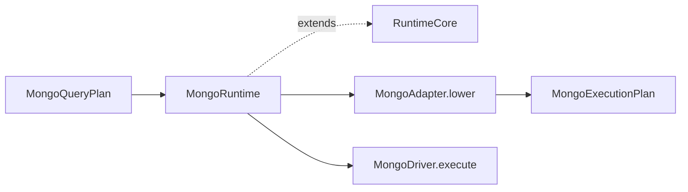

# @prisma-next/mongo-runtime

MongoDB runtime executor for Prisma Next.

## Package Classification

- **Domain**: mongo
- **Layer**: runtime
- **Plane**: runtime

## Overview

The Mongo runtime package implements the Mongo family runtime by extending the abstract `RuntimeCore` base class from `@prisma-next/framework-components/runtime` with Mongo-specific lowering and driver dispatch. It provides the public runtime API for MongoDB, layering Mongo concerns (adapter lowering and wire-command dispatch) on top of the shared middleware lifecycle.

## Responsibilities

- **Runtime executor**: `createMongoRuntime()` composes adapter and driver into a `MongoRuntime` with a single `execute(plan)` entry point accepting `MongoQueryPlan<Row>` from `@prisma-next/mongo-query-ast`. Execution is one path for reads and writes: `adapter.lower(plan)` produces a wire command, then the driver runs it.
- **Unified flow**: There is no separate `execute` vs `executeCommand`; all operations use `execute(plan)`.
- **Lowering**: Happens in the adapter (`lower(plan)`), wrapped by the runtime's `lower` override into a `MongoExecutionPlan`.
- **Middleware lifecycle inheritance**: `MongoRuntime` extends `RuntimeCore<MongoQueryPlan, MongoExecutionPlan, MongoMiddleware>` and inherits the `beforeExecute` / `onRow` / `afterExecute` lifecycle from the framework via `runWithMiddleware`. Mongo does **not** override `runBeforeCompile` (Mongo middleware has no `beforeCompile` hook today).
- **Lifecycle management**: Connection lifecycle via `close()`.

## Dependencies

- **Depends on**:
  - `@prisma-next/mongo-lowering` (`MongoAdapter`, `MongoDriver` interfaces)
  - `@prisma-next/mongo-query-ast` (`MongoQueryPlan`, `AnyMongoCommand` — the typed plan shape)
  - `@prisma-next/framework-components` (`RuntimeCore` base class, `runWithMiddleware` helper, `RuntimeMiddleware` SPI, `AsyncIterableResult` return type)
- **Depended on by**:
  - Integration tests (`test/integration/test/mongo/` and `test/integration/test/cross-package/cross-family-middleware.test.ts`)

## Architecture

`MongoRuntimeImpl` extends `RuntimeCore<MongoQueryPlan, MongoExecutionPlan, MongoMiddleware>` and overrides:

- `lower(plan)` — calls the adapter's `lower(plan)` and wraps the resulting wire command into a `MongoExecutionPlan`.
- `runDriver(exec)` — dispatches the wire command to the Mongo driver via `driver.execute(exec.command)`.
- `close()` — closes the underlying driver.

The execution template (`execute(plan)` → `lower` → `runWithMiddleware` → `runDriver`) is inherited from `RuntimeCore`. The four inline middleware lifecycle loops (`beforeExecute`, `onRow`, `afterExecute`, plus the error-path `afterExecute`) that previously lived in `MongoRuntimeImpl.execute` are now delegated to the shared `runWithMiddleware` helper.

## Related Subsystems

- **[Runtime & Middleware Framework](../../../../docs/architecture%20docs/subsystems/4.%20Runtime%20&%20Middleware%20Framework.md)** — Runtime execution pipeline
- **[Adapters & Targets](../../../../docs/architecture%20docs/subsystems/5.%20Adapters%20&%20Targets.md)** — Adapter and driver responsibilities
