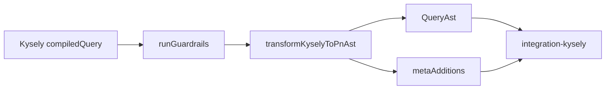

# @prisma-next/sql-kysely-lane

Kysely AST transform and guardrails for the Prisma Next SQL lane.

## Overview

This package provides the build-only logic for the Kysely lane: transforming Kysely compiled query AST into Prisma Next SQL `QueryAst`, and running pre-transform guardrails. It does not depend on `@prisma-next/sql-runtime` and is consumed by `@prisma-next/integration-kysely` for execution.

## Responsibilities

- **Transform**: Convert Kysely `compiledQuery` AST (SelectQueryNode, InsertQueryNode, UpdateQueryNode, DeleteQueryNode) into PN SQL AST (`QueryAst`)
- **Guardrails**: Pre-transform validation for multi-table scope (qualified refs, unambiguous selectAll)
- **Error codes**: Stable `KyselyTransformError` with codes for unsupported nodes, invalid refs, and contract validation

## Dependencies

- `@prisma-next/contract` — PlanRefs, ParamDescriptor
- `@prisma-next/sql-contract` — SqlContract, SqlStorage
- `@prisma-next/sql-relational-core` — AST types (SelectAst, InsertAst, etc.)
- `@prisma-next/utils` — ifDefined

## Exports

- `transformKyselyToPnAst(contract, query, parameters)` — Main transform entry point
- `runGuardrails(contract, query)` — Pre-transform validation for SelectQueryNode
- `KyselyTransformError`, `KYSELY_TRANSFORM_ERROR_CODES` — Error types
- `TransformResult` — Result type (ast + metaAdditions)

## Architecture

The lane package is build-only: it produces AST and metadata. Execution (plan assembly, lowering, driver) lives in `@prisma-next/integration-kysely` and downstream runtime packages.

## Related Packages

- `@prisma-next/integration-kysely` — Consumes this package for Kysely dialect and connection
- `@prisma-next/sql-relational-core` — Provides AST types used by the transformer

## Related Subsystems

- [Query Lanes](/docs/architecture%20docs/subsystems/3.%20Query%20Lanes.md)
- [ADR 160 - Kysely lane emits PN SQL AST](/docs/architecture%20docs/adrs/ADR%20160%20-%20Kysely%20lane%20emits%20PN%20SQL%20AST.md)
