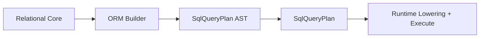

# @prisma-next/sql-orm-lane

ORM builder, include compilation, and relation filters for Prisma Next.

## Overview

This package provides the ORM query builder that compiles model-based queries to SQL lane primitives. It is part of the SQL lanes ring and depends on `@prisma-next/sql-relational-core` for schema access.

## Responsibilities

- **ORM query builder**: Model-based query builder (`orm()`)
- **Include compilation**: ORM includes compile to SQL lane primitives like `includeMany`
- **Relation filters**: Filter queries by related model properties (`some`, `none`, `every`)
- **Model accessors**: Type-safe access to models and their columns/relations
- **Generated defaults**: Auto-fills client-generated columns on create and blocks manual writes on update

## Dependencies

- `@prisma-next/contract` - Contract types and plan metadata
- `@prisma-next/plan` - Plan helpers and error utilities
- `@prisma-next/sql-relational-core` - Schema and column builders
- `@prisma-next/sql-contract` - SQL contract types (via `@prisma-next/sql-contract/types`)

## Exports

- `.` - Main package export (exports `orm` and related types)
- `./orm` - ORM builder entry point (`orm()`, `OrmRegistry`, `OrmModelBuilder`, etc.)

## Architecture

This package compiles ORM queries to SQL lane primitives (AST nodes). Dialect-specific lowering to SQL strings happens in adapters (per ADR 015 and ADR 016).



The ORM builder:
1. Takes model-based queries (e.g., `orm().user().where(...).include(...)`)
2. Compiles them to SQL lane primitives (e.g., `sql().from(...).where(...).includeMany(...)`)
3. Returns plans that can be executed by the runtime

### Package Structure

The package is organized into modular components following a domain-driven structure:

```
src/
├── orm/              # Core ORM builder and state management
│   ├── builder.ts    # Main OrmModelBuilderImpl facade
│   ├── context.ts    # OrmContext and factory
│   ├── state.ts      # Immutable state shapes
│   └── capabilities.ts # Runtime capability checks
├── selection/        # Query selection building
│   ├── predicates.ts # WHERE clause building
│   ├── ordering.ts   # ORDER BY clause building
│   ├── pagination.ts # LIMIT/OFFSET handling
│   ├── projection.ts # SELECT projection flattening
│   ├── join.ts       # JOIN ON expression building
│   └── select-builder.ts # Main SELECT AST assembly
├── relations/        # Relation handling
│   └── include-plan.ts # Include AST and EXISTS subquery building
├── mutations/        # Write operations
│   ├── insert-builder.ts # INSERT plan building
│   ├── update-builder.ts # UPDATE plan building
│   └── delete-builder.ts # DELETE plan building
├── plan/             # Plan assembly and metadata
│   ├── plan-assembly.ts # PlanMeta building and Plan creation
│   ├── lowering.ts   # Lane-specific pre-lowering (placeholder)
│   └── result-typing.ts # Type-level helpers (placeholder)
├── utils/            # Shared utilities
│   ├── ast.ts        # AST factory wrappers
│   ├── errors.ts     # Centralized error constructors
│   └── guards.ts     # Type guards and helpers
└── types/            # Internal type exports
    └── internal.ts   # Re-exported internal types
```

**Design Principles:**
- **Modular**: Each module has a single, well-defined responsibility
- **Pure helpers**: Utility functions are side-effect free
- **Centralized errors**: All error messages come from `utils/errors.ts`
- **Type-safe**: Proper generic types throughout, avoiding `any`
- **Immutable state**: Builder state is immutable, methods return new instances

## Related Packages

- `@prisma-next/sql-relational-core` - Provides schema and column builders used by this package
- `@prisma-next/sql-contract` - Defines SQL contract types (via `@prisma-next/sql-contract/types`)

## Related Subsystems

- **[Query Lanes](../../../../docs/architecture%20docs/subsystems/3.%20Query%20Lanes.md)** — Lane authoring and plan building
- **[Runtime & Plugin Framework](../../../../docs/architecture%20docs/subsystems/4.%20Runtime%20&%20Plugin%20Framework.md)** — Runtime execution pipeline

## Related ADRs

- [ADR 140 - Package Layering & Target-Family Namespacing](../../../../docs/architecture%20docs/adrs/ADR%20140%20-%20Package%20Layering%20&%20Target-Family%20Namespacing.md)
