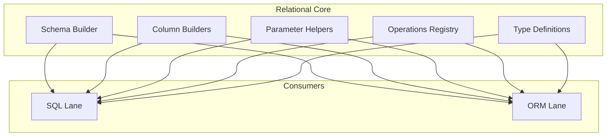

# @prisma-next/sql-relational-core

Schema and column builders, operation attachment, and AST types for Prisma Next.

## Package Classification

- **Domain**: sql
- **Layer**: lanes
- **Plane**: runtime

## Overview

The relational core package provides the foundational primitives for building relational SQL queries. It includes table/column builders, parameter helpers, operation attachment logic, and type definitions that are shared across SQL query lanes (DSL, ORM, Raw).

This package is part of the SQL lanes layer and provides the relational primitives that both the SQL DSL and ORM builder depend on.

## Purpose

Provide shared relational primitives (schema builders, column builders, parameter helpers, operations registry) that can be consumed by multiple SQL query lanes without code duplication.

## Responsibilities

- **Schema Builder**: Creates typed table and column builders from contracts
- **Column Builders**: Provides column accessors with operation methods attached based on column typeId
- **Parameter Helpers**: Creates parameter placeholders for query building
- **Operations Registry**: Attaches registered operations as methods on column builders
- **Type Definitions**: Defines TypeScript types for column builders, operations, and projections

**Non-goals:**
- Query DSL construction (sql-lane)
- ORM lowering (orm-lane)
- Raw SQL handling (sql-lane)
- Execution or runtime behavior (runtime)

## Architecture

## Components

### Schema Builder (`schema.ts`)
- Creates a schema handle with typed table builders
- Builds column builders with operation methods attached
- Provides proxy access for convenience (e.g., `tables.user.id` in addition to `tables.user.columns.id`)

### Column Builders (`types.ts`)
- Defines `ColumnBuilder` type with operation methods based on column typeId
- Provides type inference for JavaScript types from codec types
- Supports operation chaining when operations return typeIds

### Parameter Helpers (`param.ts`)
- Creates parameter placeholders for query building
- Validates parameter names

### Operations Registry (`operations-registry.ts`)
- Attaches registered operations as methods on `ColumnBuilder` instances
- Dynamically exposes operations based on column `typeId` and contract capabilities
- Handles operation chaining when operations return typeIds

### Plan Helpers (`plan.ts`)
- Defines `SqlQueryPlan<Row>` interface for SQL query plans produced by lanes before lowering
- Provides `augmentDescriptorWithColumnMeta(descriptors, columnMeta)` helper to update ParamDescriptor with `codecId` and `nativeType` from column metadata

### Type Definitions (`types.ts`)
- Defines TypeScript types for column builders, operations, projections
- Provides type inference utilities for extracting JavaScript types from codec types (e.g., `ExtractJsTypeFromColumnBuilder`)
- Defines projection row inference types
- Defines `AnyColumnBuilder` helper type for accepting column builders with any operation types

## Dependencies

- **`@prisma-next/contract`**: Core contract types
- **`@prisma-next/plan`**: Plan error helpers (`planInvalid`, `planUnsupported`) and `RuntimeError` type
- **`@prisma-next/runtime`**: Runtime context types (TODO: Slice 6 will clean this up)
- **`@prisma-next/sql-contract`**: SQL contract types (via `@prisma-next/sql-contract/types`)

**Note**: This package does not depend on specific adapters (e.g., `@prisma-next/adapter-postgres`). Test fixtures define `CodecTypes` inline to remain adapter-agnostic and avoid cyclic dependencies.

**Note**: Error helpers (`planInvalid`, `planUnsupported`) and the `RuntimeError` type are imported from `@prisma-next/plan` (core ring) rather than being defined locally. This ensures target-agnostic error handling.

## Package Structure

This package follows the standard `exports/` directory pattern:

- `src/exports/schema.ts` - Re-exports schema builder
- `src/exports/param.ts` - Re-exports parameter helpers
- `src/exports/types.ts` - Re-exports type definitions
- `src/exports/operations-registry.ts` - Re-exports operations registry
- `src/exports/plan.ts` - Re-exports plan types and helpers
- `src/exports/errors.ts` - Re-exports error helpers (from `@prisma-next/plan`)
- `src/index.ts` - Main entry point that re-exports from `exports/`

This enables subpath imports like `@prisma-next/sql-relational-core/schema`, `@prisma-next/sql-relational-core/param`, `@prisma-next/sql-relational-core/plan`, etc.

## Related Subsystems

- **[Query Lanes](../../../../docs/architecture%20docs/subsystems/3.%20Query%20Lanes.md)**: Detailed subsystem specification
- **[Runtime & Plugin Framework](../../../../docs/architecture%20docs/subsystems/4.%20Runtime%20&%20Plugin%20Framework.md)**: Plan execution

## Related ADRs

- [ADR 140 - Package Layering & Target-Family Namespacing](../../../../docs/architecture%20docs/adrs/ADR%20140%20-%20Package%20Layering%20&%20Target-Family%20Namespacing.md)
- [ADR 005 - Thin Core, Fat Targets](../../../../docs/architecture%20docs/adrs/ADR%20005%20-%20Thin%20Core,%20Fat%20Targets.md)
