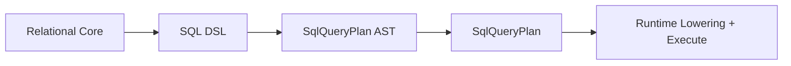

# @prisma-next/sql-lane

Relational DSL and raw SQL helpers for Prisma Next.

## Overview

This package provides the relational query DSL and raw SQL helpers for building SQL queries. It is part of the SQL lanes ring and depends on `@prisma-next/sql-relational-core` for schema and column builders.

## Responsibilities

- **Relational DSL**: Fluent query builder for SELECT, INSERT, UPDATE, DELETE queries
- **Raw SQL helpers**: Template literal and function-based raw SQL query builders
- **Query building**: AST construction and plan generation for SQL queries
- **Join support**: Inner, left, right, and full joins
- **Include support**: `includeMany` for nested queries using lateral joins and JSON aggregation

## Dependencies

- `@prisma-next/contract` - Contract types and plan metadata
- `@prisma-next/plan` - Plan helpers and error utilities
- `@prisma-next/sql-relational-core` - Schema and column builders, AST factories
- `@prisma-next/sql-contract` - SQL contract types (via `@prisma-next/sql-contract/types`)

## Exports

- `.` - Main package export (exports `sql`, `SelectBuilder`, `rawOptions`, and types)
- `./sql` - Relational DSL entry point (`sql()`, `SelectBuilder`, `InsertBuilder`, `UpdateBuilder`, `DeleteBuilder`)

## Architecture

This package compiles relational DSL queries to SQL AST nodes using factories from `@prisma-next/sql-relational-core/ast`. Dialect-specific lowering to SQL strings happens in adapters (per ADR 015 and ADR 016).

### Module Structure

The package is organized into focused modules:

- **`sql/`** - Core builder modules:
  - `builder.ts` - Thin public facade (main entry point)
  - `select-builder.ts` - SelectBuilderImpl class
  - `mutation-builder.ts` - Insert/Update/Delete builders
  - `include-builder.ts` - IncludeMany child builder and AST building
  - `join-builder.ts` - Join DSL logic
  - `predicate-builder.ts` - Where clause building
  - `projection.ts` - Projection building logic
  - `plan.ts` - Plan assembly and meta building
  - `context.ts` - Context wiring logic
- **`utils/`** - Shared utilities:
  - `errors.ts` - Centralized error constructors
  - `capabilities.ts` - Capability checking logic
  - `guards.ts` - Type guards and column info helpers
  - `state.ts` - Immutable builder state types
- **`types/`** - Type definitions:
  - `internal.ts` - Internal helper types
  - `public.ts` - Public type re-exports

All AST construction flows through factories from `@prisma-next/sql-relational-core/ast`, ensuring consistency and reducing duplication.

## Related Packages

- `@prisma-next/sql-relational-core` - Provides schema and column builders, AST factories used by this package
- `@prisma-next/sql-orm-client` - Higher-level ORM client extension for model-centric queries
- `@prisma-next/sql-contract` - Defines SQL contract types (via `@prisma-next/sql-contract/types`)

## Related Subsystems

- **[Query Lanes](../../../../docs/architecture%20docs/subsystems/3.%20Query%20Lanes.md)** — Lane authoring and plan building
- **[Runtime & Plugin Framework](../../../../docs/architecture%20docs/subsystems/4.%20Runtime%20%26%20Plugin%20Framework.md)** — Runtime execution pipeline

## Related ADRs

- [ADR 140 - Package Layering & Target-Family Namespacing](../../../../docs/architecture%20docs/adrs/ADR%20140%20-%20Package%20Layering%20%26%20Target-Family%20Namespacing.md)
