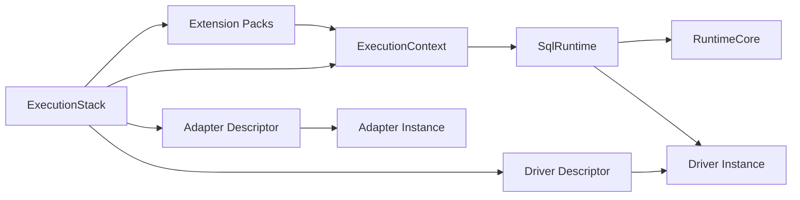

# @prisma-next/sql-runtime

SQL runtime implementation for Prisma Next.

## Package Classification

- **Domain**: sql
- **Layer**: runtime
- **Plane**: runtime

## Overview

The SQL runtime package implements the SQL family runtime by composing `@prisma-next/runtime-executor` with SQL-specific adapters, drivers, and codecs. It provides the public runtime API for SQL-based databases, including execution-plane composition via `ExecutionStack` and env-free `ExecutionContext` creation for query lanes.

## Purpose

Execute SQL query Plans with deterministic verification, guardrails, and feedback. Provide a unified execution surface that works across all SQL query lanes (DSL, ORM, Raw SQL).

## Responsibilities

- **Execution Stack Composition**: Compose runtime descriptors into a reusable `ExecutionStack`
- **Execution Context Creation**: Build env-free contexts for query lanes (contract + registries + types)
- **SQL Context Creation**: Create runtime contexts with SQL contracts, adapters, and codecs
- **SQL Marker Management**: Provide SQL statements for reading/writing contract markers
- **Codec Encoding/Decoding**: Encode parameters and decode rows using SQL codec registries
- **Codec Validation**: Validate that codec registries contain all required codecs
- **SQL Family Adapter**: Implement `RuntimeFamilyAdapter` for SQL contracts
- **SQL Runtime**: Compose runtime-executor with SQL-specific logic

## Dependencies

- `@prisma-next/core-execution-plane` - Runtime component descriptor types
- `@prisma-next/runtime-executor` - Target-neutral execution engine
- `@prisma-next/sql-contract` - SQL contract types (via `@prisma-next/sql-contract/types`)
- `@prisma-next/operations` - Operation registry

## Usage

```typescript
import postgresAdapter from '@prisma-next/adapter-postgres/runtime';
import postgresDriver from '@prisma-next/driver-postgres/runtime';
import pgvector from '@prisma-next/extension-pgvector/runtime';
import postgresTarget from '@prisma-next/target-postgres/runtime';
import { createExecutionStack, createRuntime } from '@prisma-next/sql-runtime';

const contract = validateContract<Contract>(contractJson);
const stack = createExecutionStack({
  target: postgresTarget,
  adapter: postgresAdapter,
  driver: postgresDriver,
  extensionPacks: [pgvector],
});

const context = stack.createContext({ contract });

const runtime = createRuntime({
  stack,
  context,
  driverOptions: { connect: { connectionString: process.env.DATABASE_URL } },
  verify: { mode: 'onFirstUse', requireMarker: false },
  plugins: [budgets(), lints()],
});

for await (const row of runtime.execute(plan)) {
  console.log(row);
}
```

## Exports

- `createRuntime` - Create a SQL runtime instance
- `createExecutionStack` - Compose runtime descriptors into a stack
- `createRuntimeContext` - Create a SQL runtime context
- `ExecutionStack`, `ExecutionContext`, `RuntimeContext` - Context and stack types
- `budgets`, `lints` - SQL-compatible plugins (re-exported from runtime-executor)
- `readContractMarker`, `writeContractMarker` - SQL marker statements
- `encodeParams`, `decodeRow` - Codec encoding/decoding utilities
- `validateCodecRegistryCompleteness` - Codec validation

## Architecture

The SQL runtime composes runtime-executor with SQL-specific implementations:

1. **ExecutionStack**: Holds runtime descriptors and builds `ExecutionContext`
2. **SqlFamilyAdapter**: Implements `RuntimeFamilyAdapter` for SQL contracts
3. **SqlRuntime**: Wraps `RuntimeCore` and adds SQL-specific encoding/decoding
4. **SqlContext**: Creates runtime contexts with SQL contracts, adapters, and codecs
5. **SqlMarker**: Provides SQL statements for marker management



## Related Subsystems

- **[Query Lanes](../../../../docs/architecture%20docs/subsystems/3.%20Query%20Lanes.md)** — Lane authoring and plan building
- **[Runtime & Plugin Framework](../../../../docs/architecture%20docs/subsystems/4.%20Runtime%20&%20Plugin%20Framework.md)** — Runtime execution pipeline
- **[Adapters & Targets](../../../../docs/architecture%20docs/subsystems/5.%20Adapters%20&%20Targets.md)** — Adapter and driver responsibilities

## Related ADRs

- [ADR 152 - Execution Plane Descriptors and Instances](../../../../docs/architecture%20docs/adrs/ADR%20152%20-%20Execution%20Plane%20Descriptors%20and%20Instances.md)

## Testing

Unit tests verify:
- Context creation with extensions
- Codec encoding/decoding
- Codec validation
- Marker statement generation
- Runtime execution with SQL adapters
