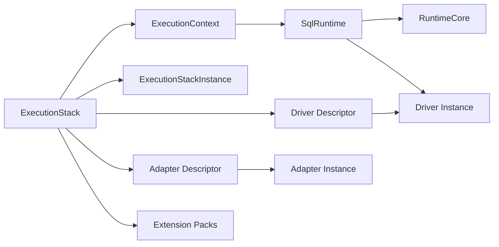

# @prisma-next/sql-runtime

SQL runtime implementation for Prisma Next.

## Package Classification

- **Domain**: sql
- **Layer**: runtime
- **Plane**: runtime

## Overview

The SQL runtime package implements the SQL family runtime by composing `@prisma-next/runtime-executor` with SQL-specific adapters, drivers, and codecs. It provides the public runtime API for SQL-based databases, including descriptor-based static context derivation via `SqlStaticContributions` and execution-plane composition via `ExecutionStack`.

## Purpose

Execute SQL query Plans with deterministic verification, guardrails, and feedback. Provide a unified execution surface that works across all SQL query lanes (DSL, ORM, Raw SQL).

## Responsibilities

- **Execution Stack Composition**: Compose runtime descriptors into a reusable `ExecutionStack`
- **Descriptor-Based Static Context Derivation**: Build `ExecutionContext` from `SqlStaticContributions` on descriptors without instantiation
- **SQL Context Creation**: Create runtime contexts with SQL contracts, adapters, and codecs
- **SQL Marker Management**: Provide SQL statements for reading/writing contract markers
- **Codec Encoding/Decoding**: Encode parameters and decode rows using SQL codec registries
- **Codec Validation**: Validate that codec registries contain all required codecs
- **SQL Family Adapter**: Implement `RuntimeFamilyAdapter` for SQL contracts
- **SQL Runtime**: Compose runtime-executor with SQL-specific logic

## Dependencies

- `@prisma-next/core-execution-plane` - Runtime component descriptor types
- `@prisma-next/runtime-executor` - Target-neutral execution engine
- `@prisma-next/sql-contract` - SQL contract types (via `@prisma-next/sql-contract/types`)
- `@prisma-next/operations` - Operation registry

## Usage

```typescript
import postgresAdapter from '@prisma-next/adapter-postgres/runtime';
import postgresDriver from '@prisma-next/driver-postgres/runtime';
import pgvector from '@prisma-next/extension-pgvector/runtime';
import postgresTarget from '@prisma-next/target-postgres/runtime';
import { instantiateExecutionStack } from '@prisma-next/core-execution-plane/stack';
import { createExecutionContext, createRuntime, createSqlExecutionStack } from '@prisma-next/sql-runtime';

const contract = validateContract<Contract>(contractJson);
const stack = createSqlExecutionStack({
  target: postgresTarget,
  adapter: postgresAdapter,
  driver: postgresDriver,
  extensionPacks: [pgvector],
});

// Static context (no instantiation needed)
const context = createExecutionContext({ contract, stack });

// Dynamic runtime
const stackInstance = instantiateExecutionStack(stack);
const driver = stack.driver.create({ connect: { connectionString: process.env.DATABASE_URL } });
const runtime = createRuntime({
  stackInstance,
  context,
  driver,
  verify: { mode: 'onFirstUse', requireMarker: false },
  plugins: [budgets()],
});

for await (const row of runtime.execute(plan)) {
  console.log(row);
}
```

## Exports

### Runtime

- `createRuntime` - Create a SQL runtime instance
- `Runtime` - Runtime instance type
- `CreateRuntimeOptions` - Options for `createRuntime`
- `RuntimeVerifyOptions` - Verification mode configuration
- `RuntimeTelemetryEvent`, `TelemetryOutcome` - Telemetry event types

### Context

- `createExecutionContext` - Create an execution context from contract + descriptors-only stack
- `createSqlExecutionStack` - SQL-specific stack factory that preserves descriptor types
- `ExecutionContext` - Context type for SQL operations
- `TypeHelperRegistry` - Registry for type helper lookup

### Descriptors & Stack

- `SqlStaticContributions` - Interface for descriptor-level static contributions (codecs, operations, parameterized codecs)
- `SqlRuntimeTargetDescriptor`, `SqlRuntimeAdapterDescriptor`, `SqlRuntimeExtensionDescriptor` - Structural descriptor types requiring `SqlStaticContributions`
- `SqlRuntimeAdapterInstance`, `SqlRuntimeDriverInstance`, `SqlRuntimeExtensionInstance` - Instance types
- `SqlExecutionStack` - Descriptors-only stack type for static context creation
- `SqlExecutionStackWithDriver` - Descriptor stack including driver for runtime instantiation
- `RuntimeParameterizedCodecDescriptor` - Parameterized codec descriptor type

### Codecs

- `validateCodecRegistryCompleteness` - Codec validation
- `extractCodecIds` - Extract codec IDs from a contract
- `validateContractCodecMappings` - Validate contract codec mappings against registry

### SQL Marker

- `readContractMarker`, `writeContractMarker` - SQL marker statements
- `ensureSchemaStatement`, `ensureTableStatement` - DDL statements for marker table setup
- `SqlStatement` - SQL statement type

### Plan Lowering

- `lowerSqlPlan` - SQL plan lowering via adapter

### Plugins (re-exported from `@prisma-next/runtime-executor`)

- `budgets`, `lints` - SQL-compatible plugins
- `BudgetsOptions`, `LintsOptions` - Plugin option types
- `Plugin`, `PluginContext` - Plugin interface types
- `AfterExecuteResult` - Plugin hook result type
- `Log` - Log entry type

## Architecture

The SQL runtime composes runtime-executor with SQL-specific implementations. Descriptors implement `SqlStaticContributions` so `ExecutionContext` can be derived from the descriptors-only stack without instantiation.

1. **ExecutionStack**: Descriptors-only stack (from `@prisma-next/core-execution-plane`)
2. **SqlStaticContributions**: Codecs, operation signatures, and parameterized codecs contributed by each descriptor
3. **ExecutionContext**: Built from contract + stack descriptors (no instantiation)
4. **ExecutionStackInstance**: Instantiated components used at runtime for execution
5. **SqlRuntime**: Wraps `RuntimeCore` and adds SQL-specific encoding/decoding
6. **SqlMarker**: Provides SQL statements for marker management



## Related Subsystems

- **[Query Lanes](../../../../docs/architecture%20docs/subsystems/3.%20Query%20Lanes.md)** — Lane authoring and plan building
- **[Runtime & Plugin Framework](../../../../docs/architecture%20docs/subsystems/4.%20Runtime%20&%20Plugin%20Framework.md)** — Runtime execution pipeline
- **[Adapters & Targets](../../../../docs/architecture%20docs/subsystems/5.%20Adapters%20&%20Targets.md)** — Adapter and driver responsibilities

## Related ADRs

- [ADR 152 - Execution Plane Descriptors and Instances](../../../../docs/architecture%20docs/adrs/ADR%20152%20-%20Execution%20Plane%20Descriptors%20and%20Instances.md)

## Error Codes

The SQL runtime uses stable error codes for programmatic error handling:

- `RUNTIME.CONTRACT_FAMILY_MISMATCH` — Contract target family differs from runtime family
- `RUNTIME.CONTRACT_TARGET_MISMATCH` — Contract target differs from stack target descriptor
- `RUNTIME.MISSING_EXTENSION_PACK` — Contract requires an extension pack not provided in stack
- `RUNTIME.DUPLICATE_PARAMETERIZED_CODEC` — Multiple extensions registered same parameterized codec
- `RUNTIME.TYPE_PARAMS_INVALID` — Type parameters fail codec schema validation
- `RUNTIME.CODEC_MISSING` — Required codec not found in registry
- `RUNTIME.DECODE_FAILED` — Row decoding failed

All errors follow the repo's error envelope convention with `code`, `category`, `severity`, and optional `details`.

## Testing

Unit tests verify:
- Context creation with extensions
- Codec encoding/decoding
- Codec validation
- Marker statement generation
- Runtime execution with SQL adapters
