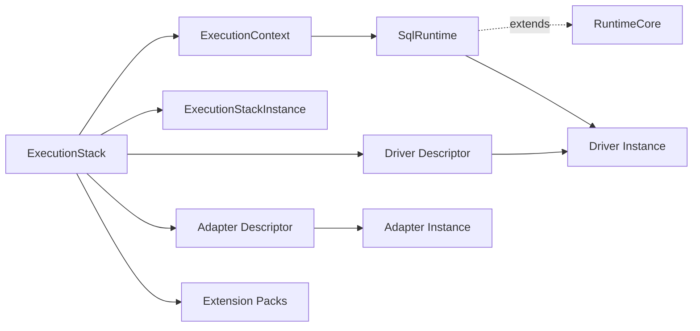

# @prisma-next/sql-runtime

SQL runtime implementation for Prisma Next.

## Package Classification

- **Domain**: sql
- **Layer**: runtime
- **Plane**: runtime

## Overview

The SQL runtime package implements the SQL family runtime by extending the abstract `RuntimeCore` base class from `@prisma-next/framework-components/runtime` with SQL-specific adapters, drivers, codecs, marker verification, telemetry fingerprinting, and a `beforeCompile` middleware chain. It provides the public runtime API for SQL-based databases, including descriptor-based static context derivation via `SqlStaticContributions` and execution-plane composition via `ExecutionStack`.

## Purpose

Execute SQL query Plans with deterministic verification, guardrails, and feedback. Provide a unified execution surface that works across all SQL query lanes (DSL, ORM, Raw SQL).

## Responsibilities

- **Execution Stack Composition**: Compose runtime descriptors into a reusable `ExecutionStack`
- **Descriptor-Based Static Context Derivation**: Build `ExecutionContext` from `SqlStaticContributions` on descriptors without instantiation
- **Mutation Default Generator Composition**: Assemble execution default generators from composed target/adapter/extension contributors
- **No Implicit Generator Baseline**: Runtime resolves generator ids only from composed contributors (no built-in runtime fallback table)
- **SQL Context Creation**: Create runtime contexts with SQL contracts, adapters, and codecs
- **SQL Marker Management**: Provide SQL statements for reading contract markers (writes go through the control adapter SPI)
- **Codec Encoding/Decoding**: Encode parameters and decode rows using SQL codec registries
- **Codec Validation**: Validate that codec registries contain all required codecs
- **SQL Family Adapter**: Implement `RuntimeFamilyAdapter` for SQL contracts (defined in `runtime-spi.ts`)
- **Marker Verification**: Read contract-marker rows from the database (`marker.ts`) on first execute and compare storage/profile hashes against the contract. On the first `execute()` call, any drift — hash mismatch, absent row, or missing marker table — is reported via a single `warn`-level structured log line through the runtime's `Log` interface (payload includes `code`, `scope`, `expected`, `actual`, `message`) and the query proceeds normally. The check runs once per runtime lifetime; subsequent queries skip the marker read. Pass `verifyMarker: false` to skip the marker read entirely.
- **Telemetry Fingerprinting**: Compute SQL fingerprints for telemetry events (`fingerprint.ts`)
- **Raw-SQL Guardrails**: Heuristic safety checks for raw SQL plans (`guardrails/raw.ts`)
- **`beforeCompile` Chain**: AST-rewrite middleware chain run pre-lowering (`middleware/before-compile-chain.ts`)
- **SQL Runtime**: `SqlRuntime` extends `RuntimeCore<SqlQueryPlan, SqlExecutionPlan, SqlMiddleware>` and overrides `lower`, `runDriver`, `runBeforeCompile`, and `close` with SQL-specific behaviour

## Dependencies

- `@prisma-next/framework-components` - Runtime component descriptor types (`./execution`) and the abstract `RuntimeCore` base class plus `runWithMiddleware` helper (`./runtime`)
- `@prisma-next/sql-contract` - SQL contract types (via `@prisma-next/sql-contract/types`)
- `@prisma-next/operations` - Operation registry

## Usage

```typescript
import postgresAdapter from '@prisma-next/adapter-postgres/runtime';
import postgresDriver from '@prisma-next/driver-postgres/runtime';
import pgvector from '@prisma-next/extension-pgvector/runtime';
import postgresTarget from '@prisma-next/target-postgres/runtime';
import { instantiateExecutionStack } from '@prisma-next/framework-components/execution';
import {
  budgets,
  createExecutionContext,
  createRuntime,
  createSqlExecutionStack,
} from '@prisma-next/sql-runtime';

const contract = postgresTarget.contractSerializer.deserializeContract(contractJson);
const stack = createSqlExecutionStack({
  target: postgresTarget,
  adapter: postgresAdapter,
  driver: postgresDriver,
  extensionPacks: [pgvector],
});

// Static context (no instantiation needed)
const context = createExecutionContext({ contract, stack });

// Dynamic runtime
const stackInstance = instantiateExecutionStack(stack);
const driver = stack.driver.create({ connect: { connectionString: process.env.DATABASE_URL } });
const runtime = createRuntime({
  stackInstance,
  context,
  driver,
  middleware: [budgets()],
});

for await (const row of runtime.execute(plan)) {
  console.log(row);
}
```

Use `verifyMarker: false` to skip the marker read entirely — e.g. during a known-skewed deploy window where contract drift is expected and tolerated.

```typescript
const runtime = createRuntime({
  stackInstance,
  context,
  driver,
  verifyMarker: false,
  middleware: [budgets()],
});
```

## Exports

### Runtime

- `createRuntime` - Create a SQL runtime instance
- `Runtime` - Runtime instance type
- `CreateRuntimeOptions` - Options for `createRuntime`
- `VerifyMarkerOption` - Marker-verification option (`'onFirstUse'` default; `false` to skip)
- `RuntimeTelemetryEvent`, `TelemetryOutcome` - Telemetry event types

### Context

- `createExecutionContext` - Create an execution context from contract + descriptors-only stack
- `createSqlExecutionStack` - SQL-specific stack factory that preserves descriptor types
- `ExecutionContext` - Context type for SQL operations
- `TypeHelperRegistry` - Registry for type helper lookup

### Descriptors & Stack

- `SqlStaticContributions` - Interface for descriptor-level static contributions (codecs, operations, parameterized codecs, mutation default generators)
- `RuntimeMutationDefaultGenerator` - Descriptor for generator id + implementation
- `SqlRuntimeTargetDescriptor`, `SqlRuntimeAdapterDescriptor`, `SqlRuntimeExtensionDescriptor` - Structural descriptor types requiring `SqlStaticContributions`
- `SqlRuntimeAdapterInstance`, `SqlRuntimeDriverInstance`, `SqlRuntimeExtensionInstance` - Instance types
- `SqlExecutionStack` - Descriptors-only stack type for static context creation
- `SqlExecutionStackWithDriver` - Descriptor stack including driver for runtime instantiation
- `RuntimeParameterizedCodecDescriptor` - Parameterized codec descriptor type

### Codecs

- `validateCodecRegistryCompleteness` - Codec validation
- `extractCodecIds` - Extract codec IDs from a contract
- `validateContractCodecMappings` - Validate contract codec mappings against registry
- `createControlCodecRegistry` - Registry for contract-free control DML (codec refs on value sites)
- `deriveParamMetadata` - Walk a control DML AST and collect per-value codec metadata for encoding
- `encodeParamsWithMetadata` - Encode lowered control DML parameters through their codecs

### SQL Marker

- `ensureSchemaStatement`, `ensureTableStatement` - DDL statements for marker table setup
- `SqlStatement` - SQL statement type

Marker reads and writes go through the control adapter SPI (`adapter.readMarker`, `adapter.initMarker`, `adapter.updateMarker`, `adapter.writeLedgerEntry`).

### Plan Lowering

- `lowerSqlPlan` - SQL plan lowering via adapter

### Middleware

- `budgets` - **AST-first budget middleware** (canonical in SQL domain), inspects `plan.ast` when present for row estimation
- `lints` - **AST-first lint middleware** (canonical in SQL domain), inspects `plan.ast` when present
- `SqlMiddleware`, `SqlMiddlewareContext` - SQL-family middleware interface and per-execution context
- `BudgetsOptions`, `LintsOptions` - Middleware option types
- `AfterExecuteResult` - Middleware `afterExecute` hook result type (re-exported from `@prisma-next/framework-components/runtime`)
- `Log` - Log entry type (re-exported from `@prisma-next/framework-components/runtime`)

#### Lints middleware (SQL domain)

The `lints` middleware operates on `plan.ast` when it is a SQL `QueryAst`:

- **DELETE without WHERE** — blocks execution (configurable severity)
- **UPDATE without WHERE** — blocks execution (configurable severity)
- **Unbounded SELECT** — warns/errors when `limit` is missing
- **SELECT \* intent** — warns/errors when `selectAllIntent` is present

When `plan.ast` is missing, the middleware falls back to raw heuristic guardrails (`fallbackWhenAstMissing: 'raw'`) or skips linting (`fallbackWhenAstMissing: 'skip'`). Default is `'raw'`.

```typescript
import { createRuntime, lints } from '@prisma-next/sql-runtime';

const runtime = createRuntime({
  // ...
  middleware: [lints({ severities: { noLimit: 'error' } })],
});
```

## Architecture

The SQL runtime extends the abstract `RuntimeCore` base class from `@prisma-next/framework-components/runtime` with SQL-specific implementations. Descriptors implement `SqlStaticContributions` so `ExecutionContext` can be derived from the descriptors-only stack without instantiation.

1. **ExecutionStack**: Descriptors-only stack (from `@prisma-next/framework-components/execution`)
2. **SqlStaticContributions**: Codecs, operation signatures, parameterized codecs, and mutation default generators contributed by each descriptor
3. **ExecutionContext**: Built from contract + stack descriptors (no instantiation)
4. **ExecutionStackInstance**: Instantiated components used at runtime for execution
5. **SqlRuntime**: `class SqlRuntimeImpl extends RuntimeCore<SqlQueryPlan, SqlExecutionPlan, SqlMiddleware>` — overrides `lower` (with codec param-encoding), `runDriver`, `runBeforeCompile` (delegates to the SQL `beforeCompile` chain), and `close`. The execution path also wraps the `runWithMiddleware` helper from `framework-components/runtime` with codec row-decoding, marker verification (via the `RuntimeFamilyAdapter` defined in `runtime-spi.ts`), and telemetry fingerprinting (via `computeSqlFingerprint` from `fingerprint.ts`).
6. **SqlMarker**: Provides SQL statements for marker management



## Related Subsystems

- **[Query Lanes](../../../../docs/architecture%20docs/subsystems/3.%20Query%20Lanes.md)** — Lane authoring and plan building
- **[Runtime & Middleware Framework](../../../../docs/architecture%20docs/subsystems/4.%20Runtime%20&%20Middleware%20Framework.md)** — Runtime execution pipeline
- **[Adapters & Targets](../../../../docs/architecture%20docs/subsystems/5.%20Adapters%20&%20Targets.md)** — Adapter and driver responsibilities

## Related ADRs

- [ADR 152 - Execution Plane Descriptors and Instances](../../../../docs/architecture%20docs/adrs/ADR%20152%20-%20Execution%20Plane%20Descriptors%20and%20Instances.md)

## Error Codes

The SQL runtime uses stable error codes for programmatic error handling:

- `RUNTIME.CONTRACT_FAMILY_MISMATCH` — Contract target family differs from runtime family
- `RUNTIME.CONTRACT_TARGET_MISMATCH` — Contract target differs from stack target descriptor
- `RUNTIME.MISSING_EXTENSION_PACK` — Contract requires an extension pack not provided in stack
- `RUNTIME.DUPLICATE_PARAMETERIZED_CODEC` — Multiple extensions registered same parameterized codec
- `RUNTIME.DUPLICATE_MUTATION_DEFAULT_GENERATOR` — Multiple components registered the same mutation default generator id (details include `existingOwner` and `incomingOwner`)
- `RUNTIME.MISSING_MUTATION_DEFAULT_GENERATOR` — Contract references mutation default generator id(s) the assembled stack does not provide; surfaced at `createExecutionContext` time (details include `ids`)
- `RUNTIME.MUTATION_DEFAULT_GENERATOR_MISSING` — Defense-in-depth lazy fallback raised by `applyMutationDefaults` when a generator becomes unavailable after context creation
- `RUNTIME.TYPE_PARAMS_INVALID` — Type parameters fail codec schema validation
- `RUNTIME.CODEC_MISSING` — Required codec not found in registry
- `RUNTIME.DECODE_FAILED` — Row decoding failed

All errors follow the repo's error envelope convention with `code`, `category`, `severity`, and optional `details`.

## Testing

Unit tests verify:
- Context creation with extensions
- Codec encoding/decoding
- Codec validation
- Marker statement generation
- Runtime execution with SQL adapters
