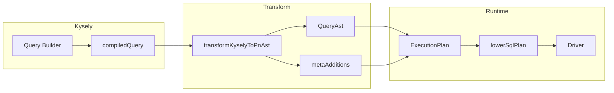

# @prisma-next/integration-kysely

Kysely integration for Prisma Next: connects Kysely query builder output to the Prisma Next runtime.

## Responsibilities

- Provide a Kysely-compatible database interface that routes queries through the Prisma Next execution stack
- Transform Kysely `compiledQuery` AST into Prisma Next SQL AST (`QueryAst`) for lane-agnostic plugin inspection
- Populate `plan.meta.refs`, `plan.meta.paramDescriptors`, and related metadata for Kysely-authored queries
- Fail unsupported Kysely-authored query kinds with a stable `PLAN.UNSUPPORTED` runtime envelope (`details.lane = 'kysely'`, `details.kyselyKind`)

## Architecture

## Transformer

The transformer (`src/transform/`) converts Kysely AST nodes to PN SQL AST:

| Kysely Node | PN AST |
|-------------|--------|
| `SelectQueryNode` | `SelectAst` |
| `InsertQueryNode` | `InsertAst` |
| `UpdateQueryNode` | `UpdateAst` |
| `DeleteQueryNode` | `DeleteAst` |
| `FromNode` / `TableNode` | `TableRef` |
| `ReferenceNode` + `ColumnNode` | `ColumnRef` |
| `SelectAllNode` | Expanded columns + `selectAllIntent` |
| `BinaryOperationNode` | `BinaryExpr` (=, <>, >, <, >=, <=, like, ilike, in, notIn) |
| `PrimitiveValueListNode` | `ListLiteralExpr` |
| `AndNode` / `OrNode` | `AndExpr` / `OrExpr` |
| `JoinNode` + `OnNode` | `JoinAst` |
| `ValuesNode` | `InsertAst.values` |
| `ColumnUpdateNode` | `UpdateAst.set` |
| `ReturningNode` | `returning` column refs |

All refs are validated against the contract. Unsupported node kinds throw `KyselyTransformError` with stable codes; the runtime connection maps unsupported cases to a stable `PLAN.UNSUPPORTED` envelope for callers.

The transformer also throws defensively if ambiguous or invalid shapes slip through (e.g. when invoked without guardrails): unqualified column refs in multi-table scope, ambiguous `selectAll` in multi-table scope, and unsupported node kinds.

## Guardrails

Pre-transform guardrails (`runGuardrails`) run before the transformer in the Kysely lane execution path:

| Rule | Condition | Error |
|------|-----------|-------|
| Qualified refs | Multi-table scope (joins **or** multiple `FROM` entries) with unqualified column ref | `UNQUALIFIED_REF_IN_MULTI_TABLE` |
| Ambiguous selectAll | Multi-table scope with `selectAll()` / `select *` without table qualification | `AMBIGUOUS_SELECT_ALL` |

Multi-table scope is triggered by either joins (`JoinNode` present) or multiple `FROM` entries (`froms.length > 1`). Only `SelectQueryNode` is validated; INSERT/UPDATE/DELETE are single-table.

## Dependencies

- `@prisma-next/contract` — Plan types, ParamDescriptor, PlanRefs
- `@prisma-next/sql-contract` — SqlContract, SqlStorage
- `@prisma-next/sql-relational-core` — AST types (SelectAst, InsertAst, etc.)
- `kysely` (peer)

## See also

- [ADR 160](../../docs/architecture%20docs/adrs/ADR%20160%20-%20Kysely%20lane%20emits%20PN%20SQL%20AST.md)
- [Transform spec](../../agent-os/specs/2026-02-15-transform-kysely-ast-to-pn-ast/spec.md)
- [Phase 2 extraction spec](../../projects/kysely-lane-rollout/specs/02-kysely-lane-build-only.spec.md)
