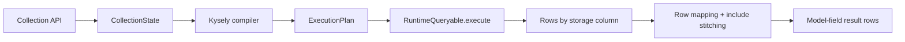

# @prisma-next/sql-orm-client

ORM client for Prisma Next — fluent, type-safe model collections.

This package provides a high-level ORM client surface on top of the runtime that can orchestrate multiple single-statement plans for a single logical operation (for example, parent query + includes).

## Responsibilities

- Expose typed `Collection` primitives for model-level data access
- Build filter/order/include state from fluent APIs (`where`, `include`, `orderBy`, `take`, `skip`)
- Compile collection state into executable SQL plans using Kysely compilation
- Execute and stitch include trees across multiple plan executions
- Map storage-column rows back to model-field row shapes
- Expose an `orm()` client with typed collection keys (for example `db.posts`)

## Dependency Boundaries

This package depends on:

- `@prisma-next/sql-contract` for contract shape and mappings
- `@prisma-next/contract` for `ExecutionPlan` metadata
- `@prisma-next/runtime-executor` for `AsyncIterableResult`
- `kysely` for SQL compilation

This package should not depend on target adapters or drivers directly; execution is delegated to the runtime queryable interface.

## Architecture



## Basic Usage

```ts
const db = orm({ contract, runtime });

const posts = await db.posts
  .where((post) => post.userId.eq(userId))
  .take(10)
  .all();
```

## Related Docs

- [Architecture Overview](../../../docs/Architecture%20Overview.md)
- [ADR 161 - Repository Layer](../../../docs/architecture%20docs/adrs/ADR%20161%20-%20Repository%20Layer.md)
- [Query Lanes Subsystem](../../../docs/architecture%20docs/subsystems/3.%20Query%20Lanes.md)
