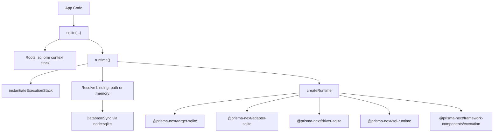

# @prisma-next/sqlite

Composition-root SQLite helper that builds a Prisma Next runtime client and exposes SQL, ORM, and schema query access.

## Package Classification

- **Domain**: extensions
- **Layer**: adapters
- **Plane**: runtime

## Overview

`@prisma-next/sqlite/runtime` exposes a single `sqlite(...)` helper that composes the SQLite execution stack and returns query/runtime roots:

- `db.sql`
- `db.orm`
- `db.context`
- `db.stack`

Runtime resources are deferred until `db.runtime()` or `db.connect(...)` is called.
Connection binding can be provided up front (`path`) or deferred via `db.connect(...)`.

## Responsibilities

- Build a static SQLite execution stack from target, adapter, and driver descriptors
- Build typed SQL surface from the execution context via `sql-query-builder-new`
- Build ORM surface from the execution context
- Normalize runtime binding input (file path or `:memory:`)
- Lazily instantiate runtime resources on first `db.runtime()` or `db.connect(...)` call
- Connect the internal SQLite driver through `db.connect(...)` or from initial binding options
- Memoize runtime so repeated `db.runtime()` calls return one instance

## Dependencies

- **`@prisma-next/sql-runtime`** for stack/context/runtime primitives
- **`@prisma-next/framework-components`** for stack instantiation
- **`@prisma-next/target-sqlite`** for target descriptor
- **`@prisma-next/adapter-sqlite`** for adapter descriptor
- **`@prisma-next/driver-sqlite`** for driver descriptor
- **`@prisma-next/sql-builder`** for `sql(...)` query builder
- **`@prisma-next/sql-relational-core`** for `schema(...)`
- **`@prisma-next/sql-orm-client`** for `orm(...)`
- **`@prisma-next/sql-contract`** for `validateContract(...)` and contract types

## Architecture

## Related Docs

- Architecture: `docs/Architecture Overview.md`
- Subsystem: `docs/architecture docs/subsystems/4. Runtime & Middleware Framework.md`
- Subsystem: `docs/architecture docs/subsystems/5. Adapters & Targets.md`
