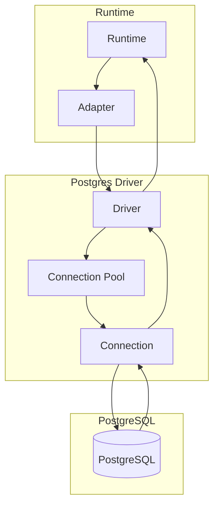

# @prisma-next/driver-postgres

PostgreSQL driver for Prisma Next.

## Package Classification

- **Domain**: targets
- **Layer**: drivers
- **Plane**: multi-plane (migration, runtime)

## Overview

The PostgreSQL driver provides transport and connection management for PostgreSQL databases. It implements the `SqlDriver` interface for executing SQL statements, explaining queries, and managing connections.

In Prisma Next, "driver" refers to the Prisma Next interface (not the underlying `pg` library). Drivers are transport-agnostic: they own pooling, connection management, and transport protocol (TCP, HTTP, etc.), but contain no dialect-specific logic. All dialect behavior lives in adapters. Instantiation is separate from connection; `create()` returns an unbound driver, `connect(binding)` binds at the boundary ([ADR 159](../../../../docs/architecture%20docs/adrs/ADR%20159%20-%20Driver%20Terminology%20and%20Lifecycle.md)).

This package spans multiple planes:
- **Migration plane** (`src/exports/control.ts`): Control plane entry point for driver descriptors
- **Runtime plane** (`src/exports/runtime.ts`): Runtime entry point for driver implementation

## Purpose

Provide PostgreSQL transport and connection management. Execute SQL statements and manage connections without dialect-specific logic.

## Responsibilities

- **Connection Management**: Acquire and release database connections
- **Statement Execution**: Execute SQL statements with parameters
- **Query Explanation**: Execute EXPLAIN queries for query analysis
- **Connection Pooling**: Manage connection pools (when applicable)
- **Transport Protocol**: Handle PostgreSQL protocol (TCP, HTTP, etc.)

**Non-goals:**
- Dialect-specific SQL lowering (adapters)
- Query compilation (sql-query)
- Runtime execution (runtime)

## Architecture



## Components

### Driver (`postgres-driver.ts`)
- Main driver implementation
- Implements `SqlDriver` interface
- Manages connections and executes statements
- Handles PostgreSQL protocol

## Dependencies

- **`@prisma-next/sql-contract`**: SQL contract types (via `@prisma-next/sql-contract/types`)

## Related Subsystems

- **[Adapters & Targets](../../docs/architecture%20docs/subsystems/5.%20Adapters%20&%20Targets.md)**: Driver specification

## Related ADRs

- [ADR 159 — Driver Terminology and Lifecycle](../../../../docs/architecture%20docs/adrs/ADR%20159%20-%20Driver%20Terminology%20and%20Lifecycle.md)
- [ADR 005 — Thin Core Fat Targets](../../../../docs/architecture%20docs/adrs/ADR%20005%20-%20Thin%20Core%20Fat%20Targets.md)
- [ADR 016 — Adapter SPI for Lowering](../../../../docs/architecture%20docs/adrs/ADR%20016%20-%20Adapter%20SPI%20for%20Lowering.md)

## Usage

Use the descriptor + connect lifecycle:

```typescript
import postgresDriver from '@prisma-next/driver-postgres/runtime';

const driver = postgresDriver.create({ cursor: { batchSize: 100 } });
await driver.connect({ kind: 'url', url: process.env.DATABASE_URL });
// driver is now bound; use acquireConnection, query, execute, etc.
```

Binding variants:
- `{ kind: 'url', url }`: Driver creates a Pool from the connection string
- `{ kind: 'pgPool', pool }`: Use an existing pg Pool
- `{ kind: 'pgClient', client }`: Use an existing pg Client (direct connection)

## Exports

- `./runtime`: Runtime entry point for driver implementation
  - Default: `postgresRuntimeDriverDescriptor` — use `create()` for unbound driver, then `connect(binding)`
  - Types: `PostgresBinding`, `PostgresDriverOptions`, `PostgresDriverCreateOptions`, `QueryResult`
- `./control`: Control plane entry point for driver descriptors
  - Default export: `DriverDescriptor` for use in `prisma-next.config.ts`

