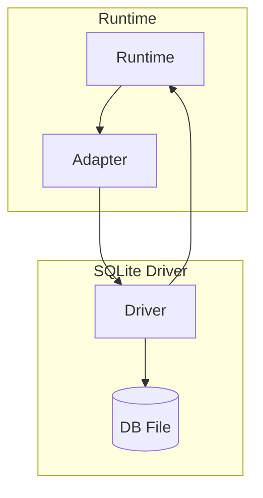

# @prisma-next/driver-sqlite

SQLite driver for Prisma Next.

## Package Classification

- **Domain**: targets
- **Layer**: drivers
- **Plane**: multi-plane (migration, runtime)

## Overview

The SQLite driver provides transport and connection management for SQLite databases (file-backed). It implements the `SqlDriver` interface for executing SQL statements, explaining queries, and managing connections.

Drivers are transport-agnostic: they own pooling, connection management, and transport protocol (TCP, HTTP, etc.), but contain no dialect-specific logic. All dialect behavior lives in adapters.

This package spans multiple planes:
- **Migration plane** (`src/exports/control.ts`): Control plane entry point for driver descriptors
- **Runtime plane** (`src/exports/runtime.ts`): Runtime entry point for driver implementation

## Purpose

Provide SQLite transport and connection management. Execute SQL statements and manage connections without dialect-specific logic.

## Responsibilities

- **Connection Management**: Acquire and release database connections
- **Statement Execution**: Execute SQL statements with parameters
- **Query Explanation**: Execute EXPLAIN queries for query analysis
- **Connection Pooling**: Manage connection pools (when applicable)
- **Transport**: Open and manage SQLite database handles (file-backed)

**Non-goals:**
- Dialect-specific SQL lowering (adapters)
- Query compilation (sql-query)
- Runtime execution (runtime)

## Architecture



## Components

### Driver (`sqlite-driver.ts`)
- Main driver implementation
- Implements `SqlDriver` interface
- Manages connections and executes statements
- Manages a SQLite database handle

## Dependencies

- **`@prisma-next/sql-contract`**: SQL contract types (via `@prisma-next/sql-contract/types`)

## Related Subsystems

- **[Adapters & Targets](../../docs/architecture%20docs/subsystems/5.%20Adapters%20&%20Targets.md)**: Driver specification

## Related ADRs

- [ADR 005 - Thin Core Fat Targets](../../docs/architecture%20docs/adrs/ADR%20005%20-%20Thin%20Core%20Fat%20Targets.md)
- [ADR 016 - Adapter SPI for Lowering](../../docs/architecture%20docs/adrs/ADR%20016%20-%20Adapter%20SPI%20for%20Lowering.md)

## Usage

```typescript
import { createSqliteDriver } from '@prisma-next/driver-sqlite/runtime';
import { createRuntime } from '@prisma-next/sql-runtime';

const driver = createSqliteDriver({ connectionString: process.env.DATABASE_URL });

const runtime = createRuntime({
  contract,
  adapter: sqliteAdapter,
  driver,
});
```

## Exports

- `./runtime`: Runtime entry point for driver implementation
  - `createSqliteDriver({ connectionString | filename, ... })`: Convenience creator
  - `createSqliteDriverFromOptions(options)`: Create driver from a `SqliteDriverOptions` object
  - Types: `SqliteDriverOptions`, `CreateSqliteDriverOptions`
- `./control`: Control plane entry point for driver descriptors
  - Default export: `DriverDescriptor` for use in `prisma-next.config.ts`
