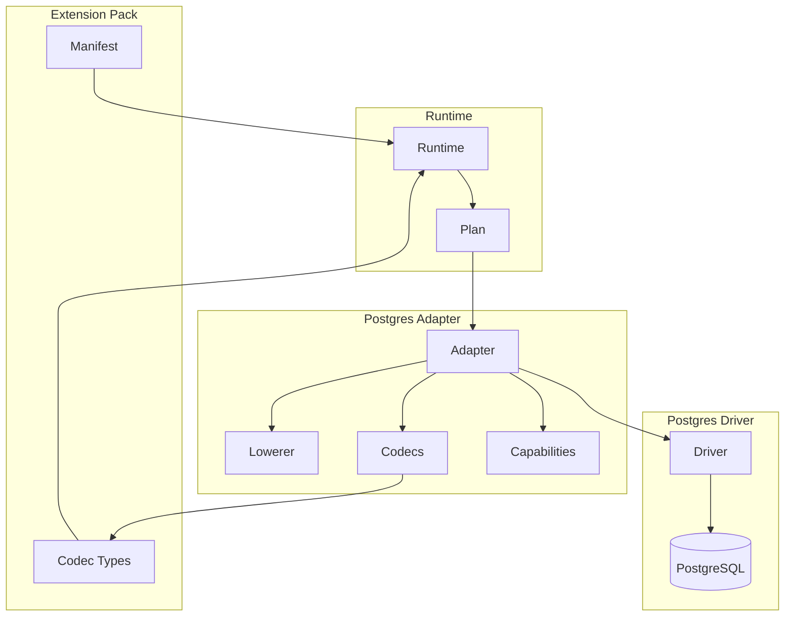

# @prisma-next/adapter-postgres

PostgreSQL adapter for Prisma Next.

## Overview

The PostgreSQL adapter implements the adapter SPI for PostgreSQL databases. It provides SQL lowering, capability discovery, codec definitions, and error mapping for PostgreSQL-specific behavior.

This package is an extension pack that extends Prisma Next with PostgreSQL-specific capabilities. It includes a manifest declaring its capabilities and codec types, and provides the adapter implementation that lowers SQL ASTs to PostgreSQL dialect SQL.

## Purpose

Provide PostgreSQL-specific adapter implementation, codecs, and capabilities. Enable PostgreSQL dialect support in Prisma Next through the adapter SPI.

## Responsibilities

- **Adapter Implementation**: Implement `Adapter` SPI for PostgreSQL
  - Lower SQL ASTs to PostgreSQL dialect SQL
  - Render `includeMany` as `LEFT JOIN LATERAL` with `json_agg` for nested array includes
  - Advertise PostgreSQL capabilities (`lateral`, `jsonAgg`)
  - Normalize PostgreSQL EXPLAIN output
  - Map PostgreSQL errors to `RuntimeError` envelope
- **Codec Definitions**: Define PostgreSQL codecs for type conversion
  - Wire format to JavaScript type decoding
  - JavaScript type to wire format encoding
- **Codec Types**: Export TypeScript types for PostgreSQL codecs
- **Extension Pack**: Provide manifest declaring capabilities and codec types

**Non-goals:**
- Transport/pooling management (drivers)
- Query compilation (sql-query)
- Runtime execution (runtime)

## Architecture



## Components

### Adapter (`adapter.ts`)
- Main adapter implementation
- Lowers SQL ASTs to PostgreSQL SQL
- Renders joins (INNER, LEFT, RIGHT, FULL) with ON conditions
- Renders `includeMany` as `LEFT JOIN LATERAL` with `json_agg` for nested array includes
- Renders DML operations (INSERT, UPDATE, DELETE) with RETURNING clauses
- Advertises PostgreSQL capabilities (`lateral`, `jsonAgg`, `returning`)
- Maps PostgreSQL errors to `RuntimeError`

### Codecs (`codecs.ts`)
- PostgreSQL codec definitions
- Type conversion between wire format and JavaScript
- Supports PostgreSQL types: `int2`, `int4`, `int8`, `float4`, `float8`, `text`, `timestamp`, `timestamptz`, `bool`

### Codec Types (`codec-types.ts`)
- TypeScript type definitions for PostgreSQL codecs
- Exported for use in `contract.d.ts` generation
- Maps type IDs to JavaScript types

### Types (`types.ts`)
- PostgreSQL-specific types and utilities
- Re-exports SQL contract types

### Manifest (`packs/manifest.json`)
- Extension pack manifest
- Declares capabilities and codec types import
- Provides canonical scalar map for type canonicalization

## Dependencies

- **`@prisma-next/sql-query`**: SQL contract types and query types
- **`@prisma-next/sql-target`**: Adapter SPI, codec interfaces, SQL contract types

## Related Subsystems

- **[Adapters & Targets](../../docs/architecture%20docs/subsystems/5.%20Adapters%20&%20Targets.md)**: Detailed adapter specification
- **[Ecosystem Extensions & Packs](../../docs/architecture%20docs/subsystems/6.%20Ecosystem%20Extensions%20&%20Packs.md)**: Extension pack model

## Related ADRs

- [ADR 005 - Thin Core Fat Targets](../../docs/architecture%20docs/adrs/ADR%20005%20-%20Thin%20Core%20Fat%20Targets.md)
- [ADR 016 - Adapter SPI for Lowering](../../docs/architecture%20docs/adrs/ADR%20016%20-%20Adapter%20SPI%20for%20Lowering.md)
- [ADR 030 - Result decoding & codecs registry](../../docs/architecture%20docs/adrs/ADR%20030%20-%20Result%20decoding%20&%20codecs%20registry.md)
- [ADR 065 - Adapter capability schema & negotiation v1](../../docs/architecture%20docs/adrs/ADR%20065%20-%20Adapter%20capability%20schema%20&%20negotiation%20v1.md)
- [ADR 068 - Error mapping to RuntimeError](../../docs/architecture%20docs/adrs/ADR%20068%20-%20Error%20mapping%20to%20RuntimeError.md)
- [ADR 112 - Target Extension Packs](../../docs/architecture%20docs/adrs/ADR%20112%20-%20Target%20Extension%20Packs.md)
- [ADR 114 - Extension codecs & branded types](../../docs/architecture%20docs/adrs/ADR%20114%20-%20Extension%20codecs%20&%20branded%20types.md)

## Usage

```typescript
import { createPostgresAdapter } from '@prisma-next/adapter-postgres';
import { createRuntime } from '@prisma-next/runtime';

const runtime = createRuntime({
  contract,
  adapter: createPostgresAdapter(),
  driver: postgresDriver,
});
```

## Capabilities

The adapter declares the following PostgreSQL capabilities:

- **`lateral: true`** - Supports LATERAL joins for `includeMany` nested array includes
- **`jsonAgg: true`** - Supports JSON aggregation functions (`json_agg`) for `includeMany`
- **`returning: true`** - Supports RETURNING clauses for DML operations (INSERT, UPDATE, DELETE)

These capabilities are declared in the adapter's `defaultCapabilities` and must be present in the contract's capabilities for the corresponding features to work.

## includeMany Support

The adapter supports `includeMany` for nested array includes using PostgreSQL's `LATERAL` joins and `json_agg`:

**Lowering Strategy:**
- Renders `includeMany` as `LEFT JOIN LATERAL` with a subquery that uses `json_agg(json_build_object(...))` to aggregate child rows into a JSON array
- The ON condition from the include is moved into the WHERE clause of the lateral subquery
- When both `ORDER BY` and `LIMIT` are present, wraps the query in an inner SELECT that projects individual columns with aliases, then uses `json_agg(row_to_json(sub.*))` on the result
- Uses different aliases for the table (`{alias}_lateral`) and column (`{alias}`) to avoid ambiguity

**Capabilities Required:**
- `lateral: true` - Enables LATERAL join support
- `jsonAgg: true` - Enables `json_agg` function support

**Example SQL Output:**
```sql
SELECT "user"."id" AS "id", "posts_lateral"."posts" AS "posts"
FROM "user"
LEFT JOIN LATERAL (
  SELECT json_agg(json_build_object('id', "post"."id", 'title', "post"."title")) AS "posts"
  FROM "post"
  WHERE "user"."id" = "post"."userId"
) AS "posts_lateral" ON true
```

## DML Operations with RETURNING

The adapter supports RETURNING clauses for DML operations (INSERT, UPDATE, DELETE), allowing you to return affected rows:

**Lowering Strategy:**
- Renders `RETURNING` clause after INSERT, UPDATE, or DELETE statements
- Returns specified columns from affected rows
- Supports returning multiple columns

**Capability Required:**
- `returning: true` - Enables RETURNING clause support

**Example SQL Output:**
```sql
-- INSERT with RETURNING
INSERT INTO "user" ("email", "createdAt") VALUES ($1, $2) RETURNING "user"."id", "user"."email"

-- UPDATE with RETURNING
UPDATE "user" SET "email" = $1 WHERE "user"."id" = $2 RETURNING "user"."id", "user"."email"

-- DELETE with RETURNING
DELETE FROM "user" WHERE "user"."id" = $1 RETURNING "user"."id", "user"."email"
```

**Note:** MySQL does not support RETURNING clauses. A future MySQL adapter would declare `returning: false` and either reject plans with RETURNING or provide an alternative implementation.

## Exports

- `./adapter`: Adapter implementation
- `./codec-types`: PostgreSQL codec types
- `./types`: PostgreSQL-specific types

