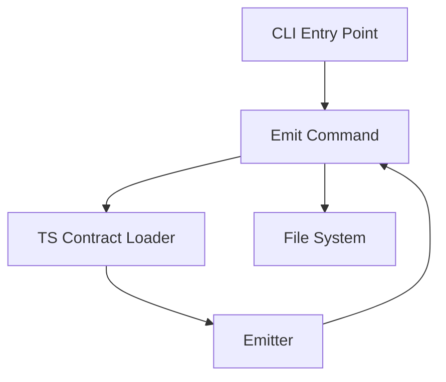

# @prisma-next/cli

Command-line interface for Prisma Next contract emission and management.

## Overview

The CLI provides commands for emitting canonical `contract.json` and `contract.d.ts` files from TypeScript-authored contracts. It enforces import allowlists and validates contract purity to ensure deterministic, reproducible artifacts. Generated files include metadata and warning headers to indicate they're generated artifacts and should not be edited manually.

## Purpose

Provide a command-line interface that:
- Loads TypeScript-authored contracts using esbuild with import allowlisting
- Validates contract purity (JSON-serializable, no functions/getters)
- Invokes the emitter to produce canonical artifacts
- Handles all file I/O operations (CLI handles I/O; emitter returns strings)

## Responsibilities

- **TS Contract Loading**: Bundle and load TypeScript contract files with import allowlist enforcement
- **CLI Command Interface**: Parse arguments and route to command handlers using commander
- **File I/O**: Read TS contracts, write emitted artifacts (`contract.json`, `contract.d.ts`)
- **Extension Pack Loading**: Load adapter and extension pack manifests for emission

## Commands

### `prisma-next emit`

Emit `contract.json` and `contract.d.ts` from a TypeScript contract file.

**Usage:**
```bash
prisma-next emit --contract <path> --out <dir> [--target postgres] [--adapter <path>] [--extensions <path...>]
```

**Options:**
- `--contract <path>`: Required. Path to TypeScript contract file
- `--out <dir>`: Required. Output directory for emitted artifacts
- `--target <target>`: Optional. Target (default: inferred from contract)
- `--adapter <path>`: Optional. Adapter package path (default: `packages/adapter-postgres`)
- `--extensions <path...>`: Optional. Extension pack paths (can be specified multiple times)

**Example:**
```bash
prisma-next emit --contract src/contract.ts --out dist
```

**Output:**
- `contract.json`: Includes `_generated` metadata field indicating it's a generated artifact (excluded from canonicalization/hashing)
- `contract.d.ts`: Includes warning header comments indicating it's a generated file

## Architecture



## Components

### CLI Entry Point (`cli.ts`)
- Main entry point using commander
- Parses arguments and routes to command handlers
- Handles global flags (`--help`, `--version`)
- Exit codes: 0 (success), 1 (error)

### TS Contract Loader (`load-ts-contract.ts`)
- Utility function (not a command) for loading TS contracts
- Uses esbuild to bundle contract entry with import allowlist
- Enforces allowlist: only `@prisma-next/*` packages allowed
- Validates contract purity (JSON-serializable)
- Returns `ContractIR` for emission

### Emit Command (`commands/emit.ts`)
- Command implementation using commander
- Loads extension packs using `loadExtensionPacks()` from emitter
- Loads TS contract using `loadContractFromTs()` utility
- Calls `emit()` from emitter (returns strings)
- Adds `_generated` metadata field to `contract.json` to indicate it's a generated artifact
- Writes `contract.json` and `contract.d.ts` to output directory

## Dependencies

- **`commander`**: CLI argument parsing and command routing
- **`esbuild`**: Bundling TypeScript contract files with import allowlisting
- **`@prisma-next/emitter`**: Contract emission engine (returns strings)
- **`@prisma-next/node-utils`**: File I/O utilities

## Design Decisions

1. **Import Allowlist**: Only `@prisma-next/*` packages allowed (MVP). Expand later if needed.
2. **Utility Separation**: TS contract loading is a utility function, not a command. Commands use utilities.
3. **CLI Framework**: Use `commander` library for robust CLI argument parsing.
4. **File I/O**: CLI handles all I/O; emitter returns strings (no file operations in emitter).
5. **Generated File Metadata**: Adds `_generated` metadata field to `contract.json` to indicate it's a generated artifact. This field is excluded from canonicalization/hashing to ensure determinism. The `contract.d.ts` file includes warning header comments generated by the emitter hook.

## See Also

- [`@prisma-next/emitter`](../emitter/README.md) - Contract emission engine
- [`@prisma-next/sql-query`](../sql-query/README.md) - Contract builder and query DSL
- [`docs/briefs/03-TS-Contract-Loader-and-CLI.md`](../../docs/briefs/03-TS-Contract-Loader-and-CLI.md) - Implementation brief

