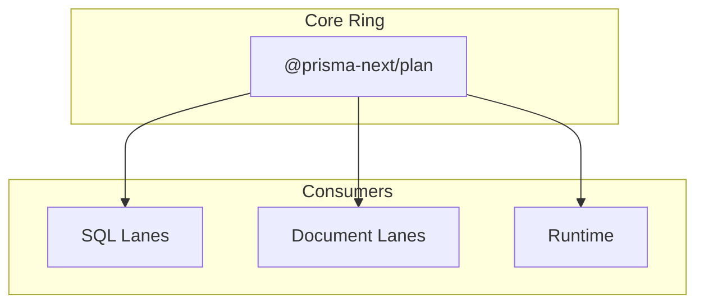

# @prisma-next/plan

Plan helpers, diagnostics, and shared errors for Prisma Next.

## Overview

This package is part of the **core ring** and provides target-agnostic plan error helpers and error types. These utilities are used across all target families (SQL, document, etc.) for consistent error handling during plan construction and validation.

## Purpose

Provide shared plan error utilities that can be used by any target family without depending on target-specific types or implementations.

## Responsibilities

- **Plan Error Helpers**: Functions for creating standardized plan errors (`planInvalid`, `planUnsupported`)
- **Error Types**: TypeScript types for plan errors (`RuntimeError`)

**Non-goals:**
- Target-specific error handling (handled by target packages)
- Runtime error handling (handled by runtime package)
- Contract validation errors (handled by contract/emitter packages)

## Architecture

## Components

### Error Helpers (`errors.ts`)

- **`planInvalid(message, details?, hints?, docs?)`**: Creates a `RuntimeError` with code `PLAN.INVALID` for invalid plan operations
- **`planUnsupported(message, details?, hints?, docs?)`**: Creates a `RuntimeError` with code `PLAN.UNSUPPORTED` for unsupported plan operations

### Error Types (`types.ts`)

- **`RuntimeError`**: Interface for plan errors with standardized fields:
  - `code`: Error code (e.g., `PLAN.INVALID`, `PLAN.UNSUPPORTED`)
  - `category`: Always `'PLAN'` for plan errors
  - `severity`: Always `'error'`
  - `message`: Human-readable error message
  - `details`: Optional structured details
  - `hints`: Optional array of hints
  - `docs`: Optional array of documentation links

## Dependencies

This package has **no dependencies** - it's part of the innermost core ring and provides foundational error utilities.

## Package Structure

This package follows the standard `exports/` directory pattern:

- `src/exports/errors.ts` - Re-exports error helpers (`planInvalid`, `planUnsupported`)
- `src/exports/types.ts` - Re-exports error types (`RuntimeError`)
- `src/index.ts` - Main entry point that re-exports from `exports/`

This enables subpath imports like `@prisma-next/plan/errors` and `@prisma-next/plan/types` if needed in the future.

## Related Subsystems

- **[Query Lanes](../../../../docs/architecture%20docs/subsystems/3.%20Query%20Lanes.md)**: Uses plan errors during query construction
- **[Runtime & Plugin Framework](../../../../docs/architecture%20docs/subsystems/4.%20Runtime%20&%20Plugin%20Framework.md)**: Uses plan errors for validation

## Related ADRs

- [ADR 140 - Package Layering & Target-Family Namespacing](../../../../docs/architecture%20docs/adrs/ADR%20140%20-%20Package%20Layering%20&%20Target-Family%20Namespacing.md)
- [ADR 068 - Error mapping to RuntimeError](../../../../docs/architecture%20docs/adrs/ADR%20068%20-%20Error%20mapping%20to%20RuntimeError.md)
- [ADR 027 - Error Envelope Stable Codes](../../../../docs/architecture%20docs/adrs/ADR%20027%20-%20Error%20Envelope%20Stable%20Codes.md)
