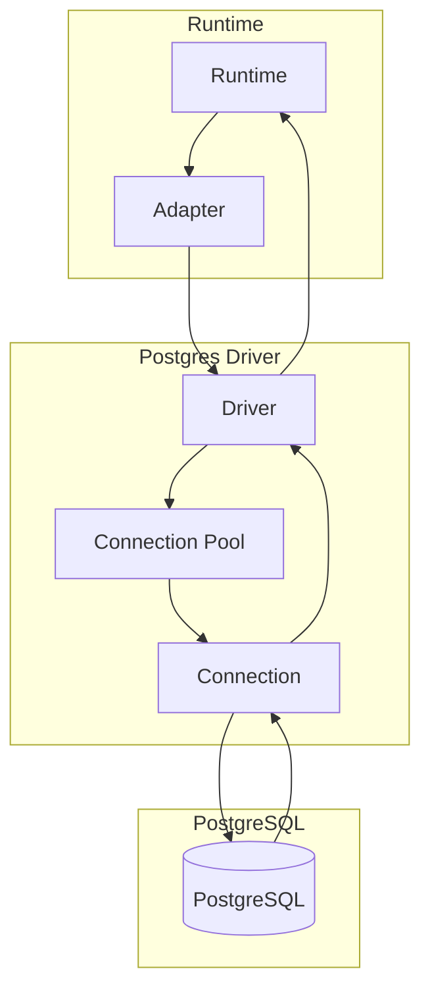

# @prisma-next/driver-postgres

PostgreSQL driver for Prisma Next.

## Overview

The PostgreSQL driver provides transport and connection management for PostgreSQL databases. It implements the `SqlDriver` interface for executing SQL statements, explaining queries, and managing connections.

Drivers are transport-agnostic: they own pooling, connection management, and transport protocol (TCP, HTTP, etc.), but contain no dialect-specific logic. All dialect behavior lives in adapters.

## Purpose

Provide PostgreSQL transport and connection management. Execute SQL statements and manage connections without dialect-specific logic.

## Responsibilities

- **Connection Management**: Acquire and release database connections
- **Statement Execution**: Execute SQL statements with parameters
- **Query Explanation**: Execute EXPLAIN queries for query analysis
- **Connection Pooling**: Manage connection pools (when applicable)
- **Transport Protocol**: Handle PostgreSQL protocol (TCP, HTTP, etc.)

**Non-goals:**
- Dialect-specific SQL lowering (adapters)
- Query compilation (sql-query)
- Runtime execution (runtime)

## Architecture



## Components

### Driver (`postgres-driver.ts`)
- Main driver implementation
- Implements `SqlDriver` interface
- Manages connections and executes statements
- Handles PostgreSQL protocol

## Dependencies

- **`@prisma-next/sql-target`**: Driver SPI and SQL types

## Related Subsystems

- **[Adapters & Targets](../../docs/architecture%20docs/subsystems/5.%20Adapters%20&%20Targets.md)**: Driver specification

## Related ADRs

- [ADR 005 - Thin Core Fat Targets](../../docs/architecture%20docs/adrs/ADR%20005%20-%20Thin%20Core%20Fat%20Targets.md)
- [ADR 016 - Adapter SPI for Lowering](../../docs/architecture%20docs/adrs/ADR%20016%20-%20Adapter%20SPI%20for%20Lowering.md)

## Usage

```typescript
import { createPostgresDriver } from '@prisma-next/driver-postgres';
import { createRuntime } from '@prisma-next/runtime';

const driver = createPostgresDriver({
  connectionString: process.env.DATABASE_URL,
});

const runtime = createRuntime({
  contract,
  adapter: postgresAdapter,
  driver,
});
```

## Exports

- `.`: Driver implementation

