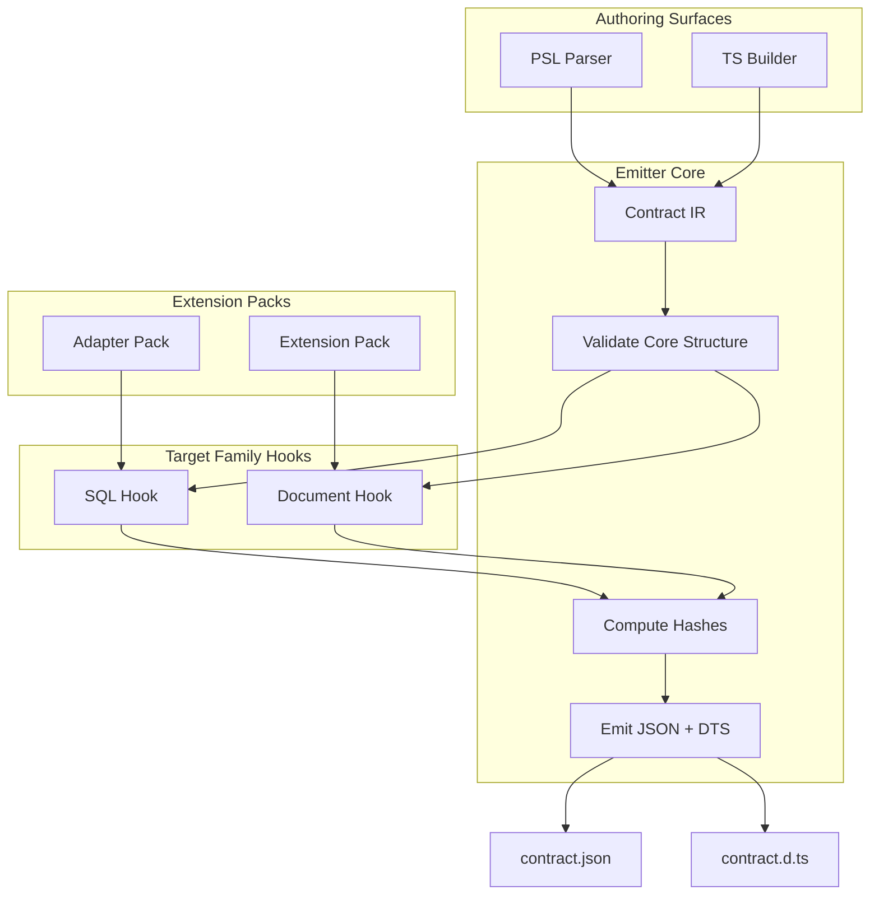

# @prisma-next/emitter

Contract emission engine that transforms authored data models into canonical JSON contracts and TypeScript type definitions.

## Overview

The emitter is the core of Prisma Next's contract-first architecture. It takes authored data models (from PSL or TypeScript builders) and produces two deterministic artifacts:

1. **`contract.json`** — Canonical JSON representation of the data contract with embedded `coreHash` and `profileHash`. Callers may add `_generated` metadata field to indicate it's a generated artifact (excluded from canonicalization/hashing).
2. **`contract.d.ts`** — TypeScript type definitions used by query builders and tooling (types-only, no runtime code). Includes warning header comments generated by target family hooks to indicate it's a generated file.

The emitter is target-family-agnostic and uses a pluggable hook system (`TargetFamilyHook`) to handle family-specific validation and type generation. This keeps the core thin while allowing SQL, Document, and other target families to extend emission behavior.

## Purpose

Provide a deterministic, verifiable representation of the application's data contract that downstream subsystems consume for planning, verification, and execution.

## Responsibilities

- **Parse & Normalize**: Accept contract IR (Intermediate Representation) from authoring surfaces
- **Validate**: Core structure validation plus family-specific type and structure validation via hooks
- **Canonicalize**: Compute `coreHash` (schema meaning) and `profileHash` (capabilities/pins) from canonical JSON
- **Emit**: Generate `contract.json` and `contract.d.ts` with family-specific type generation
- **Extension Pack Loading**: Load and validate extension pack manifests (via utilities)

**Non-goals:**
- Migration planning or execution
- Query compilation or execution
- Runtime capability discovery
- Policy enforcement

## Architecture



## Components

### Core Emitter (`emitter.ts`)
- Orchestrates validation, hashing, and type generation
- Returns contract JSON and TypeScript definitions as strings (no file I/O)
- Pure transformation function
- Accepts `targetFamily: TargetFamilyHook` as a required parameter (no global registry)

### Target Family Hook (`target-family.ts`)
- SPI interface (`TargetFamilyHook`) for extending emission with family-specific logic:
  - `validateTypes`: Validate type IDs against extensions and packs
  - `validateStructure`: Family-specific structural validation
  - `generateContractTypes`: Generate `contract.d.ts` content
  - `getTypesImports`: Determine required type imports from packs
- Authoring surfaces determine which target family SPI to use based on the contract's `targetFamily` field and pass it directly to `emit()`
- No global registry or auto-registration - dependencies are explicit and passed directly

### Hashing (`hashing.ts`)
- `computeCoreHash`: SHA-256 of schema structure (models, storage, relations)
- `computeProfileHash`: SHA-256 of capabilities and adapter pins

### Canonicalization (`canonicalization.ts`)
- `canonicalizeContract`: Normalizes contract IR into stable JSON string for hashing
- Excludes `_generated` metadata field from canonicalization to ensure determinism
- Sorts object keys, omits default values, and orders top-level fields consistently

### Extension Pack Utilities (`extension-pack.ts`)
- Load extension pack manifests from file paths
- Validate manifest structure using Arktype schemas

## Dependencies

- **`@prisma-next/node-utils`**: File I/O utilities for loading extension packs
- **`arktype`**: Runtime type validation for manifests

## Related Subsystems

- **[Contract Emitter & Types](../../docs/architecture%20docs/subsystems/2.%20Contract%20Emitter%20&%20Types.md)**: Detailed subsystem specification
- **[Data Contract](../../docs/architecture%20docs/subsystems/1.%20Data%20Contract.md)**: Contract structure and hashing

## Related ADRs

- [ADR 004 - Core Hash vs Profile Hash](../../docs/architecture%20docs/adrs/ADR%20004%20-%20Core%20Hash%20vs%20Profile%20Hash.md)
- [ADR 006 - Dual Authoring Modes](../../docs/architecture%20docs/adrs/ADR%20006%20-%20Dual%20Authoring%20Modes.md)
- [ADR 007 - Types Only Emission](../../docs/architecture%20docs/adrs/ADR%20007%20-%20Types%20Only%20Emission.md)
- [ADR 010 - Canonicalization Rules](../../docs/architecture%20docs/adrs/ADR%20010%20-%20Canonicalization%20Rules.md)
- [ADR 097 - Tooling runs on canonical JSON only](../../docs/architecture%20docs/adrs/ADR%20097%20-%20Tooling%20runs%20on%20canonical%20JSON%20only.md)

## Usage

```typescript
import { emit } from '@prisma-next/emitter';
import { loadExtensionPacks } from '@prisma-next/emitter';
import type { ContractIR, EmitOptions } from '@prisma-next/emitter';

// Load extension packs
const packs = loadExtensionPacks(
  './packages/adapter-postgres',
  ['./packages/extension-pack']
);

// Determine target family SPI based on target family
import { sqlTargetFamilyHook } from '@prisma-next/sql-target';

// Emit contract
const ir: ContractIR = {
  schemaVersion: '1',
  targetFamily: 'sql',
  target: 'postgres',
  // ... contract structure
};

// Pass target family SPI directly to emit()
const result = await emit(ir, {
  outputDir: './dist',
  packs,
}, sqlTargetFamilyHook);

// result.contractJson: string (JSON) - canonical JSON without _generated metadata
// result.contractDts: string (TypeScript definitions) - includes warning header
// result.coreHash: string
// result.profileHash?: string
```

**Note**: The emitter returns canonical JSON without `_generated` metadata. Callers (e.g., CLI) may add `_generated` metadata to the JSON before writing to disk. The `_generated` field is excluded from canonicalization/hashing to ensure determinism.

## Exports

- `.`: Main emitter API (`emit`, `loadExtensionPacks`, types)

