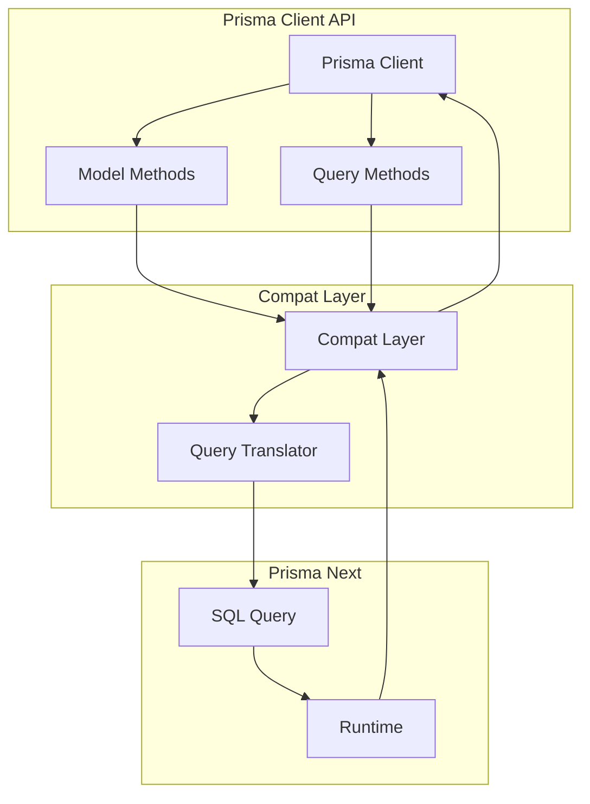

# @prisma-next/compat-prisma

Compatibility layer for migrating from Prisma ORM to Prisma Next.

## Package Classification

- **Domain**: extensions
- **Layer**: compat
- **Plane**: runtime

## Overview

The compatibility package provides a compatibility layer that allows existing Prisma ORM code to work with Prisma Next. It provides a subset of Prisma Client API surface that maps to Prisma Next's query builder and runtime.

This package is a transition tool for teams migrating from Prisma ORM to Prisma Next. It provides a familiar API surface while using Prisma Next's execution engine under the hood.

## Purpose

Provide a compatibility layer for Prisma ORM code to work with Prisma Next. Enable gradual migration from Prisma ORM to Prisma Next.

## Responsibilities

- **Prisma Client API**: Provide subset of Prisma Client API surface
- **Query Translation**: Translate Prisma Client queries to Prisma Next Plans
- **Result Mapping**: Map Prisma Next results to Prisma Client result shapes

**Non-goals:**
- Full Prisma Client API compatibility
- Migration tooling
- Schema generation

## Architecture



## Components

### Prisma Client (`prisma-client.ts`)
- Prisma Client compatibility implementation
- Provides familiar API surface
- Translates to Prisma Next Plans

## Dependencies

- **`@prisma-next/contract`**: Contract types
- **`@prisma-next/runtime`**: Runtime execution
- **`@prisma-next/sql-query`**: SQL query builder
- **`@prisma-next/adapter-postgres`**: PostgreSQL adapter
- **`@prisma-next/driver-postgres`**: PostgreSQL driver

## Related Subsystems

- **[Runtime & Plugin Framework](../../docs/architecture%20docs/subsystems/4.%20Runtime%20&%20Plugin%20Framework.md)**: Runtime execution

## Related ADRs

- [ADR 015 - ORM as Optional Extension](../../docs/architecture%20docs/adrs/ADR%20015%20-%20ORM%20as%20Optional%20Extension.md)

## Usage

```typescript
import { PrismaClient } from '@prisma-next/compat-prisma';

const prisma = new PrismaClient();

// Use familiar Prisma Client API
const users = await prisma.user.findMany({
  where: { active: true },
  select: { id: true, email: true },
});
```

## Exports

- `.`: Prisma Client compatibility implementation

