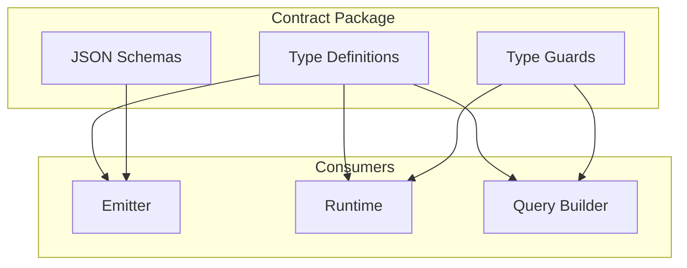

# @prisma-next/contract

Data contract type definitions and JSON schema for Prisma Next.

## Overview

This package provides TypeScript type definitions and JSON Schemas for Prisma Next data contracts. The data contract is the canonical description of an application's data model and storage layout, independent of any specific query language or database target.

## Responsibilities

- **Core Contract Types**: Defines framework-level contract types (`ContractBase`, `Source`) that are shared across all target families
- **Document Family Types**: Provides TypeScript types for document target family contracts (`DocumentContract`)
- **JSON Schema Validation**: Provides JSON Schemas for validating contract structure in IDEs and tooling
- **Type Guards**: Provides runtime type guards for narrowing contract types (`isDocumentContract`)

The contract supports document target families:
- **Document**: For document databases (MongoDB, Firestore, etc.)

## Package Contents

- **TypeScript Types**: Type definitions for `DocumentContract` and related types
- **JSON Schemas**: Schema definitions for validating `contract.json` files in IDEs and tooling
  - `data-contract-document-v1.json` (Document family)

## Usage

### TypeScript Types

Import contract types in your TypeScript code:

```typescript
import type { DocumentContract } from '@prisma-next/contract/types';
import { isDocumentContract } from '@prisma-next/contract/types';

// Use type guards to narrow the contract type
function processContract(contract: DocumentContract) {
  if (isDocumentContract(contract)) {
    // contract is DocumentContract
    console.log(contract.storage.document.collections);
  }
}
```

### JSON Schema Validation

Reference the appropriate JSON schema in your `contract.json` files to enable IDE validation and autocomplete.

#### Document Family

For document targets (MongoDB, Firestore, etc.):

```json
{
  "$schema": "node_modules/@prisma-next/contract/schemas/data-contract-document-v1.json",
  "schemaVersion": "1",
  "target": "mongodb",
  "targetFamily": "document",
  "coreHash": "sha256:...",
  "storage": {
    "document": {
      "collections": {
        "users": {
          "name": "users",
          "fields": {
            "id": { "type": "objectId", "nullable": false },
            "email": { "type": "string", "nullable": false }
          }
        }
      }
    }
  }
}
```

**Note:** For SQL contracts, use `@prisma-next/sql-query/schema-sql` instead:

```json
{
  "$schema": "node_modules/@prisma-next/sql-query/schemas/data-contract-sql-v1.json",
  "schemaVersion": "1",
  "target": "postgres",
  "targetFamily": "sql",
  "coreHash": "sha256:...",
  "storage": {
    "tables": {
      "user": {
        "columns": {
          "id": { "type": "int4", "nullable": false },
          "email": { "type": "text", "nullable": false }
        },
        "primaryKey": {
          "columns": ["id"],
          "name": "user_pkey"
        }
      }
    }
  }
}
```

After installing this package, IDEs like VS Code will automatically:
- Validate your contract structure
- Provide autocomplete for properties
- Show descriptions and constraints in tooltips
- Highlight errors for invalid configurations

## Schema Reference

### Common Header Fields

All contracts share these common fields:

- **`schemaVersion`** (required): Contract schema version (currently `"1"`)
- **`target`** (required): Database target identifier (e.g., `"postgres"`, `"mongo"`, `"firestore"`)
- **`targetFamily`** (required): Target family classification (`"document"` for document contracts)
- **`coreHash`** (required): SHA-256 hash of the core schema structure
- **`profileHash`** (optional): SHA-256 hash of the capability profile
- **`capabilities`** (optional): Capability flags declared by the contract
- **`extensions`** (optional): Extension packs and their configuration
- **`meta`** (optional): Non-semantic metadata (excluded from hashing)
- **`sources`** (optional): Read-only sources (views, etc.) available for querying

### Document Family Structure

- **`storage.document.collections`**: Object mapping collection names to collection definitions
  - Each collection includes:
    - **`name`**: Logical collection name
    - **`id`** (optional): ID generation strategy (`auto`, `client`, `uuid`, `cuid`, `objectId`)
    - **`fields`**: Field definitions using `FieldType` (supports nested objects and arrays)
    - **`indexes`** (optional): Array of index definitions with keys and optional predicates
    - **`readOnly`** (optional): Whether mutations are disallowed

## Type System

### Type Guards

Use type guards to narrow the contract type:

```typescript
import { isDocumentContract } from '@prisma-next/contract/types';

if (isDocumentContract(contract)) {
  // TypeScript knows contract is DocumentContract
  const collections = contract.storage.document.collections;
}
```

## Exports

- `./types`: TypeScript type definitions and type guards
- `./schema-document`: Document family JSON Schema (`schemas/data-contract-document-v1.json`)

## Architecture



## Related Subsystems

- **[Data Contract](../../docs/architecture%20docs/subsystems/1.%20Data%20Contract.md)**: Detailed subsystem specification
- **[Contract Emitter & Types](../../docs/architecture%20docs/subsystems/2.%20Contract%20Emitter%20&%20Types.md)**: Contract emission

## Related ADRs

- [ADR 001 - Migrations as Edges](../../docs/architecture%20docs/adrs/ADR%20001%20-%20Migrations%20as%20Edges.md)
- [ADR 004 - Core Hash vs Profile Hash](../../docs/architecture%20docs/adrs/ADR%20004%20-%20Core%20Hash%20vs%20Profile%20Hash.md)
- [ADR 006 - Dual Authoring Modes](../../docs/architecture%20docs/adrs/ADR%20006%20-%20Dual%20Authoring%20Modes.md)
- [ADR 010 - Canonicalization Rules](../../docs/architecture%20docs/adrs/ADR%20010%20-%20Canonicalization%20Rules.md)
- [ADR 021 - Contract Marker Storage](../../docs/architecture%20docs/adrs/ADR%20021%20-%20Contract%20Marker%20Storage.md)

## Dependencies

This package has no runtime dependencies (pure types and schemas).

**Dependents:**
- **`@prisma-next/contract-authoring`**: Uses core contract types for authoring
- **`@prisma-next/sql-contract`**: Extends core contract types for SQL family
- **`@prisma-next/emitter`**: Uses contract types for emission
- **`@prisma-next/runtime`**: Uses contract types for runtime execution
- **`@prisma-next/sql-query`**: Uses contract types for query building

## Related Packages

- `@prisma-next/sql-query`: SQL query builder and plan types
- `@prisma-next/runtime`: Runtime execution engine that consumes contracts
