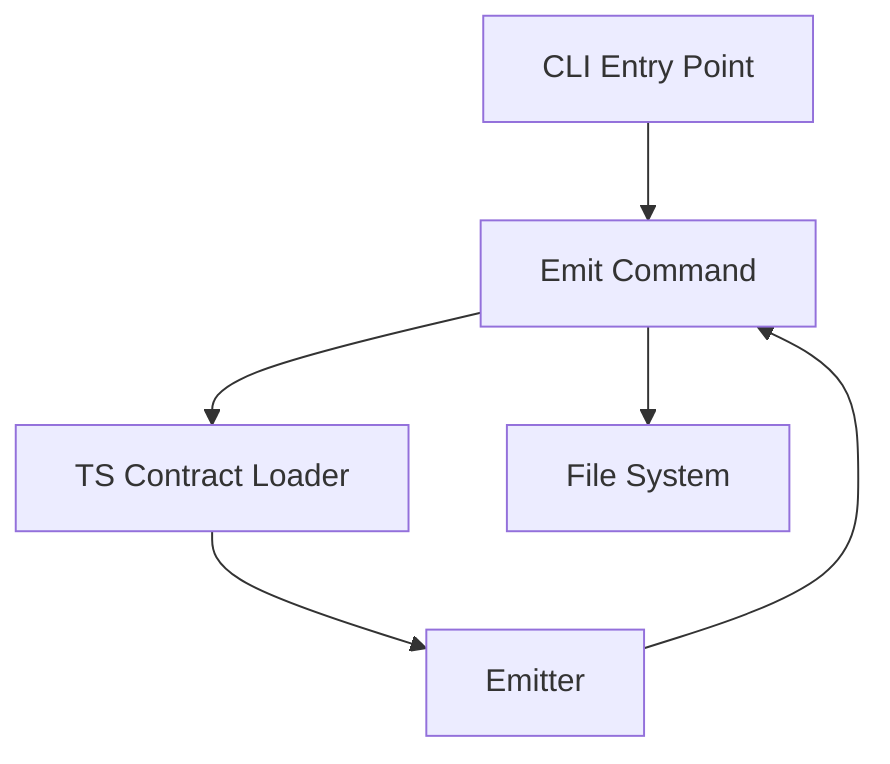

# @prisma-next/cli

Command-line interface for Prisma Next contract emission and management.

## Overview

The CLI provides commands for emitting canonical `contract.json` and `contract.d.ts` files from TypeScript-authored contracts. It enforces import allowlists and validates contract purity to ensure deterministic, reproducible artifacts. Generated files include metadata and warning headers to indicate they're generated artifacts and should not be edited manually.

## Purpose

Provide a command-line interface that:
- Loads TypeScript-authored contracts using esbuild with import allowlisting
- Validates contract purity (JSON-serializable, no functions/getters)
- Invokes the emitter to produce canonical artifacts
- Handles all file I/O operations (CLI handles I/O; emitter returns strings)

## Responsibilities

- **TS Contract Loading**: Bundle and load TypeScript contract files with import allowlist enforcement
- **CLI Command Interface**: Parse arguments and route to command handlers using commander
- **File I/O**: Read TS contracts, write emitted artifacts (`contract.json`, `contract.d.ts`)
- **Extension Pack Loading**: Load adapter and extension pack manifests for emission

## Commands

### `prisma-next emit`

Emit `contract.json` and `contract.d.ts` from `config.contract`.

Config-only surface:
```bash
prisma-next emit [--config <path>]
```

Options:
- `--config <path>`: Optional. Path to `prisma-next.config.ts` (defaults to `./prisma-next.config.ts` if present)

Example:
```bash
prisma-next emit --config prisma-next.config.ts
```

**Config File (`prisma-next.config.ts`):**

The CLI uses a config file to specify the target family, target, adapter, extensions, and contract. The config path can be:
- Relative to the current working directory (e.g., `./prisma-next.config.ts`)
- Absolute path (e.g., `/path/to/prisma-next.config.ts`)
- Omitted to use the default `./prisma-next.config.ts` in the current directory

The `c12` library handles both relative and absolute paths automatically:

```typescript
import { defineConfig } from '@prisma-next/cli/config-types';
import postgresAdapter from '@prisma-next/adapter-postgres/cli';
import postgres from '@prisma-next/targets-postgres/cli';
import sql from '@prisma-next/family-sql/cli';
import { contract } from './prisma/contract';

export default defineConfig({
  family: sql,
  target: postgres,
  adapter: postgresAdapter,
  extensions: [],
  contract: {
    source: contract, // Can be a value or a function: () => import('./contract').then(m => m.contract)
    output: 'src/prisma/contract.json', // Optional: defaults to 'src/prisma/contract.json'
    types: 'src/prisma/contract.d.ts', // Optional: defaults to output with .d.ts extension
  },
});
```

The `contract.source` field can be:
- A direct value: `source: contract`
- A synchronous function: `source: () => contract`
- An asynchronous function: `source: () => import('./contract').then(m => m.contract)`

The `contract.output` field specifies the path to `contract.json`. This is the canonical location where other CLI commands can find the contract JSON artifact. Defaults to `'src/prisma/contract.json'` if not specified.

The `contract.types` field specifies the path to `contract.d.ts`. Defaults to `output` with `.d.ts` extension (replaces `.json` with `.d.ts` if output ends with `.json`, otherwise appends `contract.d.ts` to the directory containing output).

**Output:**
- `contract.json`: Includes `_generated` metadata field indicating it's a generated artifact (excluded from canonicalization/hashing)
- `contract.d.ts`: Includes warning header comments indicating it's a generated file

## Architecture



## Config Validation and Normalization

The `defineConfig()` function validates and normalizes configs using Arktype:

- **Validation**: Validates config structure using Arktype schemas
- **Normalization**: Applies default values (e.g., `contract.output` defaults to `'src/prisma/contract.json'`)
- **Error Messages**: Provides clear, actionable error messages on validation failure

See `.cursor/rules/config-validation-and-normalization.mdc` for detailed patterns.

## Components

### CLI Entry Point (`cli.ts`)
- Main entry point using commander
- Parses arguments and routes to command handlers
- Handles global flags (`--help`, `--version`)
- Exit codes: 0 (success), 1 (error)
- **Error Handling**: Commands throw errors; Commander.js automatically handles them and exits with code 1

### Emit Command (`commands/emit.ts`)
- Command implementation using commander
- **Error Handling**: Throws errors instead of calling `process.exit()`. Commander.js handles errors and exits with code 1 automatically.
- Loads the user's config module (`prisma-next.config.ts`)
- Resolves contract from config:
  - If `config.contract.source` is a function, calls it (supports sync and async functions)
  - Otherwise uses `config.contract.source` directly
  - Throws error if `config.contract` is missing
- Uses artifact paths from `config.contract.output` and `config.contract.types` (already normalized by `defineConfig()` with defaults applied)
- Strips mappings if family provides `stripMappings()` function
- Uses framework CLI assembly functions to loop over descriptors:
  - `assembleOperationRegistry(descriptors, family)` - Loops over descriptors, extracts operations, calls `family.convertOperationManifest()` for each
  - `extractCodecTypeImports(descriptors)` - Extracts codec type imports from descriptors
  - `extractOperationTypeImports(descriptors)` - Extracts operation type imports from descriptors
  - `extractExtensionIds(adapter, target, extensions)` - Extracts extension IDs in deterministic order
- Calls `config.family.validateContractIR()` to validate and normalize contract, returns ContractIR without mappings
- Calls `emit()` from emitter with the assembled inputs and `family.hook`
- Adds `_generated` metadata field to `contract.json` to indicate it's a generated artifact
- Writes `contract.json` and `contract.d.ts` to the paths specified in `config.contract.output` and `config.contract.types`

### Pack Assembly (`pack-assembly.ts`)
- Generic assembly functions that loop over descriptors/packs:
  - `assembleOperationRegistry(descriptors, family)` - Loops over descriptors, extracts operations, delegates to `family.convertOperationManifest()` for conversion
  - `extractCodecTypeImports(descriptors)` - Extracts codec type imports from descriptors
  - `extractOperationTypeImports(descriptors)` - Extracts operation type imports from descriptors
  - `extractExtensionIds(adapter, target, extensions)` - Extracts extension IDs in deterministic order
  - Pack-based versions for tests: `assembleOperationRegistryFromPacks`, `extractCodecTypeImportsFromPacks`, etc.
- These functions handle the generic looping logic; family-specific conversion is delegated to `family.convertOperationManifest()`.

### Family Descriptor (provided by family /cli entrypoint)
- The SQL family (and other families) provide:
  - `convertOperationManifest(manifest)` - Converts `OperationManifest` to `OperationSignature` (family-specific, e.g., SQL adds lowering spec)
  - `validateContractIR(contractJson)` - Validates and normalizes contract, returns ContractIR without mappings
  - `stripMappings?(contract)` - Optionally strips runtime-only mappings from contract
- The framework CLI handles generic looping; families provide conversion logic.

### Pack Manifest Types (IR)
- Families define their manifest IR and related types under their own tooling packages. CLI treats manifests as opaque data.

## Dependencies

- **`commander`**: CLI argument parsing and command routing
- **`esbuild`**: Bundling TypeScript contract files with import allowlisting
- **`@prisma-next/emitter`**: Contract emission engine (returns strings)

## Design Decisions

1. **Import Allowlist**: Only `@prisma-next/*` packages allowed (MVP). Expand later if needed.
2. **Utility Separation**: TS contract loading is a utility function, not a command. Commands use utilities.
3. **CLI Framework**: Use `commander` library for robust CLI argument parsing.
4. **File I/O**: CLI handles all I/O; emitter returns strings (no file operations in emitter).
5. **Generated File Metadata**: Adds `_generated` metadata field to `contract.json` to indicate it's a generated artifact. This field is excluded from canonicalization/hashing to ensure determinism. The `contract.d.ts` file includes warning header comments generated by the emitter hook.

## Package Location

This package is part of the **framework domain**, **tooling layer**, **migration plane**:
- **Domain**: framework (target-agnostic)
- **Layer**: tooling
- **Plane**: migration
- **Path**: `packages/framework/tooling/cli`

## See Also

- [`@prisma-next/emitter`](../emitter/README.md) - Contract emission engine
- Project Brief — CLI Support for Extension Packs: `docs/briefs/complete/20-CLI-Support-for-Extension-Packs.md`
