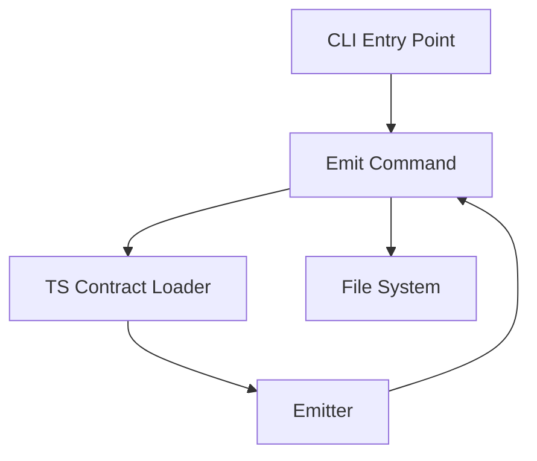

# @prisma-next/cli

Command-line interface for Prisma Next contract emission and management.

## Overview

The CLI provides commands for emitting canonical `contract.json` and `contract.d.ts` files from TypeScript-authored contracts. It enforces import allowlists and validates contract purity to ensure deterministic, reproducible artifacts. Generated files include metadata and warning headers to indicate they're generated artifacts and should not be edited manually.

## Purpose

Provide a command-line interface that:
- Loads TypeScript-authored contracts using esbuild with import allowlisting
- Validates contract purity (JSON-serializable, no functions/getters)
- Invokes the emitter to produce canonical artifacts
- Handles all file I/O operations (CLI handles I/O; emitter returns strings)

## Responsibilities

- **TS Contract Loading**: Bundle and load TypeScript contract files with import allowlist enforcement
- **CLI Command Interface**: Parse arguments and route to command handlers using commander
- **File I/O**: Read TS contracts, write emitted artifacts (`contract.json`, `contract.d.ts`)
- **Extension Pack Loading**: Load adapter and extension pack manifests for emission

## Commands

### `prisma-next emit`

Emit `contract.json` and `contract.d.ts` from a TypeScript contract file.

Config-only surface (no pack flags):
```bash
prisma-next emit --contract <path> --out <dir> [--config <path>]
```

Options:
- `--contract <path>`: Required. Path to TypeScript contract file
- `--out <dir>`: Required. Output directory for emitted artifacts
- `--config <path>`: Optional. Path to `prisma-next.config.ts` (defaults to `./prisma-next.config.ts` if present)

Example:
```bash
prisma-next emit --contract src/contract.ts --out dist --config prisma-next.config.ts
```

**Config File (`prisma-next.config.ts`):**

The CLI uses a config file to specify the target family, target, adapter, and extensions:

```typescript
import { defineConfig } from '@prisma-next/cli/config-types';
import postgresAdapter from '@prisma-next/adapter-postgres/cli';
import postgres from '@prisma-next/targets-postgres/cli';
import sql from '@prisma-next/family-sql/cli';

export default defineConfig({
  family: sql,
  target: postgres,
  adapter: postgresAdapter,
  extensions: [],
});
```

**Output:**
- `contract.json`: Includes `_generated` metadata field indicating it's a generated artifact (excluded from canonicalization/hashing)
- `contract.d.ts`: Includes warning header comments indicating it's a generated file

## Architecture



## Components

### CLI Entry Point (`cli.ts`)
- Main entry point using commander
- Parses arguments and routes to command handlers
- Handles global flags (`--help`, `--version`)
- Exit codes: 0 (success), 1 (error)

### TS Contract Loader (`load-ts-contract.ts`)
- Utility function (not a command) for loading TS contracts
- Uses esbuild to bundle contract entry with import allowlist
- Enforces allowlist: only `@prisma-next/*` packages allowed
- Validates contract purity (JSON-serializable)
- **Responsibility: Parsing Only** - This function loads and parses a TypeScript contract file. It does NOT normalize the contract. The contract should already be normalized if it was built using the contract builder. Normalization must happen in the contract builder when the contract is created.
- Returns `ContractIR` for emission (should already be normalized)

### Emit Command (`commands/emit.ts`)
- Command implementation using commander
- Loads the user’s config module (`prisma-next.config.ts`)
- Reads family hook and family helpers (`assembleOperationRegistry`, `extractCodecTypeImports`, `extractOperationTypeImports`) from `config.family`
- Calls family helpers with `{ adapter, target, extensions }` to assemble inputs for emission; manifests are treated as opaque by the CLI
- Loads TS contract using `loadContractFromTs()` utility
- Calls `emit()` from emitter with the assembled inputs and `family.hook`
- Adds `_generated` metadata field to `contract.json` to indicate it's a generated artifact
- Writes `contract.json` and `contract.d.ts` to output directory

### Family Helpers (provided by family /cli entrypoint)
- The SQL family (and other families) provide helper functions used by the CLI to assemble inputs for emission:
  - `assembleOperationRegistry(descriptors)`
  - `extractCodecTypeImports(descriptors)`
  - `extractOperationTypeImports(descriptors)`
- These helpers move family-specific assembly logic out of the CLI so the CLI remains family‑agnostic.

### Pack Manifest Types (IR)
- Families define their manifest IR and related types under their own tooling packages. CLI treats manifests as opaque data.

## Dependencies

- **`commander`**: CLI argument parsing and command routing
- **`esbuild`**: Bundling TypeScript contract files with import allowlisting
- **`@prisma-next/emitter`**: Contract emission engine (returns strings)

## Design Decisions

1. **Import Allowlist**: Only `@prisma-next/*` packages allowed (MVP). Expand later if needed.
2. **Utility Separation**: TS contract loading is a utility function, not a command. Commands use utilities.
3. **CLI Framework**: Use `commander` library for robust CLI argument parsing.
4. **File I/O**: CLI handles all I/O; emitter returns strings (no file operations in emitter).
5. **Generated File Metadata**: Adds `_generated` metadata field to `contract.json` to indicate it's a generated artifact. This field is excluded from canonicalization/hashing to ensure determinism. The `contract.d.ts` file includes warning header comments generated by the emitter hook.

## Package Location

This package is part of the **framework domain**, **tooling layer**, **migration plane**:
- **Domain**: framework (target-agnostic)
- **Layer**: tooling
- **Plane**: migration
- **Path**: `packages/framework/tooling/cli`

## See Also

- [`@prisma-next/emitter`](../emitter/README.md) - Contract emission engine
- Project Brief — CLI Support for Extension Packs: `docs/briefs/complete/20-CLI-Support-for-Extension-Packs.md`
