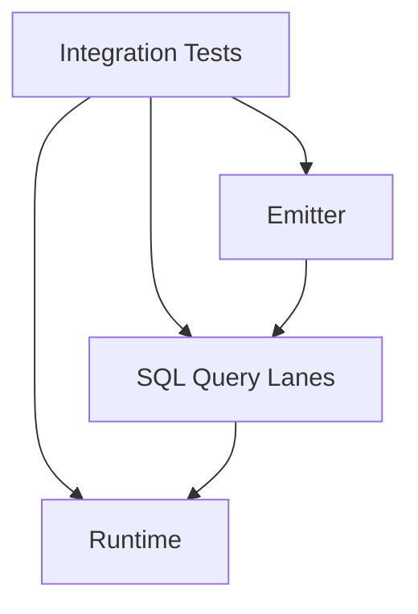

# @prisma-next/integration-tests

Integration tests for Prisma Next that verify end-to-end behavior across packages.

## Overview

This package contains integration tests that verify the complete flow from contract emission through query building and execution. It tests real consumer behavior by using only public package exports.

## Purpose

- Verify end-to-end flows across packages (emitter → lanes → runtime)
- Test real consumer behavior (no deep imports)
- Ensure package boundaries remain intact
- Validate that emitted contracts work correctly with lanes and runtime

## Structure

- `test/*.integration.test.ts` - Integration test files
- `test/fixtures/` - Optional minimal fixtures/schemas (if needed)

## Dependencies

This package depends on all packages under test via workspace protocol:
- `@prisma-next/emitter` - Contract emission
- `@prisma-next/sql-query` - Query builders
- `@prisma-next/sql-target` - SQL target family
- `@prisma-next/runtime` - Execution runtime
- `@prisma-next/adapter-postgres` - Postgres adapter
- `@prisma-next/driver-postgres` - Postgres driver
- `@prisma-next/contract` - Contract types

## Running Tests

```bash
# Run all integration tests
pnpm -F integration-tests test

# Or via turbo
turbo run test --filter=integration-tests
```

Tests automatically depend on builds of target packages via Turborepo.

## Test Strategy

- **No circular dependencies**: Tests import from built packages only
- **Public API only**: Tests use only public exports (respect package.json exports)
- **Real consumer behavior**: Tests simulate how real consumers would use the packages
- **End-to-end flows**: Tests verify complete flows (emit → lanes → runtime)

## Architecture



