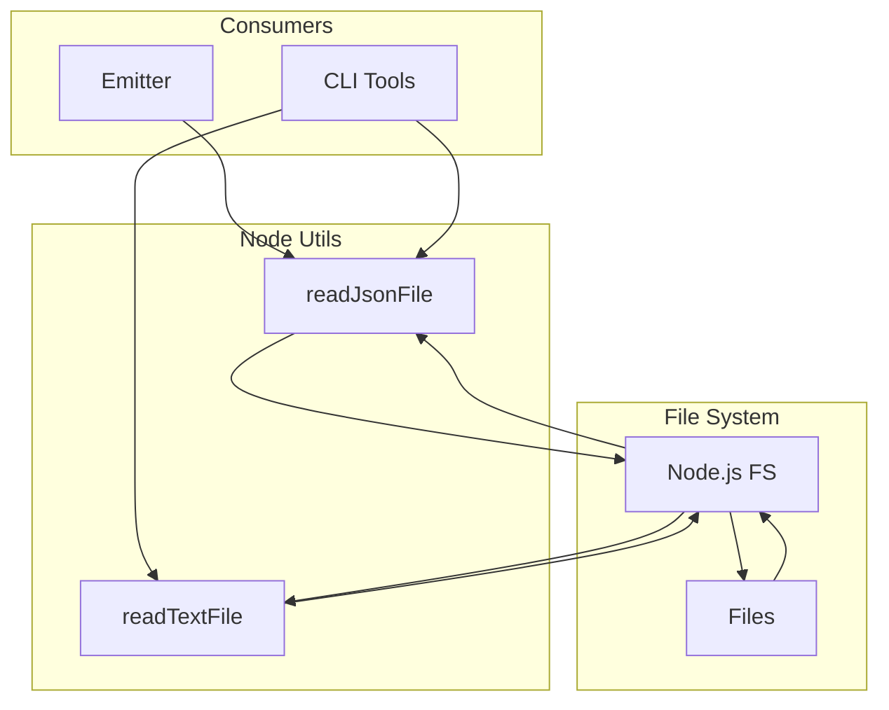

# @prisma-next/node-utils

Node.js file I/O utilities for Prisma Next.

## Overview

The node-utils package provides file I/O utilities for Node.js environments. It provides safe, consistent file reading operations with proper error handling.

This package is a minimal utility package that encapsulates file I/O operations used across Prisma Next packages. It keeps I/O concerns separate from business logic.

## Purpose

Provide file I/O utilities for Node.js environments. Centralize file reading operations with consistent error handling.

## Responsibilities

- **File Reading**: Read text and JSON files from the filesystem
- **Error Handling**: Provide clear error messages for file operations
- **Type Safety**: Type-safe JSON parsing with TypeScript generics

**Non-goals:**
- File writing operations
- Directory operations
- Cross-platform path handling

## Architecture



## Components

### File System Utilities (`fs.ts`)
- `readJsonFile<T>(filePath: string): T`: Read and parse JSON files
- `readTextFile(filePath: string): string`: Read text files

## Dependencies

- **Node.js**: Built-in `fs` module

## Usage

```typescript
import { readJsonFile, readTextFile } from '@prisma-next/node-utils';

// Read and parse JSON
const manifest = readJsonFile<ExtensionPackManifest>('./packs/manifest.json');

// Read text file
const content = readTextFile('./config.txt');
```

## Exports

- `.`: File I/O utilities

