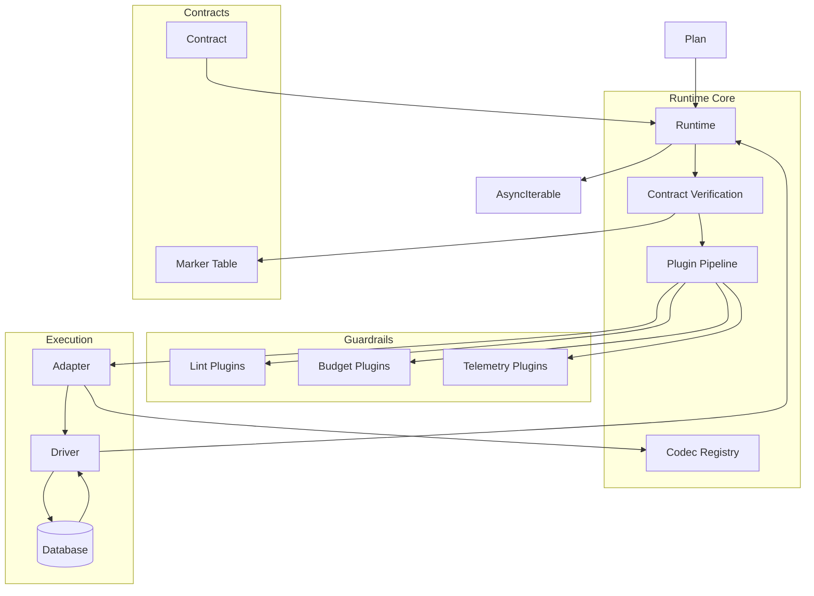

# @prisma-next/runtime

Runtime execution engine that verifies contracts, executes queries, and applies guardrails.

## Overview

The runtime is the executable core of Prisma Next. It orchestrates query execution through a deterministic pipeline: contract verification, plugin guardrails, adapter lowering, and codec decoding. Every query is compiled into a Plan, and every Plan passes through verification and a plugin pipeline before execution.

The runtime follows a "thin core, fat targets" philosophy: it contains no dialect-specific logic, no transport/pooling code, and no policy enforcement. Instead, it coordinates adapters, drivers, and plugins to deliver deterministic behavior with tight feedback loops.

## Purpose

Execute query Plans with deterministic verification, guardrails, and feedback. Provide a unified execution surface that works across all query lanes (DSL, ORM, Raw SQL, TypedSQL).

## Responsibilities

- **Contract Verification**: Verify loaded contract against database marker (`coreHash` and `profileHash`)
- **Plan Execution**: Execute Plans through adapters and drivers
- **Plugin Pipeline**: Apply guardrails (lints, budgets, telemetry) before and during execution
- **Codec Composition**: Compose codec registries from adapters and extension packs
- **Result Streaming**: Stream results as `AsyncIterable<Row>` for efficient processing
- **Error Mapping**: Map driver errors to stable `RuntimeError` envelope

**Non-goals:**
- Migration planning or execution
- Dialect-specific SQL lowering (adapters)
- Transport/pooling management (drivers)
- Policy definition (plugins)

## Architecture



## Components

### Runtime (`runtime.ts`)
- Main orchestrator for query execution
- Manages contract verification, plugin lifecycle, and result streaming
- Coordinates adapters, drivers, and codecs

### Codecs (`codecs/`)
- **Encoding**: Encode JavaScript values to wire format for parameters
- **Decoding**: Decode wire format values to JavaScript types
- **Validation**: Validate decoded values against contract types

### Plugins (`plugins/`)
- **Lints**: Pre-execution validation and warnings
- **Budgets**: Resource limit enforcement (rows, latency)
- **Types**: Type inference and validation

### Guardrails (`guardrails/`)
- **Raw**: Guardrails for raw SQL execution

### Diagnostics (`diagnostics.ts`)
- Error taxonomy and mapping
- Structured error reporting

### Marker (`marker.ts`)
- Contract marker verification
- Database alignment checks

### Fingerprint (`fingerprint.ts`)
- Plan fingerprinting for caching and identity

## Dependencies

- **`@prisma-next/sql-query`**: Plan types and SQL contract types
- **`@prisma-next/sql-target`**: Adapter SPI, codec interfaces, SQL contract types
- **`@prisma-next/driver-postgres`**: Postgres driver implementation

## Related Subsystems

- **[Runtime & Plugin Framework](../../docs/architecture%20docs/subsystems/4.%20Runtime%20&%20Plugin%20Framework.md)**: Detailed subsystem specification
- **[Adapters & Targets](../../docs/architecture%20docs/subsystems/5.%20Adapters%20&%20Targets.md)**: Adapter and driver interfaces

## Related ADRs

- [ADR 002 - Plans are Immutable](../../docs/architecture%20docs/adrs/ADR%20002%20-%20Plans%20are%20Immutable.md)
- [ADR 003 - One Query One Statement](../../docs/architecture%20docs/adrs/ADR%20003%20-%20One%20Query%20One%20Statement.md)
- [ADR 011 - Unified Plan Model](../../docs/architecture%20docs/adrs/ADR%20011%20-%20Unified%20Plan%20Model.md)
- [ADR 014 - Runtime Hook API](../../docs/architecture%20docs/adrs/ADR%20014%20-%20Runtime%20Hook%20API.md)
- [ADR 021 - Contract Marker Storage](../../docs/architecture%20docs/adrs/ADR%20021%20-%20Contract%20Marker%20Storage.md)
- [ADR 022 - Lint Rule Taxonomy](../../docs/architecture%20docs/adrs/ADR%20022%20-%20Lint%20Rule%20Taxonomy.md)
- [ADR 023 - Budget Evaluation](../../docs/architecture%20docs/adrs/ADR%20023%20-%20Budget%20Evaluation.md)
- [ADR 030 - Result decoding & codecs registry](../../docs/architecture%20docs/adrs/ADR%20030%20-%20Result%20decoding%20&%20codecs%20registry.md)
- [ADR 124 - Unified Async Iterable Execution Surface](../../docs/architecture%20docs/adrs/ADR%20124%20-%20Unified%20Async%20Iterable%20Execution%20Surface.md)
- [ADR 125 - Execution Mode Selection & Streaming Semantics](../../docs/architecture%20docs/adrs/ADR%20125%20-%20Execution%20Mode%20Selection%20&%20Streaming%20Semantics.md)

## Usage

```typescript
import { createRuntime } from '@prisma-next/runtime';
import { createPostgresAdapter } from '@prisma-next/adapter-postgres';
import { createPostgresDriver } from '@prisma-next/driver-postgres';
import contract from './contract.json';

const runtime = createRuntime({
  contract,
  adapter: createPostgresAdapter(),
  driver: createPostgresDriver({ connectionString: process.env.DATABASE_URL }),
  plugins: [
    // Add lints, budgets, telemetry plugins
  ],
});

// Execute a plan
for await (const row of runtime.execute(plan)) {
  console.log(row);
}
```

## Exports

- `.`: Main runtime API (`createRuntime`, types)
- `./test/utils`: Test utilities

