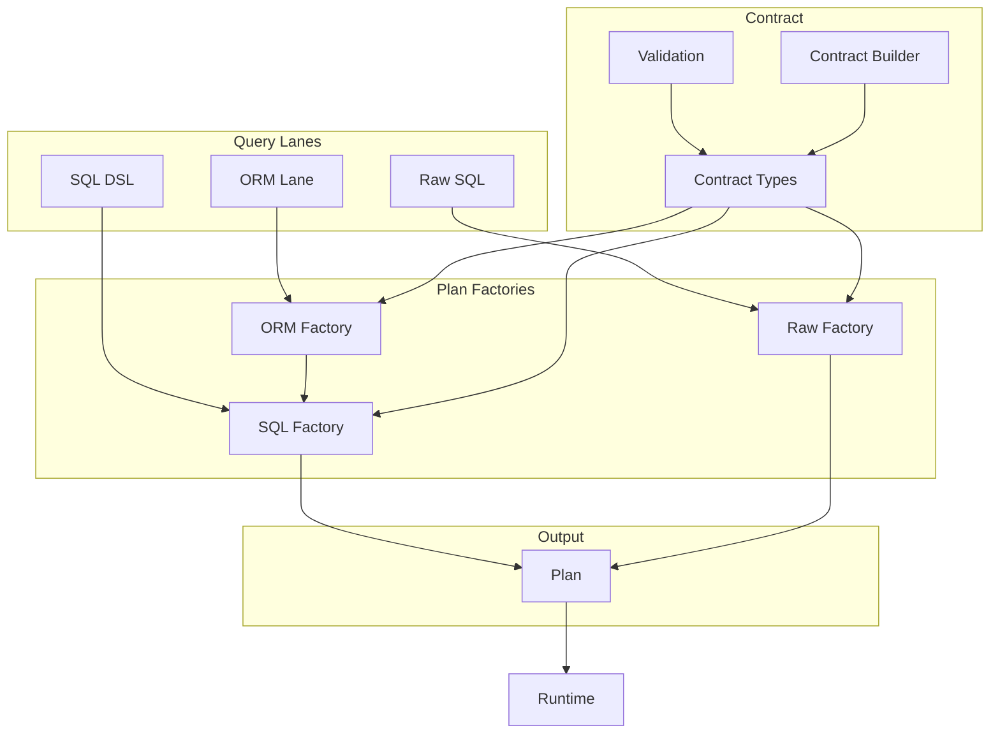

# @prisma-next/sql-query

SQL query builder and plan factories for Prisma Next.

## Overview

The SQL query package provides query authoring surfaces (DSL, Raw SQL, ORM) that compile to unified Plans. It includes SQL-specific contract types, validation, and a query builder DSL that produces Plans with SQL, parameters, and metadata.

This package implements the Query Lanes subsystem for SQL targets, providing multiple authoring ergonomics while keeping dialect/capability logic out of lanes. All lanes compile to the same Plan structure that the runtime executes with consistent verification and guardrails.

## Purpose

Provide SQL query authoring surfaces that compile to immutable Plans. Support multiple authoring ergonomics (DSL, Raw SQL, ORM) while maintaining one query → one statement semantics.

## Responsibilities

- **Query DSL**: Relational DSL that compiles to Plans with AST, SQL, and metadata
- **ORM Lane**: Model-centric ORM API that compiles to SQL lane primitives (EXISTS subqueries, includeMany, DML operations)
- **Raw SQL**: Raw SQL escape hatch with required annotations and verification
- **Contract Types**: SQL-specific contract types (`SqlContract`, `SqlStorage`, etc.)
- **Contract Validation**: Structural validation for SQL contracts using Arktype
- **Contract Builder**: TypeScript builder for creating SQL contracts programmatically
- **Plan Factories**: Compile declarative inputs into deterministic Plans

**Non-goals:**
- Execution or runtime behavior (runtime)
- Dialect-specific lowering (adapters)
- Policy enforcement (plugins)

## Architecture



## Components

### Query Builder (`sql.ts`)
- Relational DSL for building SQL queries
- Compiles to Plans with AST, SQL, and metadata
- Supports projections, filters, joins, ordering, limits
- **Nested Projection Shaping**: Express nested object literals in `.select()` for compile-time type inference, while runtime produces flat SQL with flattened aliases (e.g., `post.title` → `post_title`)
- **Nested Array Includes (`includeMany`)**: Express 1:N relationships that return one row per parent with a nested array field for children, built in a single statement using `LATERAL` + `json_agg` when supported. Requires both `lateral` and `jsonAgg` capabilities to be `true` in the contract.
- **DML Operations**: Supports INSERT, UPDATE, DELETE operations with `returning()` method for returning affected rows. The `returning()` method is capability-gated and requires `returning: true` in contract capabilities.
- Join methods: `innerJoin()`, `leftJoin()`, `rightJoin()`, `fullJoin()`
- Join ON conditions use `on.eqCol(left, right)` callback pattern
- Self-joins are not supported in MVP

### Raw SQL (`raw.ts`)
- Raw SQL escape hatch with template tags and function form
- Required annotations for verification and guardrails
- Produces Plans with SQL, parameters, and metadata

### Schema Builder (`schema.ts`)
- Type-safe table and column builders
- Infers JavaScript types from contract types
- Supports column builders with metadata
- Attaches operations from operation registry to column builders based on column typeId
- Accepts `RuntimeContext` for operations registry (optional)
- `codecTypes` is a generic type parameter only (compile-time), not a runtime parameter

### Parameter Builder (`param.ts`)
- Parameter placeholder factory
- Type-safe parameter handling

### Contract Types (`contract-types.ts`)
- SQL-specific contract types (re-exported from `@prisma-next/sql-target`)
- `SqlContract`, `SqlStorage`, `StorageColumn`, etc.

### Contract Validation (`contract.ts`)
- Structural validation for SQL contracts using Arktype
- Type guards and validation schemas
- **Responsibility: Validation Only** - This function validates that the contract has the correct structure and types. It does NOT normalize the contract. The contract must already be normalized (all required fields present) before calling this function.
- `validateContract<TContract>()` requires a fully-typed contract type `TContract` (from `contract.d.ts`), NOT a generic `SqlContract<SqlStorage>`. Using a generic type will cause all subsequent type inference to fail. See function documentation for details.

### Contract Builder (`contract-builder.ts`)
- TypeScript builder for creating SQL contracts programmatically
- Fluent API for defining tables, columns, constraints
- **Responsibility: Normalization** - The builder normalizes contracts by setting default values for all required fields:
  - `nullable`: defaults to `false` if not provided
  - `uniques`: defaults to `[]` (empty array)
  - `indexes`: defaults to `[]` (empty array)
  - `foreignKeys`: defaults to `[]` (empty array)
  - `relations`: defaults to `{}` (empty object) for both model-level and contract-level
  - `extensions`: defaults to `{}` (empty object)
  - `capabilities`: defaults to `{}` (empty object)
  - `meta`: defaults to `{}` (empty object)
  - `sources`: defaults to `{}` (empty object)
- The builder is the **only** place where normalization should occur. Validators, parsers, and emitters assume contracts are already normalized (all required fields present, even if empty).

### Types (`types.ts`)
- Plan types, AST types, and utility types
- Type inference helpers for columns and projections

### ORM Lane (`orm.ts`)
- Model-centric ORM API that compiles to SQL lane primitives
- **Entrypoint**: `orm.<model>()` with model registry proxy for discoverability
- **Read Operations**: `findMany()`, `findFirst()`, `findUnique()` (not yet implemented)
- **Chained Methods**: `where()`, `orderBy()`, `take()`, `skip()`, `select()`
- **Relation Filters**: `where.related.<relation>.some/none/every(predicate)` compile to EXISTS/NOT EXISTS subqueries
- **Includes**: `include.<relation>(child => ...)` compile to SQL lane `includeMany()` (capability-gated: requires `lateral: true` and `jsonAgg: true`)
- **Base-Model Writes**: `create(data)`, `update(where, data)`, `delete(where)` compile to SQL lane DML operations
- **Model-to-Column Mapping**: Automatically maps model field names to column names using contract mappings
- All ORM plans have `meta.lane = 'orm'` and appropriate annotations

### Errors (`errors.ts`)
- SQL-specific error types and factories

### Operations Registry (`operations-registry.ts`)
- `attachOperationsToColumnBuilder()`: Attach registered operations as methods on `ColumnBuilder` instances
- Dynamically exposes operations based on column `typeId` and contract capabilities

## Dependencies

- **`@prisma-next/contract`**: Core contract types
- **`@prisma-next/sql-target`**: SQL contract types, adapter interfaces
- **`arktype`**: Runtime type validation

## Related Subsystems

- **[Query Lanes](../../docs/architecture%20docs/subsystems/3.%20Query%20Lanes.md)**: Detailed subsystem specification
- **[Runtime & Plugin Framework](../../docs/architecture%20docs/subsystems/4.%20Runtime%20&%20Plugin%20Framework.md)**: Plan execution

## Related ADRs

- [ADR 002 - Plans are Immutable](../../docs/architecture%20docs/adrs/ADR%20002%20-%20Plans%20are%20Immutable.md)
- [ADR 003 - One Query One Statement](../../docs/architecture%20docs/adrs/ADR%20003%20-%20One%20Query%20One%20Statement.md)
- [ADR 011 - Unified Plan Model](../../docs/architecture%20docs/adrs/ADR%20011%20-%20Unified%20Plan%20Model.md)
- [ADR 012 - Raw SQL Escape Hatch](../../docs/architecture%20docs/adrs/ADR%20012%20-%20Raw%20SQL%20Escape%20Hatch.md)
- [ADR 015 - ORM as Optional Extension](../../docs/architecture%20docs/adrs/ADR%20015%20-%20ORM%20as%20Optional%20Extension.md)
- [ADR 020 - Result Typing Rules](../../docs/architecture%20docs/adrs/ADR%20020%20-%20Result%20Typing%20Rules.md)

## Usage

### SQL DSL

```typescript
import { sql, schema } from '@prisma-next/sql-query/sql';
import { createRuntimeContext } from '@prisma-next/runtime';
import type { Contract, CodecTypes } from './contract.d';
import contractJson from './contract.json' assert { type: 'json' };

const contract = validateContract<Contract>(contractJson);
const context = createRuntimeContext({ adapter, extensions: [] });

// Get tables from schema (pass context for operations registry)
const tables = schema<Contract, CodecTypes>(contract, context).tables;

const plan = sql<Contract, CodecTypes>({ contract, adapter })
  .from(tables.user)
  .where(tables.user.columns.active.eq(param('active')))
  .select({ id: tables.user.columns.id, email: tables.user.columns.email })
  .limit(100)
  .build();
```

### SQL DSL with Joins

```typescript
import { sql, schema } from '@prisma-next/sql-query/sql';
import { createRuntimeContext } from '@prisma-next/runtime';
import type { Contract, CodecTypes } from './contract.d';
import contractJson from './contract.json' assert { type: 'json' };

const contract = validateContract<Contract>(contractJson);
const context = createRuntimeContext({ adapter, extensions: [] });
const tables = schema<Contract, CodecTypes>(contract, context).tables;

const plan = sql<Contract, CodecTypes>({ contract, adapter })
  .from(tables.user)
  .innerJoin(tables.post, (on) => on.eqCol(tables.user.columns.id, tables.post.columns.userId))
  .where(tables.user.columns.active.eq(param('active')))
  .select({
    userId: tables.user.columns.id,
    email: tables.user.columns.email,
    postId: tables.post.columns.id,
    title: tables.post.columns.title,
  })
  .build({ params: { active: true } });
```

### SQL DSL with Nested Projections

```typescript
import { sql, schema } from '@prisma-next/sql-query/sql';
import { createRuntimeContext } from '@prisma-next/runtime';
import type { Contract, CodecTypes } from './contract.d';
import contractJson from './contract.json' assert { type: 'json' };

const contract = validateContract<Contract>(contractJson);
const context = createRuntimeContext({ adapter, extensions: [] });
const tables = schema<Contract, CodecTypes>(contract, context).tables;

// Nested projection shape for compile-time type inference
const plan = sql<Contract, CodecTypes>({ contract, adapter })
  .from(tables.user)
  .innerJoin(tables.post, (on) => on.eqCol(tables.user.columns.id, tables.post.columns.userId))
  .select({
    name: tables.user.columns.name,
    post: {
      title: tables.post.columns.title,
      content: tables.post.columns.content,
    },
  })
  .build();

// ResultType<typeof plan> infers: { name: string, post: { title: string, content: string } }
// Runtime returns flat rows with flattened aliases: { name: string, post_title: string, post_content: string }
```

### SQL DSL with includeMany

```typescript
import { sql, schema } from '@prisma-next/sql-query/sql';
import { createRuntimeContext } from '@prisma-next/runtime';
import type { Contract, CodecTypes } from './contract.d';
import contractJson from './contract.json' assert { type: 'json' };

const contract = validateContract<Contract>(contractJson);
const context = createRuntimeContext({ adapter, extensions: [] });
const tables = schema<Contract, CodecTypes>(contract, context).tables;

// includeMany returns one row per parent with nested array of children
const plan = sql<Contract, CodecTypes>({ contract, adapter })
  .from(tables.user)
  .includeMany(
    tables.post,
    (on) => on.eqCol(tables.user.columns.id, tables.post.columns.userId),
    (child) => child
      .select({ id: tables.post.columns.id, title: tables.post.columns.title })
      .where(tables.post.columns.published.eq(true))
      .orderBy(tables.post.columns.createdAt.desc())
      .limit(10),
    { alias: 'posts' }
  )
  .select({
    id: tables.user.columns.id,
    name: tables.user.columns.name,
    posts: true,  // Boolean true references the include alias
  })
  .build();

// ResultType<typeof plan> infers: { id: number; name: string; posts: Array<{ id: number; title: string }> }
// Runtime returns: { id: 1, name: "Alice", posts: [{ id: 1, title: "Post 1" }, ...] }
```

**Note**: `includeMany` is capability-gated and requires both `lateral: true` and `jsonAgg: true` in the contract's capabilities. It's a separate feature from nested projection shaping (which flattens nested objects into flat rows).

### SQL DSL with DML Operations

```typescript
import { sql, schema, param } from '@prisma-next/sql-query/sql';
import type { CodecTypes } from '@prisma-next/adapter-postgres/codec-types';
import contract from './contract.json';
import type { Contract } from './contract.d';

const contract = validateContract<Contract>(contractJson);
const tables = schema<Contract, CodecTypes>(contract).tables;
const t = makeT<Contract, CodecTypes>(contract);

// INSERT with returning
const insertPlan = sql<Contract, CodecTypes>({ contract, adapter })
  .insert(tables.user, {
    email: param('email'),
    createdAt: param('createdAt'),
  })
  .returning(t.user.id, t.user.email)  // Capability-gated: requires returning: true
  .build({ params: { email: 'test@example.com', createdAt: new Date() } });

// UPDATE with returning
const updatePlan = sql<Contract, CodecTypes>({ contract, adapter })
  .update(tables.user, {
    email: param('newEmail'),
  })
  .where(t.user.id.eq(param('userId')))
  .returning(t.user.id, t.user.email)  // Capability-gated: requires returning: true
  .build({ params: { newEmail: 'updated@example.com', userId: 1 } });

// DELETE with returning
const deletePlan = sql<Contract, CodecTypes>({ contract, adapter })
  .delete(tables.user)
  .where(t.user.id.eq(param('userId')))
  .returning(t.user.id, t.user.email)  // Capability-gated: requires returning: true
  .build({ params: { userId: 1 } });

// Extract row types from DML plans
type InsertRow = ResultType<typeof insertPlan>;  // { id: number; email: string }
type UpdateRow = ResultType<typeof updatePlan>;  // { id: number; email: string }
type DeleteRow = ResultType<typeof deletePlan>;  // { id: number; email: string }
```

**Note**: The `returning()` method on DML operations is capability-gated and requires `returning: true` in the contract's capabilities. PostgreSQL supports RETURNING clauses; MySQL does not. Calling `returning()` without the capability will throw an error at runtime.

### Contract Validation

```typescript
import { validateContract } from '@prisma-next/sql-query/schema';
import type { Contract } from './contract.d';
import contractJson from './contract.json' assert { type: 'json' };

// ✅ CORRECT: Use fully-typed contract type from contract.d.ts
const contract = validateContract<Contract>(contractJson);

// ❌ WRONG: Don't use generic SqlContract<SqlStorage>
// const contract = validateContract<SqlContract<SqlStorage>>(contractJson);
// This will cause all types to be inferred as 'unknown'
```

### Raw SQL

```typescript
import { sql } from '@prisma-next/sql-query/sql';
import { param } from '@prisma-next/sql-query/param';

const plan = sql`
  SELECT id, email FROM user WHERE active = ${param(true)} LIMIT 100
`;
```

### ORM Lane

```typescript
import { orm } from '@prisma-next/sql-query/orm';
import { param } from '@prisma-next/sql-query/param';
import type { ResultType } from '@prisma-next/sql-query/types';
import type { Contract, CodecTypes } from './contract.d';

const contract = validateContract<Contract>(contractJson);
const o = orm<Contract, CodecTypes>({ contract, adapter, codecTypes });

// Read with relation filter
const plan = o.user()
  .where((u) => {
    const model = u as { id: { eq: (p: unknown) => unknown } };
    return o.user().where.related.posts.some((p) => {
      const postModel = p as { published: { eq: (v: boolean) => unknown } };
      return postModel.published.eq(true);
    });
  })
  .select((u) => {
    const model = u as { id: unknown; email: unknown };
    return { id: model.id, email: model.email };
  })
  .findMany();

// Read with include
const planWithInclude = o.user()
  .include.posts((child) => {
    const childBuilder = child as {
      where: (fn: (model: unknown) => unknown) => unknown;
      orderBy: (fn: (model: unknown) => unknown) => unknown;
      select: (fn: (model: unknown) => unknown) => unknown;
    };
    return childBuilder
      .where((p) => {
        const model = p as { published: { eq: (v: boolean) => unknown } };
        return model.published.eq(true);
      })
      .orderBy((p) => {
        const model = p as { createdAt: { desc: () => unknown } };
        return model.createdAt.desc();
      })
      .select((p) => {
        const model = p as { id: unknown; title: unknown };
        return { id: model.id, title: model.title };
      });
  })
  .select((u) => {
    const model = u as { id: unknown; email: unknown; posts: boolean };
    return { id: model.id, email: model.email, posts: true };
  })
  .findMany();

// Write operations
const createPlan = o.user().create({
  email: 'alice@example.com',
  name: 'Alice',
});

const updatePlan = o.user().update(
  (u) => {
    const model = u as { id: { eq: (p: unknown) => unknown } };
    return model.id.eq(param('userId'));
  },
  { email: 'newemail@example.com' },
  { params: { userId: 1 } },
);

const deletePlan = o.user().delete(
  (u) => {
    const model = u as { id: { eq: (p: unknown) => unknown } };
    return model.id.eq(param('userId'));
  },
  { params: { userId: 1 } },
);

// Extract row types
type UserRow = ResultType<typeof plan>;
type UserWithPosts = ResultType<typeof planWithInclude>;
```

**Note**: ORM lane includes are capability-gated and require both `lateral: true` and `jsonAgg: true` in the contract's capabilities. Relation filters compile to EXISTS/NOT EXISTS subqueries. Writes use model-to-column mapping from contract mappings.

## Exports

- `./sql`: SQL DSL and raw SQL factories
- `./orm`: ORM lane factory and types
- `./schema`: Schema builder and contract validation
- `./param`: Parameter builder
- `./types`: Plan types and utility types
- `./errors`: SQL-specific error types
- `./contract-types`: SQL contract types (re-exported)
- `./contract-builder`: Contract builder API
- `./schema-sql`: SQL contract JSON Schema

