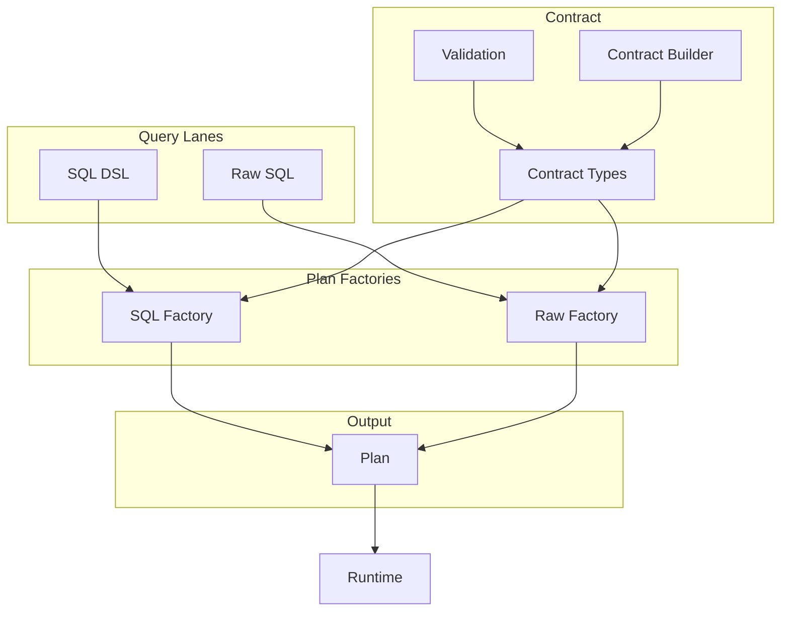

# @prisma-next/sql-query

SQL query builder and plan factories for Prisma Next.

## Overview

The SQL query package provides query authoring surfaces (DSL, Raw SQL) that compile to unified Plans. It includes SQL-specific contract types, validation, and a query builder DSL that produces Plans with SQL, parameters, and metadata.

This package implements the Query Lanes subsystem for SQL targets, providing multiple authoring ergonomics while keeping dialect/capability logic out of lanes. All lanes compile to the same Plan structure that the runtime executes with consistent verification and guardrails.

## Purpose

Provide SQL query authoring surfaces that compile to immutable Plans. Support multiple authoring ergonomics (DSL, Raw SQL) while maintaining one query → one statement semantics.

## Responsibilities

- **Query DSL**: Relational DSL that compiles to Plans with AST, SQL, and metadata
- **Raw SQL**: Raw SQL escape hatch with required annotations and verification
- **Contract Types**: SQL-specific contract types (`SqlContract`, `SqlStorage`, etc.)
- **Contract Validation**: Structural validation for SQL contracts using Arktype
- **Contract Builder**: TypeScript builder for creating SQL contracts programmatically
- **Plan Factories**: Compile declarative inputs into deterministic Plans

**Non-goals:**
- Execution or runtime behavior (runtime)
- Dialect-specific lowering (adapters)
- Policy enforcement (plugins)

## Architecture



## Components

### Query Builder (`sql.ts`)
- Relational DSL for building SQL queries
- Compiles to Plans with AST, SQL, and metadata
- Supports projections, filters, joins, ordering, limits

### Raw SQL (`raw.ts`)
- Raw SQL escape hatch with template tags and function form
- Required annotations for verification and guardrails
- Produces Plans with SQL, parameters, and metadata

### Schema Builder (`schema.ts`)
- Type-safe table and column builders
- Infers JavaScript types from contract types
- Supports column builders with metadata

### Parameter Builder (`param.ts`)
- Parameter placeholder factory
- Type-safe parameter handling

### Contract Types (`contract-types.ts`)
- SQL-specific contract types (re-exported from `@prisma-next/sql-target`)
- `SqlContract`, `SqlStorage`, `StorageColumn`, etc.

### Contract Validation (`contract.ts`)
- Structural validation for SQL contracts using Arktype
- Type guards and validation schemas

### Contract Builder (`contract-builder.ts`)
- TypeScript builder for creating SQL contracts programmatically
- Fluent API for defining tables, columns, constraints

### Types (`types.ts`)
- Plan types, AST types, and utility types
- Type inference helpers for columns and projections

### Errors (`errors.ts`)
- SQL-specific error types and factories

## Dependencies

- **`@prisma-next/contract`**: Core contract types
- **`@prisma-next/sql-target`**: SQL contract types, adapter interfaces
- **`arktype`**: Runtime type validation

## Related Subsystems

- **[Query Lanes](../../docs/architecture%20docs/subsystems/3.%20Query%20Lanes.md)**: Detailed subsystem specification
- **[Runtime & Plugin Framework](../../docs/architecture%20docs/subsystems/4.%20Runtime%20&%20Plugin%20Framework.md)**: Plan execution

## Related ADRs

- [ADR 002 - Plans are Immutable](../../docs/architecture%20docs/adrs/ADR%20002%20-%20Plans%20are%20Immutable.md)
- [ADR 003 - One Query One Statement](../../docs/architecture%20docs/adrs/ADR%20003%20-%20One%20Query%20One%20Statement.md)
- [ADR 011 - Unified Plan Model](../../docs/architecture%20docs/adrs/ADR%20011%20-%20Unified%20Plan%20Model.md)
- [ADR 012 - Raw SQL Escape Hatch](../../docs/architecture%20docs/adrs/ADR%20012%20-%20Raw%20SQL%20Escape%20Hatch.md)
- [ADR 020 - Result Typing Rules](../../docs/architecture%20docs/adrs/ADR%20020%20-%20Result%20Typing%20Rules.md)

## Usage

### SQL DSL

```typescript
import { sql, schema } from '@prisma-next/sql-query/sql';
import { validateContract } from '@prisma-next/sql-query/schema';
import contract from './contract.json';

const t = schema(contract);

const plan = sql()
  .from(t.user)
  .where(t.user.active.eq(param('active')))
  .select({ id: t.user.id, email: t.user.email })
  .limit(100)
  .build();
```

### Raw SQL

```typescript
import { sql } from '@prisma-next/sql-query/sql';
import { param } from '@prisma-next/sql-query/param';

const plan = sql`
  SELECT id, email FROM user WHERE active = ${param(true)} LIMIT 100
`;
```

## Exports

- `./sql`: SQL DSL and raw SQL factories
- `./schema`: Schema builder and contract validation
- `./param`: Parameter builder
- `./types`: Plan types and utility types
- `./errors`: SQL-specific error types
- `./contract-types`: SQL contract types (re-exported)
- `./contract-builder`: Contract builder API
- `./schema-sql`: SQL contract JSON Schema

