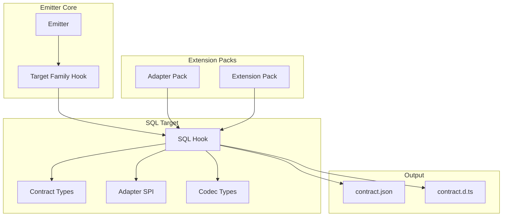

# @prisma-next/sql-target

SQL target family abstraction and emitter hook for Prisma Next.

## Overview

The SQL target package provides the target family abstraction for SQL databases. It implements the `TargetFamilyHook` for the emitter, providing SQL-specific validation and type generation. It also defines SQL contract types, adapter interfaces, and codec infrastructure.

This package is a bridge between the family-agnostic emitter and SQL-specific concerns. It keeps SQL-specific logic out of the core emitter while providing a stable SPI for SQL target families.

## Purpose

Provide SQL target family abstraction, emitter hook implementation, and SQL-specific contract types. Keep SQL-specific validation and type generation separate from the core emitter.

## Responsibilities

- **Emitter Hook**: Implement `TargetFamilyHook` for SQL target family
  - `validateTypes`: Validate type IDs against extensions and packs
  - `validateStructure`: Validate SQL-specific contract structure
  - `generateContractTypes`: Generate `contract.d.ts` for SQL contracts
  - `getTypesImports`: Determine required type imports from packs
- **Contract Types**: Define SQL-specific contract types (`SqlContract`, `SqlStorage`, etc.)
- **Adapter SPI**: Define adapter interfaces for SQL lowering and execution
- **Codec Infrastructure**: Define codec interfaces and registry types
- **Operations Registry**: Define operation registry for extension pack operations on value types

**Non-goals:**
- Query compilation or execution (sql-query, runtime)
- Dialect-specific lowering (adapters)
- Transport/pooling (drivers)

## Architecture



## Components

### Emitter Hook (`emitter-hook.ts`)
- Implements `TargetFamilyHook` for SQL target family
- **Responsibility: Validation and Type Generation Only** - This hook validates type IDs and contract structure, and generates `contract.d.ts` with SQL-specific types. It does NOT normalize contracts. The contract IR passed to this hook must already be normalized (all required fields present). Normalization must happen in the contract builder when the contract is created.
- Includes warning header comments in generated `contract.d.ts` files to indicate they're generated artifacts

### Contract Types (`contract-types.ts`)
- SQL-specific contract types:
  - `SqlContract`: SQL contract structure
  - `SqlStorage`: Storage structure with tables
  - `StorageColumn`: Column definition with type and nullability
  - `StorageTable`: Table definition with columns, constraints, indexes
  - `ModelDefinition`: Model structure with fields and storage mapping
  - `SqlMappings`: Model-to-table and field-to-column mappings

### Adapter SPI (`sql-target.ts`)
- Adapter interfaces for SQL lowering and execution
- `Adapter`: Lowering and capability discovery
- `AdapterProfile`: Adapter version and capabilities
- `Lowerer`: AST to SQL lowering
- `SqlDriver`: Driver interface for execution

### Codec Infrastructure (`codecs.ts`)
- Codec interface definitions
- Codec registry types
- Codec factory functions

### Operations Registry (`operations-registry.ts`)
- Operation registry interface and implementation
- Operation signature types (`ArgSpec`, `ReturnSpec`, `LoweringSpec`)
- `createOperationRegistry()`: Create a new operation registry
- `assembleOperationRegistry()`: Assemble registry from extension pack manifests

## Dependencies

- **`@prisma-next/emitter`**: Core emitter types and hook interface

## Related Subsystems

- **[Contract Emitter & Types](../../docs/architecture%20docs/subsystems/2.%20Contract%20Emitter%20&%20Types.md)**: Emitter subsystem
- **[Adapters & Targets](../../docs/architecture%20docs/subsystems/5.%20Adapters%20&%20Targets.md)**: Adapter and driver interfaces

## Related ADRs

- [ADR 005 - Thin Core Fat Targets](../../docs/architecture%20docs/adrs/ADR%20005%20-%20Thin%20Core%20Fat%20Targets.md)
- [ADR 016 - Adapter SPI for Lowering](../../docs/architecture%20docs/adrs/ADR%20016%20-%20Adapter%20SPI%20for%20Lowering.md)
- [ADR 030 - Result decoding & codecs registry](../../docs/architecture%20docs/adrs/ADR%20030%20-%20Result%20decoding%20&%20codecs%20registry.md)
- [ADR 065 - Adapter capability schema & negotiation v1](../../docs/architecture%20docs/adrs/ADR%20065%20-%20Adapter%20capability%20schema%20&%20negotiation%20v1.md)
- [ADR 114 - Extension codecs & branded types](../../docs/architecture%20docs/adrs/ADR%20114%20-%20Extension%20codecs%20&%20branded%20types.md)
- [ADR 121 - Contract.d.ts structure and relation typing](../../docs/architecture%20docs/adrs/ADR%20121%20-%20Contract.d.ts%20structure%20and%20relation%20typing.md)

## Usage

The SQL hook is passed directly to the emitter when emitting SQL contracts:

```typescript
import { sqlTargetFamilyHook } from '@prisma-next/sql-target';
import { emit } from '@prisma-next/emitter';

// Pass SQL hook directly to emit()
const result = await emit(ir, options, sqlTargetFamilyHook);

// result.contractDts includes warning header:
// // ⚠️  GENERATED FILE - DO NOT EDIT
// // This file is automatically generated by 'prisma-next emit'.
// // To regenerate, run: prisma-next emit --contract <path> --out <dir>
```

## Exports

- `.`: SQL target types, adapter SPI, codec infrastructure, operations registry, and emitter hook

