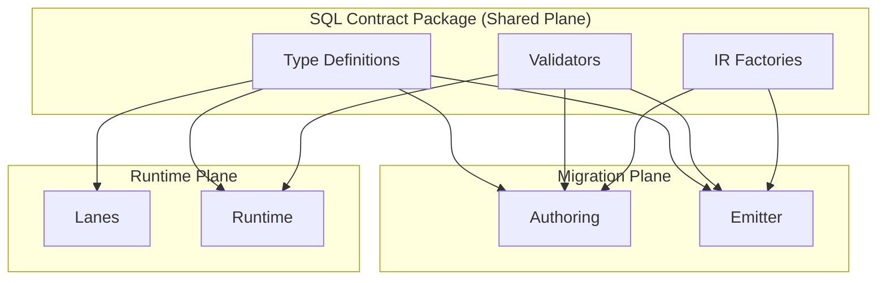

# @prisma-next/sql-contract

SQL contract types, validators, and IR factories for Prisma Next.

## Overview

This package provides TypeScript type definitions, Arktype validators, and factory functions for constructing SQL contract structures. It is located in the **shared plane**, making it available to both migration-plane (authoring, emitter) and runtime-plane (lanes, runtime) packages.

## Package Contents

- **TypeScript Types**: Type definitions for `SqlContract`, `SqlStorage`, `StorageTable`, `ModelDefinition`, and related types
- **Validators**: Arktype-based validators for structural validation of contracts, storage, and models
- **Factories**: Pure factory functions for constructing contract IR structures in tests and authoring

## Usage

### TypeScript Types

Import SQL contract types:

```typescript
import type {
  SqlContract,
  SqlStorage,
  StorageTable,
  ModelDefinition,
} from '@prisma-next/sql-contract/exports/types';
```

### Validators

Validate contract structures using Arktype validators:

```typescript
import { validateSqlContract, validateStorage, validateModel } from '@prisma-next/sql-contract/exports/validators';

// Validate a complete contract
const contract = validateSqlContract<Contract>(contractJson);

// Validate storage structure
const storage = validateStorage(storageJson);

// Validate model structure
const model = validateModel(modelJson);
```

### Factories

Use factory functions to construct contract IR structures in tests:

```typescript
import { col, table, storage, model, contract, pk, unique, index, fk } from '@prisma-next/sql-contract/exports/factories';

// Create a column
const idColumn = col('pg/int4@1', false);

// Create a table
const userTable = table(
  {
    id: col('pg/int4@1'),
    email: col('pg/text@1'),
  },
  {
    pk: pk('id'),
    uniques: [unique('email')],
    indexes: [index('email')],
  }
);

// Create storage
const s = storage({ user: userTable });

// Create a model
const userModel = model('user', {
  id: { column: 'id' },
  email: { column: 'email' },
});

// Create a complete contract
const c = contract({
  target: 'postgres',
  coreHash: 'sha256:abc123',
  storage: s,
  models: { User: userModel },
});
```

## Exports

- `./exports/types`: TypeScript type definitions
- `./exports/validators`: Arktype validators for structural validation
- `./exports/factories`: Factory functions for constructing contract IR

## Architecture



## Related Packages

- `@prisma-next/contract`: Framework-level contract types (`ContractBase`)
- `@prisma-next/sql-contract-ts`: SQL contract authoring surface (uses this package)
- `@prisma-next/emitter`: Contract emission engine (uses validators)

## Related Subsystems

- **[Data Contract](../../../docs/architecture%20docs/subsystems/1.%20Data%20Contract.md)**: Detailed subsystem specification
- **[Contract Emitter & Types](../../../docs/architecture%20docs/subsystems/2.%20Contract%20Emitter%20&%20Types.md)**: Contract emission

