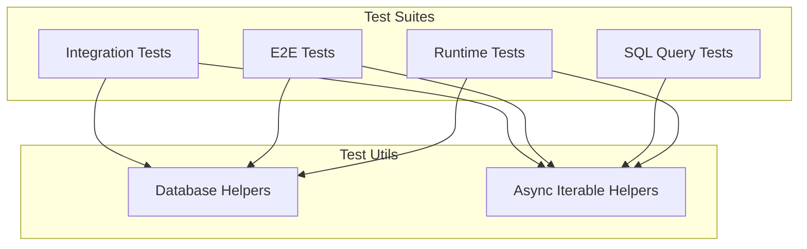

# @prisma-next/test-utils

Shared test utilities for Prisma Next test suites.

## Overview

The test-utils package provides shared generic test helpers used across multiple test suites in Prisma Next. It centralizes common testing patterns to reduce duplication and ensure consistency.

## Purpose

Provide reusable generic test utilities that DRY up common testing patterns across packages. Centralize database setup/teardown and async iterable utilities. This package has zero dependencies on other `@prisma-next/*` packages to avoid circular dependencies.

## Responsibilities

- **Database Management**: Create dev databases, manage connections, setup/teardown schemas
- **Async Iterable Utilities**: Collect and drain async iterables

**Non-goals:**
- Test-specific business logic
- Package-specific test utilities (those belong in package test directories)
- Runtime-specific utilities (see `@prisma-next/runtime/test/utils`)
- Contract-related utilities (see `e2e-tests/test/utils.ts`)

## Architecture



**Note**: Runtime-specific utilities are in `@prisma-next/runtime/test/utils`, and contract-related utilities are in `e2e-tests/test/utils.ts`.

## Components

### Database Helpers

- `createDevDatabase(options?)`: Creates a dev database instance
- `withDevDatabase(fn, options?)`: Executes a function with a dev database, auto-cleanup
- `withClient(connectionString, fn)`: Executes a function with a database client, auto-cleanup
- `teardownTestDatabase(client, tables?)`: Tears down test database

### Async Iterable Helpers

- `collectAsync(iterable)`: Collects all values from an async iterable
- `drainAsyncIterable(iterable)`: Drains an async iterable without collecting

**Note**: For runtime-specific utilities (plan execution, runtime creation, contract markers), see `@prisma-next/runtime/test/utils`. For contract-related utilities (contract loading, emission verification), see `e2e-tests/test/utils.ts`.

## Dependencies

**Zero dependencies on other `@prisma-next/*` packages** - This allows test-utils to be used by all packages without circular dependencies.

**External dependencies (devDependencies only):**
- `@prisma/dev`: Dev database server
- `pg`: PostgreSQL client

## Usage

### Integration Tests

```typescript
import {
  withDevDatabase,
  withClient,
  teardownTestDatabase,
  collectAsync,
  drainAsyncIterable,
} from '@prisma-next/test-utils';

// Use with dev database
await withDevDatabase(async ({ connectionString }) => {
  await withClient(connectionString, async (client) => {
    // ... test code ...

    // Collect async iterable
    const results = await collectAsync(someAsyncIterable);

    // Or drain without collecting
    await drainAsyncIterable(someAsyncIterable);

    await teardownTestDatabase(client);
  });
});
```

**For runtime-specific utilities**, import from `@prisma-next/runtime/test/utils`:
```typescript
import {
  executePlanAndCollect,
  drainPlanExecution,
  setupTestDatabase,
  createTestRuntime,
  createTestRuntimeFromClient,
} from '@prisma-next/runtime/test/utils';
```

**For contract-related utilities in E2E tests**, import from local `./utils`:
```typescript
import { loadContractFromDisk, emitAndVerifyContract } from './utils';
```

## Exports

- `.`: All test utilities

