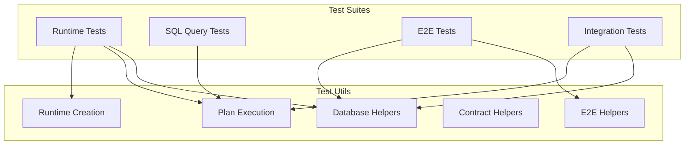

# @prisma-next/test-utils

Shared test utilities for Prisma Next test suites.

## Overview

The test-utils package provides shared test helpers used across multiple test suites in Prisma Next. It centralizes common testing patterns to reduce duplication and ensure consistency.

## Purpose

Provide reusable test utilities that DRY up common testing patterns across packages. Centralize database setup/teardown, plan execution, runtime creation, and other test infrastructure.

## Responsibilities

- **Database Management**: Create dev databases, manage connections, setup/teardown schemas
- **Plan Execution**: Execute plans and collect results, drain iterables
- **Runtime Creation**: Create test runtimes with standard configurations
- **Contract Management**: Load contracts, write contract markers
- **E2E Testing**: Emit contracts via CLI, setup E2E test databases

**Non-goals:**
- Test-specific business logic
- Package-specific test utilities (those belong in package test directories)

## Architecture



## Components

### Database Helpers

- `createDevDatabase(options?)`: Creates a dev database instance
- `withDevDatabase(fn, options?)`: Executes a function with a dev database, auto-cleanup
- `withClient(connectionString, fn)`: Executes a function with a database client, auto-cleanup
- `executeStatement(client, statement)`: Executes a SQL statement
- `setupTestDatabase(client, contract, setupFn)`: Sets up database schema and writes contract marker
- `teardownTestDatabase(client, tables?)`: Tears down test database

### Plan Execution Helpers

- `collectAsync(iterable)`: Collects all values from an async iterable
- `drainAsyncIterable(iterable)`: Drains an async iterable without collecting
- `executePlanAndCollect<Row>(runtime, plan)`: Executes a plan and collects results
- `drainPlanExecution(runtime, plan)`: Drains plan execution without collecting

### Runtime Creation Helpers

- `createTestRuntime(contract, adapter, driver, options?)`: Creates a runtime with standard test configuration
- `createTestRuntimeFromClient(contract, client, adapter)`: Creates a runtime from a database client (for E2E tests)

### Contract Helpers

- `writeTestContractMarker(client, contract)`: Writes a contract marker to the database

### E2E Helpers

- `loadContractFromDisk<TContract>(contractJsonPath)`: Loads a contract from disk (already-emitted artifact)
- `emitAndVerifyContract(cliPath, contractTsPath, adapterPath, outputDir, expectedContractJsonPath)`: Emits contract via CLI and verifies it matches on-disk artifacts
- `setupE2EDatabase(client, contract, setupFn)`: Sets up E2E test database

## Architecture: Dependency Injection Pattern

The `@prisma-next/test-utils` package has **no dependencies** on other `@prisma-next` packages. Instead, it uses a dependency injection pattern where functions accept their dependencies as parameters (e.g., `validateContractFn`, `markerStatements`, `createRuntimeFn`).

**Why?** This prevents cyclic dependencies and keeps test utilities lightweight and reusable across packages.

**How it works:**
- Base functions in `test-utils` accept dependencies as parameters
- Consuming packages (e.g., `packages/runtime/test/utils.ts`, `packages/e2e-tests/test/utils.ts`) create wrapper files that inject dependencies
- Wrappers provide type-safe interfaces specific to each package's needs

## Dependencies

**Direct dependencies:**
- `@prisma/dev`: Dev database server (marked as external in tsup config to prevent bundling issues)
- `pg`: PostgreSQL client

**Injected dependencies (via wrapper files):**
- `@prisma-next/runtime`: Runtime creation and contract marker functions
- `@prisma-next/sql-query`: Contract validation and Plan types
- `@prisma-next/sql-target`: SQL types

## Usage

**Note**: The base functions in `@prisma-next/test-utils` use dependency injection. For most use cases, you should import from package-specific wrapper files (e.g., `packages/runtime/test/utils.ts`, `packages/e2e-tests/test/utils.ts`) which inject the required dependencies.

### Integration Tests

```typescript
// Import from package-specific wrapper (injects dependencies)
import {
  withDevDatabase,
  withClient,
  setupTestDatabase,
  teardownTestDatabase,
  executePlanAndCollect,
  createTestRuntime,
} from '@prisma-next/runtime/test/utils';

// Use with dev database
await withDevDatabase(async ({ connectionString }) => {
  await withClient(connectionString, async (client) => {
    await setupTestDatabase(client, contract, async (c) => {
      await c.query('create table "user" (id serial primary key, email text not null)');
    });

    const runtime = createTestRuntime(contract, adapter, driver);
    const plan = sql({ contract, adapter }).from(tables.user).select({ id: t.user.id }).build();
    const rows = await executePlanAndCollect(runtime, plan);

    await teardownTestDatabase(client);
  });
});
```

### E2E Tests

```typescript
// Import from package-specific wrapper (injects dependencies)
import {
  withDevDatabase,
  withClient,
  loadContractFromDisk,
  setupE2EDatabase,
  createTestRuntimeFromClient,
  executePlanAndCollect,
} from '@prisma-next/e2e-tests/test/utils';

// Load contract from committed fixtures
const contract = await loadContractFromDisk<Contract>(contractJsonPath);

await withDevDatabase(
  async ({ connectionString }) => {
    await withClient(connectionString, async (client) => {
      // Setup database with test-specific schema/data
      await setupE2EDatabase(client, contract, async (c) => {
        await c.query('create table "user" ...');
        await c.query('insert into "user" ...');
      });

      // Create runtime and execute plan
      const adapter = createPostgresAdapter();
      const runtime = createTestRuntimeFromClient(contract, client, adapter);
      try {
        const tables = schema<Contract, CodecTypes>(contract).tables;
        const plan = sql<Contract, CodecTypes>({ contract, adapter })
          .from(tables.user)
          .select({ id: tables.user.columns.id })
          .build();

        // Return type is automatically inferred from plan
        const rows = await executePlanAndCollect(runtime, plan);
        type Row = ResultType<typeof plan>;  // Optional: for type tests
        expect(rows.length).toBeGreaterThan(0);
      } finally {
        await runtime.close();
      }
    });
  },
  { acceleratePort: 54020, databasePort: 54021, shadowDatabasePort: 54022 },
);
```

### Creating Wrapper Files

If you need to use test utilities in a new package, create a wrapper file that injects dependencies:

```typescript
// packages/your-package/test/utils.ts
import {
  executePlanAndCollect as executePlanAndCollectBase,
  // ... other base functions
} from '@prisma-next/test-utils';
import type { Plan, ResultType } from '@prisma-next/sql-query/types';
import { validateContract } from '@prisma-next/sql-query/schema';
// ... other dependencies

// Wrap with proper types
export async function executePlanAndCollect<P extends Plan>(
  runtime: { execute<Row = Record<string, unknown>>(plan: unknown): AsyncIterable<Row> },
  plan: P,
): Promise<ResultType<P>[]> {
  return executePlanAndCollectBase(runtime, plan) as Promise<ResultType<P>[]>;
}

// ... other wrapped functions
```

## Exports

- `.`: All test utilities

