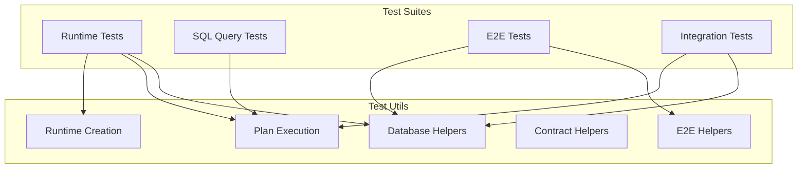

# @prisma-next/test-utils

Shared test utilities for Prisma Next test suites.

## Overview

The test-utils package provides shared test helpers used across multiple test suites in Prisma Next. It centralizes common testing patterns to reduce duplication and ensure consistency.

## Purpose

Provide reusable test utilities that DRY up common testing patterns across packages. Centralize database setup/teardown, plan execution, runtime creation, and other test infrastructure.

## Responsibilities

- **Database Management**: Create dev databases, manage connections, setup/teardown schemas
- **Plan Execution**: Execute plans and collect results, drain iterables
- **Runtime Creation**: Create test runtimes with standard configurations
- **Contract Management**: Load contracts, write contract markers
- **E2E Testing**: Emit contracts via CLI, setup E2E test databases

**Non-goals:**
- Test-specific business logic
- Package-specific test utilities (those belong in package test directories)

## Architecture



## Components

### Database Helpers

- `createDevDatabase(options?)`: Creates a dev database instance
- `withDevDatabase(fn, options?)`: Executes a function with a dev database, auto-cleanup
- `withClient(connectionString, fn)`: Executes a function with a database client, auto-cleanup
- `executeStatement(client, statement)`: Executes a SQL statement
- `setupTestDatabase(client, contract, setupFn)`: Sets up database schema and writes contract marker
- `teardownTestDatabase(client, tables?)`: Tears down test database

### Plan Execution Helpers

- `collectAsync(iterable)`: Collects all values from an async iterable
- `drainAsyncIterable(iterable)`: Drains an async iterable without collecting
- `executePlanAndCollect<Row>(runtime, plan)`: Executes a plan and collects results
- `drainPlanExecution(runtime, plan)`: Drains plan execution without collecting

### Runtime Creation Helpers

- `createTestRuntime(contract, adapter, driver, options?)`: Creates a runtime with standard test configuration

### Contract Helpers

- `writeTestContractMarker(client, contract)`: Writes a contract marker to the database

### E2E Helpers

- `loadContractFromDisk<TContract>(contractJsonPath)`: Loads a contract from disk (already-emitted artifact)
- `emitAndVerifyContract(cliPath, contractTsPath, adapterPath, outputDir, expectedContractJsonPath)`: Emits contract via CLI and verifies it matches on-disk artifacts
- `setupE2EDatabase(client, contract, setupFn)`: Sets up E2E test database

## Dependencies

- `@prisma-next/runtime`: Runtime creation and contract marker functions
- `@prisma-next/sql-query`: Contract validation
- `@prisma-next/sql-target`: SQL types
- `@prisma/dev`: Dev database server
- `pg`: PostgreSQL client

## Usage

```typescript
import {
  createDevDatabase,
  withDevDatabase,
  withClient,
  setupTestDatabase,
  teardownTestDatabase,
  executePlanAndCollect,
  createTestRuntime,
} from '@prisma-next/test-utils';

// Use with dev database
await withDevDatabase(async ({ connectionString }) => {
  await withClient(connectionString, async (client) => {
    await setupTestDatabase(client, contract, async (c) => {
      await c.query('create table "user" (id serial primary key, email text not null)');
    });

    const runtime = createTestRuntime(contract, adapter, driver);
    const plan = sql({ contract, adapter }).from(tables.user).select({ id: t.user.id }).build();
    const rows = await executePlanAndCollect(runtime, plan);

    await teardownTestDatabase(client);
  });
});
```

## Exports

- `.`: All test utilities

