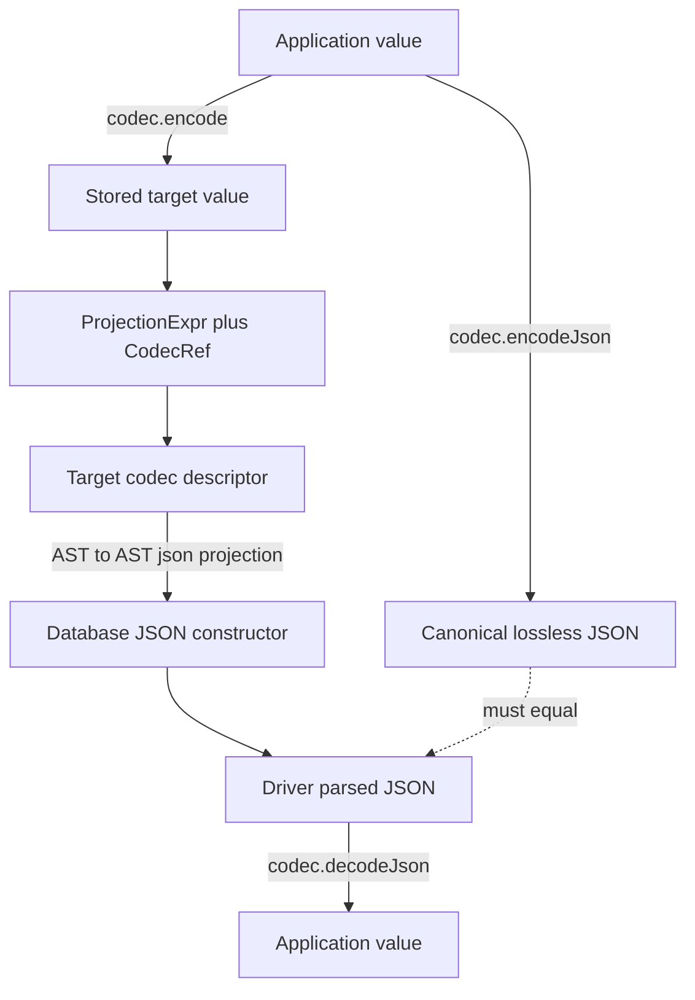

# Codec JSON projections

> Linear Project: [Codec JSON projections](https://linear.app/prisma-company/project/codec-json-projections-a10fba2e9cd5) · Planning record: [TML-3060](https://linear.app/prisma-company/issue/TML-3060/plan-codec-json-projections) · Slices: [TML-3062](https://linear.app/prisma-company/issue/TML-3062/sql-json-projection-ast-foundations) → [TML-3061](https://linear.app/prisma-company/issue/TML-3061/target-codec-descriptor-foundations) → [TML-3063](https://linear.app/prisma-company/issue/TML-3063/lossless-json-projection-hard-cut) → [TML-3064](https://linear.app/prisma-company/issue/TML-3064/aggregate-codec-typing-and-extension-testkits) · Branch: `tml-3060-codec-json-projections`

## Purpose

Database-produced JSON must not silently corrupt values or force codecs to imitate incidental target-native scalar formats. This project establishes one lossless end-to-end contract in which codecs choose canonical JSON, targets project stored expressions into that representation, and ORM/aggregate pipelines carry enough codec identity to decode built-in and extension values correctly.

## At a glance

PR [#942](https://github.com/prisma/prisma-next/pull/942) made codec JSON mirror database-native JSON. That contract fails for arbitrary precision before the codec can intervene:

```text
PostgreSQL numeric 9007199254740993
  -> json_build_object emits a JSON number
  -> driver parses JavaScript number 9007199254740992
  -> codec receives an already-corrupted value
```

The project separates the two responsibilities that #942 coupled:



The target-neutral SQL AST says whether a value is codec-projected, natively converted, or already a JSON document. PostgreSQL, SQLite, and custom targets own how those semantics become SQL. `ProjectionItem.codec` is the authoritative output-codec fact; target renderers use typed target descriptor registries rather than codec-ID branches or derived-table lineage inference. A separate aggregate descriptor system makes runtime result decoding and emitted aggregate types agree.

The accepted hard cut restores canonical lossless representations, including PostgreSQL numeric/int8 decimal strings and bytea base64, pgvector arrays, PostGIS GeoJSON, SQLite bigint decimal strings, and SQLite BLOB hexadecimal strings. Existing codec IDs remain unchanged; users regenerate contracts and adopt corrected `bigint`/decimal aggregate results.

## Non-goals

- **A central target-to-projection map.** Targets are open-world; custom databases must define their own descriptor specialization without modifying framework-owned unions.
- **Codec-ID knowledge in the ORM or generic SQL planner.** Those layers carry opaque `CodecRef`s and projection semantics but never branch on PostgreSQL, SQLite, numeric, money, bytea, or extension IDs.
- **A universal identity/default scalar projection.** Native compatibility is an explicit semantic claim in each target descriptor, not an omission fallback.
- **Target-specializing the whole SQL extension descriptor or control stack.** Only codec descriptor authoring and target-adapter registries need target-specific narrowing; unrelated component surfaces remain generic.
- **A complete SQL grammar.** The relational AST gains only the typed frozen nodes required to express built-in projections and array lifting; raw SQL remains an extension escape hatch.
- **A raw JavaScript `JsonValue` projection variant.** Every JSON projection variant wraps a relational `ProjectionExpr`.
- **Speculative SQLite stored-array support.** SQLite receives scalar/document and JSON-aggregation projection behavior; PostgreSQL-style `many` storage machinery waits for a real SQLite representation.
- **New aggregate operations.** The project corrects availability, typing, lowering, nullability, and decoding of the existing aggregate surface rather than adding unrelated analytics features.
- **Production dependencies on conformance tooling.** Public codec testkits are separate dev-only packages, never runtime adapter dependencies.
- **Compatibility codec IDs or permissive lossy decoders.** This pre-1.0 migration keeps existing IDs, removes the invalid contract, and documents regeneration rather than shipping `@2` aliases or accepting rounded numbers.

## Place in the larger world

- **Framework codec descriptors and component assembly.** `CodecDescriptor` and `CodecDescriptorImpl` in `packages/1-framework/1-core/framework-components` currently carry generic `meta`/`metaFor`; `ControlStack` assembles heterogeneous descriptors. The project removes generic target metadata while retaining safe internal erasure.
- **Relational SQL AST.** `packages/2-sql/4-lanes/relational-core` currently represents JSON object entries as plain `{ key, value }` records, gives `JsonArrayAggExpr` a bare expression, and already carries optional `CodecRef` on `ProjectionItem`. The project introduces frozen projection classes/visitors and broadens that existing codec slot's authority.
- **SQL contract type maps.** `packages/2-sql/1-core/contract` emits codec, query-operation, field, and storage-column type maps. `aggregateTypes` joins this type-only surface and is generated from aggregate descriptors.
- **SQL ORM client.** `packages/3-extensions/sql-orm-client` builds nested JSON documents and aggregates. Its aggregate planner currently leaves `count`, `sum`, and `avg` output codecs unresolved; both top-level aggregate builders and include reducers migrate to descriptor-resolved output codecs.
- **PostgreSQL target and adapter.** `packages/3-targets/3-targets/postgres` owns codecs; `packages/3-targets/6-adapters/postgres` owns SQL rendering and parameter casts. PostgreSQL descriptors replace `meta.db.sql.postgres.nativeType`, provide scalar/array JSON projections, and prevent arbitrary-precision values from becoming JSON numbers.
- **SQLite target and adapter.** `packages/3-targets/3-targets/sqlite` and `packages/3-targets/6-adapters/sqlite` own SQLite codec and rendering behavior. SQLite needs target-specific BLOB hex, bigint text, and JSON-document retagging because native JSON rejects BLOBs and loses JSON subtype across derived tables.
- **Extensions.** In-repo PostgreSQL extensions such as pgvector and PostGIS contribute target descriptors and projection behavior for canonical numeric arrays and GeoJSON. Extension-owned database setup runs the public conformance harness.
- **Custom targets.** Third-party targets may define an equivalent descriptor specialization, registry, renderer, and testkit; no framework release or target-union edit is required.

## Cross-cutting requirements

- **Canonical projection invariant.** For every supported built-in and migrated extension codec value, database-produced JSON after driver parsing equals `codec.encodeJson(applicationValue)` and is accepted losslessly by `codec.decodeJson`.
- **Target-neutral planning.** ORM and relational-core code represent codec/native/document intent and propagate opaque `CodecRef`s; they contain no target or codec-ID branches.
- **Authoritative output codecs.** `ProjectionItem.codec` describes any known projected result, including columns, computed values, and aggregates, and every AST/query-plan rewrite preserves it.
- **Frozen class/visitor AST.** JSON projection variants and newly required AST vocabulary follow the repository's frozen-class/visitor conventions; rewrites preserve class identity and exhaustiveness.
- **Typed target authoring.** PostgreSQL/SQLite public factories and narrow array helpers reject unadapted generic descriptors at TypeScript authoring time. Scalar projection is mandatory; descriptor template methods validate `CodecRef.typeParams` before invoking typed hooks.
- **One validated internal boundary.** Target adapter construction structurally validates erased descriptors and builds a typed registry once. Invalid dynamic components fail at composition, never during an individual query; render paths use no query-time casts.
- **Open-world target ownership.** Generic codecs and the ORM do not import target descriptor types. First-party and custom targets adapt generic descriptors locally and own native-type/projection SQL.
- **Reference array semantics.** PostgreSQL's default array lift binds the source once and preserves null array, empty array, null elements, and element order. Every optimized override passes the same shared conformance cases.
- **Runtime/type-level aggregate parity.** `SqlAggregateDescriptor` is the single source for operation/input matching, exact-over-trait precedence, output codec, type parameters, nullability, and lowering; emitted `aggregateTypes` and runtime resolution cannot select different results.
- **Database-backed conformance.** Built-in target suites cover every built-in and wrapped generic codec; extension suites cover every migrated extension codec through real AST, renderer, database, driver, and codec paths.
- **Clean dependency boundaries.** Public conformance APIs live in `@prisma-next/postgres-codec-testkit` and `@prisma-next/sqlite-codec-testkit` as dev-only packages; production adapters do not depend on them.
- **Breaking-change completeness.** Codec docs, target/extension docs, generated fixtures, contract examples, and upgrade instructions all describe canonical codec JSON, required projections, regenerated contracts, and changed bigint/aggregate application types.

## Transitional-shape constraints

- **The captured prototype is evidence, not architecture.** Its exact uncommitted diff is preserved as a hashed project asset and in a named local stash until the regression cases are ported into the selected design; the hardcoded codec ID and lineage resolver must not enter a PR.
- **Slice 1 is behavior-preserving.** New projection/function/cast/case/ordinality AST nodes and broader `ProjectionItem.codec` semantics land with tests while existing renderers still produce the same SQL and JSON.
- **Slice 2 retains old metadata temporarily.** Target descriptor subclasses, wrapping factories, helpers, registries, and migrated descriptor definitions coexist with `meta` until every consumer can switch atomically. It must not change canonical codec JSON yet.
- **Slice 3 performs one coherent JSON hard cut.** All built-in and in-repo extension codec formats, ORM JSON planning, PostgreSQL/SQLite rendering, target conformance, and metadata removal change together. No merged state may advertise canonical lossless JSON while a database-produced JSON path still emits the old native representation.
- **Slice 4 performs one coherent aggregate hard cut.** Runtime descriptors, emitted `aggregateTypes`, ORM API availability/result types, output-codec decoding, and target matrices change together so types never promise a result codec different from runtime.
- **Stack order is mandatory.** Each slice branch builds on the preceding slice's stable handoff and its PR targets the preceding branch until the stack is rebased/retargeted after merges.
- **Main must be synchronized before each PR's final validation.** The project branch was rebased after prototype preservation; every slice repeats the team-DoD sync gate before opening its PR.
- **Tests precede implementation in every slice.** Regression, visitor/exhaustiveness, descriptor typing, target conformance, and aggregate type/runtime tests are written or adapted before production behavior changes.
- **Existing codec IDs remain stable.** Intermediate compatibility aliases or duplicate `@2` descriptors are not introduced; generated contracts change only in the hard-cut slices and are regenerated with `pnpm fixtures:check`.

## Project Definition of Done

Inherits the team-DoD floor ([`drive/calibration/dod.md`](../../drive/calibration/dod.md)) — not restated here. Project-specific conditions on top:

- [ ] PostgreSQL arbitrary-precision numeric integration coverage proves exact round trips for `1234567890.12345678901234567890` and `9007199254740993`; no selected query path lets either become a JavaScript number before codec decoding.
- [ ] `encodeJson`/`decodeJson` documentation defines a codec-chosen canonical lossless representation and every database-produced JSON projection satisfies that contract.
- [ ] `CodecJsonValueProjection`, `NativeJsonValueProjection`, and `JsonDocumentProjection` are frozen class/visitor AST variants consumed by JSON objects and JSON array aggregates, with all rewrite/render sites exhaustive.
- [ ] `ProjectionItem.codec` is authoritative for known column, computed, and aggregate outputs and survives every relevant query-plan/AST rewrite; no renderer performs codec lineage reconstruction.
- [ ] PostgreSQL and SQLite descriptor authoring is target-typed, generic SQL descriptors are adapted through target factories, malformed erased descriptors fail at adapter composition, and query rendering performs no target-descriptor casts.
- [ ] Generic `CodecMeta`, descriptor `meta`/`metaFor`, and lookup `metaFor` are removed; PostgreSQL native-type parameter rendering resolves through `PostgresCodecDescriptor`.
- [ ] PostgreSQL scalar and scalar-array projections preserve canonical codec JSON, and the default plus every optimized array projection passes shared null/empty/null-element/order/single-evaluation conformance.
- [ ] SQLite BLOB projects to the pinned hexadecimal canonical form, bigint projects as decimal text, JSON documents survive derived tables through retagging, and finite-only float behavior is enforced and documented.
- [ ] Built-in PostgreSQL/SQLite codecs and in-repo pgvector/PostGIS/other affected extension codecs pass real database-backed scalar/document/array conformance as applicable.
- [ ] `SqlAggregateDescriptor` resolution uses exact codec matches before trait matches and declaratively determines output codec/nullability; runtime and emitted `aggregateTypes` share that source of truth.
- [ ] Top-level and include aggregate APIs decode through resolved output codecs and expose target-accurate results, including PostgreSQL/SQLite `count()` as `bigint`, integer sums where appropriate as `bigint`, and arbitrary-precision numeric aggregates as decimal strings.
- [ ] `@prisma-next/postgres-codec-testkit` and `@prisma-next/sqlite-codec-testkit` are public test-framework-independent dev tools, have no path into production adapter dependencies, and are exercised by at least one extension-owned suite.
- [ ] Existing codec IDs remain unchanged, all affected generated contracts/fixtures are regenerated, and upgrade instructions explicitly require regeneration and describe stored JSON/default/value-set and TypeScript result changes.
- [ ] Long-lived codec/projection/aggregate architecture documentation is updated and a dedicated ADR is authored or the final ADR audit records why an amendment to an existing ADR is the better durable form.

## Contract impact

_Required: this project changes contract and emitted-type surfaces._

- **Entities affected:** codec-defined JSON representations used by serialized defaults/value sets; `CodecTypes` application channels for `pg/int8` and SQLite bigint-related paths; SQL `TypeMaps`; aggregate builder and include result types.
- **New or changed kinds:** SQL `TypeMaps` gains `aggregateTypes`; target aggregate descriptors contribute operation/input-to-output mappings. The relational JSON projection class union is internal AST and does not become a serialized contract entity.
- **Behavioral hard cut:** affected codec IDs keep their current `@1` names while canonical JSON and some application output types change. Contracts generated under PR #942 semantics must be regenerated; serialized values using those semantics may require re-emission rather than permissive decoding.
- **Downstream migration:** users regenerate `contract.json`/`contract.d.ts`, update code expecting `number` from `pg/int8`, `count`, and affected sums/averages, and adopt the published upgrade instructions. No backwards-compatibility exports or parallel codec IDs are added.

## Adapter impact

_Required: this project changes target adapters._

- **PostgreSQL:** codec descriptor/native-type resolution, JSON scalar/document/array rendering, target registry construction, parameter casts, and codec conformance are affected.
- **SQLite:** codec descriptor construction, JSON scalar/document rendering, BLOB/bigint handling, derived-document retagging, and codec conformance are affected.
- **PostgreSQL extensions:** pgvector, PostGIS, arktype-json, and any other in-repo codec contributor are audited and migrated to target descriptors/projections as applicable.
- **Mongo:** no JSON projection or aggregate-descriptor change is planned; removal of generic codec metadata must preserve Mongo descriptor compilation and runtime behavior.
- **Custom targets:** not migrated by this repository, but public APIs/docs must leave them able to define their own target descriptor and conformance package without editing generic SQL or ORM code.

## ADR pointer

The split between codec-canonical JSON, target-owned projection descriptors, planner-carried output codec identity, and target-neutral projection semantics is a durable cross-cutting architecture decision. Working position: author a dedicated ADR during close-out, referencing the existing codec descriptor and SQL AST patterns; record aggregate descriptors in the same ADR only if implementation confirms they are one inseparable decision, otherwise author or amend a separate aggregate-typing decision.

## Open Questions

1. **How should PostgreSQL native type names be represented?** Working position: begin with a descriptor-owned trusted renderer compatible with current behavior; introduce structured type-name AST only if safe quoting/schema qualification cannot be expressed without it.
2. **What is the smallest typed AST addition for the reference array lift?** Working position: compose existing subquery/derived/function-source nodes and add only missing function, cast, case, returned-column alias, ordinality, or binding nodes; built-ins do not fall back to raw SQL for convenience.
3. **How is PostgreSQL temporal canonical ISO rendered exactly?** Working position: choose session-independent UTC SQL and pin precision/timezone behavior against `encodeJson` in the target conformance matrix.
4. **What are the complete PostgreSQL and SQLite aggregate overload matrices?** Working position: executable-probe database result types in slice 4, encode exact codec overloads first, and use trait fallbacks only where every matching codec has the same result contract.
5. **Which affected extension codecs require `JsonDocumentProjection` rather than scalar projection?** Working position: classify from canonical `encodeJson`; structured outputs such as GeoJSON use document semantics, while text/number/array scalar results use codec projection.
6. **What public testkit case API best supports extension-owned setup?** Working position: a test-framework-independent case runner receives descriptors, representative values, and caller-provided execution/setup while the testkit owns AST projection and equivalence assertions.
7. **Does SQLite need stored scalar-array projection now?** Working position: no; only row-value JSON array aggregation is in scope until a concrete SQLite `CodecRef.many` storage representation exists.
8. **Is one ADR or two the clearer durable record?** Working position: decide at final retro after seeing whether aggregate descriptors stand independently from target codec projection architecture.

## References

- Linear Project: [Codec JSON projections](https://linear.app/prisma-company/project/codec-json-projections-a10fba2e9cd5)
- Planning issue: [TML-3060](https://linear.app/prisma-company/issue/TML-3060/plan-codec-json-projections)
- Slice issues: [TML-3062](https://linear.app/prisma-company/issue/TML-3062/sql-json-projection-ast-foundations), [TML-3061](https://linear.app/prisma-company/issue/TML-3061/target-codec-descriptor-foundations), [TML-3063](https://linear.app/prisma-company/issue/TML-3063/lossless-json-projection-hard-cut), [TML-3064](https://linear.app/prisma-company/issue/TML-3064/aggregate-codec-typing-and-extension-testkits)
- Settled design: [`design-notes.md`](./design-notes.md)
- Full discussion and evidence checkpoint: [`assets/codec-json-projection-design-checkpoint.md`](./assets/codec-json-projection-design-checkpoint.md)
- Regression source: [PR #942](https://github.com/prisma/prisma-next/pull/942), merge commit `bd2bcd1914`
- Project plan: [`plan.md`](./plan.md)
