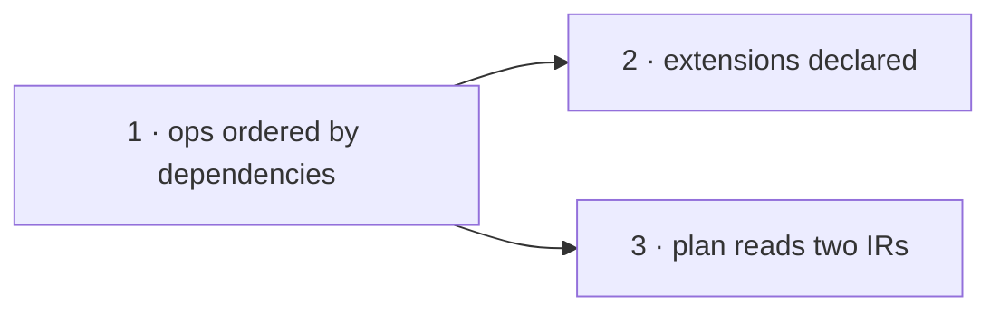

# Contract-free migration planning — Plan

**Spec:** [`spec.md`](./spec.md) · **Linear:** [Contract-free migration planning](https://linear.app/prisma-company/project/contract-free-migration-planning-0608cf26e2ff) ([TML-3026](https://linear.app/prisma-company/issue/TML-3026)) · **Branch:** `tml-3026-contract-free-migration-planning`

Each slice is named for what a developer can **rely on** when it merges. Slice 1 is the mechanism; slices 2 and 3 are independent consumers of it and can run in parallel.

## Slices

| # | Slice | Delivers | Status | Ticket |
| --- | --- | --- | --- | --- |
| 1 | `migration-ops-ordered-by-dependencies` | Operation order derives from `dependsOn` in the schema trees: nodes and issues carry edges, the planner topo-sorts, `nodeIssueOrder` is deleted, `reason` is dropped for presence. | ⬜ next | [TML-3028](https://linear.app/prisma-company/issue/TML-3028) |
| 2 | `extensions-are-declared-entities` | `extension` (and codec-defined custom types) authored in PSL + TS, verified by `db verify`, validated against codec `requires`, lifecycled by control policy (`external` assume-present / `managed` inline). | ⬜ | [TML-3030](https://linear.app/prisma-company/issue/TML-3030) |
| 3 | `plan-reads-two-schema-irs` | The SQL planner's contract parameter is deleted: control stamped on expected nodes, `defaultControlPolicy` a plan option, field events fed from column issues, `planTypeOperations` deleted. | ⬜ | [TML-3031](https://linear.app/prisma-company/issue/TML-3031) |

## Sequencing

- **Slice 1 first.** Both others consume its hand-off; nothing in it depends on them.
- **Slices 2 ∥ 3.** No hand-off in either direction: slice 2's `managed` creation rides the slice-1 graph (not slice 3's contract-shedding); slice 3's re-feeds and node stamps don't touch the entity/authoring surface. Both edit the Postgres planner area, so if run concurrently use isolated worktrees and expect a textual (not semantic) merge; running them serially in either order is also fine.

## Per-slice notes

### 1 — `migration-ops-ordered-by-dependencies` ([TML-3028](https://linear.app/prisma-company/issue/TML-3028))

The framework interface change (`SchemaDiffIssue` drops `reason`, gains `dependsOn`; `DiffableNode` gains `dependsOn`) lands *inside* this slice, not as its own slice — standalone it would be preparation with nothing consuming the new field, and the presence-based-discrimination sweep is only provably complete when the graph consumer exists. The sweep touches every issue consumer: `db verify`, both SQL issue-planners, the Mongo envelope, the runner post-apply check — and the assertion sweep extends beyond `packages/**` into `test/integration` + `test/e2e`, where issue-shape assertions live.

**Builds on:** current main (the ADR 235 substrate). **Hands to:** issues that carry mirrored `dependsOn` edges; a planner whose order is the graph's; no `reason` anywhere; the ordering property test as the standing proof.

### 2 — `extensions-are-declared-entities` ([TML-3030](https://linear.app/prisma-company/issue/TML-3030))

The full authoring vertical on the RLS/native-enum playbook (block descriptor + `entities` channel + pack entity kind + both derivations), plus the generic codec-`requires` validation and the `external`/`managed` lifecycle split. Resolves the custom-type-vs-`native_enum` open question at its own spec time. Includes the in-repo adoption (pgvector/postgis/paradedb declare + `requires`) and the extension-author upgrade instructions for the declaration requirement.

**Builds on:** slice 1 (a `managed` extension's `CREATE`/`DROP` ordering is graph-derived). **Hands to:** declared prerequisite entities the codec `requires` check and slice-3 field-event anchoring can reference; project close-out (the walking-skeleton DoD items).

### 3 — `plan-reads-two-schema-irs` ([TML-3031](https://linear.app/prisma-company/issue/TML-3031))

Deletes the planner's contract parameter by relocating its five reads: control → stamped on expected nodes (generalizing the nativeEnum precedent; resolvers go node-only), default policy → plan option, ownership namespace mapping + default-schema fallback → node state, codec hooks → field events re-fed from column issues (`FieldEventContext` shape preserved; ops anchored at the column issue's graph position) and `storageTypePlanCallStrategy`/`planTypeOperations` deleted outright. Ships the CipherStash-shaped hook regression test and the hook-re-feed upgrade instructions.

**Builds on:** slice 1 (issue graph anchoring). **Hands to:** the final `plan(start, end, options)` signature; project close-out.

## Close-out obligations (tracked here so no slice forgets them)

- The two project ADRs (spec § ADR pointer) are authored at close-out; the migration-system subsystem doc gains the dependency-graph + declared-prerequisite sections.
- [ADR 235](../../docs/architecture%20docs/adrs/ADR%20235%20-%20The%20schema%20differ%20walks%20two%20derived%20schema%20IRs.md) **must be amended at slice 1** — its interface listing and worked example show `reason` and no `dependsOn`; slice 1 changes both. Per the ADR-examples-must-match-code rule, the amendment rides the slice-1 PR, not close-out.
- The CipherStash reference clone lives in the session scratchpad only — never committed.
