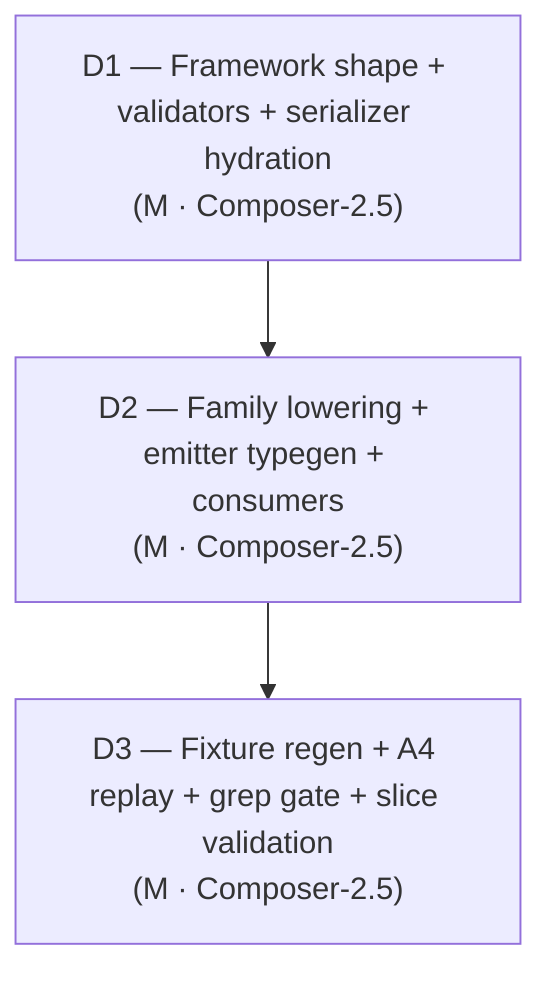

# Slice Plan: cross-reference-encoding (S1.C)

**Slice spec:** [`./spec.md`](./spec.md)
**Parent plan:** [`projects/contract-ir-planes/plan.md`](../../plan.md) § S1.C
**Linear:** [TML-2624](https://linear.app/prisma-company/issue/TML-2624)[^1]

[^1]: [TML-2624](https://linear.app/prisma-company/issue/TML-2624) was canceled on 2026-05-20 along with the other slice tracking tickets (TML-2622 / S1.A, TML-2623 / S1.B); the operator chose to track work via the parent project ticket ([TML-2584](https://linear.app/prisma-company/issue/TML-2584)) instead. PR titles continue to prefix the slice-ticket id for traceability.

## At a glance

Three dispatches, strictly sequential, one PR. The project plan's working position was **2 dispatches** (encoding + fixture regen); the slice spec sized S1.C as **M-borderline-L** (the project's biggest slice) and flagged a re-decomposition trigger in § Open Questions 1. Splitting source into framework + family keeps every dispatch under the M-cap. **D1** lands the framework shape contract: `NamespaceId` brand, `ContractReferenceRelation.to` / `ContractModelBase.base` / `Contract.roots` object-pair shape, `Contract.domain` populated by removing the flat `models` / `valueObjects`, framework + family validator-schema updates, family serializer hydration of the new envelope. **D2** updates every producer + consumer: SQL & Mongo authoring lowering paths emit object pairs from in-scope namespace coordinates, the framework emitter typegen renders the new literal-typed shape, ORM-client / query-builder / domain validator consumers read from the populated domain plane. **D3** regenerates ~25 contract.{json,d.ts} fixture pairs, runs the A4 migration-replay probe against ~13 pre-S1.C bookends, runs the slice grep gate (no surviving bare-string cross-refs in source), and closes the slice validation gate. D1 + D2 must be committed in sequence before D3's fixture emit so the emitted shape matches the new envelope.

## Dispatch plan

### Dispatch 1: Framework shape + validators + family serializer hydration

**Intent.** Land the shape contract every other site keys off. Replace bare-string cross-references with `{ namespace, model }` object pairs in framework + family type substrate; introduce the `NamespaceId` brand and consume it on the existing `ForeignKeyReference.namespaceId` + Postgres `ForeignKeySpec.references.schema` (subsumes [TML-2586](https://linear.app/prisma-company/issue/TML-2586)). Remove flat `Contract.models` / `Contract.valueObjects` in favour of `Contract.domain.<ns>.{models, valueObjects, types}` (the field exists on the type since S1.A — D1 *populates* it as the canonical home and deletes the flat siblings). Update the SQL + Mongo family contract-schema arktype shapes to validate the new envelope. Update the SQL + Mongo family serializer hydration to read entities from the populated domain plane.

What stays the same: authoring DSL surface (handles + string-target overloads stay accepting the same arguments); on-disk FK reference shape (`{ namespaceId, tableName, columns }` — only the namespaceId field gains the `NamespaceId` brand, no on-disk JSON change); document-scoped `storage.types` slot in the SQL contract schema (codec triples / aliases — codec-alias relocation to `domain.<ns>.types` is staged across D1's type contract and D2's authoring producer; the storage-side slot stays for now to avoid stranding consumers that read it). No on-disk fixture edits in this dispatch — fixture regen is D3. No producer-side (authoring lowering) changes — D2.

**Files in play.** Grounded on the slice spec table + grep at brief assembly (`rg -l '\\.models\\[|relation\\.to|model\\.base|roots:' packages/1-framework/0-foundation packages/2-sql/1-core packages/2-mongo-family/1-foundation packages/2-sql/9-family packages/2-mongo-family/9-family --type ts`):

| Surface | Paths |
|---|---|
| Framework type substrate | [`packages/1-framework/0-foundation/contract/src/domain-types.ts`](../../../../packages/1-framework/0-foundation/contract/src/domain-types.ts) (`ContractReferenceRelation.to`, `ContractEmbedRelation.to`, `ContractModelBase.base`), [`contract-types.ts`](../../../../packages/1-framework/0-foundation/contract/src/contract-types.ts) (`Contract.roots`, remove flat `models` / `valueObjects`; keep `domain` as canonical) |
| Framework `NamespaceId` brand | New file at framework foundation (e.g. `packages/1-framework/0-foundation/contract/src/namespace-id.ts`) — declares the branded type + a runtime-cheap factory if needed; consumed by relation/base/roots/FK shapes |
| Framework domain validator | [`packages/1-framework/0-foundation/contract/src/validate-domain.ts`](../../../../packages/1-framework/0-foundation/contract/src/validate-domain.ts) (`DomainContractShape.roots`, `DomainModelShape.base`, `relations.to` shape; walks `contract.domain.<ns>.models`) |
| Framework canonicalization | [`packages/1-framework/0-foundation/contract/src/canonicalization.ts`](../../../../packages/1-framework/0-foundation/contract/src/canonicalization.ts) (touch only if `roots` serialisation shape changes the canonical sort key — likely yes since values become objects) |
| Framework hashing | [`packages/1-framework/0-foundation/contract/src/hashing.ts`](../../../../packages/1-framework/0-foundation/contract/src/hashing.ts) (`roots: {}` default; verify the hash input shape matches the new envelope) |
| SQL family validator | [`packages/2-sql/1-core/contract/src/validators.ts`](../../../../packages/2-sql/1-core/contract/src/validators.ts) (RelationSchema, RootsSchema; `domain` envelope replaces flat `models` / `valueObjects`) |
| Mongo family validator | [`packages/2-mongo-family/1-foundation/mongo-contract/src/contract-schema.ts`](../../../../packages/2-mongo-family/1-foundation/mongo-contract/src/contract-schema.ts) (`RelationSchema.to`, `roots` shape, `domain` envelope) |
| SQL family serializer base | [`packages/2-sql/9-family/src/core/ir/sql-contract-serializer-base.ts`](../../../../packages/2-sql/9-family/src/core/ir/sql-contract-serializer-base.ts) (hydrate `domain.<ns>.{models, valueObjects, types}` instead of flat siblings) |
| Mongo family serializer base | Grep at brief time — Mongo family serializer's analogous hydration path |
| Mongo storage validator (consumer of `contract.models[relation.to]`) | [`packages/2-mongo-family/1-foundation/mongo-contract/src/validate-storage.ts`](../../../../packages/2-mongo-family/1-foundation/mongo-contract/src/validate-storage.ts) — walks `contract.domain[relation.to.namespace].models[relation.to.model]` (consumer update folded here since it sits adjacent to the validator schema) |
| FK reference type tightening | [`packages/2-sql/1-core/contract/src/ir/foreign-key-reference.ts`](../../../../packages/2-sql/1-core/contract/src/ir/foreign-key-reference.ts) (`namespaceId: NamespaceId`) |
| Postgres FK spec type tightening | [`packages/3-targets/3-targets/postgres/src/core/migrations/operations/shared.ts`](../../../../packages/3-targets/3-targets/postgres/src/core/migrations/operations/shared.ts) (`ForeignKeySpec.references.schema: NamespaceId`) |
| Testing factories | [`packages/1-framework/0-foundation/contract/src/testing-factories.ts`](../../../../packages/1-framework/0-foundation/contract/src/testing-factories.ts) (default `roots: {}` shape; `domain` envelope) |

**Done when.**

- [ ] Pre-flight grep inventory recorded in dispatch commit message or brief appendix: `rg -l 'readonly to:\s*string|readonly base\?\:\s*string|roots:\s*Record<string,\s*string>' packages/ --glob '!**/dist/**' --glob '!**/*.json'` (file list is the scope contract — every match is either retired in D1 or deferred to D2's consumer-side work with explicit rationale)
- [ ] **Lockfile pre-flight (mandatory inheritance from S1.B retro):** `pnpm install --frozen-lockfile` runs clean on the slice branch; no transient test-app importer leakage. If lockfile drift surfaces, halt — do not edit `pnpm-lock.yaml` by hand.
- [ ] **Stale-dist pre-flight (mandatory inheritance from S1.B retro):** `rm -rf .turbo` + per-package `pnpm build --force` for the touched packages (`@prisma-next/contract`, `@prisma-next/sql-contract`, `@prisma-next/mongo-contract`, `@prisma-next/family-sql`, `@prisma-next/family-mongo`, `@prisma-next/target-postgres`) refresh `dist/*.d.mts` before `pnpm typecheck`.
- [ ] `pnpm --filter @prisma-next/contract build` then `pnpm --filter @prisma-next/sql-contract build` then `pnpm --filter @prisma-next/mongo-contract build` then `pnpm --filter @prisma-next/family-sql build` then `pnpm --filter @prisma-next/family-mongo build` then `pnpm --filter @prisma-next/target-postgres build` (order per dep graph)
- [ ] `pnpm typecheck` clean (after the build cascade above)
- [ ] `pnpm test:packages` green for the touched packages — incl. framework contract tests asserting the new `ContractReferenceRelation.to` shape, SQL/Mongo validator tests, family serializer hydration tests
- [ ] `pnpm lint:deps` clean — no new layering violations
- [ ] Intent-validation: `rg 'readonly to:\s*string\b|readonly base\?\:\s*string\b' packages/1-framework/0-foundation/contract/src/ packages/2-sql/1-core/contract/src/ packages/2-mongo-family/1-foundation/mongo-contract/src/` returns zero matches (the shape contract migrated)
- [ ] Intent-validation: `rg 'Contract\.models\[|contract\.models\[' packages/1-framework/0-foundation/contract/src/` returns zero matches (flat siblings retired; consumer-side updates in `packages/2-mongo-family/1-foundation/.../validate-storage.ts` audited above)
- [ ] Intent-validation: `ForeignKeyReference.namespaceId` typed `NamespaceId` (grep at the import + declaration sites); `ForeignKeySpec.references.schema` typed `NamespaceId`
- [ ] Edge cases covered: self-reference at the validator shape level (spec edge); same-namespace reference shape uniform (no implicit shortcut); FK shape unchanged on the wire (type tightened only)
- [ ] **Explicit non-gate:** `pnpm test:integration` and `pnpm fixtures:check` are expected to fail after D1 until D2 + D3 complete — do not treat fixture or producer drift as D1 rework; proceed to D2.

**Size.** M. ~12–15 implementation files across 5 packages; two design judgments (NamespaceId brand representation per spec OQ#6; codec-alias destination per spec OQ#2 — D1 settles type contract, D2 settles producer behaviour). **Re-decomposition trigger:** if `git diff --stat` shows > 18 files under `packages/` *or* typecheck cascade pulls in > 25 files (canonicalization / hashing fan-out wider than expected), halt and split into **D1a** (framework substrate + validators) + **D1b** (family schemas + serializer hydration) before continuing.

**Model tier.** Composer-2.5 (`composer-2.5-fast`). Per [`drive/calibration/model-tier.md`](../../../../drive/calibration/model-tier.md): type-substrate rewrites with a fully-settled shape contract — design is pinned in spec § Approach + ADR Decisions 1/2/4/6. **Escalate to Opus** (`claude-opus-4-7-thinking-high`) if: (a) the `NamespaceId` brand representation choice (arktype-tagged vs structural-only string brand) surfaces typecheck cascades the brief can't pre-resolve; (b) `Contract.domain` envelope removal of flat `models` / `valueObjects` exposes a load-bearing consumer in the framework foundation that needs more than mechanical update (F6 — flag to discussion mode); (c) the codec-alias destination question expands beyond a single sentinel namespace (spec OQ#2 falsifies B4).

**Pre-dispatch DoR** (executor walks before starting; brief-assembly walks Risk #5 overlay — see § Per-dispatch DoR overlay below).

- [x] Intent statement clear (shape contract + validator + hydration; producer/consumer updates and fixture regen are D2/D3)
- [x] Files in play named (table + grep pre-flight)
- [x] "Done when" gates explicit (lockfile + stale-dist pre-flight; build cascade; typecheck; test:packages; lint:deps; intent-validation greps; fixtures:check explicitly deferred)
- [x] Predicted size M (re-decomposition trigger at >18 files / >25 cascade)
- [x] Failure modes considered: **F1** (no dual-shape `relation.to: string | { namespace, model }` union under new name), **F3** (grep inventory before edits), **F5** (destructive git forbidden), **F6** (NamespaceId brand is type-only — no new runtime registry; codec-alias destination one sentinel namespace, not a new framework map)
- [x] Edge cases mapped (see Done when list)
- [x] No silent design decisions: A6 confirmed 2026-05-22; NamespaceId brand representation pinned at brief assembly (spec OQ#6); codec-alias destination pinned at brief assembly (spec OQ#2)

**Refusal triggers** (halt dispatch; report to orchestrator — do not workaround):

- Implementer proposes a transitional `relation.to: string | { namespace, model }` union "for migration" (F1 — A6 confirms hard-cut)
- Implementer adds a `flatModelsRegistry` / `legacyModelLookup` framework-level structure to keep flat lookups working alongside the domain plane (F6)
- Implementer extends `NamespaceId` brand into a runtime validator with allow-lists (F6 — brand is compile-time only; arktype validates `string` structurally)
- Codec-alias destination expansion: the brief discovers per-namespace codec aliases needed in-tree → halt, route to discussion mode (spec OQ#5 falsifies; defer the codec-alias move to a follow-up slice rather than expanding S1.C)
- `pnpm test:packages` regression cascades into > 5 family-level tests requiring shape rework beyond the substrate change — halt; D1a/D1b split

**Brief overlay** (when `drive-build-workflow` assembles the brief):

- MUST forbid destructive git operations per F5
- MUST require grep pre-flight file inventory before edits (F3)
- MUST forbid F1 patterns: `to: string | object`, `legacyRoots`, `flatModelsFallback`, `models ?? domain[ns].models` coalescing
- MUST walk Risk #5 (a)+(b) for **any** field the implementer proposes to add; default answer for this dispatch is "tighten existing shape, don't add a parallel field" — see [spec § Per-dispatch DoR overlay](./spec.md#per-dispatch-dor-overlay) answer table (link only; do not duplicate)
- MUST name lockfile pre-flight (`pnpm install --frozen-lockfile`) + stale-dist pre-flight (`rm -rf .turbo && pnpm build --force` per touched package) as step 1 + step 2 (inheritance from [`drive/retro/findings.md`](../../../../drive/retro/findings.md) 2026-05-21 + 2026-05-22 entries — lockfile leak cost a follow-up commit; stale-dist cost two adjacent reviewer false-fails)
- MUST name the build cascade order: contract → {sql-contract, mongo-contract} → {family-sql, family-mongo} → target-postgres
- MUST settle NamespaceId brand representation (arktype-tagged vs structural-only) in the brief with one-sentence rationale
- MUST settle codec-alias destination (single `__unbound__` sentinel vs per-namespace) in the brief with one-sentence rationale
- MUST state: **do not edit fixtures or authoring lowering in D1** — producer-side migration is D2; fixture work is D3

---

### Dispatch 2: Family authoring lowering + emitter typegen + domain consumers

**Intent.** Wire the new shape contract through the producer + consumer layers. SQL and Mongo authoring lowering paths emit `relation.to`, `model.base`, and `roots[*]` as `{ namespace, model }` object pairs — handles resolve via the lowering context's already-present model→namespace map (`tableNameToNamespaceId` in [`build-contract.ts`](../../../../packages/2-sql/2-authoring/contract-ts/src/build-contract.ts), `modelNamespaceIds` in PSL [`interpreter.ts`](../../../../packages/2-sql/2-authoring/contract-psl/src/interpreter.ts)); string-form `belongsTo('User', …)` overloads resolve against the same map, raising on ambiguity. Framework emitter typegen renders the literal-typed object-pair shape in `contract.d.ts`. Domain consumers (ORM client, Mongo query builders) read `contract.domain.<ns>.models` instead of flat `contract.models`; root resolution unwraps the object pair.

What stays the same: the user-facing DSL — `rel.belongsTo(User, …)`, `models: { User: … }`, `defineContract({ roots: { user: User } })` — all unchanged at the call site. Framework type substrate (D1 territory; D2 must not modify the type contract). Validator schemas (D1). Family serializer base hydration paths (D1). Fixtures (D3).

**Files in play.** Grounded on the slice spec source-surfaces table + grep (`rg -l 'contract\\.models\\b|toModel|relation\\.to|model\\.base|roots\\[' packages/2-sql/2-authoring packages/2-mongo-family/2-authoring packages/1-framework/3-tooling packages/3-extensions/sql-orm-client packages/2-mongo-family/5-query-builders --type ts`):

| Surface | Paths |
|---|---|
| SQL authoring TS DSL | [`packages/2-sql/2-authoring/contract-ts/src/build-contract.ts`](../../../../packages/2-sql/2-authoring/contract-ts/src/build-contract.ts) (`to: relation.toModel` → object pair; `roots` map construction; existing `tableNameToNamespaceId` resolves targets), [`contract-lowering.ts`](../../../../packages/2-sql/2-authoring/contract-ts/src/contract-lowering.ts) (relation lowering; `base` lowering), [`contract-warnings.ts`](../../../../packages/2-sql/2-authoring/contract-ts/src/contract-warnings.ts) (warning message strings touch `to` if they format it for display) |
| SQL authoring PSL | [`packages/2-sql/2-authoring/contract-psl/src/interpreter.ts`](../../../../packages/2-sql/2-authoring/contract-psl/src/interpreter.ts) (lines 1457–1605 region for relation inference; `modelNamespaceIds` already present), associated PSL tests under [`test/psl-contract-infer/`](../../../../packages/2-sql/9-family/test/psl-contract-infer/) |
| Mongo authoring TS | [`packages/2-mongo-family/2-authoring/contract-ts/src/contract-builder.ts`](../../../../packages/2-mongo-family/2-authoring/contract-ts/src/contract-builder.ts) (`ContractRelationFromBuilder`, `normalizeRoots`, relation lowering — emit object pairs) |
| Mongo authoring PSL | [`packages/2-mongo-family/2-authoring/contract-psl/src/interpreter.ts`](../../../../packages/2-mongo-family/2-authoring/contract-psl/src/interpreter.ts) — same shape change as SQL PSL interpreter |
| Mongo authoring emit | [`packages/2-mongo-family/3-tooling/emitter/src/index.ts`](../../../../packages/2-mongo-family/3-tooling/emitter/src/index.ts) — relation/root emission paths |
| Framework emitter typegen | [`packages/1-framework/3-tooling/emitter/src/domain-type-generation.ts`](../../../../packages/1-framework/3-tooling/emitter/src/domain-type-generation.ts) (`generateModelRelationsType` emits `readonly to: { readonly namespace: '<ns>'; readonly model: '<X>' }`; `model.base` likewise; top-level `roots` switches from `{ rootKey: 'X' }` to `{ rootKey: { namespace, model } }`; models / valueObjects / types nested inside `domain.<ns>`) |
| Mongo state classes (consumer) | [`packages/2-mongo-family/5-query-builders/query-builder/src/state-classes.ts`](../../../../packages/2-mongo-family/5-query-builders/query-builder/src/state-classes.ts), [`lookup-builder.ts`](../../../../packages/2-mongo-family/5-query-builders/query-builder/src/lookup-builder.ts) (root resolution unwraps the object pair) |
| Mongo orm-raw (consumer) | [`packages/2-mongo-family/5-query-builders/orm/src/mongo-raw.ts`](../../../../packages/2-mongo-family/5-query-builders/orm/src/mongo-raw.ts) (if it walks roots / relations) |
| SQL orm-client (consumer) | [`packages/3-extensions/sql-orm-client/src/collection-contract.ts`](../../../../packages/3-extensions/sql-orm-client/src/collection-contract.ts), [`model-accessor.ts`](../../../../packages/3-extensions/sql-orm-client/src/model-accessor.ts), [`mutation-executor.ts`](../../../../packages/3-extensions/sql-orm-client/src/mutation-executor.ts) (relation walks → object-pair-aware) |

**Done when.**

- [ ] Pre-flight grep inventory: `rg -l 'toModel|contract\.models\[|\.relations\.[a-zA-Z]+\.to' packages/2-sql/2-authoring packages/2-mongo-family/2-authoring packages/1-framework/3-tooling packages/3-extensions/sql-orm-client packages/2-mongo-family/5-query-builders --glob '!**/dist/**'`
- [ ] **Lockfile pre-flight:** `pnpm install --frozen-lockfile` clean (re-run; D1 may have shifted importers)
- [ ] **Stale-dist pre-flight:** `rm -rf .turbo` + force-build the framework + family + target-postgres packages D1 touched + the authoring + emitter + orm-client packages D2 touches before `pnpm typecheck`
- [ ] `pnpm --filter @prisma-next/contract-ts build` then `pnpm --filter @prisma-next/contract-psl build` then `pnpm --filter @prisma-next/mongo-contract-ts build` then `pnpm --filter @prisma-next/mongo-contract-psl build` then `pnpm --filter @prisma-next/emitter build` then `pnpm --filter @prisma-next/sql-orm-client build` then `pnpm --filter @prisma-next/mongo-orm build` (final package names verified at brief time via `package.json` reads)
- [ ] `pnpm typecheck` clean
- [ ] `pnpm test:packages` green — authoring tests (TS DSL + PSL inference), emitter typegen tests, ORM-client + query-builder tests
- [ ] `pnpm lint:deps` clean
- [ ] Intent-validation: `rg "to: relation\.toModel\b|to:\s*['\\\"]\\$\\{.*Model.*\\}" packages/2-sql/2-authoring packages/2-mongo-family/2-authoring --glob '!**/dist/**'` returns zero matches (no bare-name emission)
- [ ] Intent-validation: emitter typegen sample — render the demo contract through the type generator and confirm the emitted `readonly relations: { … readonly to: { readonly namespace: '__unbound__'; readonly model: 'User' } … }` shape (one-shot test or visual confirmation against a fixture; binding test in D3 via fixture regen)
- [ ] Intent-validation: `rg 'contract\.models\[' packages/3-extensions/sql-orm-client packages/2-mongo-family/5-query-builders --glob '!**/dist/**'` returns zero matches (consumers walk the domain plane)
- [ ] Edge cases covered: cross-namespace handle reference (lowering resolves via in-scope map); ambiguous string-form target (lowering raises `ContractValidationError` naming the conflict); `model.base` STI variant lowering; `roots[*]` resolves to object pair; Mongo cross-references handled symmetrically; single-namespace (`__unbound__`) contract still produces object-pair shape uniformly
- [ ] **Explicit non-gate:** `pnpm test:integration` and `pnpm fixtures:check` still expected to fail until D3's regen completes — do not treat as D2 rework.

**Size.** M. ~10–13 producer + consumer files across SQL/Mongo authoring + emitter + orm-client + query-builder; one design judgment (string-target ambiguity raising — defer to existing lowering pattern for FK targets, which already handles this). **Re-decomposition trigger:** if consumer-side updates (orm-client + query-builders) cascade beyond 4 additional files *or* the Mongo authoring path requires structural rework beyond mechanical pair-emission, halt and split into **D2a** (SQL + Mongo authoring lowering + emitter typegen) + **D2b** (downstream consumers: orm-client, query-builders).

**Model tier.** Composer-2.5 (`composer-2.5-fast`). Mechanical producer/consumer migration with the shape contract pinned by D1. **Escalate to Opus** if: (a) the lowering's model→namespace map doesn't extend cleanly to `roots[*]` resolution (e.g., a `roots: { user: User }` where `User` is a handle from a different lowering scope — map lookup miss); (b) emitter typegen literal preservation surfaces a TypeScript-level type-inference issue not anticipated by the spec; (c) Mongo PSL interpreter doesn't carry an equivalent `modelNamespaceIds` map and needs new infrastructure (F6 — would expand scope into a Mongo-side namespace-resolution slice).

**Pre-dispatch DoR.**

- [x] Intent clear (producer + consumer migration; shape contract is D1)
- [x] Files in play named (table + grep pre-flight)
- [x] "Done when" gates explicit (lockfile + stale-dist pre-flight; build cascade; typecheck; test:packages; lint:deps; intent-validation greps; integration/fixtures explicitly deferred)
- [x] Predicted size M (re-decomposition trigger at >4 consumer-cascade files or Mongo-structural-rework)
- [x] Failure modes: **F1** (no producer-side bare-name fallback), **F3** (grep inventory), **F5**, **F6** (no parallel framework-level namespace registry — use existing lowering-context maps), **F7** (consumer Composer workaround forbidden — halt on emit/build cycles)
- [x] Edge cases mapped (cross-namespace handle, ambiguous string-form, STI base, roots resolution, Mongo symmetry, single-namespace regression)
- [x] D1 committed on branch before D2 starts

**Refusal triggers:**

- Implementer adds bare-name fallback in lowering (`to: relation.toModel` left somewhere "for legacy") — F1
- Mongo PSL interpreter lacks a model→namespace map and the implementer proposes building one from scratch in D2 — F6; halt, route to discussion mode (this is a structural addition, not the threading D2 is scoped for)
- Emitter typegen literal shape doesn't round-trip through TypeScript narrowing as expected and requires a generator-level rewrite — halt; spec OQ flagged but not anticipated at this depth
- Implementer touches D1's shape contract (relation.to type, NamespaceId brand, `Contract.domain` envelope) — halt; out-of-dispatch scope; D1 owns the type contract
- Implementer pre-runs `pnpm fixtures:emit` to "verify" the typegen — halt; fixture regen is D3 strictly after D1+D2 commit on branch

**Brief overlay:**

- MUST forbid destructive git operations per F5
- MUST run lockfile + stale-dist pre-flight before typecheck (S1.B retro inheritance)
- MUST require grep pre-flight file inventory before edits
- MUST forbid F1 patterns: `to: relation.toModel` left bare, `roots: { …: modelName }` left bare, `models ?? domain[ns].models` coalescing in consumers
- MUST walk Risk #5 (a)+(b) for any new lowering-side helper; default answer is "use the lowering context's existing model→namespace map; do not introduce a parallel one"
- MUST state: producer-side and consumer-side updates land in the same dispatch; the lowering-emit + consumer-read pair is the smallest reviewable unit (splitting them would land in a state where authoring emits the new shape but consumers can't read it)
- MUST NOT run `pnpm fixtures:emit` — fixture work is D3

---

### Dispatch 3: Fixture regen + A4 replay + grep gate + slice validation

**Intent.** Regenerate every committed contract carrying at least one cross-namespace reference (every contract with a `relations` block or `roots` entry — the common case) so on-disk JSON and emitted `contract.d.ts` use the new object-pair shape and the populated domain plane. Run the A4 migration-replay probe against the ~13 pre-S1.C bookend contracts (regen bookends only if replay rejects them, with documented rationale). Run the slice grep gates (no bare-string cross-references in source; FK reference type tightening confirmed). Close the slice validation gate (typecheck, package tests, integration tests, fixtures:check, lint:deps, e2e tests) before reviewer engagement.

What stays the same: no further source edits unless the regen reveals a missed surface (≤ 3 files absorbed; else halt per refusal trigger and route to D1/D2 rework). Mongo + SQL fixtures regen uniformly. User-facing DSL unchanged. No new manual-QA introduced (SDoD4 N/A — structural change with no user-observable surface).

**Files in play.** Grep-driven at dispatch start:

```bash
# Fixture inventory (cross-references)
rg -l '"to":' examples/*/src/**/contract.json packages/**/contract.json
rg -l '"base":\s*"[A-Z]' examples/*/src/**/contract.json packages/**/contract.json
rg -l '"roots":' examples/*/src/**/contract.json packages/**/contract.json

# Bookend inventory (A4 probe)
find examples -name "end-contract.json"
```

**Working position inventory** (confirm at execution; spec source-surfaces table):

- Live contracts (~10–12): [`examples/prisma-next-demo/src/prisma/`](../../../../examples/prisma-next-demo/src/prisma/), [`examples/prisma-next-demo-sqlite/src/prisma/`](../../../../examples/prisma-next-demo-sqlite/src/prisma/), [`examples/prisma-next-cloudflare-worker/src/prisma/`](../../../../examples/prisma-next-cloudflare-worker/src/prisma/), [`examples/cipherstash-integration/src/prisma/`](../../../../examples/cipherstash-integration/src/prisma/), [`examples/paradedb-demo/src/prisma/`](../../../../examples/paradedb-demo/src/prisma/), [`examples/react-router-demo/src/prisma/`](../../../../examples/react-router-demo/src/prisma/), [`examples/prisma-next-postgis-demo/src/prisma/`](../../../../examples/prisma-next-postgis-demo/src/prisma/), [`examples/retail-store/src/`](../../../../examples/retail-store/src/), [`examples/mongo-demo/src/`](../../../../examples/mongo-demo/src/), [`examples/mongo-blog-leaderboard/src/`](../../../../examples/mongo-blog-leaderboard/src/), [`examples/multi-extension-monorepo/`](../../../../examples/multi-extension-monorepo/) (`app/src/`, `packages/audit/src/`, `packages/feature-flags/src/`) — each carries `contract.json` + `contract.d.ts`
- Test-fixture contracts: [`packages/3-extensions/sql-orm-client/test/fixtures/generated/`](../../../../packages/3-extensions/sql-orm-client/test/fixtures/generated/), [`packages/2-sql/4-lanes/sql-builder/test/fixtures/generated/`](../../../../packages/2-sql/4-lanes/sql-builder/test/fixtures/generated/), [`packages/2-sql/4-lanes/relational-core/test/fixtures/`](../../../../packages/2-sql/4-lanes/relational-core/test/fixtures/), [`packages/2-sql/2-authoring/contract-ts/test/fixtures/`](../../../../packages/2-sql/2-authoring/contract-ts/test/fixtures/), [`packages/2-mongo-family/7-runtime/test/fixtures/`](../../../../packages/2-mongo-family/7-runtime/test/fixtures/), [`packages/2-mongo-family/1-foundation/mongo-contract/test/fixtures/`](../../../../packages/2-mongo-family/1-foundation/mongo-contract/test/fixtures/)
- Bookend contracts (~13; replay probe, regen only on A4 failure): `examples/*/migrations/*/end-contract.json` (full inventory via `find examples -name "end-contract.json"`)

**Done when.**

- [ ] Pre-flight grep inventory: live contracts + test-fixture contracts + bookends — list committed in dispatch notes; any surprise hits surface to scope before emit
- [ ] **Lockfile pre-flight:** `pnpm install --frozen-lockfile` clean
- [ ] **Stale-dist pre-flight:** `rm -rf .turbo && pnpm build --force` (full workspace force-build before fixture emit; per [`drive/retro/findings.md`](../../../../drive/retro/findings.md) 2026-05-22, fixture emit must not run on stale dist)
- [ ] `pnpm fixtures:emit` (or targeted emit per package README) run **after** D1 + D2 are committed on the slice branch (sequencing dependency — D3 must not start until both source dispatches are on branch)
- [ ] Every inventoried `contract.json` + paired `contract.d.ts` updated; `storageHash` / `profileHash` shifts accepted (spec edge — expected, not a defect)
- [ ] `pnpm fixtures:check` clean — **byte-stability gate for the slice**
- [ ] `pnpm typecheck` clean (emitted `.d.ts` literals satisfy `Contract<…>` with D1's new types)
- [ ] `pnpm test:packages` green
- [ ] `pnpm test:integration` green — cross-namespace contract authoring + emit + execution exercised end-to-end (multi-extension-monorepo + mongo-blog-leaderboard are the cross-namespace exemplars)
- [ ] `pnpm test:e2e` green (per project plan S1.C validation gate — e2e is included for S1.C because the cross-reference change touches the demo's user-facing query path indirectly via the DSL handles)
- [ ] `pnpm lint:deps` clean
- [ ] **A4 / SDoD10:** migration-replay tests pass for pre-S1.C bookends OR bookends regenerated with documented rationale in PR body (working position: replay-first; regen on falsification, absorbed in this dispatch — ~0.5 day per project plan Risk #1)
- [ ] **PDoD4 / SDoD6 binding test:** serialization round-trip on each cross-reference shape (`relation.to`, `model.base`, `roots[*]`, FK target) — assertion lives in `packages/1-framework/0-foundation/contract/test/` or family-level equivalent. If the binding test doesn't already exist, **D3 adds it** (one new test file, ≤ 30 LoC; folds into D3 scope without sizing change because the assertion is mechanical against the new shape).
- [ ] **PDoD2 / SDoD7 shape-assertion test:** confirm no in-tree contract carries flat `models` / `valueObjects` at root — one targeted test or a `pnpm fixtures:check` extension; folds into D3 if cheap.
- [ ] **PDoD4 grep gate / SDoD8:** `rg "readonly to:\s*'[A-Z]" examples/*/src/**/contract.d.ts packages/**/contract.d.ts --glob '!**/node_modules/**'` returns zero matches (no bare-name `to` in emitted contracts); `rg 'roots:\s*\{\s*[a-z_]+:\s*['\"]' examples/*/src/**/contract.d.ts` returns the new object-pair shape; `rg "to: ['\"][A-Z]" packages/ --type ts --glob '!**/test/**' --glob '!**/dist/**'` returns zero matches in production source
- [ ] **SDoD9 (TML-2586 subsumed):** PR body references TML-2586 by identifier for the GitHub-integration close-out; `ForeignKeyReference.namespaceId: NamespaceId` confirmed via grep
- [ ] Edge cases covered: fixture regen ordering (D1 + D2 on branch before emit); bookend replay (A4); Mongo + SQL fixtures regen uniformly; hash shifts on every cross-ref-bearing contract (expected); migration bookend replay path (A4); single-namespace contract regen (`__unbound__` sentinel in object pairs)
- [ ] Edge-case disposition audit (SDoD2): every row in spec § Edge cases marked Handle/Defer/Out with evidence (grep output, test name, fixture diff, or PR note)
- [ ] PR body lists: motivation (PDoD4 + PDoD2 joint), spec link, three SDoD gates with evidence (round-trip test, grep results, A4 outcome), Linear ticket references (TML-2624 footnote, TML-2584 parent, TML-2586 subsumed), sequencing note (after S1.B; before S1.D)

**Size.** M. ~25 fixture pairs + conditional bookend regen + ~3 verification assertions (round-trip + shape-assertion + grep). Mechanical at unit scope but wide volume; gate runs add wall-clock. **Re-decomposition trigger:** if fixture emit surfaces an unexpected blocker (TML-2654-style emit-pipeline cross-roads, or A4 falsification cascading into a replay-path refactor > 3 source files) — halt; split D3a (fixture regen + A4) + D3b (grep gate + slice validation + PR body). If grep gate finds > 3 straggler source files outside the touched packages (D1 + D2 missed a surface), halt; open D1 or D2 follow-up dispatch.

**Model tier.** Composer-2.5 (`composer-2.5-fast`). Fixture regen + verification gates; no design judgment beyond the existing model-tier calibration row for fixture-regen dispatches. **Escalate to Opus** only if A4 falsifies and bookend regen requires non-mechanical planner / replay-path reasoning.

**Pre-dispatch DoR.**

- [x] Intent clear (regen + A4 probe + grep + slice gate; conditional bookend regen)
- [x] Files in play named (grep-driven inventory + bookend paths)
- [x] "Done when" gates explicit (lockfile + stale-dist; fixtures:check; typecheck; tests; lint:deps; PDoD4 round-trip; PDoD4 grep; A4)
- [x] Predicted size M (re-decomposition triggers explicit)
- [x] Failure modes: **F3** (grep inventory first), **F5** (destructive git), **F6** (no new framework registry), **F7** (Composer workaround forbidden — halt on emit blocker)
- [x] Edge cases mapped (fixture ordering, A4 replay, Mongo + SQL uniform, hash shifts, single-namespace)
- [x] D1 + D2 committed on branch before D3 starts (sequencing dependency)

**Refusal triggers:**

- `pnpm fixtures:emit` fails with errors requiring TML-2654 emit-pipeline / plain-literal namespace fixes — halt; defer ticket, do not expand D3
- A4 replay failure needs source refactor (>3 implementation files) — halt; promote per spec edge / project plan Risk #1
- Implementer regens fixtures before D1+D2 source migration is on branch — halt (ordering violation; breaks reviewability)
- Grep gate finds > 3 straggler files outside D1 + D2 scope — halt; route to D1/D2 follow-up dispatch, do not patch ad hoc in D3
- Round-trip serialization test reveals a shape mismatch (one direction loses the namespace, e.g.) — halt; failure indicates a D1 contract bug or D2 producer bug, route to originating dispatch
- Implementer edits production source beyond the round-trip / shape-assertion test files — halt; D3 is verification + regen only

**Brief overlay:**

- MUST forbid destructive git operations per F5
- MUST run lockfile + stale-dist pre-flight as step 1 + step 2 (S1.B retro inheritance — fixture emit on stale dist is the canonical 2026-05-22 failure mode)
- MUST run grep inventory as step 3; commit inventory in PR description
- MUST document A4 outcome explicitly (replay-green vs bookend-regen-with-rationale)
- MUST verify pnpm-lock.yaml is unchanged after emit (S1.B D2-R2 lockfile-leak retro inheritance — leaked importers are an indicator of a transient test-app footprint that must be cleaned before commit)
- MUST NOT edit implementation files except the round-trip / shape-assertion test files folded into D3 scope — source changes belong in D1 or D2
- MUST map each failing SDoD item to D1, D2, or D3 — no new scope in D3 beyond verification

---

## Sanity checks

- [x] Each dispatch sized M (no L/XL); D1 re-decomposition trigger at >18 files / >25 cascade; D2 re-decomposition trigger at >4 consumer-cascade files; D3 re-decomposition trigger at A4 falsification or grep-gate stragglers
- [x] Each "Done when" is binary + verifiable (named commands; named grep patterns)
- [x] Every slice-spec edge case mapped:
  - Self-reference / same-namespace / cross-namespace → D1 shape contract + D3 round-trip test
  - String-form authoring / ambiguous string-form → D2 lowering + edge-case raise
  - Dot-qualified legacy strings → D3 grep gate (working position: none exist; halt on surprise)
  - `roots[*]` / `model.base` / `relation.to` / `relation.through` → D1 type contract + D2 lowering + D3 fixture regen
  - FK shape (`ForeignKeyReference`) + `ForeignKeySpec.references.schema` (TML-2586) → D1 type tightening + D3 grep confirmation
  - Mongo cross-references → D2 Mongo authoring + D3 mongo fixture regen
  - Hash shifts → D3 (expected; not a defect)
  - Bookend replay (A4) → D3 with refusal trigger / project plan Risk #1
  - Plan IR / DDL paths consuming cross-refs at planner time → D1 hydration (planner reads from new envelope) + D3 integration tests
  - Codec-alias destination → D1 brief settlement; producer in D2; fixture impact in D3
  - `Contract.models` / `Contract.valueObjects` flat-field consumers → D1 framework retirement + D2 family + downstream consumer updates
  - Single-namespace contract → D1 shape uniformity + D3 regen (no DSL change)
  - External `@prisma-next/*` consumer pinning old shape (A6 falsification) → A6 confirmed; if falsifies mid-flight, halt → discussion mode
  - Pack-contributed authoring entity kinds → out (no dispatch)
- [x] Slice-DoD reachable: SDoD1 → D3 gate; SDoD2 → D3 audit; SDoD3 → PR review; SDoD4 → N/A noted in D3 PR body; SDoD5 → D3 grep (out-of-scope diff check); SDoD6 → D3 PDoD4 round-trip test; SDoD7 → D3 PDoD2 shape-assertion test; SDoD8 → D3 grep gate; SDoD9 → D3 TML-2586 grep + PR-body reference; SDoD10 → D3 A4 outcome documented

## Dispatch sequence (visualisation)



```text
D1 (framework shape) ──► commit ──► WIP inspection (≤ 5 min)
   │
   ├─ test:integration + fixtures:check FAIL expected — do NOT rework D1; proceed to D2
   ├─ If >18 package files or >25 cascade: halt → D1a + D1b replan
   ├─ If NamespaceId brand needs runtime registry: halt (F6)
   ├─ If codec-alias destination needs per-namespace scoping mid-flight: halt → discussion mode (spec OQ#5)
   └─ If implementer proposes dual-shape `to: string | object`: halt (F1; A6 hard-cut)
   ▼
D2 (family lowering + emitter + consumers) ──► commit ──► WIP inspection
   │
   ├─ test:integration + fixtures:check FAIL expected — do NOT rework D2; proceed to D3
   ├─ If consumer cascade > 4 files or Mongo PSL needs new namespace-resolution infra: halt → D2a + D2b replan
   ├─ If implementer touches D1's shape contract: halt (out-of-dispatch scope)
   └─ If implementer pre-runs fixtures:emit: halt (ordering violation; D3 owns)
   ▼
D3 (fixture regen + slice gate) ──► commit ──► WIP inspection
   │
   ├─ Lockfile + stale-dist pre-flight before emit (S1.B retro inheritance)
   ├─ fixtures:check MUST pass; round-trip test MUST exist + green
   ├─ If A4 needs >3 source files: halt → promote bookend regen / replay-path refactor to its own slice
   ├─ If grep gate finds >3 stragglers outside D1/D2: halt → D1/D2 follow-up
   └─ If emit blocked by TML-2654: halt → defer ticket
   ▼
PR ready for reviewer
```

**Parallelisation:** none within slice. D2 must not start until D1 is committed on the slice branch; D3 must not start until D2 is committed. Orchestrator should land D1 + D2 + D3 in close succession (same PR, same review round) so CI never interprets partial state as product regression.

## Per-dispatch DoR overlay (Risk #5 mitigation)

Project plan Risk #5: **every dispatch brief assembled within this slice must answer (a) and (b) before locking decisions.**

- **(a)** For every field in any public surface this dispatch touches, what does it add that an existing field doesn't already say?
- **(b)** For every framework-layer data structure that encodes target/family identity, what enforcement does it provide that contract hydration / validation doesn't already structurally provide?

**Spec-level working-position answers** for surfaces this slice already knows it touches: [`spec.md` § Per-dispatch DoR overlay — spec-level answer table](./spec.md#per-dispatch-dor-overlay). Dispatch briefs may refine row-level wording; **must not contradict** the table. Briefs that cannot answer (a) or (b) for a proposed **new** field or registry **must not lock** — escalate via design discussion (I12).

**Slice-specific brief-assembly discipline** (from [`drive/retro/findings.md`](../../../../drive/retro/findings.md) 2026-05-21):

- Do **not** lift spec table rows into a "Decisions pre-resolved — do NOT relitigate" block without the one-sentence (a) justification. Inherited "decided" fields propagate without challenge (F6).
- Default stance for S1.C: **tighten existing shapes** (`relation.to`, `model.base`, `roots[*]` from bare-string to object-pair carrying the entity coordinate); **do not add** parallel `relation.toNamespace`, `flatModelsRegistry`, `legacyRoots`, or any framework-level lookup table that duplicates the populated domain plane.
- If (b)'s answer is "none — `contract.domain[ns].models[name]` structural shape already enforces this," the dispatch must not introduce parallel indexing.
- `NamespaceId` brand is compile-time only; D1 briefs that propose runtime validation / allow-list registries for `NamespaceId` must escalate (the brand is a type-system tightening, not a runtime structure).

## Slice validation gate

Final gate before reviewer engagement on the slice PR (spec SDoD1 + project plan S1.C validation gate). Executed in **D3**; all must pass:

| Gate | Command / check |
|---|---|
| Typecheck | `pnpm typecheck` |
| Package tests | `pnpm test:packages` |
| Integration tests | `pnpm test:integration` |
| E2E tests | `pnpm test:e2e` |
| Fixture byte stability | `pnpm fixtures:check` |
| Layering | `pnpm lint:deps` |
| PDoD4 (SDoD6) | Serialization round-trip test on `relation.to`, `model.base`, `roots[*]`, FK target — assertion lives in D3 (new test if missing) |
| PDoD2 (SDoD7) | Shape-assertion: no in-tree contract carries flat `contract.models` / `contract.valueObjects` at root |
| Grep gate (SDoD8) | `rg "to: ['\"][A-Z]" packages/ --type ts --glob '!**/test/**'` → 0 bare-name `to` in production source; emitted `contract.d.ts` shapes match the object-pair format |
| TML-2586 (SDoD9) | `ForeignKeyReference.namespaceId: NamespaceId` + `ForeignKeySpec.references.schema: NamespaceId` confirmed via grep; PR body references TML-2586 |
| A4 replay (SDoD10) | Documented outcome (replay-green or bookend-regen-with-rationale) |
| Edge cases (SDoD2) | Disposition audit in D3 |
| Out-of-scope (SDoD5) | PR diff excludes S1.D deletions, S1.E planner work, column.typeRef shape change, DSL surface ergonomics, namespace-aware ORM accessors |
| Manual-QA (SDoD4) | N/A — noted in PR (structural change with no user-observable surface; runtime regressions caught by `pnpm test:e2e`) |

## Risks specific to this dispatch decomposition

| Risk | Mitigation in plan |
|---|---|
| **Fixture/source ordering** — D1 alone breaks `pnpm fixtures:check`; D2 alone breaks `pnpm test:integration`; D3 fixes both | Expected; documented in D1 + D2 explicit-non-gate clauses and sequencing diagram. Orchestrator lands D1 + D2 + D3 in same PR; CI on PR sees all three commits. |
| **D1 oversized** — framework + family substrate inflates file count beyond M-cap | Re-decomposition trigger at >18 files / >25 cascade → D1a (framework + validators) + D1b (family schemas + serializer hydration); grep pre-flight bounds scope. |
| **D2 oversized** — Mongo PSL lacks namespace-resolution infra or consumer cascade is wider than expected | Re-decomposition trigger at >4 consumer-cascade files or Mongo-structural-rework → D2a (authoring + emitter) + D2b (consumers). |
| **A4 falsification expands D3** — bookend regen + replay-path refactor | D3 refusal trigger at >3 source files; spec defers promotion slice (project plan Risk #1). |
| **F6 surface-then-retire** — implementer adds redundant `flatModelsRegistry`, `relation.toNamespace`, or NamespaceId allow-list registry | Risk #5 overlay mandatory at brief assembly; D1 + D2 refusal triggers; retro 2026-05-21 cited. |
| **F1 dual-shape under new name** — `to: string \| { namespace, model }` "for migration" | Explicit refusal trigger in D1; A6 confirmed hard-cut. |
| **Stale dist / false CI signal** | D1, D2, D3 briefs all name `pnpm install --frozen-lockfile` + `rm -rf .turbo && pnpm build --force` cascade before typecheck (retro 2026-05-22 — second-instance failure mode). |
| **Lockfile-leak (S1.B retro inheritance)** | D3 brief mandates `pnpm install --frozen-lockfile` post-emit check; leaked importers indicate transient test-app footprint that must be cleaned before commit (S1.B D2-R2 cost a follow-up commit). |
| **TML-2654 emit-pipeline blocker surfaces during emit** | D3 refusal trigger; defer ticket, do not expand D3 scope. |
| **Codec-alias destination expansion** — spec OQ#5 falsifies and per-namespace codec scoping needed in-tree | D1 brief settles working position; if expansion needed mid-flight, halt → defer codec-alias move to a follow-up slice; preserve S1.C scope. |
| **Composer workaround (F7)** — unbriefed Turbo/lint cycle in fixture emit or producer build | D2 + D3 refusal triggers; halt rather than alias bypass. |

## References

- Slice spec: [`./spec.md`](./spec.md)
- Predecessor slice plan (tone/template): [`../enum-migration/plan.md`](../enum-migration/plan.md)
- Project plan: [`../../plan.md`](../../plan.md) § S1.C
- ADR: [`../../adrs/0001-contract-planes.md`](../../adrs/0001-contract-planes.md) — Decisions 1 (two planes), 2 (uniform shape), 4 (cross-references as object pairs), 6 (entity coordinate)
- PR #534 precedent (object-pair FK shape): [`packages/2-sql/1-core/contract/src/ir/foreign-key-reference.ts`](../../../../packages/2-sql/1-core/contract/src/ir/foreign-key-reference.ts)
- Subsumed: [TML-2586](https://linear.app/prisma-company/issue/TML-2586) — `ForeignKeySpec.references.schema` typed as `NamespaceId`
- Calibration: [`drive/calibration/sizing.md`](../../../../drive/calibration/sizing.md) (M-borderline-L slice decomposed into three M dispatches), [`model-tier.md`](../../../../drive/calibration/model-tier.md), [`failure-modes.md`](../../../../drive/calibration/failure-modes.md), [`grep-library.md`](../../../../drive/calibration/grep-library.md)
- Retro: [`drive/retro/findings.md`](../../../../drive/retro/findings.md) (2026-05-21 F6 / sizing / Composer routing; 2026-05-22 stale-dist hygiene; S1.B D2-R2 lockfile-leak)
