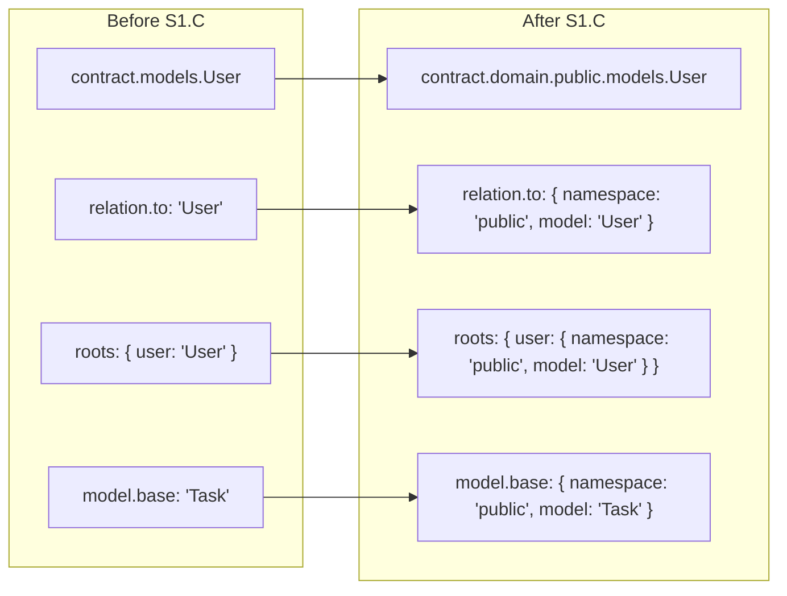

# Slice: cross-reference-encoding (S1.C)

Parent project [`projects/contract-ir-planes/`](../../); this slice satisfies **FR1**, **FR3**, **PDoD2** (jointly with S1.B), and **PDoD4** from the project spec — every cross-namespace reference site (`relation.to`, `model.base`, `roots[*]`, FK targets) carries an explicit `{ namespace, model }` (or `{ namespace, table, columns }`) object pair on the wire, and domain content lands in `contract.domain.<ns>.<entityKind>.<entityName>` so each model's namespace is structurally addressable.

**Linear:** [TML-2624](https://linear.app/prisma-company/issue/TML-2624)[^1]

[^1]: [TML-2624](https://linear.app/prisma-company/issue/TML-2624) was canceled on 2026-05-20 along with the other slice tracking tickets (TML-2622 / S1.A, TML-2623 / S1.B); the operator chose to track work via the parent project ticket ([TML-2584](https://linear.app/prisma-company/issue/TML-2584)) instead. PR titles continue to prefix the slice-ticket id for traceability.

## Purpose

S1.A laid the framework substrate (two-plane `Contract<{domain?, storage}>` shape, `elementCoordinates(storage)`, descriptor mechanism, narrowed `Namespace`). S1.B migrated Postgres enum off the framework-shared `types` slot, proving the substrate end-to-end.

This slice is the project's first concrete use of the `domain` plane that S1.A's substrate makes possible, and the load-bearing migration that satisfies **PDoD4** (cross-namespace references everywhere use object pairs). Three structural moves happen together in one PR because they cannot land independently without breaking the wire format:

1. Domain content moves into the `domain` plane: `contract.models.<X>` → `contract.domain.<ns>.models.<X>` (similarly `valueObjects`, `types` codec aliases). Per-model `namespaceId` becomes structural rather than asymmetrically tracked.
2. Every cross-namespace reference on the wire carries `{ namespace, model }`: `relation.to`, `model.base`, `roots[*]`. Storage-plane references (FK target) keep the `{ namespaceId, tableName, columns }` shape PR #534 already shipped — this slice tightens the type (subsumes [TML-2586](https://linear.app/prisma-company/issue/TML-2586)).
3. Authoring DSL keeps taking entity handles (`rel.belongsTo(User, …)`); the encoding change is on-the-wire only. Lowering paths resolve a model handle's namespace from the handle's containing namespace declaration.

Every in-tree contract carrying at least one cross-namespace reference (every contract with a `relations` block or `roots` entry — the common case) regenerates atomically in the same PR. Both `storageHash` and `profileHash` shift for every regenerated contract — expected, not a defect (A6 confirmed in S1.B).

## At a glance

`contract.models` / `contract.valueObjects` / codec-alias `contract.storage.types` relocate to `contract.domain.<ns>.{models, valueObjects, types}`; cross-references on the wire become `{ namespace, model }` object pairs (and `{ namespaceId, tableName, columns }` for the storage plane); authoring DSL still takes handles; ~20 source files and ~25 contract.{json,d.ts} fixture pairs regen atomically in one PR.

## Scope

### In scope

**Framework type substrate (encoding shape).**

| Surface | Change |
|---|---|
| [`packages/1-framework/0-foundation/contract/src/domain-types.ts`](../../../../packages/1-framework/0-foundation/contract/src/domain-types.ts) | `ContractReferenceRelation.to` and `ContractEmbedRelation.to` change from `string` to `{ namespace: string; model: string }`; `ContractModelBase.base` changes from `string` to `{ namespace: string; model: string }`. |
| [`packages/1-framework/0-foundation/contract/src/contract-types.ts`](../../../../packages/1-framework/0-foundation/contract/src/contract-types.ts) | `Contract.roots` changes from `Record<string, string>` to `Record<string, { namespace: string; model: string }>`. `Contract.domain` (already optional on the type — S1.A) becomes the canonical home for `models` / `valueObjects` / `types`; the flat `models` / `valueObjects` properties on `Contract` are removed. |
| `NamespaceId` branded type | New branded `NamespaceId` (`string & { readonly __brand: 'NamespaceId' }` or arktype-tagged) declared at the framework foundation, consumed by the cross-reference shapes and by `ForeignKeyReference.namespaceId`. Subsumes [TML-2586](https://linear.app/prisma-company/issue/TML-2586). |

**Framework validators + emitter.**

| Surface | Change |
|---|---|
| [`packages/1-framework/0-foundation/contract/src/validate-domain.ts`](../../../../packages/1-framework/0-foundation/contract/src/validate-domain.ts) | `DomainContractShape.roots` becomes `Record<string, { namespace: string; model: string }>`; `DomainModelShape.base` becomes the object-pair shape; `relations` shape's `to` becomes the object pair. `validateRelationTargets`, `validateRoots`, `validateVariantsAndBases` walk `contract.domain.<ns>.models` to resolve the `(namespace, model)` pair to an entity — same-namespace and cross-namespace references validated uniformly. |
| [`packages/1-framework/3-tooling/emitter/src/domain-type-generation.ts`](../../../../packages/1-framework/3-tooling/emitter/src/domain-type-generation.ts) | `generateModelRelationsType` emits `readonly to: { readonly namespace: '<ns>'; readonly model: '<X>' }` (literal types preserved); `model.base` emits the same shape; the top-level `roots` emission switches from `{ readonly rootKey: 'X' }` to `{ readonly rootKey: { readonly namespace: '<ns>'; readonly model: 'X' } }`. Models / value objects / types emit nested inside `domain.<ns>` rather than flat at root. |

**Family validator schemas.**

| Surface | Change |
|---|---|
| [`packages/2-mongo-family/1-foundation/mongo-contract/src/contract-schema.ts`](../../../../packages/2-mongo-family/1-foundation/mongo-contract/src/contract-schema.ts) | `RelationSchema.to` arktype shape becomes `type({ namespace: 'string', model: 'string' })`. Top-level `roots` shape switches accordingly. `models` / `valueObjects` slots move under `domain` envelope. |
| [`packages/2-sql/1-core/contract/src/validators.ts`](../../../../packages/2-sql/1-core/contract/src/validators.ts) | Same shape changes for the SQL family contract schema; `domain` envelope replaces flat `models` / `valueObjects`. Existing storage-plane FK reference shape unchanged (already object-pair). |

**Authoring lowering (handles → object pairs).**

| Surface | Change |
|---|---|
| [`packages/2-sql/2-authoring/contract-ts/src/contract-lowering.ts`](../../../../packages/2-sql/2-authoring/contract-ts/src/contract-lowering.ts) | Each lowered relation resolves the target model's `namespaceId` from the lowering context (model→namespace map already exists for FK lowering); emit `to: { namespace, model }`. `base` lowering similarly. |
| [`packages/2-sql/2-authoring/contract-ts/src/build-contract.ts`](../../../../packages/2-sql/2-authoring/contract-ts/src/build-contract.ts) | `to: relation.toModel` becomes `to: { namespace: resolvedTargetNamespaceId, model: relation.toModel }`. The existing `tableNameToNamespaceId` infrastructure provides the resolution. `roots` map construction switches to object-pair entries. |
| [`packages/2-sql/2-authoring/contract-psl/src/interpreter.ts`](../../../../packages/2-sql/2-authoring/contract-psl/src/interpreter.ts) | The PSL relation-inference path already carries `modelNamespaceIds: ReadonlyMap<string, string>` — emit object pairs instead of bare names where the lowered relation is produced. `roots` and STI `base` follow. |
| [`packages/2-mongo-family/2-authoring/contract-ts/src/contract-builder.ts`](../../../../packages/2-mongo-family/2-authoring/contract-ts/src/contract-builder.ts) + [`packages/2-mongo-family/2-authoring/contract-psl/src/interpreter.ts`](../../../../packages/2-mongo-family/2-authoring/contract-psl/src/interpreter.ts) | Same handle-resolution change on the Mongo authoring side. |

**Family serializers.**

| Surface | Change |
|---|---|
| [`packages/2-sql/9-family/src/core/ir/sql-contract-serializer-base.ts`](../../../../packages/2-sql/9-family/src/core/ir/sql-contract-serializer-base.ts) | Hydration / serialization passes treat `domain.<ns>.{models, valueObjects, types}` as the canonical entity location; flat `contract.models` is no longer accepted on hydration. Cross-reference object-pair shape passes through unchanged once the envelope shape moves. |
| Postgres + Mongo target serializers | Inherit the family-base shape; no additional target-specific cross-reference handling. |

**Storage-plane FK type tightening.**

| Surface | Change |
|---|---|
| [`packages/2-sql/1-core/contract/src/ir/foreign-key-reference.ts`](../../../../packages/2-sql/1-core/contract/src/ir/foreign-key-reference.ts) | `ForeignKeyReference.namespaceId` typed as `NamespaceId` rather than `string`. Subsumes [TML-2586](https://linear.app/prisma-company/issue/TML-2586)'s ask. |
| [`packages/3-targets/3-targets/postgres/src/core/migrations/operations/shared.ts`](../../../../packages/3-targets/3-targets/postgres/src/core/migrations/operations/shared.ts) | `ForeignKeySpec.references.schema` typed as `NamespaceId`. (Postgres-internal type, already string-valued; no on-disk change.) |

**Domain consumers updated (read path).**

| Surface | Change |
|---|---|
| [`packages/2-mongo-family/1-foundation/mongo-contract/src/validate-storage.ts`](../../../../packages/2-mongo-family/1-foundation/mongo-contract/src/validate-storage.ts) | `contract.models[relation.to]` → walk `contract.domain[relation.to.namespace].models[relation.to.model]`. |
| [`packages/2-mongo-family/5-query-builders/query-builder/`](../../../../packages/2-mongo-family/5-query-builders/query-builder/) ([`state-classes.ts`](../../../../packages/2-mongo-family/5-query-builders/query-builder/src/state-classes.ts), [`lookup-builder.ts`](../../../../packages/2-mongo-family/5-query-builders/query-builder/src/lookup-builder.ts)) | `roots` consumers walk the new shape — `Object.entries(roots)` yields `[rootKey, { namespace, model }]`. The TML-2400 compile-time-rejection limitation noted in the README persists; not in scope to fix here. |
| [`packages/3-extensions/sql-orm-client/`](../../../../packages/3-extensions/sql-orm-client/) ([`collection-contract.ts`](../../../../packages/3-extensions/sql-orm-client/src/collection-contract.ts), [`model-accessor.ts`](../../../../packages/3-extensions/sql-orm-client/src/model-accessor.ts), [`mutation-executor.ts`](../../../../packages/3-extensions/sql-orm-client/src/mutation-executor.ts)) | Relation-walk consumers read from `domain.<ns>.models` and resolve cross-namespace `to` via the object pair. |

**Fixture regeneration (atomic, same PR).**

- Live contract pairs (~10 confirmed via `rg -l "\"to\":" examples/*/src/**/contract.json packages/**/contract.json`): `examples/prisma-next-demo`, `examples/prisma-next-demo-sqlite`, `examples/prisma-next-cloudflare-worker`, `examples/cipherstash-integration`, `examples/paradedb-demo`, `examples/react-router-demo`, `examples/prisma-next-postgis-demo`, `examples/retail-store`, `examples/mongo-demo`, `examples/mongo-blog-leaderboard`, `examples/multi-extension-monorepo/app`, `examples/multi-extension-monorepo/packages/{audit,feature-flags}`, plus the test-fixture contracts under `packages/3-extensions/sql-orm-client/test/fixtures/`, `packages/2-sql/4-lanes/sql-builder/test/fixtures/`, `packages/2-mongo-family/{1-foundation,7-runtime}/`.
- Migration bookend contracts (~13 `end-contract.json` files under `examples/*/migrations/`) replay with the new shape — A4 falsification probe applies (see edge cases).
- Audit at execution start with `rg -l "\"to\":" examples/ packages/` and `rg -l "readonly to: '" examples/ packages/` to catch any drift before regen.

**Cleanup subsumptions.**

| Ticket | Decision | Rationale |
|---|---|---|
| [TML-2586](https://linear.app/prisma-company/issue/TML-2586) — Type `ForeignKeySpec.references.schema` as `NamespaceId` | **Fold into D1** | The NamespaceId brand is introduced for the domain-plane cross-reference shapes anyway; FK reference shape consumes it for free in the same dispatch. |

### Out of scope (this slice)

- **Deletion of `findSqlTable`, `assertUniqueSqlTableNames`, `extractStorageElementNames`, `SqlNamespacePayload`, `DEFAULT_NAMESPACES`, `normaliseNamespaceEntry`, `stripNamespaceKinds`, `UnboundTables<C>`** — **S1.D**. This slice does not delete subsumed helpers even though their replacements (object-pair refs, namespaced model lookups) become available here. Reviewers focus on encoding correctness; deletion is its own grep-gated PR.
- **`elementCoordinates(domain)` walk** — S1.A introduced `elementCoordinates(storage)`; the domain-plane analogue (or per-plane parameterisation) is consumed by S1.D when retired helpers are replaced.
- **Planner-side namespace-aware enum lookup** — [S1.E](../namespace-aware-enum-planning/spec.md). The column→enum reference resolution path (`enumRebuildCallRecipe`'s `column.typeRef === typeName` walk) is **not** changed by this slice; see pre-audit subsection below.
- **`column.typeRef` shape change to object pair** — column-level type references stay bare-string in this slice. They are not the cross-namespace references PDoD4 targets. Re-litigation of this scope would expand S1.C beyond what the project plan budgets.
- **TML-2400 compile-time root rejection** — the `Contract.roots` widening that produces it is fixed structurally here (the new shape carries `(namespace, model)` per root) but the compile-time inference improvement that tightens `from('badname')` rejection sits in the ORM/query-builder layer and is its own follow-up.
- **DSL surface ergonomics** — `db.auth.User` / `db.auth.users` namespace-aware accessors (TML-2581 / TML-2550) are unblocked by this slice but not delivered here.
- **Pack-contributed PSL grammar / namespace-aware DSL roots** — unchanged.
- **Mongo enum / SQLite-specific cross-reference quirks** — neither Mongo nor SQLite have target-specific cross-reference encodings; the slice's encoding change applies uniformly through `family-sql` and `family-mongo` bases.

## Approach

The substrate this slice rests on already exists. S1.A landed the optional `Contract.domain` field, the narrowed `Namespace` interface, and the entity coordinate. PR #534 landed `ForeignKeyReference.{namespaceId, tableName, columns}` as the precedent for object-pair encoding. The PSL interpreter already maintains `modelNamespaceIds: ReadonlyMap<string, string>` for FK target resolution. What's left is wiring the encoding change through every site that today reads or writes a cross-reference as a bare string.

**Encoding shape.** A cross-namespace reference is a closed object with two keys:

```jsonc
// Domain-plane cross-references (relation.to, model.base, roots[*])
{ "namespace": "auth", "model": "User" }

// Storage-plane cross-references (FK target — unchanged on the wire, type tightened)
{ "namespaceId": "auth", "tableName": "user", "columns": ["id"] }
```

The domain-plane shape uses `namespace` + `model` (matching the entity coordinate's `entityName` for the `models` kind); the storage-plane shape keeps `namespaceId` + `tableName` per PR #534. The asymmetry is intentional and load-bearing for ADR Decision 4 — storage-plane references address tables (which carry columns), domain-plane references address models. The `NamespaceId` brand sits on both `namespace` fields.

**Authoring layer (handles in, object pairs out).** The TS DSL's `belongsTo(Token, …)` / `hasMany(Token, …)` overloads already take either a model handle (carrying its containing namespace) or a string. Lowering paths walk a model→namespace map (already present for FK resolution in [`build-contract.ts`](../../../../packages/2-sql/2-authoring/contract-ts/src/build-contract.ts) line 365) and emit the object pair. The PSL interpreter's `resolveNamespaceIdForSqlTarget` / `modelNamespaceIds` infrastructure (already present at [`interpreter.ts`](../../../../packages/2-sql/2-authoring/contract-psl/src/interpreter.ts) lines 1457–1605) handles cross-namespace target resolution; the slice emits the object pair where the bare name lands today.

**Domain-plane population.** Lowering pipelines that today emit `contract.models[X]` emit `contract.domain[X.namespace].models[X]` instead. The flat `models` / `valueObjects` fields on `Contract` are removed; consumers (validator, emitter, ORM client, query builders) read from the domain plane. Codec aliases that today sit in document-scoped `storage.types` move to per-namespace `domain.<ns>.types` (codec aliases are domain-side per ADR Decision 1 — they describe the application's type vocabulary, not the storage projection). Concrete sub-questions about whether codec aliases collapse to a single sentinel namespace or distribute across namespaces are settled in D1 brief assembly — working position: codec aliases live in `domain.__unbound__.types` until a use case for per-namespace codec scoping surfaces.

**Validator + emitter.** `validate-domain.ts` walks `contract.domain.<ns>.models` and resolves `(namespace, model)` pairs against the populated plane. `domain-type-generation.ts` emits literal-typed object-pair shapes — `readonly to: { readonly namespace: 'auth'; readonly model: 'User' }` — preserving the same compile-time exactness the bare string shape provided.

**Serializer.** SQL and Mongo family serializer bases hydrate `contract.domain.<ns>.{models, valueObjects, types}` instead of flat root-level entries. Cross-reference object pairs are structural JSON; no class-identity dispatch needed at the reference level.

**Bookend replay (A4 probe).** Pre-S1.C bookend contracts (~13 `end-contract.json` files) carry the flat `models` + bare-string `to`/`base`/`roots` shape. Migration replay paths must either accept the historical shape OR the bookends regenerate in the same PR. Working position: replay-first per A4; regen on falsification, absorbed in the slice (not split out).



## Pre-audit: column→enum reference resolution path

Operator-directed pre-audit (S1.E spec Open Question #2): determine whether S1.C's encoding migration touches the column→enum reference resolution path, and decide who owns the fix.

**What the path looks like today.** [`packages/3-targets/3-targets/postgres/src/core/migrations/planner-strategies.ts`](../../../../packages/3-targets/3-targets/postgres/src/core/migrations/planner-strategies.ts) lines 384–394, inside `enumRebuildCallRecipe(typeName, ctx)`:

```ts
const columnRefs: { namespaceId: string; table: string; column: string }[] = [];
for (const [nsId, ns] of Object.entries(ctx.toContract.storage.namespaces)) {
  for (const [tableName, tableNode] of Object.entries(ns.tables)) {
    const table = tableNode as StorageTable;
    for (const [columnName, column] of Object.entries(table.columns)) {
      if (column.typeRef === typeName) {
        columnRefs.push({ namespaceId: nsId, table: tableName, column: columnName });
      }
    }
  }
}
```

The walk iterates every namespace × every table × every column and filters by `column.typeRef === typeName` — a **bare-string equality check** with no namespace narrowing. The enclosing function `enumRebuildCallRecipe(typeName, ctx)` does not carry the source enum's namespace.

**Collision shape.** Identical to the planner enum lookups S1.E is fixing. If `audit.Status` and `public.Status` are distinct enums (different values, different `nativeType`), and `audit.log_entry.priority.typeRef === 'Status'` while `public.post.status.typeRef === 'Status'`, the rebuild walk matches **both** columns regardless of which enum's rebuild is in progress — wrong, would cast both column types to the wrong temp type.

**Does S1.C change this path?** No.

S1.C's scope is the *domain-plane* cross-reference shape (`relation.to`, `model.base`, `roots[*]`) plus the FK reference type tightening. `column.typeRef` is a *storage-plane* column-level field that references a named storage entry (Postgres enum at `storage.<ns>.enum.<name>` or codec alias at document-scoped `storage.types.<name>`). It is not one of the cross-reference sites PDoD4 enumerates, and the project spec § In scope does not list `column.typeRef` among the reference encodings that change. Treating it as in-scope would conflate domain-plane entity references (PDoD4) with storage-plane named-type references (a different concern).

A future scope expansion could namespace-qualify `column.typeRef` (e.g., `column.typeRef: { namespace, type }`) to make the column→enum resolution structurally unambiguous. That belongs to a separate slice — the cleanest design needs to settle whether codec aliases (document-scoped today) also get namespaced, whether the `typeRef` shape unifies across enum and codec-alias targets, and what the migration story for column-level type references is.

**Verdict.** **S1.E owns the planner-side correctness fix.** S1.E's D2 brief absorbs the column→enum walk's namespace narrowing — the source enum's namespace flows into `enumRebuildCallRecipe` once `locateNamespaceType` returns the namespace-qualified entry (S1.E's D2 scope). The fix in S1.E is a *filter tightening* (`column.typeRef === typeName && nsId === sourceNamespaceId`), not an encoding change.

**Closes S1.E Open Question #2.** S1.E's working position was *"investigate at D2 brief assembly — if the column already carries namespace-qualified typeRef (object-pair encoding from S1.C, if S1.C has landed) the resolution is free; if not, narrow the filter by namespace as part of D2's scope."* The audit closes this: S1.C does not change `column.typeRef`, so S1.E's D2 narrows by namespace explicitly. S1.E OQ#2 is resolved with disposition *"narrow the filter by namespace; column.typeRef stays a bare string."*

## Edge cases (Example-Mapping)

| Edge case | Disposition | Notes |
|---|---|---|
| Self-reference (model references itself in same namespace) | **Handle** | `to: { namespace: ownNs, model: ownName }` — uniform encoding; no special case. |
| Same-namespace reference (today's implicit-resolution case) | **Handle** | Becomes explicit `{ namespace, model }` — no implicit shortcut (ADR Decision 4 rejected implicit-same-namespace + explicit-override). |
| Cross-namespace reference (canonical case) | **Handle** | The case the encoding exists to support. Verified by a serialization round-trip test per PDoD4. |
| String-form authoring (DSL `belongsTo('User', …)` overload) | **Handle** | DSL lowering resolves the string against the lowering context's model→namespace map; emits object pair. Ambiguous string (two namespaces hold same model name) raises at lowering time. |
| Ambiguous string-form target (multiple namespaces hold `User`) | **Handle** | Lowering raises a `ContractValidationError` naming the conflict; user disambiguates by passing the handle (`auth.User`) instead of the string. Pre-existing lowering already detects this for FK targets; same path applies to relation/base/roots resolution. |
| Dot-qualified string forms in legacy contracts (e.g. `"to": "auth.User"`) | **Handle (verify)** | Audit `rg '"to": "[A-Z][a-z]+\\.[A-Z]"' examples/ packages/` at execution start — working position: **no such forms exist** (the codebase never authorised dot-qualified strings; PR #534 used `namespaceId`/`tableName` pairs from the start). If any surface, halt and route to discussion mode — they cannot silently round-trip through the new object-pair schema. |
| `roots[*]` (root model list — bare string today) | **Handle** | `Contract.roots: Record<string, { namespace, model }>`. Every `roots` entry regenerates. Subsumes the asymmetry that `Contract.roots: Record<string, string>` widens (TML-2400) — though the compile-time inference fix that improves rejection is its own follow-up. |
| `model.base` (STI base — bare string today) | **Handle** | Same object-pair encoding. Models with `base` regenerate (multi-extension-monorepo audit, mongo-demo's `Bug`/`Feature` variants). |
| `relation.to` (most common form — `belongsTo` / `hasMany` / `hasOne`) | **Handle** | Both reference (`belongsTo`) and embed (`hasMany`/`hasOne`) relations carry `to`. Both shapes lift to object pairs. |
| `relation.through` (many-to-many bridge — if present) | **Verify (likely N/A)** | Grep at execution start; no `through` field exists in `ContractReferenceRelation` today. If a hidden site surfaces, encoding follows the same rule. |
| FK `ForeignKeyReference` (already object-pair) | **Handle** | Shape unchanged; type tightened — `namespaceId: NamespaceId` instead of `namespaceId: string`. Subsumes TML-2586. |
| `ForeignKeySpec.references.schema` (postgres-internal op-factory shape) | **Handle** | Type-only tightening to `NamespaceId`; no on-disk DDL change. Subsumes TML-2586. |
| Mongo cross-references (`relation.to` in mongo contracts) | **Handle** | Mongo participates uniformly — `relation.to`, `model.base`, `roots` all lift via the framework-level shape change. Confirmed: `examples/mongo-demo`, `examples/mongo-blog-leaderboard`, `packages/2-mongo-family/7-runtime/test/fixtures/`. |
| `storageHash` / `profileHash` shift on every cross-ref-bearing contract | **Handle** | Expected, confirmed not a defect (A6 confirmed 2026-05-22). |
| Migration replay against pre-S1.C bookends (~13 `end-contract.json`) | **Handle (verify)** / **Defer regen** if green | A4 working position: replay path accepts historical shape. If replay rejects, absorb bookend regen in slice (extra dispatch, ~0.5 day per project plan Risk #1). |
| Migration replay rejects bookends → replay path needs refactor | **Defer** | Promote to own slice only if failure cascades beyond bookend regen. Discussion-mode re-entry trigger. |
| Plan IR / DDL paths consuming cross-refs at planner time | **Handle** | Planner reads FK references which already carry the object-pair shape; relation-to and roots are domain-plane and don't reach the planner. No planner-side changes expected — verified by a smoke pass on integration tests. |
| `domain.<ns>.types` (codec aliases) destination namespace | **Handle** | Working position: codec aliases land in `domain.__unbound__.types` (single-namespace sentinel) until per-namespace codec scoping has a use case. Settle in D1 brief. |
| `Contract.models` / `Contract.valueObjects` consumers (the ~34 sites that read flat-at-root) | **Handle** | Each consumer updated to walk `contract.domain.<ns>.{models, valueObjects}`. Replacement helper / pattern is the per-plane property walk — same shape as `elementCoordinates(storage)`. Helper deletion deferred to S1.D. |
| `db.<root>` ORM accessor lookups | **Handle** | Root list resolves to model via the object pair — `roots[rootKey]: { namespace, model }` → `contract.domain[namespace].models[model]`. |
| `validateContractDomain` walking flat `contract.models` | **Handle** | Rewrites to walk `contract.domain.<ns>.models` and resolves cross-namespace `(namespace, model)` references against the populated plane. |
| Single-namespace contract (the common case — `__unbound__` only) | **Handle** | Object pair with `namespace: '__unbound__'` for every reference. No DSL or user-facing affordance change. |
| Contract with zero cross-references (no `relations`, single `roots` entry) | **Handle** | Encoding shape still changes at `roots[*]`. Hash shifts. |
| Round-trip serialize → deserialize → re-serialize | **Handle** | PDoD4 round-trip test exercises each shape (`relation.to`, `model.base`, `roots[*]`, FK target) and asserts identity preservation. |
| External `@prisma-next/*` consumer pinning old `Contract.models` shape | **Defer** | A6 confirmed 2026-05-22; no external pins. If falsified mid-flight, halt and route to discussion mode. |
| Pack-contributed authoring entity kinds with namespace-resolution needs | **Explicitly out** | The project doesn't ship additional pack-contributed kinds in S1.C; future contributions through `AuthoringContributions.entityTypes` follow the same shape but are not in scope here. |

## Slice Definition of Done

- [ ] **SDoD1.** All "Done when" gates from the slice plan pass: `pnpm typecheck`, `pnpm test:packages`, `pnpm test:integration`, `pnpm test:e2e`, `pnpm fixtures:check`, `pnpm lint:deps` clean.
- [ ] **SDoD2.** Every pre-named edge case handled per its disposition.
- [ ] **SDoD3.** Reviewer verdict: accept (PR review surface).
- [ ] **SDoD4.** Manual-QA: **N/A** — no user-observable authoring or runtime API change; users still author `rel.belongsTo(User, …)` / `models: { User: … }`. Structural IR / emitted contract shape change only. Hash shifts are invisible at the DSL surface. If the demo example's `db.user.findMany()` (or equivalent) breaks at runtime during fixture regen, that's a regression caught by `pnpm test:e2e`, not a missing manual-QA pass.
- [ ] **SDoD5.** Slice doesn't touch surfaces listed as out-of-scope (subsumed helper deletion, planner-side enum lookup, `column.typeRef` shape, DSL surface ergonomics, pack-contributed authoring entity kinds, namespace-aware ORM accessors).
- [ ] **SDoD6 — PDoD4 satisfied.** Cross-namespace references everywhere use object pairs. `relation.to`, `model.base`, `roots[*]` carry `{ namespace, model }`. FK targets carry `{ namespaceId, tableName, columns }` with `namespaceId: NamespaceId`. Round-trip through serializer + deserializer preserves shape — verified by a serialization round-trip test on each shape.
- [ ] **SDoD7 — PDoD2 jointly satisfied** (with S1.B): all in-tree contracts follow the canonical shape `contract.{domain, storage}.<ns>.<entityKind>.<entityName>`. `pnpm fixtures:check` clean. A shape-assertion test confirms no contract carries flat `models` / `valueObjects` at root.
- [ ] **SDoD8 — Grep gate.** After the fix, no bare-string cross-references in source: `rg "to: '" packages/ --type ts` returns hits only inside test data (no implementation source). `rg 'roots: \{ [a-z]+: ' examples/*/src/**/contract.d.ts` returns the new object-pair shape. The audit is phrased verifiably so a reviewer can confirm by inspection.
- [ ] **SDoD9 — TML-2586 subsumed.** `ForeignKeyReference.namespaceId` typed as `NamespaceId`; `ForeignKeySpec.references.schema` typed as `NamespaceId`. PR body references TML-2586 by identifier for the GitHub-integration close-out.
- [ ] **SDoD10 — Migration replay.** Pre-S1.C bookend contracts replay successfully OR bookends regenerated in the same PR with documented rationale if A4 falsified.

## Constraints + Assumptions

**Inherited from parent project (load-bearing for this slice).**

- **A1.** `AuthoringContributions.entityTypes` descriptor surface is unchanged by this slice — S1.A established it; S1.B exercised it; S1.C consumes the registration as-is.
- **A4.** Pre-S1.C migration bookends replay without shape upgrade. Falsification trigger: migration-replay test failure in the fixture-regen dispatch → bookend regen absorbed in slice (~0.5 day, project plan Risk #1).
- **A6 — CONFIRMED 2026-05-22.** No external `@prisma-next/*` consumer pins `contract.json` shape or `storageHash` literals; no off-repo EA tooling depends on flat `contract.models` surviving the npm minor. Hard-cut path proceeds.
- **A7.** Framework canonicalizer family-contribution hook (used by S1.D) is implementable without a circular dependency — not relevant to this slice; this slice leaves the canonicalizer's SQL-specific paths in place.

**Slice-specific assumptions.**

- **B1.** S1.B is merged on the slice branch base (`origin/main` includes the enum-migration PR). This slice consumes the namespace-scoped `domain.<ns>.enum` slot that S1.B's substrate established (irrelevant to most of S1.C, but the slot's existence proves the descriptor mechanism works for the encoding move).
- **B2.** The `NamespaceId` brand is a single-field type-level rename in this slice. No runtime validation overhead; arktype's `string` accepts the branded type structurally.
- **B3.** `db.<root>` ORM consumers walk `contract.roots` as a plain `Record<string, { namespace, model }>` — no compile-time inference improvement (TML-2400) bundled here. Working position: the structural fix lands; the compile-time tightening is a follow-up.
- **B4.** Codec aliases (`storage.types` in document-scoped form today) land in `domain.__unbound__.types` post-S1.C. Falsification trigger: per-namespace codec scoping has a use case at brief assembly → discussion-mode re-entry.
- **B5.** Lowering paths already carry the model→namespace map sufficient to resolve handle targets to object pairs (verified for SQL via `tableNameToNamespaceId`; PSL via `modelNamespaceIds`). Falsification trigger: a lowering site lacks the map → expand the lowering context.

## Per-dispatch DoR overlay

Project plan Risk #5 mitigation: **every dispatch brief assembled within this slice must answer (a) and (b) before locking decisions.**

- **(a)** For every field in any public surface this dispatch touches, what does it add that an existing field doesn't already say?
- **(b)** For every framework-layer data structure that encodes target/family identity, what enforcement does it provide that contract hydration / validation doesn't already structurally provide?

**Spec-level answers for surfaces this slice already knows it touches** (dispatch briefs may refine; must not contradict):

| Surface | (a) — non-redundancy | (b) — enforcement beyond hydration/validation |
|---|---|---|
| **`ContractReferenceRelation.to: { namespace, model }`** | Replaces a bare string that lost the namespace coordinate; the pair is the entity coordinate (per FR2 / ADR D6) at the cross-reference site. No new field — *replacing* a field of the same shape class. | Structural — the validator walks `contract.domain[namespace].models[model]`; no new identity table or runtime registry. Cross-namespace ambiguity is impossible because the namespace is on the wire. |
| **`ContractModelBase.base: { namespace, model }`** | Same as above — replaces bare string with the canonical coordinate. | Same — STI base resolution walks the populated domain plane; no parallel registry. |
| **`Contract.roots: Record<string, { namespace, model }>`** | Replaces bare-string root values with the entity coordinate; `Contract.roots: Record<string, string>` widening (TML-2400) is structurally fixed. | Validator walks the domain plane; no new identity surface. |
| **`NamespaceId` branded type** | Tightens an existing `string` field's type without introducing a new runtime value. Subsumes [TML-2586](https://linear.app/prisma-company/issue/TML-2586) without adding scope. | Compile-time only — the brand exists in the type system; at runtime the value is still a string. arktype validates `string` structurally; no runtime overhead. |
| **`Contract.domain` populated with `models` / `valueObjects` / `types`** | The domain plane was introduced as a type in S1.A but unpopulated. This dispatch *populates* the existing field rather than adding a new one — the shape was already declared. | Hydration walks `contract.domain` per the family serializer's slot loop; structural validation enforces the shape. No new identity table. |
| **`ForeignKeyReference.namespaceId: NamespaceId`** | Type tightening of an existing `string` field; no new field. | Compile-time brand; runtime unchanged. |
| **Removed `Contract.models` / `Contract.valueObjects` flat fields** | Deletion of redundant flat top-level fields the domain plane already provides via `domain.<ns>.{models, valueObjects}`. The flat shape was a pre-namespace-exemplar legacy; removing it eliminates the parallel encoding. | The deletion is a contract-shape simplification, not a new enforcement surface. |
| **`Contract.roots` populated with object-pair values** | Same as above — populating the existing `roots` field's value shape with the entity coordinate. | Validator walks domain plane to resolve each root; no new identity surface. |

Briefs that cannot answer (a) or (b) satisfactorily for a proposed new field or registry **must not lock** — escalate via design discussion (I12). The default stance for this slice is **tighten existing shapes to carry the entity coordinate**, not add new identity-encoding structures.

## Open Questions

1. **Sizing / re-decomposition trigger.** This slice is the project's biggest per the plan. It touches framework type substrate, validators, emitter, both families' authoring layers, both families' serializers, and ~25 fixture pairs. The project plan's working position is **2 dispatches** (encoding migration in D1, fixture regen in D2). **Re-decomposition trigger:** if the codec-alias destination (B4) needs per-namespace scoping, or if A4 falsifies and bookend regen cascades into a replay-path refactor, the dispatch count grows. Working assessment: **M-borderline-L** — at the upper edge of a single-PR slice. If brief-assembly D1 surfaces a fold-in that pushes the file count past ~25 source touches, halt and route to discussion mode for a 3-dispatch decomposition (e.g., D1 framework shape + D2 family lowering & serializer + D3 fixture regen).
2. **Codec-alias destination namespace.** Working position: codec aliases (today's document-scoped `storage.types` entries) land in `domain.__unbound__.types`. Settle in D1 brief — confirm by reading the demo's `Embedding1536` shape and verifying no example contract carries per-namespace codec aliases today.
3. **`Contract.roots` widening compile-time fix (TML-2400) scope.** Working position: not in scope — the structural fix lands here; the compile-time inference improvement that tightens `from('badname')` rejection is a follow-up. Document in PR body for traceability.
4. **Bookend regen vs replay-only.** Working position: replay-first per A4; regen bookends only on falsification. Document outcome in PR body. Same disposition as S1.B's OQ#2.
5. **`storage.types` (codec aliases) destination question vs full domain-plane move.** Working position: the codec-alias move is part of the domain-plane population (B4). If brief-assembly D1 finds the move expands consumer surface (~10+ files reading document-scoped `storage.types`), split out as a follow-up slice — codec aliases are domain-side per ADR Decision 1 but not load-bearing for PDoD4 (the cross-reference encoding). Defer if scope grows.
6. **`NamespaceId` brand type representation.** Working position: arktype-tagged brand (`type('string').as<NamespaceId>()` or equivalent) at the framework foundation, consumed by the cross-reference shape definitions. Settle in D1 brief.

## References

- Parent project spec: [`projects/contract-ir-planes/spec.md`](../../spec.md)
- Parent project plan (S1.C entry): [`projects/contract-ir-planes/plan.md`](../../plan.md)
- ADR: [`projects/contract-ir-planes/adrs/0001-contract-planes.md`](../../adrs/0001-contract-planes.md) — Decision 1 (two planes), Decision 2 (uniform shape), Decision 3 (plane names), Decision 4 (cross-references as object pairs), Decision 6 (entity coordinate)
- **Linear:** [TML-2624](https://linear.app/prisma-company/issue/TML-2624) (this slice — canceled, see footnote); [TML-2584](https://linear.app/prisma-company/issue/TML-2584) (parent project); [TML-2586](https://linear.app/prisma-company/issue/TML-2586) (subsumed — FK reference type tightening); [TML-2400](https://linear.app/prisma-company/issue/TML-2400) (related — `Contract.roots` widening, structural fix lands here)
- **Predecessor slices:**
  - [`projects/contract-ir-planes/slices/enum-migration/spec.md`](../enum-migration/spec.md) — S1.B; established the descriptor-driven slot migration pattern this slice consumes for `domain.<ns>.types`
  - S1.A substrate (TML-2622): `Contract.domain` optional field, narrowed `Namespace`, `elementCoordinates(storage)`, entity coordinate
- **Follow-on slices:**
  - [`projects/contract-ir-planes/slices/namespace-aware-enum-planning/spec.md`](../namespace-aware-enum-planning/spec.md) — S1.E; owns the column→enum reference resolution path (see pre-audit subsection above)
  - S1.D (cleanup) — deletes subsumed helpers (`findSqlTable`, `assertUniqueSqlTableNames`, `extractStorageElementNames`, `SqlNamespacePayload`, `DEFAULT_NAMESPACES`, `normaliseNamespaceEntry`, `stripNamespaceKinds`, `UnboundTables<C>`) once the domain plane is populated and cross-references are object pairs
- **PR #534 precedent:** [`packages/2-sql/1-core/contract/src/ir/foreign-key-reference.ts`](../../../../packages/2-sql/1-core/contract/src/ir/foreign-key-reference.ts) — `ForeignKeyReference.{namespaceId, tableName, columns}` (S1.C inherits this object-pair shape for the storage plane)
- **Audit grep templates** (run at execution start):
  - Cross-references in source: `rg 'to: ' packages/ --type ts`
  - Dot-qualified legacy strings: `rg '"to": "[A-Z][a-z]+\\.[A-Z]"' examples/ packages/`
  - Live cross-ref-bearing contracts: `rg -l '"to":' examples/*/src/**/contract.json packages/**/contract.json`
- **Calibration:** [`drive/calibration/sizing.md`](../../../../drive/calibration/sizing.md) (M reference: *"Tighten existing shapes across substrate + consumers + fixtures, ~15–25 sites"*; L reference upper-edge if scope expands)
- **Risk #5 / retro:** [`drive/retro/findings.md`](../../../../drive/retro/findings.md) (2026-05-21 entry — surface-then-retire cycle the per-dispatch DoR overlay mitigates)
