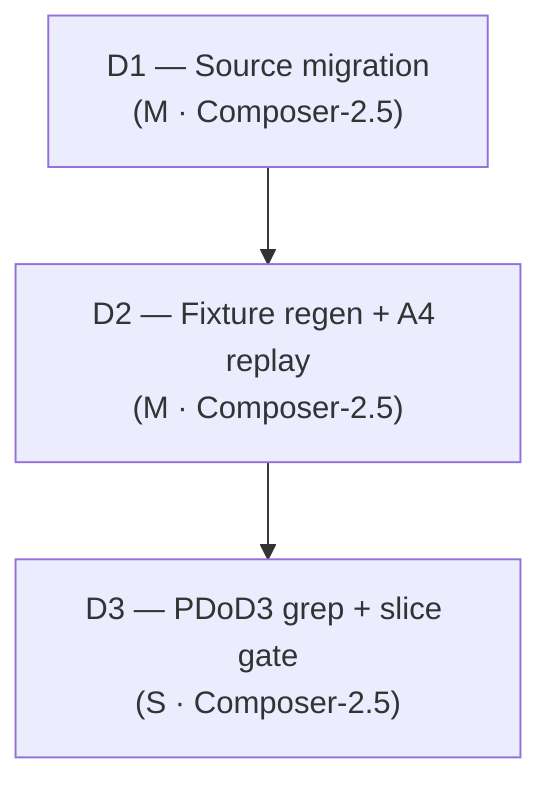

# Slice Plan: enum-migration (S1.B)

**Slice spec:** [`./spec.md`](./spec.md)
**Parent plan:** [`projects/contract-ir-planes/plan.md`](../../plan.md) § S1.B
**Linear:** [TML-2623](https://linear.app/prisma-company/issue/TML-2623)

## At a glance

Three dispatches, strictly sequential, one PR. **D1** hard-cuts enum entries from framework-shared `storage.namespaces.<ns>.types` to pack-contributed `storage.namespaces.<ns>.enum` across IR typing, validator composition, serializer hydration (incl. TML-2658 `'+': 'ignore'`), emitter codegen, authoring lowering, and Postgres target read/write paths — with document-scoped `storage.types` left untouched. **D2** grep-audits and regenerates every enum-bearing committed contract, then runs the A4 migration-replay probe on pre-#534 bookends (regen bookends only on falsification). **D3** is the slice closure pass: PDoD3 grep gate, edge-case disposition audit, and full slice validation gate before reviewer engagement. D1 + D2 must land in the same PR commit window so CI never sees source on the new slot with fixtures still on the old slot.

## Dispatch plan

### Dispatch 1: Source migration — IR, validator, serializer, emitter, authoring, Postgres paths

**Intent.** Complete the hard-cut slot migration in source: namespace-scoped enum entries use the `enum` property; the framework-shared namespace `types` slot stops accepting enums and is deleted from IR types, validator schema, and hydration walks. Enum validation composes only through the Postgres pack's existing `validatorSchema` fragment on `'enum?'`, keyed by discriminator `'postgres-enum'`. Emitter codegen emits under `namespace.enum` using the descriptor discriminator (not a hardcoded path under `namespace.types`). Authoring (TS DSL + PSL) lowers enums to `namespace.enum`. Postgres target serializer / schema / migration planner paths that today read `namespace.types` for enums read `namespace.enum` instead. Fold [TML-2658](https://linear.app/prisma-company/issue/TML-2658): `NamespaceRawSchema` gains explicit `'+': 'ignore'` + rationale comment in `sql-contract-serializer-base.ts`. Replace the family-base *"postgres-enum requires PostgresContractSerializer"* special-case with a generic descriptor-driven message.

What stays the same: document-scoped `storage.types` (codec triples / aliases only) — no deletion, no shape change. No on-disk `contract.json` / `contract.d.ts` edits in this dispatch (`pnpm fixtures:check` must still pass against **unchanged** fixtures is **not** expected once D1 lands — see Risks; D2 follows immediately). No dual-write, no read-fallback from `types` → `enum`. SQLite adapter `PostgresEnumStorageEntry` import sites in `packages/3-targets/6-adapters/sqlite/` stay (project non-goals). TML-2654 emit-pipeline wiring, TML-2634 plural rename, domain-plane population, cross-ref encoding, subsumed-helper deletion — all out of scope.

**Files in play.** Grounded on spec source-surfaces table + codebase audit (grep `postgres-enum|PostgresEnum` under `packages/2-sql/`, `packages/3-targets/3-targets/postgres/` at dispatch start; expect ~15–22 implementation files, not fixture JSON):

| Surface | Paths |
|---|---|
| IR typing | [`packages/2-sql/1-core/contract/src/ir/sql-storage.ts`](../../../../packages/2-sql/1-core/contract/src/ir/sql-storage.ts), [`postgres-enum-storage-entry.ts`](../../../../packages/2-sql/1-core/contract/src/ir/postgres-enum-storage-entry.ts) (retire or narrow per hard-cut), [`sql-node.ts`](../../../../packages/2-sql/1-core/contract/src/ir/sql-node.ts), [`storage-type-instance.ts`](../../../../packages/2-sql/1-core/contract/src/ir/storage-type-instance.ts), [`types.ts`](../../../../packages/2-sql/1-core/contract/src/types.ts) |
| Validator | [`packages/2-sql/1-core/contract/src/validators.ts`](../../../../packages/2-sql/1-core/contract/src/validators.ts), [`test/sql-storage.test.ts`](../../../../packages/2-sql/1-core/contract/test/sql-storage.test.ts) |
| Serializer + TML-2658 | [`packages/2-sql/9-family/src/core/ir/sql-contract-serializer-base.ts`](../../../../packages/2-sql/9-family/src/core/ir/sql-contract-serializer-base.ts) |
| Verifier | [`packages/2-sql/9-family/src/core/schema-verify/verify-sql-schema.ts`](../../../../packages/2-sql/9-family/src/core/schema-verify/verify-sql-schema.ts) |
| Emitter codegen | [`packages/2-sql/3-tooling/emitter/src/index.ts`](../../../../packages/2-sql/3-tooling/emitter/src/index.ts) |
| Authoring lowering | [`packages/2-sql/2-authoring/contract-ts/src/`](../../../../packages/2-sql/2-authoring/contract-ts/src/) (`contract-builder.ts`, `contract-lowering.ts`, `contract-definition.ts`, `build-contract.ts`, `contract-types.ts`, `contract-dsl.ts`, `contract-warnings.ts` — enumerate at brief time), [`packages/2-sql/2-authoring/contract-psl/src/interpreter.ts`](../../../../packages/2-sql/2-authoring/contract-psl/src/interpreter.ts) + touched PSL tests |
| Postgres target | [`packages/3-targets/3-targets/postgres/src/core/postgres-contract-serializer.ts`](../../../../packages/3-targets/3-targets/postgres/src/core/postgres-contract-serializer.ts), [`postgres-schema.ts`](../../../../packages/3-targets/3-targets/postgres/src/core/postgres-schema.ts), [`postgres-enum-type.ts`](../../../../packages/3-targets/3-targets/postgres/src/core/postgres-enum-type.ts), migration planner modules under [`migrations/`](../../../../packages/3-targets/3-targets/postgres/src/core/migrations/) that reference namespace `types` for enums (`enum-planning.ts`, `planner-*.ts`, `issue-planner.ts` — grep-driven) |
| Descriptor (read-only anchor) | [`packages/3-targets/3-targets/postgres/src/core/authoring.ts`](../../../../packages/3-targets/3-targets/postgres/src/core/authoring.ts) — confirm `enum` descriptor registration; adjust only if slot-key wiring still references legacy `types` |

**Done when.**

- [ ] Pre-flight grep inventory recorded in dispatch commit message or brief appendix: `rg -l 'postgres-enum|PostgresEnum' packages/2-sql/ packages/3-targets/3-targets/postgres/ --glob '!**/test/fixtures/**' --glob '!**/*.json'` (file list is the scope contract)
- [ ] `pnpm --filter @prisma-next/sql-contract build` then `pnpm --filter @prisma-next/family-sql build` then `pnpm --filter @prisma-next/sql-emitter build` then `pnpm --filter @prisma-next/target-postgres build` (order per dep graph; refresh `dist/*.d.mts` before downstream typecheck)
- [ ] `pnpm typecheck` clean
- [ ] `pnpm test:packages` green — incl. `packages/2-sql/1-core/contract/test/sql-storage.test.ts`, serializer/verifier tests, authoring tests, postgres target tests that cover enum hydration / planning
- [ ] `pnpm test:integration` green — Postgres enum path is the load-bearing exemplar
- [ ] `pnpm lint:deps` clean — no new framework→target layering violations; **no** read-fallback shim that imports across layers to accept old slot (F1)
- [ ] Intent-validation: `rg "PostgresEnumStorageEntry|'postgres-enum'" packages/1-framework/ packages/2-sql/9-family/` returns **zero** matches (PDoD3 pre-gate — must hold before D3 re-runs it slice-wide)
- [ ] Intent-validation: `rg '\.types\.' packages/2-sql/9-family/src/core/ir/sql-contract-serializer-base.ts packages/2-sql/3-tooling/emitter/src/index.ts packages/2-sql/1-core/contract/src/validators.ts` — no namespace-enum reads/writes under `.types.` (document-scoped `storage.types` paths in emitter may remain)
- [ ] Intent-validation: document-scoped `storage.types` slot still present in `createSqlStorageSchema` / emitter document path — **not** deleted (spec edge: accidental deletion)
- [ ] `NamespaceRawSchema` carries `'+': 'ignore'` + comment (SDoD7 / TML-2658)
- [ ] Edge cases covered in this dispatch: enum-under-old-slot rejected at validator (spec edge #1); document-scoped `storage.types` enum rejected (edge #2); empty `enum` map omitted/`{}` (edge #3); discriminator `'postgres-enum'` vs slot key `enum` (edge #5); enum/table name collision via distinct slots (edge #18); no `types`→`enum` read-fallback (A6 hard-cut, edge #1)
- [ ] **Explicit non-gate:** `pnpm fixtures:check` is expected to fail after D1 until D2 completes — do not treat fixture drift as D1 rework; proceed to D2

**Size.** M. ~15–22 implementation files across 4 packages; one settled design judgment (hard-cut, no shim). **Re-decomposition trigger:** if `git diff --stat` shows > 25 files under `packages/` *or* typecheck cascade pulls in > 30 files, halt and split into **D1a** (contract IR + validator + family serializer/verifier/emitter) + **D1b** (authoring + postgres target + migration planners) before continuing.

**Model tier.** Composer-2.5 (`composer-2.5-fast`). Per [`drive/calibration/model-tier.md`](../../../../drive/calibration/model-tier.md): mechanical migration with a fully-settled brief and enumerated file list; design is pinned in spec § Approach + ADR Decision 5. **Escalate to Opus** (`claude-opus-4-7-thinking-high`) if: (a) descriptor-driven emitter change requires inventing a new public field on `AuthoringEntityTypeDescriptor` or `FamilyDescriptor`; (b) migration planner paths need a shape change beyond slot-key substitution; (c) Risk #5 (a)+(b) cannot be answered without new registry/lookup infrastructure (F6 — revert to discussion mode, do not ship redundant surface).

**Pre-dispatch DoR** (executor walks before starting; brief-assembly walks Risk #5 overlay — see § Per-dispatch DoR overlay below).

- [x] Intent statement clear (hard-cut slot migration; document-scoped `storage.types` preserved)
- [x] Files in play named (table + grep pre-flight)
- [x] "Done when" gates explicit (build cascade, typecheck, test:packages, test:integration, lint:deps, intent-validation greps; fixtures:check explicitly deferred to D2)
- [x] Predicted size M (re-decomposition trigger at >25 files / >30 cascade)
- [x] Failure modes considered: **F1** (no read-fallback / dual-shape under new name), **F3** (grep inventory before test-suite discovery), **F5** (destructive git forbidden), **F6** (no new redundant descriptor fields — Risk #5 (a))
- [x] Edge cases mapped (see Done when list)
- [x] No silent design decisions: A6 confirmed 2026-05-22; slot key `enum` not revisited (B2); TML-2654/2634/2636/2648 deferred per spec table

**Refusal triggers** (halt dispatch; report to orchestrator — do not workaround):

- Implementer proposes read-fallback or dual-write from `types` to `enum` (A6 falsified mid-flight → discussion mode; spec edge #1 / project Risk #2)
- Implementer adds a new public field to a descriptor/framework export without brief-level Risk #5 (a) justification (F6)
- Implementer adds a framework-level lookup table for slot keys (F6 / retro 2026-05-21 — enforcement beyond hydration)
- `pnpm test:integration` regresses on Postgres enum hydration and fix requires emit-pipeline / `deserializeContract` changes (TML-2654 territory — defer, do not expand slice)
- Typecheck/fixture cascade exceeds re-decomposition threshold — halt and re-plan D1a/D1b
- Implementer deletes or narrows document-scoped `storage.types` in `createSqlStorageSchema` (spec out-of-scope guard)

**Brief overlay** (when `drive-build-workflow` assembles the brief):

- MUST forbid destructive git operations per F5
- MUST require grep pre-flight file inventory before edits (F3)
- MUST forbid F1 patterns: `normalize*Enum*`, `readFallback`, `legacyTypesSlot`, `types ?? enum` coalescing on namespace envelopes
- MUST walk Risk #5 (a)+(b) for **any** field the implementer proposes to add; default answer for this dispatch is "retire, don't add" — see [spec § Per-dispatch DoR overlay](./spec.md#per-dispatch-dor-overlay) answer table (link only; do not duplicate table in brief)
- MUST name downstream `pnpm build` order (sql-contract → family-sql → sql-emitter → target-postgres)
- MUST state: **do not run `pnpm fixtures:emit` in D1** — fixture work is D2

---

### Dispatch 2: Fixture regeneration + migration replay (A4)

**Intent.** Regenerate every committed contract that carries `"kind": "postgres-enum"` so on-disk JSON and emitted `contract.d.ts` use `storage.namespaces.<ns>.enum.<name>`. Run migration-replay verification against pre-#534 bookend contracts with **document-scoped** `storage.types` enums (A4). Regenerate bookends only if replay fails; document outcome in PR notes (spec open question #2). **Fold-in:** generalize two pre-existing JSDoc references in `packages/1-framework/1-core/framework-components/src/ir/ir-node.ts` and `packages/1-framework/1-core/framework-components/src/ir/storage-type.ts` that name `'postgres-enum'` as the example discriminator — replace with a target-agnostic placeholder so the JSDoc reads as framework-substrate documentation rather than Postgres-specific (D1 post-flight surfaced; cost = 2 lines).

What stays the same: no further source edits unless replay falsification requires a small planner/serializer fix (if fix cascades beyond bookend regen → halt per spec edge #12 deferral). Mongo contracts unchanged. User-facing DSL unchanged.

**Files in play.** Grep-driven at dispatch start:

```bash
rg -l '"kind": "postgres-enum"' examples/ test/ packages/ --glob 'contract.json' --glob '*.json'
```

**Working position inventory** (confirm at execution; spec B3):

- [`examples/prisma-next-demo/src/prisma/contract.json`](../../../../examples/prisma-next-demo/src/prisma/contract.json) + `contract.d.ts`
- [`examples/prisma-next-cloudflare-worker/src/prisma/contract.json`](../../../../examples/prisma-next-cloudflare-worker/src/prisma/contract.json) + `contract.d.ts`
- [`packages/3-targets/3-targets/postgres/test/fixtures/snapshot-read-shapes/postgres-enum.json`](../../../../packages/3-targets/3-targets/postgres/test/fixtures/snapshot-read-shapes/postgres-enum.json)
- [`test/integration/test/authoring/parity/core-surface/expected.contract.json`](../../../../test/integration/test/authoring/parity/core-surface/expected.contract.json) (if still enum-bearing)
- Bookends (replay probe, regen only on failure): `examples/prisma-next-demo/migrations/app/*/end-contract.json` and matching `start-contract.json` under pre-#534 paths (6 bookends per project plan working position)

**Done when.**

- [ ] Grep inventory at dispatch start matches committed regen set; any surprise hits added to regen list before emit
- [ ] `pnpm fixtures:emit` (or targeted emit per package README) run **after** D1 is committed on the slice branch
- [ ] Every inventory `contract.json` + paired `contract.d.ts` updated; `storageHash` / `profileHash` shifts accepted (spec edge #9)
- [ ] `pnpm fixtures:check` clean — **byte-stability gate for the slice**
- [ ] `pnpm typecheck` clean (emitted `.d.ts` literals satisfy `Contract<SqlStorage>` with D1's narrowed types)
- [ ] `pnpm test:packages` + `pnpm test:integration` green (post-regen)
- [ ] **A4 / SDoD8:** migration-replay tests pass for document-scoped enum bookends OR bookends regenerated with documented rationale in PR body
- [ ] Edge cases: fixture regen ordering (edge #7); orthogonal document `storage.types` + namespace `enum` exercised in demo contract (edge #4); `elementCoordinates(storage)` yields `(plane: 'storage', ns, entityKind: 'enum', name)` on regenerated demo contract (edge #6) — assert via existing walk tests or one targeted assertion in postgres/framework tests
- [ ] Intent-validation: no `contract.json` under repo still has namespace-scoped postgres-enum under `.types.` — `rg '"kind": "postgres-enum"' -A5 -B5 examples/ packages/ test/ | rg 'types'` returns zero namespace-enum contexts (grep pattern refined at brief time)

**Size.** M. ~4–12 JSON + `.d.ts` pairs plus conditional bookend regen; emit + verification is mechanical but integration + replay probe add wall-clock. **Re-decomposition trigger:** if A4 falsification requires source changes beyond bookend JSON regen (>3 non-fixture files), halt — spec defers to promotion slice.

**Model tier.** Composer-2.5 (`composer-2.5-fast`). Test-literal / fixture regen row in [`model-tier.md`](../../../../drive/calibration/model-tier.md). Escalate to Opus only if replay failure implicates non-mechanical planner semantics.

**Pre-dispatch DoR.**

- [x] Intent clear (regen + A4 probe; conditional bookend regen)
- [x] Files in play named (grep-driven inventory + bookend paths)
- [x] "Done when" gates explicit (`fixtures:check`, typecheck, tests, A4/SDoD8)
- [x] Predicted size M
- [x] Failure modes: **F3** (grep inventory first), **F5** (destructive git), **F7** (if emit fails due to unbriefed blocker — halt, don't alias-workaround)
- [x] Edge cases mapped (#4, #6, #7, #9, #12, A4)
- [x] D1 committed on branch before D2 starts (sequencing dependency)

**Refusal triggers:**

- `pnpm fixtures:emit` fails with errors requiring TML-2654 emit-pipeline / plain-literal namespace fixes — halt; defer ticket, do not expand D2
- A4 replay failure needs non-trivial source refactor (>3 implementation files) — halt; promote per spec edge #12
- Implementer regens fixtures before D1 source migration is on branch — halt (ordering violation; breaks reviewability)

**Brief overlay:**

- MUST forbid destructive git operations per F5
- MUST run grep inventory as step 1; commit inventory in PR description
- MUST document A4 outcome explicitly (replay-green vs bookend-regen-with-rationale)
- MUST NOT edit implementation files except incidental fixture-adjacent test expectations — source changes belong in D1

---

### Dispatch 3: PDoD3 grep gate + slice validation

**Intent.** Close the slice with verifiable PDoD3 / SDoD6 confirmation and the full slice validation gate. No implementation changes unless grep finds a straggler (fix ≤ 3 files → absorb; else halt and open D1 follow-up).

**Files in play.** None expected. Read-only verification across repo; PR description update.

**Done when.**

- [ ] PDoD3 grep gate: `rg "PostgresEnumStorageEntry|'postgres-enum'" packages/1-framework/ packages/2-sql/9-family/` → zero matches
- [ ] Confirming grep: `'postgres-enum'` confined to `packages/3-targets/3-targets/postgres/**`, `packages/3-targets/6-adapters/postgres/**`, test fixtures, and emitted contracts — `rg "'postgres-enum'" packages/ --glob '!**/node_modules/**'` reviewed; stragglers in framework/family paths → halt
- [ ] `rg 'storageSlotKey|reservedStorageSlotKeys|namespaceSlotHydrationRegistry' packages/` → zero (substrate retirement sanity — no S1.B regression)
- [ ] Slice validation gate (maps to spec SDoD1): `pnpm typecheck`, `pnpm test:packages`, `pnpm test:integration`, `pnpm fixtures:check`, `pnpm lint:deps` — all clean
- [ ] Edge-case disposition audit: every row in spec § Edge cases marked Handle/Defer/Out with evidence (grep output, test name, or PR note) — SDoD2
- [ ] SDoD7: TML-2658 verified via `rg "'\\+': 'ignore'" packages/2-sql/9-family/src/core/ir/sql-contract-serializer-base.ts` + comment present
- [ ] SDoD8: A4 outcome documented (from D2)
- [ ] SDoD4: Manual-QA N/A noted in PR
- [ ] SDoD5: no out-of-scope surfaces touched (grep `packages/1-framework/1-core/framework-components/src/ir/` for domain-plane population changes — should be none)
- [ ] PR body lists final enum-bearing contract inventory + hash-shift expectation

**Size.** S. Verification + documentation only.

**Model tier.** Composer-2.5 (`composer-2.5-fast`). No design judgment.

**Pre-dispatch DoR.**

- [x] Intent clear (grep + slice gate)
- [x] Gates explicit (commands + SDoD mapping)
- [x] Size S
- [x] D1 + D2 complete on branch

**Refusal triggers:**

- PDoD3 grep gate fails with > 3 straggler files outside D1 scope — halt; do not patch ad hoc in D3
- Any slice validation command fails — halt; route failure to originating dispatch (D1 source vs D2 fixtures), do not band-aid in D3

**Brief overlay:**

- MUST forbid destructive git operations per F5
- MUST produce PR-body grep evidence (command + zero-hit confirmation)
- MUST map each failing SDoD item to D1 or D2 rework — no new scope in D3

---

## Sanity checks

- [x] Each dispatch sized S or M (no L/XL); D1 has re-decomposition trigger at >25 files / >30 cascade
- [x] Each "Done when" is binary + verifiable (named commands; named grep patterns)
- [x] Every slice-spec edge case mapped:
  - #1, #2, #3, #5, #18, accidental `storage.types` deletion guard → D1
  - #4, #6, #7, #9 → D2
  - #8 (Mongo), #14–#17, SQLite import, TML-2654 emitter → explicitly out / defer (no dispatch)
  - #10–#11 (descriptor vs slot) → D1 validation + D3 grep
  - #12 (replay rejects → refactor) → D2 refusal trigger / defer promotion
  - #13 (A6 falsified) → D1 refusal trigger / discussion mode
- [x] Slice-DoD reachable: SDoD1 → D3 gate; SDoD2 → D3 audit; SDoD3 → PR review; SDoD4 → N/A; SDoD5 → D3 grep; SDoD6 → D3 PDoD3; SDoD7 → D1 + D3; SDoD8 → D2 + D3

## Dispatch sequence (visualisation)



```text
D1 (source hard-cut) ──► commit ──► WIP inspection (≤ 5 min)
   │
   ├─ fixtures:check FAIL expected — do NOT rework D1; proceed to D2
   ├─ If >25 package files or >30 cascade: halt → D1a + D1b replan
   ├─ If test:integration Postgres enum fails: halt (load-bearing exemplar)
   └─ If new public field proposed without Risk #5 (a): halt (F6)
   ▼
D2 (fixture regen + A4) ──► commit ──► WIP inspection
   │
   ├─ fixtures:check MUST pass before D3
   ├─ If A4 needs >3 source files: halt → promote slice
   └─ If emit blocked by TML-2654: halt → defer ticket
   ▼
D3 (grep + slice validation) ──► PR ready for reviewer
```

**Parallelisation:** none within slice. D2 must not start until D1 is committed on the slice branch. Orchestrator should land D1+D2 in quick succession (same PR, same review round) so CI never interprets partial state as product regression.

## Per-dispatch DoR overlay (Risk #5 mitigation)

Project plan Risk #5: **every dispatch brief assembled within this slice must answer (a) and (b) before locking decisions.**

- **(a)** For every field in any public surface this dispatch touches, what does it add that an existing field doesn't already say?
- **(b)** For every framework-layer data structure that encodes target/family identity, what enforcement does it provide that contract hydration / validation doesn't already structurally provide?

**Spec-level working-position answers** for surfaces this slice already knows it touches: [`spec.md` § Per-dispatch DoR overlay — spec-level answer table](./spec.md#per-dispatch-dor-overlay). Dispatch briefs may refine row-level wording; **must not contradict** the table. Briefs that cannot answer (a) or (b) for a proposed **new** field or registry **must not lock** — escalate via design discussion (I12).

**Slice-specific brief-assembly discipline** (from [`drive/retro/findings.md`](../../../../drive/retro/findings.md) 2026-05-21):

- Do **not** lift spec table rows into a "Decisions pre-resolved — do NOT relitigate" block without the one-sentence (a) justification. Inherited "decided" fields propagate without challenge (F6).
- Default stance for S1.B: **retire** framework-encoded Postgres identity (`PostgresEnumTypeSchema` on hardcoded `'types?'`, `PostgresEnumStorageEntry` on namespace `types`); **do not add** parallel `storageSlotKey`, slot registries, or read-fallback tables.
- If (b)'s answer is "none — hydration/validation already enforce this," the dispatch must not introduce that structure.

## Slice validation gate

Final gate before reviewer engagement on the slice PR (spec SDoD1 + project plan S1.B validation gate). Executed in **D3**; all must pass:

| Gate | Command / check |
|---|---|
| Typecheck | `pnpm typecheck` |
| Package tests | `pnpm test:packages` |
| Integration tests | `pnpm test:integration` |
| Fixture byte stability | `pnpm fixtures:check` |
| Layering | `pnpm lint:deps` |
| PDoD3 (SDoD6) | `rg "PostgresEnumStorageEntry|'postgres-enum'" packages/1-framework/ packages/2-sql/9-family/` → 0 |
| TML-2658 (SDoD7) | `NamespaceRawSchema` `'+': 'ignore'` in `sql-contract-serializer-base.ts` |
| A4 replay (SDoD8) | Documented outcome from D2 |
| Edge cases (SDoD2) | Disposition audit in D3 |
| Out-of-scope (SDoD5) | PR diff excludes domain plane, cross-ref encoding, TML-2654, plural rename |
| Manual-QA (SDoD4) | N/A — noted in PR |

## Risks specific to this dispatch decomposition

| Risk | Mitigation in plan |
|---|---|
| **Fixture/source ordering** — D1 alone breaks `pnpm fixtures:check` until D2 runs | Expected; documented in D1 Done when (non-gate) and sequencing diagram. Orchestrator lands D1+D2 before requesting review; CI on PR should see both commits. |
| **D1 oversized** — authoring + postgres migration planners inflate file count | M-cap with re-decomposition to D1a/D1b at >25 files; grep pre-flight bounds scope. |
| **A4 falsification expands D2** — bookend regen + source fix | D2 refusal trigger at >3 source files; spec defers promotion slice. |
| **F6 surface-then-retire** — implementer adds redundant registry field | Risk #5 overlay mandatory at brief assembly; D1 refusal triggers; retro 2026-05-21 cited. |
| **F1 read-fallback shim** — "temporary" dual-slot read | Explicit refusal trigger; A6 confirmed hard-cut. |
| **Stale dist / false CI signal** | D1 brief names `pnpm build` cascade before typecheck (retro 2026-05-21 QA hygiene). |
| **Composer workaround (F7)** — unbriefed Turbo/lint cycle in fixture emit | D2 refusal trigger; halt rather than alias bypass. |

## References

- Slice spec: [`./spec.md`](./spec.md)
- Predecessor slice plan (tone/template): [`../substrate/plan.md`](../substrate/plan.md)
- ADR Decision 5: [`../../adrs/0001-contract-planes.md`](../../adrs/0001-contract-planes.md)
- Calibration: [`drive/calibration/sizing.md`](../../../../drive/calibration/sizing.md), [`model-tier.md`](../../../../drive/calibration/model-tier.md), [`failure-modes.md`](../../../../drive/calibration/failure-modes.md), [`grep-library.md`](../../../../drive/calibration/grep-library.md)
- Retro: [`drive/retro/findings.md`](../../../../drive/retro/findings.md) (2026-05-21 F6 + sizing + Composer routing)
