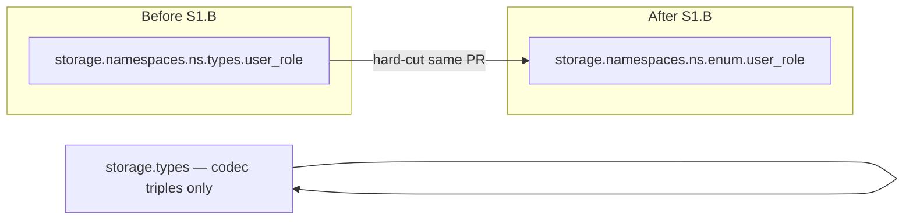

# Slice: enum-migration (S1.B)

Parent project [`projects/contract-ir-planes/`](../../); this slice satisfies **FR6** and **PDoD3** from the project spec — Postgres enum at `storage.<ns>.enum`, framework-shared `storage.<ns>.types` deleted as a load-bearing surface.

**Linear:** [TML-2623](https://linear.app/prisma-company/issue/TML-2623)

## Purpose

The parent project makes the contract IR target-extensible at the entity-kind level. S1.A landed the substrate — two-plane `Contract<{domain, storage}>`, `elementCoordinates(storage)`, and the pack-contributed entity-kind descriptor mechanism with Postgres registering `'postgres-enum'` — but enum entries still write to the legacy framework-shared `storage.namespaces.<ns>.types` slot.

This slice performs the **hard-cut migration** that proves the substrate works: Postgres enum moves to the pack-contributed `storage.<ns>.enum` slot (singular essence per ADR Decision 5), the framework-shared namespace `types` slot stops accepting enum entries and is deleted as load-bearing IR, and every in-tree contract carrying enum entries regenerates atomically in the same PR. **PDoD3 is satisfied when this slice merges.**

## At a glance

Postgres enum relocates from `storage.namespaces.<ns>.types.<name>` → `storage.namespaces.<ns>.enum.<name>`; framework and SQL-family packages shed hardcoded `'postgres-enum'` / `PostgresEnumStorageEntry` paths from the shared `types` slot; enum-bearing `contract.json` + `contract.d.ts` fixtures regen in the same PR.

## Scope

### In scope

**Slot migration (hard-cut, no deprecation shim).**

- Namespace-scoped enum entries land on **`enum`** (pack-contributed slot key), not **`types`**, in both on-disk JSON and IR class instances.
- **`storage.namespaces.<ns>.types`** is removed from SQL namespace typing, validator schema, serializer hydration, verifier walks, authoring lowering, and emitter codegen. Enum validation moves to the descriptor's `validatorSchema` fragment keyed on `'postgres-enum'`.
- **Document-scoped `storage.types`** (codec triples / codec aliases only) is **unchanged** — it never carried namespace enums in the canonical shape; the emitter's existing guard rejecting postgres-enum in document-scoped `storage.types` stays.

**Source surfaces (~15 files, per project plan D1).**

| Surface | Change |
|---|---|
| [`packages/2-sql/1-core/contract/src/ir/sql-storage.ts`](../../../../packages/2-sql/1-core/contract/src/ir/sql-storage.ts) | Drop `PostgresEnumStorageEntry` from namespace `types`; add `enum` slot on namespace input / payload |
| [`packages/2-sql/1-core/contract/src/validators.ts`](../../../../packages/2-sql/1-core/contract/src/validators.ts) | Remove hardcoded `PostgresEnumTypeSchema` from `createNamespaceEntrySchema`'s `'types?'` slot; compose `'enum?'` from descriptor fragments |
| [`packages/2-sql/9-family/src/core/ir/sql-contract-serializer-base.ts`](../../../../packages/2-sql/9-family/src/core/ir/sql-contract-serializer-base.ts) | Hydration slot loop reads/writes `enum` instead of `types` for pack-contributed entries; **[TML-2658](https://linear.app/prisma-company/issue/TML-2658) folded here** — explicit `'+': 'ignore'` + rationale comment on `NamespaceRawSchema` |
| [`packages/2-sql/9-family/src/core/schema-verify/verify-sql-schema.ts`](../../../../packages/2-sql/9-family/src/core/schema-verify/verify-sql-schema.ts) | `verifyEnumType` walks namespace `enum` slot; descriptor-driven where applicable |
| [`packages/2-sql/3-tooling/emitter/src/index.ts`](../../../../packages/2-sql/3-tooling/emitter/src/index.ts) | Replace hardcoded `kind: 'postgres-enum'` literal emission under `namespace.types` with descriptor-driven emission under `namespace.enum` |
| [`packages/2-sql/2-authoring/contract-ts/`](../../../../packages/2-sql/2-authoring/contract-ts/) + [`contract-psl/`](../../../../packages/2-sql/2-authoring/contract-psl/) | Lowering paths write enum entries to `enum` slot |
| [`packages/3-targets/3-targets/postgres/src/core/`](../../../../packages/3-targets/3-targets/postgres/src/core/) | Planner / serializer / migration paths that read namespace `types` for enums |
| Family-base error in `sql-contract-serializer-base.ts` | Generic descriptor-driven message replaces *"postgres-enum requires PostgresContractSerializer"* special-case |

**Fixture regeneration (atomic, same PR).**

- Live enum-bearing example contracts (confirmed: [`examples/prisma-next-demo`](../../../../examples/prisma-next-demo/), [`examples/prisma-next-cloudflare-worker`](../../../../examples/prisma-next-cloudflare-worker/)) — `contract.json` + `contract.d.ts`.
- Postgres target snapshot fixture [`packages/3-targets/3-targets/postgres/test/fixtures/snapshot-read-shapes/postgres-enum.json`](../../../../packages/3-targets/3-targets/postgres/test/fixtures/snapshot-read-shapes/postgres-enum.json).
- Any additional enum-bearing committed contracts discovered during execution (grep for `"kind": "postgres-enum"` under `examples/`, `test/fixtures/`, `packages/`).
- **`storageHash` and `profileHash` shift** for every regenerated contract — expected, not a defect.

**Verification gates.**

- PDoD3 grep gate: `rg "PostgresEnumStorageEntry|'postgres-enum'" packages/1-framework/ packages/2-sql/9-family/` returns zero matches (SQLite adapter imports of `PostgresEnumStorageEntry` for rejection spelling remain in `packages/3-targets/` per project non-goals).
- Migration-replay check against pre-#534 bookend contracts carrying **document-scoped** enum shape (`storage.types.<enum>`, not namespace-scoped) — A4 falsification probe (see edge cases).

**In-flight cleanup fold decisions.**

| Ticket | Decision | Rationale |
|---|---|---|
| [TML-2658](https://linear.app/prisma-company/issue/TML-2658) | **Fold into D1** (`family-sql` touch) | One-line `NamespaceRawSchema` `'+': 'ignore'` + comment; same file as enum slot hydration changes. Not a separate dispatch. |
| [TML-2654](https://linear.app/prisma-company/issue/TML-2654) | **Defer — standalone ticket** | Concerns `executeContractEmit` consuming `deserializeContract` output (CLI emit-pipeline cross-roads, all families). S1.B's emitter work is slot-key / descriptor-driven **codegen** in `@prisma-next/sql-emitter`, not the CLI pipeline wiring. Different code path; folding would expand slice scope beyond enum migration. |
| [TML-2634](https://linear.app/prisma-company/issue/TML-2634) | **Defer** | Plural → singular rename (`tables` → `table`, etc.); ~150 sites + mass fixture regen. Best after S1.B–S1.D close so rename is atomic. |
| [TML-2636](https://linear.app/prisma-company/issue/TML-2636) | **Defer** | Namespace `.entries` redirect; stacks on TML-2634. |
| [TML-2648](https://linear.app/prisma-company/issue/TML-2648) | **Defer** | SQLite `kind` materialization; no overlap with enum slot migration. |

### Out of scope (this slice)

- **Domain plane population** (`contract.domain.<ns>.…`) — S1.C.
- **Cross-reference object-pair encoding** — S1.C.
- **Deletion of subsumed helpers** (`findSqlTable`, `extractStorageElementNames`, etc.) — S1.D.
- **Plural slot rename** (`tables` → `table`) — TML-2634, deferred.
- **SQLite `PostgresEnumStorageEntry` import cleanup** — project non-goals (Tier 3 tolerated ugliness).
- **User-facing enum affordances** (typed value refs, `db.enums.X`, codec narrowing) — `postgres-enum-finishing` project.
- **Deprecation shim** for old `storage.namespaces.<ns>.types` enum entries — A6 confirmed; hard-cut only.
- **TML-2654 emit-pipeline fix** — standalone follow-up PR.
- **Two-plane `domain` content migration** — types exist from S1.A; population is S1.C.

## Approach

S1.A wired the descriptor mechanism but left enum entries on the legacy slot so substrate could land without fixture churn. S1.B completes the move in one atomic PR.

**Validator + IR typing.** `createNamespaceEntrySchema` drops the unconditional `'types?'` slot that hardcodes `PostgresEnumTypeSchema`. Enum entries validate through the Postgres pack's existing `validatorSchema` fragment (`PostgresEnumTypeSchema`, keyed by discriminator `'postgres-enum'`) on a new `'enum?'` slot. `SqlNamespacePayload` / `SqlNamespaceTablesInput` carry `enum` instead of namespace-scoped `types`. The document-scoped `storage.types` slot in `createSqlStorageSchema` is untouched.

**Serializer hydration.** The structural slot loop in `sql-contract-serializer-base.ts` already iterates undeclared entity-bearing properties and dispatches through the kind-keyed registry (S1.A D3). After this slice, enum JSON entries appear under `enum`, not `types`; hydration and serialization follow the property name. `NamespaceRawSchema` gains explicit `'+': 'ignore'` (TML-2658) so the intentional pass-through of slot maps is documented.

**Emitter codegen.** `@prisma-next/sql-emitter` stops generating `namespace.types.<name>: { kind: 'postgres-enum'; … }` and generates `namespace.enum.<name>: …` using the descriptor's discriminator for the `kind` literal. Document-scoped `storage.types` codegen path unchanged.

**Authoring lowering.** TS DSL and PSL interpreter paths that today attach `PostgresEnumType` instances under `namespace.types` attach under `namespace.enum` instead. Authoring still dispatches through `postgresAuthoringEntityTypes.enum` — only the storage envelope slot key changes.

**Fixtures.** `pnpm fixtures:emit` (or targeted emit) regenerates every contract carrying `"kind": "postgres-enum"`. Regen runs **after** source changes so emitted shape matches new slot. Bookend contracts with document-scoped enums are verified for migration replay (A4); regen only if replay fails.

## Edge cases (Example-Mapping)

| Edge case | Disposition | Notes |
|---|---|---|
| Enum entry still under `storage.namespaces.<ns>.types` after merge | **Handle** | Validator rejects; no read path accepts old slot. Grep gate confirms no framework/family references. |
| Enum entry incorrectly under document-scoped `storage.types` | **Handle** | Existing emitter error preserved; validator rejects on ingest. |
| Namespace with `enum` slot but empty map | **Handle** | Omitted key or `{}`; consistent with `tables` empty-namespace behaviour. |
| Namespace with both codec alias in document-scoped `storage.types` and enum in `namespace.enum` | **Handle** | Orthogonal slots; demo-style contracts exercise both. |
| Descriptor `discriminator: 'postgres-enum'` vs slot key `enum` | **Handle** | Discriminator keys hydration/validation registries; slot key is JSON envelope position per ADR Decision 5. Entry JSON still carries `"kind": "postgres-enum"`. |
| `elementCoordinates(storage)` walk over migrated contract | **Handle** | Structural walk yields `(plane: 'storage', ns, entityKind: 'enum', name)` — no special case needed (S1.A D3 walk is property-name-driven). |
| Fixture regen ordering (source vs emit) | **Handle** | Source + validator + serializer land first; fixture regen dispatch runs emit against new shape; `pnpm fixtures:check` is the gate. |
| `storageHash` / `profileHash` change on every enum-bearing contract | **Handle** | Expected breaking change; A6 confirms no external hash pins. |
| Migration replay against bookends with **document-scoped** `storage.types` enum (`examples/prisma-next-demo/migrations/app/*/end-contract.json`) | **Handle** (verify) / **Defer regen** if green | A4 working position: replay path accepts historical shape. If replay fails, absorb bookend regen in slice (extra dispatch) — do not split slice. |
| Migration replay rejects bookends → replay path needs refactor | **Defer** | Promote to own slice only if failure cascades beyond bookend regen (~0.5 day mitigation per project plan Risk #1). |
| SQLite adapter importing `PostgresEnumStorageEntry` for enum rejection | **Explicitly out** | Project non-goals; stays in `packages/3-targets/6-adapters/sqlite/`. |
| Mongo contracts / family | **Explicitly out** | No enum slot on Mongo; no fixture changes expected. |
| A6 falsified mid-flight (external consumer pins old shape) | **Defer** | Discussion-mode re-entry; split into deprecation-shim + hard-cut sub-slices (project plan Risk #2). Pre-flight: **A6 confirmed 2026-05-22 — proceed hard-cut.** |
| Accidentally deleting document-scoped `storage.types` | **Handle** | Out-of-scope guard: only namespace `types` enum slot removed; document-scoped codec triples slot stays in `createSqlStorageSchema`. |
| Emitter receives plain-literal namespace (missing `kind`) | **Defer** | TML-2654 territory; not load-bearing for enum slot migration if fixtures emit from updated pipeline. |
| Enum name collision with table name in same namespace | **Handle** | Distinct entity kinds (`enum` vs `tables` slots); coordinate tuple includes `entityKind`. |

## Slice Definition of Done

- [ ] **SDoD1.** All "Done when" gates from the slice plan pass: `pnpm typecheck`, `pnpm test:packages`, `pnpm test:integration`, `pnpm fixtures:check`, `pnpm lint:deps` clean.
- [ ] **SDoD2.** Every pre-named edge case handled per its disposition.
- [ ] **SDoD3.** Reviewer verdict: accept (PR review surface).
- [ ] **SDoD4.** Manual-QA: **N/A** — no user-observable authoring or runtime API change; users still author `enum { … }` / `helpers.enum({…})`. Structural IR / emitted contract shape change only. Hash shifts are invisible at the DSL surface.
- [ ] **SDoD5.** Slice doesn't touch surfaces listed as out-of-scope (domain plane population, cross-ref encoding, subsumed helper deletion, TML-2654 pipeline, plural rename).
- [ ] **SDoD6 — PDoD3 satisfied.** Postgres enum emitted at `contract.storage.namespaces.<ns>.enum.<name>`. Framework-shared namespace `types` slot no longer accepts enum entries. `rg "PostgresEnumStorageEntry|'postgres-enum'" packages/1-framework/ packages/2-sql/9-family/` returns zero matches. `'postgres-enum'` hits confined to `packages/3-targets/3-targets/postgres/**`, `packages/3-targets/6-adapters/postgres/**`, and test fixtures exercising the kind.
- [ ] **SDoD7 — TML-2658 closed.** `NamespaceRawSchema` carries explicit `'+': 'ignore'` + comment (folded, not separate PR).
- [ ] **SDoD8 — Migration replay.** Pre-#534 bookend contracts with document-scoped enums replay successfully OR bookends regenerated with documented rationale if A4 falsified.

## Constraints + Assumptions

**Inherited from parent project (load-bearing for this slice).**

- **A1.** `AuthoringContributions.entityTypes` descriptor surface carries serializer hydration + validator schema — confirmed by S1.A.
- **A4.** Pre-#534 migration bookends with document-scoped `storage.types` enums replay without shape upgrade. **Falsification trigger:** migration-replay test failure in fixture-regen dispatch → bookend regen absorbed in slice.
- **A6 — CONFIRMED 2026-05-22 (operator).** No external `@prisma-next/*` consumer pins `contract.json` shape or `storageHash` literals; no off-repo EA tooling depends on `storage.namespaces.*.types` surviving the npm minor. **Hard-cut path greenlit** — no deprecation-shim sub-slice.

**Slice-specific assumptions.**

- **B1.** S1.A substrate is merged on the slice branch base (`origin/main` includes TML-2622 / PR for substrate). Enum migration consumes descriptor registration already present in [`packages/3-targets/3-targets/postgres/src/core/authoring.ts`](../../../../packages/3-targets/3-targets/postgres/src/core/authoring.ts).
- **B2.** Slot key is **`enum`** (essence + singular), settled in S1.A / ADR Decision 5 — not revisited in this slice.
- **B3.** Only **two** live example contracts currently carry namespace-scoped postgres-enum entries (demo, cloudflare-worker); audit may surface additional committed fixtures during execution — all regen in same PR.
- **B4.** Hard-cut means **no** dual-write, **no** read-fallback from `types` to `enum`, **no** upgrade skill for the slot rename (in-tree migration only; external upgrade instructions land at project close-out per ADR Migration section).

## Per-dispatch DoR overlay

Project plan Risk #5 mitigation: **every dispatch brief assembled within this slice must answer (a) and (b) before locking decisions.**

- **(a)** For every field in any public surface this dispatch touches, what does it add that an existing field doesn't already say?
- **(b)** For every framework-layer data structure that encodes target/family identity, what enforcement does it provide that contract hydration / validation doesn't already structurally provide?

**Spec-level answers for surfaces this slice already knows it touches** (dispatch briefs may refine; must not contradict):

| Surface | (a) — non-redundancy | (b) — enforcement beyond hydration/validation |
|---|---|---|
| **`NamespaceRawSchema` `'+': 'ignore'`** (TML-2658) | Documents intentional deviation from the validators.ts `'+': 'reject'` convention; does not add a new field. | N/A — schema directive, not an identity-encoding structure. |
| **Namespace slot key `enum` vs legacy `types`** | `enum` names the entity kind (essence + singular); `types` was a framework-shared polymorphic grab-bag mixing enum + misnamed concern. Replacing, not duplicating. | Slot key is envelope position; identity for validation/hydration is the entry's `kind` discriminator via descriptor registry — no parallel `storageSlotKey` field (S1.A D3 retirement). |
| **Descriptor `discriminator: 'postgres-enum'`** | Keys hydration registry + validator fragment composition; distinct from slot key `enum` which keys JSON property name. | Registry keyed on discriminator is necessary because JSON envelopes carry `kind` literal before class hydration; structural namespace shape alone cannot distinguish postgres-enum entries from future pack kinds in the same slot. |
| **Removing `PostgresEnumTypeSchema` from `createNamespaceEntrySchema`'s hardcoded `'types?'`** | Eliminates duplicate validation path; enum validation lives only on `'enum?'` via descriptor fragment. | Hardcoded `'types?'` slot was framework encoding Postgres identity — deletion removes redundant framework-layer target naming. |
| **Emitter `kind: 'postgres-enum'` literal under `namespace.enum`** | Moves literal emission to consume descriptor discriminator (single source); property path changes from `.types` to `.enum`. | Emitter codegen is type emission, not runtime enforcement; no new identity table. |
| **`verifyEnumType` walk target** | Changes which namespace property is iterated; verification logic unchanged. | Verifier consumes hydrated IR; does not add parallel identity encoding. |

Briefs that cannot answer (a) or (b) satisfactorily for a proposed new field or registry **must not lock** — escalate via design discussion (I12).

## Open Questions

1. **Exact fixture inventory.** Working position: grep-driven at execution start (`"kind": "postgres-enum"` across `examples/`, `test/fixtures/`, `packages/`); regen all hits. Plan's "4 contract.json" audit may be stale vs current tree (2 live examples confirmed).
2. **Bookend regen vs replay-only.** Working position: replay-first per A4; regen bookends only on falsification. Document outcome in PR body.
3. **`types?` key removal vs empty-never typed.** Working position: delete namespace `types` from schema and IR types entirely (not `Record<string, never>` stub) — hard-cut, nothing belongs there after enum leaves.

## References

- Parent project spec: [`projects/contract-ir-planes/spec.md`](../../spec.md)
- Parent project plan (S1.B entry): [`projects/contract-ir-planes/plan.md`](../../plan.md) (lines 42–67)
- ADR: [`projects/contract-ir-planes/adrs/0001-contract-planes.md`](../../adrs/0001-contract-planes.md) — Decision 5 (slot naming, descriptor mechanism)
- **Linear:** [TML-2623](https://linear.app/prisma-company/issue/TML-2623) (this slice); [TML-2584](https://linear.app/prisma-company/issue/TML-2584) (parent project)
- **Predecessor slice:** [TML-2622](https://linear.app/prisma-company/issue/TML-2622) (S1.A substrate) — descriptor mechanism, `elementCoordinates(storage)`, narrowed `Namespace`, two-plane `Contract` shape
- **Folded cleanup:** [TML-2658](https://linear.app/prisma-company/issue/TML-2658)
- **Deferred cleanup:** [TML-2654](https://linear.app/prisma-company/issue/TML-2654), [TML-2634](https://linear.app/prisma-company/issue/TML-2634), [TML-2636](https://linear.app/prisma-company/issue/TML-2636), [TML-2648](https://linear.app/prisma-company/issue/TML-2648)
- **S1.A landings (starting codebase state):**
  - [`packages/1-framework/1-core/framework-components/src/ir/`](../../../../packages/1-framework/1-core/framework-components/src/ir/) — `elementCoordinates`, narrowed `Namespace`
  - [`packages/2-sql/9-family/src/core/ir/sql-contract-serializer-base.ts`](../../../../packages/2-sql/9-family/src/core/ir/sql-contract-serializer-base.ts) — structural slot hydration loop
  - [`packages/3-targets/3-targets/postgres/src/core/authoring.ts`](../../../../packages/3-targets/3-targets/postgres/src/core/authoring.ts) — `'postgres-enum'` descriptor registration
- **Risk #5 / retro:** [`drive/retro/findings.md`](../../../../drive/retro/findings.md) (2026-05-21 entry — surface-then-retire cycle)
