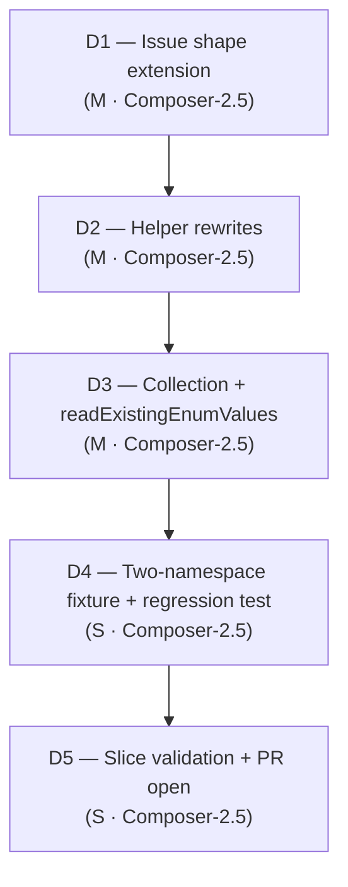

# Slice Plan: namespace-aware-enum-planning (S1.E)

**Slice spec:** [`./spec.md`](./spec.md)
**Parent plan:** [`projects/contract-ir-planes/plan.md`](../../plan.md) § S1.E
**Linear:** [TML-2686](https://linear.app/prisma-company/issue/TML-2686)

## At a glance

Five dispatches, strictly sequential, one PR. **D1** extends the framework `SchemaIssue` shape: `EnumValuesChangedIssue` gains required `namespaceId`, and the verifier paths producing `type_missing` / `type_values_mismatch` for enum subjects always populate the existing optional `BaseSchemaIssue.namespaceId`. **D2** rewrites `locateNamespaceType` + `locateNamespaceTypeInStorage` to take `(namespaceId, typeName)` and threads the namespace coordinate through their three callsites. **D3** rewrites `collectPostgresEnumTypes` to return a compound-keyed map, updates `nativeEnumPlanCallStrategy`'s loop + `enumRebuildCallRecipe`, and folds the `(schemaName, nativeType)` keying into `readExistingEnumValues`. **D4** adds the two-namespace-same-name test fixture exercising introduce + rebuild + add-values paths under collision, plus the pre-fix regression assertion. **D5** runs the slice validation gate and prepares the PR. D1 lands before D2/D3 because issue-matching in D3's `nativeEnumPlanCallStrategy` depends on `issue.namespaceId` being populated.

## Dispatch plan

### Dispatch 1: Substrate — `SchemaIssue` carries `namespaceId` on enum-related kinds

**Intent.** Extend `EnumValuesChangedIssue` with required `namespaceId: string`. Audit every verifier-side issue construction site producing `type_missing` / `type_values_mismatch` for enum subjects and populate the existing optional `BaseSchemaIssue.namespaceId`. The `BaseSchemaIssue` field stays optional in the type signature (other kinds — `extra_table` for a live-DB-only table — legitimately have no namespace) but the verifier contract for enum-related kinds becomes *"always populated."* No planner-side consumer changes in this dispatch; consumers continue to work because the value-changed issue's `namespaceId` is unused until D2/D3 land the compound-key matching.

What stays the same: `BaseSchemaIssue` shape (already carries optional `namespaceId`); non-enum issue kinds; verifier output for single-namespace contracts (the field is populated but the planner doesn't yet read it). No on-disk format change. No fixture regen (Issue payloads aren't byte-stable goldens unless an integration test snapshots them — verify at brief assembly).

**Files in play.** Grounded on grep against `BaseSchemaIssue|EnumValuesChangedIssue|enum_values_changed|type_missing|type_values_mismatch` at brief assembly:

| Surface | Paths |
|---|---|
| Framework issue types | [`packages/1-framework/1-core/framework-components/src/control/control-result-types.ts`](../../../../packages/1-framework/1-core/framework-components/src/control/control-result-types.ts) |
| Verifier issue construction (enum-related) | [`packages/2-sql/9-family/src/core/schema-verify/verify-sql-schema.ts`](../../../../packages/2-sql/9-family/src/core/schema-verify/verify-sql-schema.ts) — grep for `EnumValuesChangedIssue`, `type_missing`, `type_values_mismatch` |
| Verifier tests | [`packages/2-sql/9-family/test/schema-verify.storage-types.test.ts`](../../../../packages/2-sql/9-family/test/schema-verify.storage-types.test.ts) — update assertions to include `namespaceId` |
| Mongo family (verify no enum-related sites) | [`packages/2-mongo-family/9-family/src/core/schema-diff.ts`](../../../../packages/2-mongo-family/9-family/src/core/schema-diff.ts) — Mongo has no enum slot; touch only if grep surfaces enum-related issue construction |

**Done when.**

- [ ] Pre-flight grep inventory recorded: `rg -l 'EnumValuesChangedIssue|enum_values_changed' packages/ --glob '!**/dist/**' --glob '!**/*.json'` (file list is the scope contract)
- [ ] `EnumValuesChangedIssue` declaration carries `readonly namespaceId: string`
- [ ] Every verifier-side construction of `EnumValuesChangedIssue` populates `namespaceId`
- [ ] Every verifier-side construction of `BaseSchemaIssue` with `kind: 'type_missing' | 'type_values_mismatch'` for an enum subject populates `namespaceId` (audit via grep; ad-hoc smoke-revert in review)
- [ ] `pnpm --filter @prisma-next/framework-components build` then `pnpm --filter @prisma-next/family-sql build` (refresh `dist/*.d.mts` before downstream typecheck)
- [ ] `pnpm typecheck` clean
- [ ] `pnpm test:packages` green — verifier tests updated to assert `namespaceId` presence on enum-related issues
- [ ] `pnpm lint:deps` clean
- [ ] Intent-validation: `rg 'new EnumValuesChangedIssue|kind: .enum_values_changed.' packages/ --glob '!**/dist/**'` — every match has a `namespaceId` field on the constructed object (visual audit; codify as a test if cheap)
- [ ] Edge case covered: single-namespace contract — verifier still produces issues with populated `namespaceId`; no regression in existing tests
- [ ] **Explicit non-gate:** `pnpm test:integration` is allowed to fail if existing Postgres planner tests snapshot Issue payloads — D1 surfaces the goldens shift; D4 (or earlier if cheap) regenerates. Do not treat as D1 rework unless the failure shape is structural (not snapshot drift).

**Size.** M. ~3–6 files; one settled design judgment (required vs optional on the new field — required, per spec § Open Questions #1). **Re-decomposition trigger:** if verifier construction surfaces > 10 sites across packages (unlikely; enum-related issues are localised to the SQL family verifier), halt and split D1a (type extension) + D1b (verifier population).

**Model tier.** Composer-2.5 (`composer-2.5-fast`). Per [`drive/calibration/model-tier.md`](../../../../drive/calibration/model-tier.md): mechanical type extension + verifier audit with a settled brief; design is pinned in spec § Approach. **Escalate to Opus** (`claude-opus-4-7-thinking-high`) if: (a) verifier audit surfaces ambiguity about whether a given issue is "enum-related" (e.g., `type_mismatch` issues that sometimes target enums); (b) the population of `BaseSchemaIssue.namespaceId` requires deriving the namespace by name lookup (F6 — should be in scope at construction time per the field's contract).

**Pre-dispatch DoR.**

- [x] Intent statement clear (extend issue shape; populate at every enum-related construction site)
- [x] Files in play named (table + grep pre-flight)
- [x] "Done when" gates explicit (build cascade, typecheck, test:packages, lint:deps, intent-validation greps)
- [x] Predicted size M
- [x] Failure modes considered: **F3** (grep inventory first), **F5** (destructive git forbidden), **F6** (no new redundant field — `BaseSchemaIssue.namespaceId` already exists; D1 tightens its population contract, not adds a parallel field)
- [x] Edge cases mapped (single-namespace regression; `type_missing` vs `enum_values_changed` distinction)
- [x] No silent design decisions: required-on-`EnumValuesChangedIssue` per spec § Open Questions #1

**Refusal triggers** (halt dispatch; report to orchestrator — do not workaround):

- Implementer proposes adding `namespaceId` as a parallel field on a new sub-union member instead of extending `EnumValuesChangedIssue` directly (F6 — surface-then-retire risk)
- Implementer adds a verifier-side name-lookup helper to derive `namespaceId` after the fact (F6 — coordinate must come from construction-site scope per `BaseSchemaIssue` field contract)
- Integration test snapshot drift cascades into >3 source files of fixture regen (re-decomposition signal; defer regen to D4)

**Brief overlay** (when `drive-build-workflow` assembles the brief):

- MUST forbid destructive git operations per F5
- MUST require grep pre-flight before edits (F3)
- MUST forbid F1 patterns: `normalize*Issue*`, `attachNamespaceLater`, `deriveNamespaceFromTypeName`
- MUST walk Risk #5 (a)+(b) for the `EnumValuesChangedIssue.namespaceId` addition — answers in spec § Per-dispatch DoR overlay
- MUST state: do not change `BaseSchemaIssue.namespaceId` from optional to required (other kinds legitimately have no namespace); tighten the *contract* at construction sites, not the type signature

---

### Dispatch 2: Helper rewrites — `locateNamespaceType` + `locateNamespaceTypeInStorage` namespace-aware

**Intent.** Rewrite the two name-only-keyed namespace-type lookup helpers to take `(namespaceId, typeName)` and read the named namespace's `enum` slot directly. Thread the namespace coordinate through their three callsites: `planner-strategies.ts:375` (`enumRebuildCallRecipe`), `planner-strategies.ts:454` (top of `nativeEnumPlanCallStrategy` loop — partial; `collectPostgresEnumTypes` change is D3), `issue-planner.ts:603`. Caller-side: each callsite has `issue.namespaceId` or the outer loop's namespace coordinate already in scope (D1 substrate guarantees the issue field).

**Column→enum reference resolution (spec OQ#2, resolved 2026-05-27 by the S1.C pre-audit).** D2 also narrows the column→enum reference filter at `planner-strategies.ts:384–394` (`enumRebuildCallRecipe`) by namespace; identified by the S1.C pre-audit (see [S1.E spec OQ#2](../spec.md#open-questions)). The walk's `column.typeRef === typeName` bare-string match becomes `column.typeRef === typeName && nsId === sourceNamespaceId`. `column.typeRef` stays a bare string — S1.C does not change column-level type-reference encoding — so the narrowing happens inside the helper using the source enum's namespace coordinate threaded by `locateNamespaceType` / the outer recipe call (`enumRebuildCallRecipe` takes `(namespaceId, typeName, ctx)` after this dispatch, see D3 fold).

What stays the same: `collectPostgresEnumTypes` shape (D3). The `nativeEnumPlanCallStrategy` outer loop iteration variable (D3). All non-enum planner strategies. `readExistingEnumValues` (D3 fold).

**Files in play.**

| Surface | Paths |
|---|---|
| Helper rewrites | [`packages/3-targets/3-targets/postgres/src/core/migrations/planner-strategies.ts`](../../../../packages/3-targets/3-targets/postgres/src/core/migrations/planner-strategies.ts) (`locateNamespaceType` lines 131–141), [`issue-planner.ts`](../../../../packages/3-targets/3-targets/postgres/src/core/migrations/issue-planner.ts) (`locateNamespaceTypeInStorage` lines 66+) |
| Callsites | `planner-strategies.ts:375` (`enumRebuildCallRecipe`), `issue-planner.ts:603` (grep at brief time for exact call signature) |
| Column-ref resolution (confirmed in-scope by S1.C pre-audit) | [`planner-strategies.ts`](../../../../packages/3-targets/3-targets/postgres/src/core/migrations/planner-strategies.ts) `enumRebuildCallRecipe` column-ref walk (lines 384–394) — narrow `column.typeRef === typeName` by namespace using the source enum's namespace coordinate (S1.C does not change column.typeRef encoding; spec OQ#2 resolved) |
| Tests | [`packages/3-targets/3-targets/postgres/test/migrations/issue-planner.test.ts`](../../../../packages/3-targets/3-targets/postgres/test/migrations/issue-planner.test.ts), planner-strategy tests in the same folder |

**Done when.**

- [ ] Pre-flight grep: `rg -n 'locateNamespaceType|locateNamespaceTypeInStorage' packages/3-targets/3-targets/postgres/` — callsite inventory matches the three known sites; any surprises added to the scope before edits
- [ ] `locateNamespaceType` signature is `(storage, namespaceId, typeName)`; body reads `storage.namespaces[namespaceId]?.enum?.[typeName]` directly — no `Object.values(storage.namespaces)` loop
- [ ] `locateNamespaceTypeInStorage` signature mirrors the change
- [ ] Each of the three callsites passes `namespaceId` from the caller's in-scope coordinate (`issue.namespaceId` after D1; outer loop variable in `nativeEnumPlanCallStrategy`'s partial update)
- [ ] Column-ref walk in `enumRebuildCallRecipe` (lines 384–394): narrowed by namespace explicitly — `column.typeRef === typeName && nsId === sourceNamespaceId` (spec OQ#2 resolved by S1.C pre-audit; `column.typeRef` stays a bare string)
- [ ] `pnpm --filter @prisma-next/target-postgres build`
- [ ] `pnpm typecheck` clean
- [ ] `pnpm test:packages` green (postgres target tests)
- [ ] `pnpm test:integration` green — Postgres enum hydration / planning path is the load-bearing exemplar
- [ ] `pnpm lint:deps` clean
- [ ] Intent-validation: `rg 'for \(const ns of Object\.values\(storage\.namespaces\)\)' packages/3-targets/3-targets/postgres/src/core/migrations/` — no matches in the enum-lookup helpers (`collectPostgresEnumTypes` may still have one until D3)
- [ ] Edge cases covered: single-namespace contract still resolves correctly (regression test); issue with `namespaceId === undefined` (shouldn't happen post-D1 for enum-related kinds; defensive behaviour — assert at helper boundary if cheap)

**Size.** M. ~3–5 files; spec OQ#2 settled by the S1.C pre-audit — column-ref narrowing absorbed as one filter clause in `enumRebuildCallRecipe` (no sizing change; the file count and LoC delta are well under the M-cap). **Re-decomposition trigger:** if the column-ref narrowing surfaces an unexpected schema-IR cascade (the outer-loop coordinate isn't actually in scope at the recipe entry), halt and split D2a (helper signatures) + D2b (column-ref narrowing).

**Model tier.** Composer-2.5 (`composer-2.5-fast`). Mechanical signature change + callsite threading + bare column-ref filter narrowing. **Escalate to Opus** if the column-ref narrowing surfaces unexpected schema-IR cascade or if `nsId` isn't actually in scope at `enumRebuildCallRecipe` entry (would require deeper recipe restructure than the spec OQ#2 resolution assumes).

**Pre-dispatch DoR.**

- [x] Intent clear (signature change + callsite threading + column-ref narrowing — spec OQ#2 resolved 2026-05-27 by the S1.C pre-audit, in-helper narrowing only)
- [x] Files in play named
- [x] "Done when" gates explicit
- [x] Predicted size M
- [x] Failure modes: **F1** (no cross-namespace fallback / dual-lookup), **F3** (grep inventory first), **F5**, **F6** (no new lookup registry — direct read-by-coordinate)
- [x] Edge cases mapped (single-namespace regression; column-ref encoding open question)
- [x] D1 committed on branch before D2 starts

**Refusal triggers:**

- Implementer adds a name→namespace lookup helper to "find which namespace the type belongs to" instead of taking the coordinate from caller scope (F6)
- Column-ref narrowing surfaces a missing namespace coordinate at `enumRebuildCallRecipe` entry (recipe takes `(typeName, ctx)` today; S1.E D2 + D3 thread `namespaceId` — if `nsId` still isn't in scope at the column-ref walk after the helper rewrites, halt and re-plan the threading)
- `pnpm test:integration` regresses on single-namespace Postgres enum hydration — halt; the regression test is the bar
- Implementer introduces a `types?.[typeName] ?? enum?.[typeName]` coalescing pattern (F1 dual-shape under new name)

**Brief overlay:**

- MUST forbid destructive git operations per F5
- MUST run grep pre-flight for callsite inventory
- MUST forbid F1 patterns: cross-namespace fallback, dual-lookup coalescing
- MUST name spec OQ#2 as **resolved 2026-05-27 by the S1.C pre-audit** (link [spec OQ#2](./spec.md#open-questions)); the brief carries the planned filter shape (`column.typeRef === typeName && nsId === sourceNamespaceId`) and confirms `nsId` is in scope at the recipe entry (it will be, post-D2 / D3 helper rewrites threading `namespaceId`)
- MUST name downstream `pnpm build` order (target-postgres only)

---

### Dispatch 3: Collection rewrite + strategy loop + `readExistingEnumValues` fold

**Intent.** Rewrite `collectPostgresEnumTypes` to return a compound-keyed map (`Map<string, PostgresEnumType>` keyed by serialised `${namespaceId}\u0000${typeName}` — implementation choice settled in brief per spec § Constraints + Assumptions B4; alternative tuple-keyed map acceptable if readability wins). Update `nativeEnumPlanCallStrategy`'s outer loop to iterate compound-keyed entries; `handledTypeNames` / `introducedTypeNames` / `rebuiltTypeNames` become compound-key sets. Update `enumRebuildCallRecipe` to take `(namespaceId, typeName, ctx)`. Fold the `readExistingEnumValues` keying change: lookup against the live Postgres schema becomes `(schemaName, nativeType)`-keyed; two namespaces sharing a `nativeType` resolve to distinct types.

Issue-matching: the `handledTypeNames.has(issue.typeName)` filter inside `nativeEnumPlanCallStrategy` becomes `handledKeys.has(compoundKey(issue.namespaceId, issue.typeName))` — depends on D1's substrate guarantee that enum-related issues carry `namespaceId`.

What stays the same: `nativeEnumPlanCallStrategy`'s outer-shape behaviour (introduce / unchanged / add_values / rebuild branches); `CreateEnumTypeCall` / `AddEnumValuesCall` / `DropEnumTypeCall` / `RenameTypeCall` constructors; the DDL sequencing bucket assignment (`dep` for non-rebuild creates).

**Files in play.**

| Surface | Paths |
|---|---|
| Collection helper | [`planner-strategies.ts`](../../../../packages/3-targets/3-targets/postgres/src/core/migrations/planner-strategies.ts) `collectPostgresEnumTypes` (lines 541–553) |
| Strategy loop | [`planner-strategies.ts`](../../../../packages/3-targets/3-targets/postgres/src/core/migrations/planner-strategies.ts) `nativeEnumPlanCallStrategy` (line 453+) |
| Recipe | [`planner-strategies.ts`](../../../../packages/3-targets/3-targets/postgres/src/core/migrations/planner-strategies.ts) `enumRebuildCallRecipe` (lines 371–415) |
| Schema-IR lookup | `readExistingEnumValues` callsite at [`planner-strategies.ts:467`](../../../../packages/3-targets/3-targets/postgres/src/core/migrations/planner-strategies.ts); function definition — grep `readExistingEnumValues` at brief time; likely in [`packages/3-targets/3-targets/postgres/src/core/`](../../../../packages/3-targets/3-targets/postgres/src/core/) or [`packages/2-sql/9-family/`](../../../../packages/2-sql/9-family/) |
| Tests | [`packages/3-targets/3-targets/postgres/test/migrations/`](../../../../packages/3-targets/3-targets/postgres/test/migrations/) — planner-strategy tests; assertions on compound-key membership |

**Done when.**

- [ ] Pre-flight grep: `rg -n 'collectPostgresEnumTypes|readExistingEnumValues|handledTypeNames|introducedTypeNames|rebuiltTypeNames' packages/3-targets/3-targets/postgres/`
- [ ] `collectPostgresEnumTypes` return type is a compound-keyed map (string `${namespaceId}\u0000${typeName}` or `Map<{namespaceId, typeName}, …>` — implementer's choice with brief-time rationale)
- [ ] `nativeEnumPlanCallStrategy` outer loop iterates compound entries; `handledKeys` / `introducedKeys` / `rebuiltKeys` are compound-key sets
- [ ] `enumRebuildCallRecipe` signature is `(namespaceId, typeName, ctx)`; resolves DDL schema via `resolveDdlSchemaForNamespace(ctx, namespaceId)` once at entry
- [ ] `readExistingEnumValues` keyed by `(schemaName, nativeType)` — two namespaces sharing a `nativeType` resolve distinctly
- [ ] Issue-matching filter uses compound key: `handledKeys.has(compoundKey(issue.namespaceId, issue.typeName))` (or equivalent depending on key shape)
- [ ] `pnpm --filter @prisma-next/target-postgres build`
- [ ] `pnpm typecheck` clean
- [ ] `pnpm test:packages` + `pnpm test:integration` green
- [ ] `pnpm lint:deps` clean
- [ ] Intent-validation: `rg 'Map<string,\s*PostgresEnumType' packages/3-targets/3-targets/postgres/` — zero matches **of the bare-name-keyed shape** (annotated comments OK if grep is too coarse; verify by reading the helper)
- [ ] Intent-validation: `rg 'new Set<string>\(\)' packages/3-targets/3-targets/postgres/src/core/migrations/planner-strategies.ts` — review hits in the strategy; bare-typeName sets retired
- [ ] Edge cases covered: introduce (two same-name, different values → two `CreateEnumTypeCall`); rebuild (one same-name conflicts); add-values (additive on one of the two); same-`nativeType` collision via `readExistingEnumValues`; drop scenario (enum removed from one namespace, retained in the other)
- [ ] **Explicit non-gate:** SDoD6 functional gate (two distinct `CreateEnumTypeCall` from two-namespace fixture) — assertion lives in D4's fixture test; D3's tests can include a smoke-level assertion but the binding test is D4

**Size.** M. ~2–4 files; one design judgment (compound-key shape — string vs tuple). **Re-decomposition trigger:** if `readExistingEnumValues` keying change cascades into the schema-IR provider (live-DB reflection layer), halt and split D3a (planner-side compound key) + D3b (schema-IR keying).

**Model tier.** Composer-2.5 (`composer-2.5-fast`). Mechanical map-shape change + loop rewrites. **Escalate to Opus** if compound-key membership logic introduces subtle issue-matching bugs the brief can't pre-specify (e.g., `enum_values_changed` issue carrying `namespaceId` but `typeName` differs after the rebuild rename — verify the issue lifecycle in brief).

**Pre-dispatch DoR.**

- [x] Intent clear (compound-key collection + strategy loop + `readExistingEnumValues` fold)
- [x] Files in play named
- [x] "Done when" gates explicit
- [x] Predicted size M
- [x] Failure modes: **F1** (no dual-keyed map kept "for safety"), **F3** (grep inventory first), **F5**, **F6** (no new framework-level registry; compound key is a local Map shape)
- [x] Edge cases mapped (introduce / rebuild / add-values / drop / same-`nativeType` / single-namespace regression)
- [x] D1 + D2 committed on branch before D3 starts

**Refusal triggers:**

- Implementer keeps `Map<string, PostgresEnumType>` and adds a second `Map<string, PostgresEnumType>` keyed by `${namespaceId}\u0000${typeName}` (F1 / F6 — two maps where one suffices)
- `readExistingEnumValues` keying change requires schema-IR provider refactor beyond a signature update — halt; route to D3b
- Issue-matching filter regression: existing single-namespace tests fail because compound key requires `issue.namespaceId` and a test fixture's issue carries `undefined` — surface as D1 contract violation, halt
- Implementer introduces a `'\u0001'` separator instead of `'\u0000'` without rationale (style consistency — pick one and document)

**Brief overlay:**

- MUST forbid destructive git operations per F5
- MUST run grep pre-flight
- MUST forbid F1 patterns: dual-keyed maps, fallback lookups
- MUST settle compound-key implementation choice (string vs tuple) in the brief with one-sentence rationale
- MUST walk `readExistingEnumValues` callgraph at brief time to confirm the fold is in-scope (signature + callsite only) — if it implicates the schema-IR provider, defer per refusal trigger

---

### Dispatch 4: Two-namespace-same-name fixture + regression test

**Intent.** Add a test fixture (contract literal or test-time builder) exercising two namespaces with the same enum name across the three planner paths: introduce (create new enum), rebuild (values diverge), add-values (additive). Assertions: two distinct `CreateEnumTypeCall` instances per planner run; namespace-correct issue assignment; compound-key membership in the strategy's handled-keys set. Add a pre-fix regression test (snapshot or assertion) demonstrably red against the pre-D1 codebase and green after. Regen any Issue-payload-snapshotting test goldens that drifted post-D1 (deferred from D1's non-gate).

What stays the same: no production source edits unless test surfaces a real bug missed by D1–D3 (≤ 3 files absorbed; else halt per refusal trigger).

**Files in play.**

| Surface | Paths |
|---|---|
| New test fixture | [`packages/3-targets/3-targets/postgres/test/migrations/`](../../../../packages/3-targets/3-targets/postgres/test/migrations/) — new file (`enum-collision.test.ts` or similar; final name at brief time per `omit-should-in-tests` + matching existing test naming) |
| Pre-fix regression test | Same folder; either inline in the collision test or a separate file documenting the smoke-revert behaviour |
| Issue-payload goldens (conditional) | Grep at dispatch start: `rg -l "'enum_values_changed'" packages/ test/ examples/ --glob '*.json' --glob '*.snap'` — regen with `namespaceId` field if any goldens snapshot the issue payload |

**Done when.**

- [ ] Pre-flight grep for Issue-payload goldens: `rg -l '"kind":\s*"enum_values_changed"' packages/ test/ examples/ --glob '*.json' --glob '*.snap'` — inventory committed in dispatch notes; regen with `namespaceId` if any hits
- [ ] New test fixture exercises three paths (introduce, rebuild, add-values) under two-namespace-same-name collision
- [ ] Assertions:
  - [ ] Two distinct `CreateEnumTypeCall` instances when planning introduce against an empty database (SDoD6 binding)
  - [ ] Each call's `schemaName` corresponds to its source namespace's DDL schema
  - [ ] Same-`nativeType` collision resolves distinctly via `readExistingEnumValues` (D3 fold coverage)
  - [ ] Drop scenario: enum removed from one namespace, retained in other → `DropEnumTypeCall` scoped to correct schema
  - [ ] **Cross-namespace column→enum binding** (spec OQ#2 resolved coverage): fixture carries `audit.log_entry.priority.typeRef = 'Status'` alongside `public.post.status.typeRef = 'Status'` where `audit.Status` and `public.Status` are distinct enums with different values; rebuild on `audit.Status` migrates only the `audit.log_entry.priority` column, leaves `public.post.status` untouched (assert `AlterColumnTypeCall` count + per-call `schemaName`)
- [ ] Pre-fix regression test: described in test-name as the collision scenario; assertion targets compound-key membership or `CreateEnumTypeCall` count (not opaque snapshot blob — SDoD8 verifiability constraint)
- [ ] Issue-payload goldens regenerated (if any); diff is shape-only (`+ namespaceId`), not content-shift
- [ ] `pnpm typecheck` clean
- [ ] `pnpm test:packages` + `pnpm test:integration` green
- [ ] `pnpm fixtures:check` clean
- [ ] `pnpm lint:deps` clean
- [ ] Edge cases covered: introduce / rebuild / add-values / drop / same-`nativeType` / single-namespace regression (negative — existing tests are the negative bar)

**Size.** S. One new test file + conditional goldens regen. **Re-decomposition trigger:** if writing the test fixture surfaces a real bug not caught by D1–D3 requiring > 3 source-file fixes, halt — that's a D2/D3 rework, not S1.E expansion.

**Model tier.** Composer-2.5 (`composer-2.5-fast`). Test authoring with a fully-specified scenario. **Escalate to Opus** if the fixture exposes design ambiguity (e.g., column-ref encoding in the cross-namespace column→enum case behaves unexpectedly — open question #2 fallout).

**Pre-dispatch DoR.**

- [x] Intent clear (fixture + regression test; goldens regen if needed)
- [x] Files in play named (new fixture + grep-driven goldens inventory)
- [x] "Done when" gates explicit (three-path assertion list; SDoD6/SDoD8 binding)
- [x] Predicted size S
- [x] Failure modes: **F3** (grep goldens first), **F5**, **F7** (if test surfaces real bug → halt, route to D2/D3, don't workaround in fixture)
- [x] Edge cases mapped (#1, #2, #3, #6, #7 from spec table)
- [x] D1 + D2 + D3 committed on branch before D4 starts

**Refusal triggers:**

- Test surfaces a real bug requiring > 3 source-file fixes — halt; route to D2/D3 rework
- Implementer relaxes assertion shape from binding (compound-key membership, `CreateEnumTypeCall` count) to opaque snapshot — SDoD8 verifiability gate must hold
- Goldens diff shows content drift beyond `+ namespaceId` shape change — investigate; do not blindly accept regen

**Brief overlay:**

- MUST forbid destructive git operations per F5
- MUST run goldens grep as step 1
- MUST require pre-fix regression test phrased verifiably (test name + assertion target — no opaque snapshots as SDoD8 evidence)
- MUST follow `omit-should-in-tests` test-naming convention

---

### Dispatch 5: Slice validation + PR open

**Intent.** Close the slice with the full validation gate, SDoD audit, and PR open. No implementation changes unless grep finds a straggler (fix ≤ 2 files → absorb; else halt and open D2/D3 follow-up).

**Files in play.** None expected. Read-only verification across repo; PR description authoring.

**Done when.**

- [ ] Slice validation gate (maps to spec SDoD1): `pnpm typecheck`, `pnpm test:packages`, `pnpm test:integration`, `pnpm fixtures:check`, `pnpm lint:deps` — all clean
- [ ] SDoD6 functional gate: D4's two-namespace fixture asserts two distinct `CreateEnumTypeCall`; reviewer-readable
- [ ] SDoD7 collision-grep gate: `rg 'Map<string,\s*PostgresEnumType' packages/3-targets/3-targets/postgres/` → zero bare-keyed shapes; confirming grep on `collectPostgresEnumTypes` / `locateNamespaceType` signatures carrying `namespaceId`
- [ ] SDoD8 regression coverage: D4's pre-fix regression test cited in PR body with link
- [ ] Edge-case disposition audit: every row in spec § Edge cases marked Handle/Defer/Out with evidence (grep output, test name, or PR note) — SDoD2
- [ ] SDoD4: Manual-QA N/A noted in PR body
- [ ] SDoD5: PR diff excludes domain-plane population, cross-ref encoding, subsumed helper deletion, plural rename, Mongo, SQLite, new pack-contributed kinds, on-disk format changes (grep PR diff)
- [ ] PR body lists: motivation (CodeRabbit finding on PR #595), spec link, three SDoD gates with evidence, sequencing note (parallel to S1.D — disjoint surfaces), Linear ticket reference ([TML-2686](https://linear.app/prisma-company/issue/TML-2686))

**Size.** S. Verification + PR authoring only.

**Model tier.** Composer-2.5 (`composer-2.5-fast`). No design judgment.

**Pre-dispatch DoR.**

- [x] Intent clear (gate + PR)
- [x] Gates explicit (commands + SDoD mapping)
- [x] Size S
- [x] D1 + D2 + D3 + D4 complete on branch

**Refusal triggers:**

- Any slice validation command fails — halt; route failure to originating dispatch (D1 substrate vs D2 helpers vs D3 collection vs D4 fixture), do not band-aid in D5
- SDoD7 grep finds stragglers > 2 files outside the touched files — halt; open D2/D3 follow-up

**Brief overlay:**

- MUST forbid destructive git operations per F5
- MUST produce PR-body grep evidence (command + zero/expected-only hits)
- MUST map each failing SDoD item to its originating dispatch — no new scope in D5

---

## Sanity checks

- [x] Each dispatch sized S or M (no L/XL); D1/D2/D3 carry re-decomposition triggers
- [x] Each "Done when" is binary + verifiable (named commands; named grep patterns)
- [x] Every slice-spec edge case mapped:
  - Two namespaces same name, different/same values → D3 + D4
  - Same `nativeType` collision → D3 + D4
  - Single-namespace regression → D1 + D2 + D3 (existing tests stay green)
  - Cross-namespace column reference → D2 (column-ref narrowing — spec OQ#2 resolved 2026-05-27 by S1.C pre-audit) + D4 (cross-namespace column→enum binding fixture assertion)
  - Drop scenario → D3 + D4
  - `enum_values_changed` under collision → D1 (issue carries namespaceId) + D3 (matching filter)
  - Issue serialization goldens → D4 (conditional)
  - Pre-S1.E bookend replay → D5 spot-check
  - Mongo / SQLite / new pack kinds / same-namespace name collision → out
  - A4 falsification → defer (refusal trigger)
- [x] Slice-DoD reachable: SDoD1 → D5 gate; SDoD2 → D5 audit; SDoD3 → PR review; SDoD4 → N/A noted D5; SDoD5 → D5 grep; SDoD6 → D4 binding test; SDoD7 → D5 grep; SDoD8 → D4 regression test

## Dispatch sequence (visualisation)



```text
D1 (Issue substrate) ──► commit ──► WIP inspection (≤ 5 min)
   │
   ├─ test:integration snapshot drift expected — defer regen to D4 (non-gate)
   ├─ If verifier audit surfaces >10 sites: halt → D1a + D1b replan
   └─ If implementer proposes parallel sub-union member: halt (F6)
   ▼
D2 (helpers + callsites) ──► commit ──► WIP inspection
   │
   ├─ Spec OQ#2 column-ref narrowing absorbed (`column.typeRef === typeName && nsId === sourceNamespaceId`) — resolved 2026-05-27 by S1.C pre-audit
   ├─ If `nsId` not in scope at column-ref walk after helper rewrites: halt → re-plan threading
   └─ If implementer adds name→namespace lookup helper: halt (F6)
   ▼
D3 (collection + readExistingEnumValues fold) ──► commit ──► WIP inspection
   │
   ├─ Compound-key shape (string vs tuple) settled in brief
   ├─ If readExistingEnumValues fold cascades into schema-IR provider: halt → D3a + D3b
   └─ If implementer keeps dual maps: halt (F1 / F6)
   ▼
D4 (fixture + regression test) ──► commit ──► WIP inspection
   │
   ├─ If fixture surfaces real bug needing >3 source files: halt → D2/D3 rework
   └─ Issue-payload goldens regen on grep-driven inventory only
   ▼
D5 (slice validation + PR) ──► PR ready for reviewer
```

**Parallelisation:** none within slice. D2 depends on D1's substrate guarantee; D3 depends on D2's helper signatures; D4 binds D3's compound-key shape; D5 is the gate. Orchestrator lands all five dispatches in one PR per slice = PR coupling.

## Per-dispatch DoR overlay (Risk #5 mitigation)

Project plan Risk #5: **every dispatch brief assembled within this slice must answer (a) and (b) before locking decisions.**

- **(a)** For every field in any public surface this dispatch touches, what does it add that an existing field doesn't already say?
- **(b)** For every framework-layer data structure that encodes target/family identity, what enforcement does it provide that contract hydration / validation doesn't already structurally provide?

**Spec-level working-position answers** for surfaces this slice already knows it touches: [`spec.md` § Per-dispatch DoR overlay — spec-level answer table](./spec.md#per-dispatch-dor-overlay). Dispatch briefs may refine row-level wording; **must not contradict** the table. Briefs that cannot answer (a) or (b) for a proposed **new** field or registry **must not lock** — escalate via design discussion (I12).

**Slice-specific brief-assembly discipline:**

- Default stance: **thread the existing namespace coordinate through the planner pipeline.** Do not add new identity-encoding structures (parallel sub-union members, framework-level lookup tables, dual-keyed maps).
- If (b)'s answer is "none — `storage.namespaces[id].enum[name]` structural shape already enforces this," the dispatch must not introduce parallel indexing.
- `BaseSchemaIssue.namespaceId` exists already; D1 tightens its population contract, not the type signature. D1 briefs that propose changing the type signature to required-on-base must escalate (other issue kinds legitimately have no namespace).

## Slice validation gate

Final gate before reviewer engagement on the slice PR (spec SDoD1 + project plan S1.E validation gate). Executed in **D5**; all must pass:

| Gate | Command / check |
|---|---|
| Typecheck | `pnpm typecheck` |
| Package tests | `pnpm test:packages` |
| Integration tests | `pnpm test:integration` |
| Fixture byte stability | `pnpm fixtures:check` |
| Layering | `pnpm lint:deps` |
| Functional (SDoD6) | D4's two-namespace fixture asserts two distinct `CreateEnumTypeCall`; reviewer-readable |
| Collision grep (SDoD7) | `rg 'Map<string,\s*PostgresEnumType' packages/3-targets/3-targets/postgres/` → 0 bare-keyed shapes |
| Regression coverage (SDoD8) | D4's pre-fix regression test cited in PR body |
| Edge cases (SDoD2) | Disposition audit in D5 |
| Out-of-scope (SDoD5) | PR diff excludes the out-of-scope surfaces |
| Manual-QA (SDoD4) | N/A — noted in PR |

## Risks specific to this dispatch decomposition

| Risk | Mitigation in plan |
|---|---|
| **D1 substrate cascades** — `EnumValuesChangedIssue` field addition surfaces > 10 verifier sites or breaks Issue-payload snapshot goldens widely | Re-decomposition trigger at >10 sites; D1 non-gate explicitly allows integration test snapshot drift (regen in D4); F6 refusal trigger blocks parallel sub-union proposals |
| **Open question #2 — column typeRef encoding implicates S1.C** | D2 refusal trigger halts and routes to discussion mode if resolution requires changing column typeRef encoding shape (S1.C scope) |
| **D3 compound-key shape bikeshed** — string-serialised vs tuple-keyed | Implementer settles in brief with one-sentence rationale; both satisfy SDoD6/SDoD7; no slice-level decision needed |
| **D3 `readExistingEnumValues` fold cascades into schema-IR provider** | D3 refusal trigger halts and routes to D3a/D3b split |
| **F1 dual-keyed map shim** — "keep the old map for safety" | Explicit D3 refusal trigger; SDoD7 grep gate catches at D5 |
| **F6 surface-then-retire** — implementer adds parallel registry/lookup-table for namespace→enum mapping | Risk #5 overlay mandatory at brief assembly; D1/D2/D3 refusal triggers; default stance is "thread the coordinate, don't add structure" |
| **Stale dist / false CI signal** | D1 brief names `pnpm build` cascade for framework-components → family-sql; D2/D3 brief names target-postgres rebuild |
| **A4 falsification (replay against pre-S1.E bookends)** | No on-disk format change in this slice; replay path trivially unaffected. If somehow surfaced, halt — not in slice scope |

## References

- Slice spec: [`./spec.md`](./spec.md)
- Predecessor slice plan (tone/template): [`../enum-migration/plan.md`](../enum-migration/plan.md)
- Calibration: [`drive/calibration/sizing.md`](../../../../drive/calibration/sizing.md) (L slice decomposed into M/S dispatches), [`model-tier.md`](../../../../drive/calibration/model-tier.md), [`failure-modes.md`](../../../../drive/calibration/failure-modes.md), [`grep-library.md`](../../../../drive/calibration/grep-library.md)
- Provenance: CodeRabbit Major-severity finding on PR #595 (S1.B enum-migration). Bug pre-dates S1.B; surfaced by the slot-key rename touching the affected lines.
