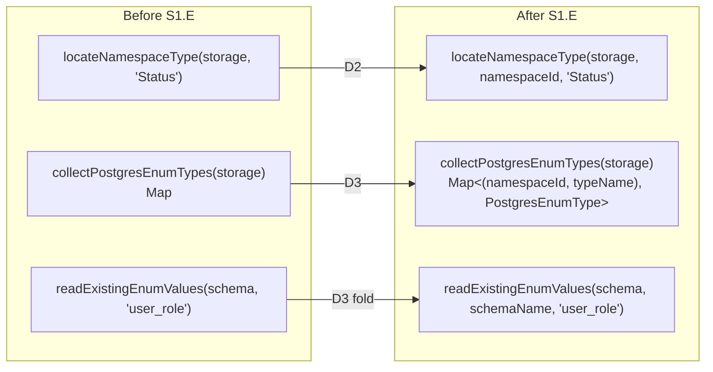

# Slice: namespace-aware-enum-planning (S1.E)

Parent project [`projects/contract-ir-planes/`](../../); this slice is a follow-on correctness fix surfaced by CodeRabbit on the S1.B enum-migration PR. It does not satisfy a new PDoD — it closes a pre-existing planner bug that S1.B's enum-slot rename made visible.

**Linear:** [TML-2686](https://linear.app/prisma-company/issue/TML-2686)

## Purpose

The Postgres migration planner keys enum lookups by bare TypeScript name across all namespaces. Two namespaces holding `enum.<sameName>` collide silently: [`locateNamespaceType`](../../../../packages/3-targets/3-targets/postgres/src/core/migrations/planner-strategies.ts) (lines 131–141) returns first-match-wins; [`collectPostgresEnumTypes`](../../../../packages/3-targets/3-targets/postgres/src/core/migrations/planner-strategies.ts) (lines 541–553) returns last-write-wins; [`locateNamespaceTypeInStorage`](../../../../packages/3-targets/3-targets/postgres/src/core/migrations/issue-planner.ts) (line 66) shares the first-match-wins shape. The same algorithm exists on `origin/main` (pre-S1.B); S1.B D1 only renamed `.types.` → `.enum.` inside the existing loops — pre-existing bug, surfaced by the slot rename touching the line.

This slice makes the Postgres enum planner namespace-aware end-to-end: enum lookup, enum collection, and the consuming planner strategies thread `namespaceId` alongside `typeName`. The framework `SchemaIssue` shape gains a `namespaceId` field on enum-related kinds so the planner can match issues to the right namespace's enum without re-scanning. The `readExistingEnumValues` lookup against the live Postgres schema gains `(schemaName, nativeType)` keying so two namespaces sharing a `nativeType` (e.g., both `user_role`) don't collide on the database side either.

## At a glance

Three planner helpers (`locateNamespaceType`, `locateNamespaceTypeInStorage`, `collectPostgresEnumTypes`) and one schema-IR lookup (`readExistingEnumValues`) move from bare-name keying to namespace-qualified keying. The framework `SchemaIssue` union extends with `namespaceId` on enum-related kinds. Two namespaces with the same enum name produce two distinct `CreateEnumTypeCall` instances, one per schema.

## Scope

### In scope

**Substrate change — `SchemaIssue` carries `namespaceId` on enum-related kinds.**

| Surface | Change |
|---|---|
| [`packages/1-framework/1-core/framework-components/src/control/control-result-types.ts`](../../../../packages/1-framework/1-core/framework-components/src/control/control-result-types.ts) | `EnumValuesChangedIssue` gains `namespaceId: string`. `BaseSchemaIssue` already carries optional `namespaceId` (added pre-S1.E); the verifier paths producing `type_missing` / `type_values_mismatch` for enum subjects must always populate it. |
| Family verifier paths producing enum-related issues | Issue construction populates `namespaceId` from the source namespace during verification (no re-derivation by name lookup downstream — `BaseSchemaIssue` already documents this contract). |

**Planner helpers — namespace-aware keying.**

| Surface | Change |
|---|---|
| [`packages/3-targets/3-targets/postgres/src/core/migrations/planner-strategies.ts`](../../../../packages/3-targets/3-targets/postgres/src/core/migrations/planner-strategies.ts) `locateNamespaceType` | Signature becomes `(storage, namespaceId, typeName)`; returns the entry from the named namespace only. |
| [`packages/3-targets/3-targets/postgres/src/core/migrations/issue-planner.ts`](../../../../packages/3-targets/3-targets/postgres/src/core/migrations/issue-planner.ts) `locateNamespaceTypeInStorage` | Same signature change; same single-namespace lookup. |
| [`packages/3-targets/3-targets/postgres/src/core/migrations/planner-strategies.ts`](../../../../packages/3-targets/3-targets/postgres/src/core/migrations/planner-strategies.ts) `collectPostgresEnumTypes` | Returns `ReadonlyMap<{ namespaceId, typeName }, PostgresEnumType>` (compound key — implementation may use a serialised key string `${namespaceId}\u0000${typeName}` or a tuple-keyed map; settle in D3 brief). |
| [`planner-strategies.ts`](../../../../packages/3-targets/3-targets/postgres/src/core/migrations/planner-strategies.ts) `nativeEnumPlanCallStrategy` (line 453+) | Loop iterates `(namespaceId, typeName, enumType)` tuples; `handledTypeNames` becomes a compound-key set; `introducedTypeNames` / `rebuiltTypeNames` follow. |
| [`planner-strategies.ts`](../../../../packages/3-targets/3-targets/postgres/src/core/migrations/planner-strategies.ts) `enumRebuildCallRecipe` (line 371+) | Takes `(namespaceId, typeName, ctx)`; resolves DDL schema via `resolveDdlSchemaForNamespace(ctx, namespaceId)` once at recipe entry. Column-ref walk's `column.typeRef === typeName` filter narrowed by namespace (column→enum reference resolution — see open question #2). |

**Adjacent collision — `readExistingEnumValues` (D3 fold).**

| Surface | Change |
|---|---|
| [`packages/3-targets/3-targets/postgres/src/core/`](../../../../packages/3-targets/3-targets/postgres/src/core/) `readExistingEnumValues` callsite at [`planner-strategies.ts:467`](../../../../packages/3-targets/3-targets/postgres/src/core/migrations/planner-strategies.ts) | Lookup keyed by `(schemaName, nativeType)`; two namespaces with same `nativeType` (e.g., both `user_role`) resolve to distinct live Postgres types. Schema-IR side may already store per-schema; verify and thread the schema axis through the lookup if not. |

**Fixture / test coverage.**

- New test fixture: two-namespace-same-name contract exercising introduce + rebuild + add-values paths under collision. Tests assert two distinct `CreateEnumTypeCall` calls (one per schema) and namespace-correct issue matching.
- Pre-fix regression test: snapshot / assertion that demonstrably fails on the pre-D1 codebase and passes after.
- Issue serialization goldens (if Issues appear in committed fixtures): regen as part of D4.

### Out of scope (this slice)

- **`Issue` shape generalisation to all pack-contributed entity kinds.** S1.E is enum-specific; the design pattern landed here generalises later when a second pack-contributed kind surfaces. Open question #4.
- **Mongo family** — Mongo has no enum slot.
- **SQLite family** — imports `PostgresEnumStorageEntry` for issue-rejection only; lookup logic does not exist there.
- **New pack-contributed entity kinds** (RLS policies, roles, sequences, materialised views) — neither in scope for the umbrella project nor for this slice.
- **Plural slot rename** (`tables` → `table`, etc.) — TML-2634, deferred.
- **Domain-plane content migration** — S1.C.
- **Cross-reference object-pair encoding** — S1.C.
- **Subsumed helper deletion** — S1.D.
- **On-disk `contract.json` format change** — none in this slice; only planner behaviour changes. Verify replay against pre-S1.E bookends as A4 falsification probe.

## Approach

The planner today walks `storage.namespaces` and projects every namespace's enum entries into a flat name-keyed structure. The structural defect is the projection: every consumer of `locateNamespaceType` / `locateNamespaceTypeInStorage` / `collectPostgresEnumTypes` has the namespace coordinate in scope at the callsite (issue.namespaceId, or the loop variable in `nativeEnumPlanCallStrategy`'s outer iteration) but the helpers throw the coordinate away. The fix is mechanical at each helper plus brief at each callsite: take the namespace coordinate as an argument, return the namespace-qualified result.

**Substrate (D1).** `BaseSchemaIssue` already carries optional `namespaceId` (added pre-S1.E as documented in [`control-result-types.ts`](../../../../packages/1-framework/1-core/framework-components/src/control/control-result-types.ts) lines 62–77 — *"Downstream planners trust this field as the authoritative subject coordinate and do not re-derive it by name lookup"*). For enum-related kinds (`type_missing`, `type_values_mismatch`), every family verifier site producing the issue must populate `namespaceId`. `EnumValuesChangedIssue` (separate union member) gains `namespaceId: string` as required — the planner cannot match an enum-values diff to the right enum without it.

**Helper rewrites (D2).** `locateNamespaceType(storage, namespaceId, typeName)` reads `storage.namespaces[namespaceId]?.enum?.[typeName]` directly — no cross-namespace scan. `locateNamespaceTypeInStorage` follows. Both callsites (`planner-strategies.ts:375` in `enumRebuildCallRecipe`, `issue-planner.ts:603`) have `issue.namespaceId` or the outer loop's namespace coordinate in scope; pass it through.

**Collection rewrite + strategy loop (D3).** `collectPostgresEnumTypes` returns a compound-keyed map (`${namespaceId}\u0000${typeName}` string key or tuple — implementation choice settled in D3 brief; prefer the simplest readable shape). `nativeEnumPlanCallStrategy`'s outer loop iterates compound tuples; `handledTypeNames` / `introducedTypeNames` / `rebuiltTypeNames` become compound-keyed sets. `enumRebuildCallRecipe` takes `(namespaceId, typeName)` and threads the schema resolution once. Same dispatch folds the `readExistingEnumValues` keying change — `nativeType` lookup against the live schema becomes `(schemaName, nativeType)`-keyed so two namespaces sharing a `nativeType` don't collide on the DB side.

**Issue matching (D2 + D3).** The `handledTypeNames.has(issue.typeName)` filter inside `nativeEnumPlanCallStrategy` becomes `handledKeys.has(compoundKey(issue.namespaceId, issue.typeName))` — relies on `issue.namespaceId` being populated (D1 contract). Without D1's substrate the matching filter is unsound, so D1 lands before D2/D3 even though it's the more invasive change.

**Test fixture (D4).** Two-namespace-same-name contract (e.g., `audit.Status` + `public.Status`, different values) exercising the three paths the planner takes: introduce (create new enum), rebuild (values diverge), add-values (additive). Assertions: two distinct `CreateEnumTypeCall` instances per planner run; namespace-correct issue assignment; pre-fix regression test (snapshot or assertion) red against pre-D1 codebase, green after.

## Edge cases (Example-Mapping)

| Edge case | Disposition | Notes |
|---|---|---|
| Two namespaces with same enum **name**, different **values** | **Handle** | Planner emits two distinct `CreateEnumTypeCall`, one per schema. Functional gate (SDoD6). |
| Two namespaces with same enum **name** AND same **values** | **Handle** | Still two distinct Postgres types (different schemas); planner emits two `CreateEnumTypeCall`. Idempotent failure isn't acceptable. |
| Two namespaces with same `nativeType` (e.g., both `user_role`) | **Handle** | `readExistingEnumValues` resolves per-`(schemaName, nativeType)`; D3 fold. |
| Single-namespace contract (the common case) | **Handle** | Must still work identically post-fix. Existing single-namespace tests are the regression bar. |
| Cross-namespace enum **column reference** (column in `audit.log_entry` whose `typeRef: 'Status'` resolves to `audit.Status`, not `public.Status`) | **Handle** | Column→enum lookup in `enumRebuildCallRecipe`'s column-ref walk needs namespace context. Open question #2; brief assembly confirms whether already wired or needs threading. |
| Drop scenario: enum removed from namespace `audit` but retained in `public` with same name | **Handle** | Planner emits `DropEnumTypeCall` scoped to the right schema; verifier-side issue for removed enum must carry the source namespace. |
| `enum_values_changed` issue under collision | **Handle** | Issue carries `namespaceId` (D1); planner matches against the compound key. |
| Issue serialization goldens (if Issues appear in committed fixtures) | **Handle** | Regen as part of D4; verify diff is shape-only (`+ namespaceId`) and not content-shift. |
| Pre-S1.E bookend contracts replay | **Handle (verify)** | No on-disk `contract.json` shape change; replay path unaffected. Spot-check during D4 / D5. |
| Mongo / SQLite families | **Explicitly out** | Mongo has no enum slot; SQLite's `PostgresEnumStorageEntry` imports are rejection-only — unaffected. |
| New pack-contributed entity kind with same collision shape | **Explicitly out** | S1.E is enum-specific; design pattern landed here generalises later if needed (open question #4). |
| Same-namespace enum name collision (within one namespace) | **Already handled** | The namespace's `enum` map is name-keyed; structural duplicate is impossible. Not a S1.E concern. |
| Planner emits operations in wrong order across namespaces (e.g., create-enum for `public.Status` after `CreateTableCall` referencing it) | **Handle** | `CreateEnumTypeCall` still goes through the `dep` bucket per namespace; sequencing existing behaviour preserved post-rewrite. Verify in integration test on multi-namespace contract. |
| A4 falsification — replay against pre-S1.E bookends fails | **Defer** | No on-disk format change, so working position is replay-clean. If somehow falsified, halt and route to discussion mode — not in slice scope. |

## Slice Definition of Done

- [ ] **SDoD1.** All "Done when" gates from the slice plan pass: `pnpm typecheck`, `pnpm test:packages`, `pnpm test:integration`, `pnpm fixtures:check`, `pnpm lint:deps` clean.
- [ ] **SDoD2.** Every pre-named edge case handled per its disposition.
- [ ] **SDoD3.** Reviewer verdict: accept (PR review surface).
- [ ] **SDoD4.** Manual-QA: **N/A** — no user-observable authoring or runtime API change; planner-internal correctness only. Two-namespace-same-name authoring already works at the DSL level pre-fix (the bug is silent collision at planner time, not an authoring rejection). The fix changes which `CreateEnumTypeCall` instances the planner emits; users don't write planner output by hand.
- [ ] **SDoD5.** Slice doesn't touch out-of-scope surfaces (plural slot rename, domain-plane population, cross-ref encoding, subsumed helper deletion, Mongo, SQLite, new pack-contributed entity kinds, on-disk `contract.json` format).
- [ ] **SDoD6 — functional gate.** A fixture contract carrying two namespaces with the same enum name (e.g., `audit.Status` + `public.Status`) produces two distinct `CreateEnumTypeCall` instances when planned against an empty database — one per schema. Verified by `expect(calls.filter(c => c instanceof CreateEnumTypeCall)).toHaveLength(2)` (or equivalent), and assertion that each call's `schemaName` corresponds to its source namespace's DDL schema.
- [ ] **SDoD7 — collision-grep gate.** After the fix, no `new Map<string, PostgresEnumType>` (or shape-equivalent) in the Postgres migration planner that aggregates per-namespace enums by bare TypeScript name. Grep: `rg 'Map<string,\s*PostgresEnumType' packages/3-targets/3-targets/postgres/` returns zero matches. Confirming grep: `rg 'collectPostgresEnumTypes|locateNamespaceType' packages/3-targets/3-targets/postgres/src/core/migrations/` — every signature carries `namespaceId`.
- [ ] **SDoD8 — regression coverage.** A pre-fix regression test (snapshot or assertion) is added in D4; reviewer can verify it demonstrably fails against the pre-D1 codebase (smoke-revert in review) and passes after. Phrased verifiably: the test file's `describe`/`it` names the collision scenario; the assertion targets `CreateEnumTypeCall` count or compound-key membership, not an opaque snapshot blob.

## Constraints + Assumptions

**Inherited from parent project (load-bearing for this slice).**

- **A1.** `AuthoringContributions.entityTypes` descriptor surface unchanged — this slice consumes the registration S1.A established; no new descriptor fields.
- **A4.** Pre-S1.E migration bookends replay without shape upgrade — **trivially satisfied** by this slice because no on-disk `contract.json` shape change.
- **A6.** No external `@prisma-next/*` consumer pins planner output shape — **irrelevant here**; planner output is in-process only, not a serialized contract surface.

**Slice-specific assumptions.**

- **B1.** Runs **parallel** to S1.D (no ordering dependency). The bug pre-dates this project (it exists on `origin/main`) and the planner surface is disjoint from S1.D's deletion surface, so the two slices touch non-overlapping files and can proceed concurrently in separate worktrees. The only shared constraint is reviewer bandwidth — if a single reviewer is the bottleneck, pull S1.E after S1.D as a pacing choice, not a dependency. (Earlier plans sequenced S1.E after S1.D for reviewer focus; the replan parallelises it under the default-to-parallel principle.)
- **B2.** `Issue` types live in [`packages/1-framework/1-core/framework-components/src/control/control-result-types.ts`](../../../../packages/1-framework/1-core/framework-components/src/control/control-result-types.ts) — `BaseSchemaIssue` (lines 39–84) carries optional `namespaceId` already; `EnumValuesChangedIssue` (lines 86–92) does not. D1's substrate change extends the union member; verifier-side construction sites populate the field for enum-related kinds.
- **B3.** No on-disk contract format change; this is a pure planner correctness fix. No fixture regen expected beyond the D4 new fixture (and any goldens-of-goldens that snapshot Issue payloads).
- **B4.** Compound-key implementation choice (string-serialised `${namespaceId}\u0000${typeName}` vs tuple-keyed map) is an implementer degree of freedom in D3 — prefer the simplest readable shape; both satisfy SDoD6/SDoD7.

## Per-dispatch DoR overlay

Project plan Risk #5 mitigation applies: **every dispatch brief assembled within this slice must answer (a) and (b) before locking decisions.**

- **(a)** For every field in any public surface this dispatch touches, what does it add that an existing field doesn't already say?
- **(b)** For every framework-layer data structure that encodes target/family identity, what enforcement does it provide that contract hydration / validation doesn't already structurally provide?

**Spec-level answers for surfaces this slice already knows it touches** (dispatch briefs may refine; must not contradict):

| Surface | (a) — non-redundancy | (b) — enforcement beyond hydration/validation |
|---|---|---|
| **`EnumValuesChangedIssue.namespaceId`** (required) | Adds the source namespace coordinate the planner needs to match the issue to a compound-keyed enum entry; `typeName` alone is insufficient under collision. No existing field carries the namespace for this union member. | Issue is a planner-input shape, not a hydration target; structural validation doesn't apply. The field is a contract between the verifier (producer) and the planner (consumer); the type signature is the enforcement surface. |
| **`BaseSchemaIssue.namespaceId` always-populated for enum-related kinds** | The field exists already (optional); the new constraint is *"every enum-related issue construction site sets it."* No new field; tightens an existing contract. | Same as above — input-shape contract between verifier and planner. |
| **`locateNamespaceType(storage, namespaceId, typeName)` signature** | Replaces the cross-namespace scan with a direct namespace-keyed read; the namespace coordinate is moved from "discovered inside the helper" to "supplied by the caller." Caller already has it in scope at every callsite. | The helper is a pure read; structural namespace shape already enforces `storage.namespaces[id]?.enum` typing. No new enforcement structure. |
| **`collectPostgresEnumTypes` compound-keyed return** | Compound key (`(namespaceId, typeName)`) replaces bare `typeName` so two namespaces with the same enum name don't collide. The compound key IS the entity coordinate per FR2 / PDoD6 (just scoped to the planner's enum collection, not yet the polymorphic `elementCoordinates(storage)` consumer). | No new framework-level identity table; the compound key is an in-process Map structure local to the planner. Cross-namespace identity is already structurally enforced by `storage.namespaces[id].enum[name]` shape. |
| **`readExistingEnumValues` `(schemaName, nativeType)` keying** | Adds schema axis to a previously-name-only lookup against the live Postgres `pg_type` projection. Two namespaces sharing a `nativeType` resolve to distinct DB-side types. | Postgres schema separation IS the enforcement surface; the lookup just stops projecting it away. No new framework-level structure. |

Briefs that cannot answer (a) or (b) satisfactorily for a proposed new field or registry **must not lock** — escalate via design discussion (I12). The default stance for this slice is **thread the existing namespace coordinate through the planner pipeline**, not add new identity-encoding structures.

## Open Questions

1. **`Issue.namespaceId` optional vs required on enum-related kinds.** Working position: **required** on `EnumValuesChangedIssue` (new union member), **always populated** on `BaseSchemaIssue` for `type_missing` / `type_values_mismatch` when the subject is namespace-scoped. The `BaseSchemaIssue` field stays optional in the type signature (other kinds — `extra_table` raised for a live-DB-only table — legitimately have no namespace) but the verifier paths producing enum-related kinds must populate it. Settle wording in D1 brief.
2. **Cross-namespace enum column reference resolution.** **Resolved 2026-05-27** by the S1.C pre-audit (see [`../cross-reference-encoding/spec.md`](../cross-reference-encoding/spec.md) § Pre-audit: column→enum reference resolution path). The audit confirmed the column-ref walk at `enumRebuildCallRecipe`'s lines 384–394 of [`planner-strategies.ts`](../../../../packages/3-targets/3-targets/postgres/src/core/migrations/planner-strategies.ts) is collision-shaped identically to the enum-lookup helpers this slice already fixes — `column.typeRef === typeName` is a bare-string match across every namespace × table × column, with no namespace narrowing on the enclosing recipe. S1.C does **not** change `column.typeRef` (the column-level field stays a bare string; S1.C's scope is the domain-plane cross-references `relation.to` / `model.base` / `roots[*]`, not storage-plane column-level type references). **Disposition:** S1.E D2 absorbs the fix as a single namespace-narrow filter (`column.typeRef === typeName && nsId === sourceNamespaceId`); `column.typeRef` stays a bare string; the namespace coordinate comes from the outer-loop / `locateNamespaceType` callsite that already threads `namespaceId` after D2. No additional dispatches; D2 scope grows by approximately one filter clause + the cross-namespace column→enum binding test in D4.
3. **`readExistingEnumValues` keying in this slice vs follow-up.** Working position: **in scope as part of D3** — same collision shape, same code area (`nativeEnumPlanCallStrategy:467`), splitting it into a follow-up would require touching the same files twice.
4. **Generalisation to all pack-contributed entity kinds.** Should the namespace-aware-planner pattern landed here generalise to future pack-contributed kinds (RLS policies, roles, sequences, materialised views) so they don't repeat the bug? **Out of scope for S1.E** — the umbrella project doesn't ship those kinds. Surface as a discussion-trigger for the project retro: *"S1.E threaded namespaceId through enum planning ad-hoc; future pack-contributed kinds should consume `elementCoordinates(storage)` (PDoD6) for the same purpose without re-inventing the threading per kind."*

## References

- Parent project spec: [`projects/contract-ir-planes/spec.md`](../../spec.md)
- Parent project plan (S1.E entry): [`projects/contract-ir-planes/plan.md`](../../plan.md)
- Predecessor slice (surfaced the bug via slot rename): [`../enum-migration/spec.md`](../enum-migration/spec.md), [TML-2623](https://linear.app/prisma-company/issue/TML-2623)
- ADR: [`projects/contract-ir-planes/adrs/0001-contract-planes.md`](../../adrs/0001-contract-planes.md) — Decision 5 (slot naming), Decision 6 (entity coordinate)
- **Linear:** [TML-2686](https://linear.app/prisma-company/issue/TML-2686) (this slice); [TML-2584](https://linear.app/prisma-company/issue/TML-2584) (parent project)
- Source touchpoints:
  - [`packages/1-framework/1-core/framework-components/src/control/control-result-types.ts`](../../../../packages/1-framework/1-core/framework-components/src/control/control-result-types.ts) — `BaseSchemaIssue` (lines 39–84) + `EnumValuesChangedIssue` (lines 86–92)
  - [`packages/3-targets/3-targets/postgres/src/core/migrations/planner-strategies.ts`](../../../../packages/3-targets/3-targets/postgres/src/core/migrations/planner-strategies.ts) — `locateNamespaceType` (131–141), `enumRebuildCallRecipe` (371–415), `nativeEnumPlanCallStrategy` (453+), `collectPostgresEnumTypes` (541–553)
  - [`packages/3-targets/3-targets/postgres/src/core/migrations/issue-planner.ts`](../../../../packages/3-targets/3-targets/postgres/src/core/migrations/issue-planner.ts) — `locateNamespaceTypeInStorage` (66+), callsite at line 603
- Calibration: [`drive/calibration/sizing.md`](../../../../drive/calibration/sizing.md) (L reference: *"Restructure an existing IR class's shape … substrate + every consumer + fixtures"*), [`model-tier.md`](../../../../drive/calibration/model-tier.md), [`failure-modes.md`](../../../../drive/calibration/failure-modes.md)
- Provenance: CodeRabbit Major-severity finding on PR #595 (S1.B enum-migration) flagging the collision in `planner-strategies.ts`. Bug pre-dates S1.B; S1.B's slot rename `.types.` → `.enum.` touched the affected lines without introducing the defect.
