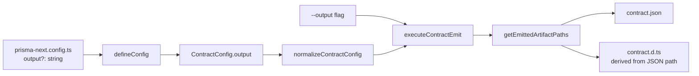

# Design notes: customize-generated-asset-output-path

> Synthesized design document for `customize-generated-asset-output-path`. Read this if you want to understand **what the project's design is**, **what principles it serves**, and **what alternatives were considered and rejected**. This document is not a chronological log of decisions — it captures the settled design, standing independently of the discussions that produced it.
>
> Owned by the Orchestrator. Authored directly (not delegated — see [`drive/roles/README.md § Orchestrator-direct authoring`](../../drive/roles/README.md)). Updated as design settles; not as decisions happen. Cross-link from the project spec; never block on a design-notes update during execution.

## Principles this design serves

- **Symmetric target surface (where surface exists)** — a config knob that exists for one first-party target's `defineConfig` wrapper exists consistently across the others' wrappers. The principle applies *to surfaces that exist*, not to surfaces that need creating. Today Mongo + Postgres ship `defineConfig` wrappers; SQLite does not (its users wire `coreDefineConfig` from the framework level directly). Adding a SQLite wrapper to satisfy this principle would be its own scope of work — tracked at [TML-2677](https://linear.app/prisma-company/issue/TML-2677/add-prisma-nextsqliteconfig-defineconfig-wrapper-at-parity-with-mongo).
- **Plumbing-first, surface-second** — the project leans on the existing `ContractConfig.output` plumbing (already threaded through provider → normalizer → CLI emit → emitter). It does not introduce a new emit pathway. The only change is exposing the override at the user-facing `defineConfig` wrappers and on the CLI.
- **Sensible defaults, escape hatches available** — the default behaviour (assets co-located with the schema source per the [`contract-space-package-layout`](../../.cursor/rules/contract-space-package-layout.mdc) convention) is unchanged. Users who don't opt in see no difference.
- **Defaults are conventions, not mandates** — the contract-space layout convention is a *recommended default for application / extension authors*. The new override is per-application; the convention itself doesn't need to be relaxed or rewritten.

## The model

### Surface: one option, one CLI flag, one semantics

A new optional field on the three first-party `defineConfig` wrappers:

```ts
defineConfig({
  contract: './src/contract.prisma',
  output: './generated/contract.json',
  // ...
});
```

- **Type:** `string` (file path).
- **Semantics:** the path to the emitted `contract.json` file. The `contract.d.ts` file is co-located next to it, derived by the existing `getEmittedArtifactPaths` (replace `.json` with `.d.ts`). The `.json` and `.d.ts` paths cannot be controlled independently.
- **Resolution:** relative paths resolve against the directory containing the `prisma-next.config.ts` file (consistent with how `contract` is resolved today).
- **Default:** unchanged from today — `deriveOutputPath(options.contract)`, which strips the schema extension and appends `.json` (e.g. `src/contract.prisma` → `src/contract.json`).

A matching CLI flag on `prisma-next contract emit`:

```bash
prisma-next contract emit --output ./generated/contract.json
```

- **Precedence:** CLI `--output` overrides config `output`, which overrides the default.
- **Validation:** none beyond what `mkdir -p` does for the parent directory. If the user points at a non-`.json` extension or a directory-shaped path, soft-warn and proceed; this is UX, not safety.

### Symmetric application (Mongo + Postgres)

Both existing first-party `defineConfig` wrappers accept the option identically:

- `@prisma-next/mongo/config`
- `@prisma-next/postgres/config`

The implementation may share a helper or duplicate inline — both wrappers already have an identical inline `deriveOutputPath` helper that's a candidate for extraction into `@prisma-next/config`. Extracting is a slice-time judgment call; the *surface* must be identical regardless.

**SQLite is out of scope.** `@prisma-next/sqlite` has no `defineConfig` wrapper today; users wire the framework-level `coreDefineConfig` directly and explicitly pass the output path as the second argument to `typescriptContract(contract, outputPath)`. SQLite users therefore *already have* customizable output paths — they just don't have the ergonomic one-liner. Closing that ergonomic gap is tracked at [TML-2677](https://linear.app/prisma-company/issue/TML-2677/add-prisma-nextsqliteconfig-defineconfig-wrapper-at-parity-with-mongo).

### What's emitted, where



CLI flag short-circuits the config value at `executeContractEmit` entry. The rest of the pipeline is unchanged.

### Invariants

- **I-output-1.** When `output` is unset (config) and `--output` is absent (CLI), behaviour is byte-identical to today's emit.
- **I-output-2.** When `output` is set, `contract.d.ts` lands beside `contract.json` (same parent directory, same basename, `.d.ts` extension).
- **I-output-3.** The `output` option's semantics, name, default, and resolution rules are identical across the Mongo + Postgres `defineConfig` wrappers.
- **I-output-4.** The CLI flag is named `--output` and takes precedence over the config value.

## Alternatives considered

- **File-path-or-directory polymorphism.** Accept either a `.json` file path or a directory; if a directory, derive both filenames. **Rejected because:** the operator chose path-only — two semantics in one option creates ambiguity and extra validation surface for no clear ergonomic win (the user types one path either way, just with or without the filename).
- **Independent control over `.json` and `.d.ts` paths.** Lift the `getEmittedArtifactPaths` co-location constraint. **Rejected because:** co-location is the simpler mental model; no current user need motivates lifting it; downstream tooling that imports from `contract.json` and the `.d.ts` companion assumes co-location.
- **Mongo-only fix.** Resolve just the Mongo ticket; leave Postgres alone. **Rejected because:** the Mongo + Postgres wrappers are functionally identical in this area (same `deriveOutputPath` helper, same threading); users moving between targets would hit the same wall in Postgres; the symmetric-target-surface principle holds for surfaces that already exist.
- **Build a SQLite `defineConfig` wrapper to achieve full target symmetry inside this project.** Add `@prisma-next/sqlite/config` mirroring the Mongo + Postgres shape and migrate the SQLite demo. **Rejected because:** that's a new user-facing surface, not a config-knob extension. It needs its own design discussion (option shape, migration plan for existing consumers, docs) and is a substantially larger PR. Tracked separately at TML-2677.
- **Post-emit hook / formatter plugin.** Let users transform the emit output via a plugin rather than re-locate it. **Rejected because:** out of scope for this project; locating is the request, not transforming.
- **Revise the `contract-space-package-layout` rule to permit overrides.** **Rejected (as a design move).** The rule already scopes itself to "packages that emit their own `contract.json`" (extensions, internal packages, aggregate-root apps) and describes the *recommended layout* for those packages. The new override is an application-author choice — applications can opt out of the convention for their specific needs without the convention itself being weakened. The rule may pick up a one-line note at close-out clarifying the convention is the default, not a hard mandate, but it doesn't need a rewrite.
- **Different option name (`outputDir`, `assets`, `generatedDir`).** **Rejected because:** the operator chose `output` (matching `ContractConfig.output`), with `outputPath` as a fallback only if `output` collides with another field. No collision is known.
- **Path validation / safety rails (forbid traversal, forbid `node_modules`, refuse to overwrite tracked files).** **Rejected because:** soft warnings only. Trust the user; this is config-file UX, not multi-tenant security.

## Open questions

_None blocking. One implementation-shape choice deliberately deferred to the slice author:_

- **Shared helper vs duplicated inline for `deriveOutputPath` across Mongo + Postgres.** Both wrappers today carry an identical inline copy. Extracting it into `@prisma-next/config` (or wherever the wrappers' common dependency lives) reduces duplication and positions the helper for reuse by a future SQLite wrapper (TML-2677). Keeping it inline is simpler for this PR. **Working position:** extract if the move is a clean 1-file lift; otherwise keep inline and let TML-2677 do the extraction when it adds the third wrapper.

## References

- Project spec: [`./spec.md`](./spec.md)
- Project plan: [`./plan.md`](./plan.md)
- Linear ticket: [TML-2664](https://linear.app/prisma-company/issue/TML-2664/mongo-feature-request-customize-generated-asset-output-path)
- ADR 007 — Types-Only Emission (`docs/architecture docs/adrs/ADR 007 - Types Only Emission.md`)
- Rule — `contract-space-package-layout` (`.cursor/rules/contract-space-package-layout.mdc`)
- Follow-up ticket (SQLite parity): [TML-2677](https://linear.app/prisma-company/issue/TML-2677/add-prisma-nextsqliteconfig-defineconfig-wrapper-at-parity-with-mongo)
- Existing call sites to update (verified during slice spec authoring):
  - `packages/3-extensions/mongo/src/config/define-config.ts` (the Mongo gap)
  - `packages/3-extensions/postgres/src/config/define-config.ts` (the Postgres gap)
  - `packages/1-framework/3-tooling/cli/src/commands/contract-emit.ts` (CLI flag wiring)
  - `packages/1-framework/3-tooling/cli/src/control-api/operations/contract-emit.ts` (CLI override precedence)
- Existing plumbing (unchanged):
  - `packages/1-framework/1-core/config/src/config-types.ts` (`ContractConfig.output`, `normalizeContractConfig`)
  - `packages/1-framework/3-tooling/emitter/src/artifact-paths.ts` (`getEmittedArtifactPaths`)
