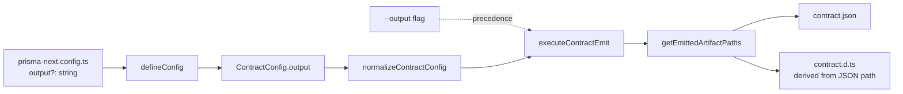

# Summary

Expose the existing `ContractConfig.output` plumbing on the user-facing `defineConfig` wrappers for the two first-party target wrappers that currently hide it (Mongo, Postgres) and add a matching `--output` flag to `prisma-next contract emit`. SQLite users already control the output path through the framework-level `defineConfig` and are out of scope for this project — see [TML-2677](https://linear.app/prisma-company/issue/TML-2677/add-prisma-nextsqliteconfig-defineconfig-wrapper-at-parity-with-mongo) for the follow-up that closes the ergonomic gap.

# Purpose

Give Prisma Next users control over where the contract emitter writes its two generated artifacts (`contract.json`, `contract.d.ts`), through a config-file option and a matching CLI flag. The feature exists because users (originating from a MongoDB customer request and applying equally to Postgres) need to integrate contract emission with project layouts that don't match the default schema-co-located convention.

# At a glance

The new surface is one optional field on `defineConfig` and one optional flag on the CLI. Both target the path of `contract.json`; `contract.d.ts` is always co-located beside it.

```ts
// prisma-next.config.ts
import { defineConfig } from '@prisma-next/mongo/config'; // or /postgres/config

export default defineConfig({
  contract: './src/contract.prisma',
  output: './generated/contract.json',   // ← new, optional, identical surface across Mongo + Postgres wrappers
  db: { connection: process.env['MONGODB_URL']! },
});
```

```bash
prisma-next contract emit --output ./generated/contract.json
```

The plumbing already supports this end-to-end (`ContractConfig.output` is threaded through provider → normalizer → CLI emit → `executeContractEmit` → `getEmittedArtifactPaths`). This project's surface is the two `defineConfig` wrappers (which currently hard-wire the path) and the CLI command (which has no flag).

SQLite users today wire `coreDefineConfig` from `@prisma-next/cli/config-types` directly and already pass the output path explicitly as the second argument to `typescriptContract(contract, 'src/prisma/contract.json')`. The ergonomic wrapper at parity with Mongo + Postgres is tracked separately at [TML-2677](https://linear.app/prisma-company/issue/TML-2677/add-prisma-nextsqliteconfig-defineconfig-wrapper-at-parity-with-mongo).



# Scope

## In scope

- A new optional `output?: string` field on the two target `defineConfig` wrappers that currently hard-wire the path: `@prisma-next/mongo/config` and `@prisma-next/postgres/config`. Identical semantics, name, defaults, and resolution rules across both.
- A new `--output <path>` flag on `prisma-next contract emit`, with precedence over the config value.
- Path resolution relative to the directory containing the `prisma-next.config.ts` file (consistent with how `contract` is resolved).
- A short documentation update covering the new knob, its default, and CLI/config precedence.
- Test coverage for each wrapper, the CLI flag, the precedence rule, and the "no override → unchanged default behaviour" invariant.

## Non-goals

- Adding a `@prisma-next/sqlite/config` `defineConfig` wrapper at ergonomic parity. SQLite already supports a custom output path through the framework-level `defineConfig` + `typescriptContract(contract, output)` plumbing; the ergonomic wrapper is tracked at [TML-2677](https://linear.app/prisma-company/issue/TML-2677/add-prisma-nextsqliteconfig-defineconfig-wrapper-at-parity-with-mongo).
- Independent control over `.json` and `.d.ts` paths. The two stay co-located, derived by the existing `getEmittedArtifactPaths`.
- Directory-shaped `output` semantics. The value is a file path to a `.json` file; directory paths are not accepted.
- Changes to the contract surface, contract schema, or emitter algorithm. Output *location* only.
- Changes to migration manifest output. `migrations.dir` continues to govern that surface unchanged.
- Post-emit transformation hooks, formatters, or codegen plugins.
- Rewriting the [`contract-space-package-layout`](../../.cursor/rules/contract-space-package-layout.mdc) rule. It remains the recommended default for application/extension authors. A one-line clarification ("convention, not mandate; overridable via `output`") may land at close-out but isn't load-bearing for this project.
- Hard validation of the supplied path (escape-traversal blocking, `node_modules` blocking, overwrite protection). Soft warnings only.

# Approach

The change is a thin user-facing extension over plumbing that already exists. The framework-level `ContractConfig.output` is already optional, already threaded through the entire emit pipeline, and already honoured by `getEmittedArtifactPaths`. The two affected layers are:

1. **The `defineConfig` wrappers in two target extension packages (Mongo + Postgres).** Today each hard-wires `output = deriveOutputPath(options.contract)`. The change is to accept `output` in the options type, default to `deriveOutputPath(options.contract)` if absent, and pass through unchanged otherwise. Identical surface across Mongo + Postgres is an invariant (I-output-3). Both wrappers already share an identical inline `deriveOutputPath` helper that's a candidate for extraction; whether to extract is a slice-time judgment call. (SQLite has no `defineConfig` wrapper today; users go through `coreDefineConfig` directly and explicitly pass the output path. Closing the SQLite ergonomic gap is tracked at TML-2677.)

2. **The CLI `contract emit` command.** Add a `--output` flag at the command surface, thread it through the control-API operation, and have it take precedence over the value read from the config. When neither is supplied, the path comes from the normalized config (which falls back to the wrapper's derivation, which falls back to `DEFAULT_CONTRACT_OUTPUT`).

The `.d.ts` file's location stays a derivation of the `.json` location. The mental model is "one knob for the asset pair, co-located by construction." Lifting the co-location would require revisiting `getEmittedArtifactPaths` and downstream import expectations; no user need motivates it.

Validation is intentionally minimal: `mkdir -p` of the parent directory plus soft warnings on obviously-odd inputs (non-`.json` extension; directory-shaped path). The override is a config-file UX surface, not a security boundary.

# Project Definition of Done

- [ ] **PDoD1.** Single slice (per the project plan) merged.
- [ ] **PDoD2.** `output` accepted on both Mongo + Postgres `defineConfig` wrappers with byte-identical surface (option name, type, default, resolution semantics).
- [ ] **PDoD3.** `--output` flag accepted by `prisma-next contract emit`, with CLI > config > default precedence.
- [ ] **PDoD4.** Default behaviour (no `output` set, no `--output` passed) is byte-identical to pre-change emit output for at least one Mongo and one Postgres fixture / example.
- [ ] **PDoD5.** Tests covering: (a) both wrappers' new option; (b) the CLI flag; (c) precedence; (d) the default-unchanged invariant.
- [ ] **PDoD6.** Docs updated: a short section in the relevant config / CLI reference describing the option, its default, and precedence. Examples (`examples/mongo-demo` et al.) **not** updated to use the override — keeping the default-path examples is the right baseline.
- [ ] **PDoD7.** `pnpm build`, `pnpm test:packages`, `pnpm test:integration`, `pnpm test:e2e`, `pnpm lint:deps`, `pnpm fixtures:check` all green.
- [ ] **PDoD8.** Mandatory final retro complete; output landed (canonical findings / `drive/calibration/` / ADR — whichever fits).
- [ ] **PDoD9.** Long-lived docs migrated into `docs/` if any (likely a short addition to the Contract Emitter subsystem doc; possibly a one-line clarification to the `contract-space-package-layout` rule).
- [ ] **PDoD10.** Repo-wide references to `projects/customize-generated-asset-output-path/**` removed / replaced with canonical links.
- [ ] **PDoD11.** `projects/customize-generated-asset-output-path/` deleted.
- [ ] **PDoD12.** Linear ticket [TML-2664](https://linear.app/prisma-company/issue/TML-2664/mongo-feature-request-customize-generated-asset-output-path) auto-closed by PR merge integration.

# Functional Requirements

- **FR1.** `@prisma-next/mongo/config`'s `defineConfig({ contract, output?, db, ... })` accepts an optional `output: string` and threads it into the contract config. If absent, behaviour is identical to today.
- **FR2.** `@prisma-next/postgres/config`'s `defineConfig` accepts the same optional `output: string` with identical semantics.
- **FR3.** `output`, when set, is the path to the emitted `contract.json` file. `contract.d.ts` is co-located, derived by the existing `getEmittedArtifactPaths` substitution.
- **FR4.** `output`, when relative, resolves against the directory containing `prisma-next.config.ts`.
- **FR5.** `prisma-next contract emit --output <path>` overrides the config-file value (and any default).
- **FR6.** When `output` is absent from both config and CLI, the emitted paths are byte-identical to current behaviour for every existing fixture / example.
- **FR7.** The parent directory of the resolved output path is created if missing (existing `mkdir` behaviour, preserved).

# Non-Functional Requirements

- **NFR1.** No `any`. No `@ts-expect-error` outside negative type tests. No lint suppression. Minimal casts. (Per [`AGENTS.md § Typesafety rules`](../../AGENTS.md).)
- **NFR2.** Tests added before implementation changes (per [`AGENTS.md § Golden Rules`](../../AGENTS.md)).
- **NFR3.** No changes to `contract.json` / `contract.d.ts` payload shape; the artifacts at the new location are byte-identical to the artifacts at the default location.
- **NFR4.** Performance impact zero — the change is a pass-through option; no new I/O, no new computation.
- **NFR5.** Soft warnings for unusual paths (non-`.json` extension; absolute path traversing `node_modules`) are structured + actionable; no hard failures.
- **NFR6.** Use `pathe`, not `node:path`, for any new path manipulation (per [`use-pathe-for-paths`](../../.cursor/rules/use-pathe-for-paths.mdc)).

# Contract-impact

This work does **not** change the contract surface (`packages/0-shared/contract/**`, `packages/1-framework-core/**`). The emitted artifacts (`contract.json`, `contract.d.ts`) and their schema, validation rules, and downstream consumers are untouched. Only the *destination paths* of those artifacts are configurable.

# Adapter-impact

Affects the two first-party target config wrappers that hard-wire the output path today:

- `@prisma-next/mongo` (`packages/3-extensions/mongo/src/config/define-config.ts`)
- `@prisma-next/postgres` (`packages/3-extensions/postgres/src/config/define-config.ts`)

The framework-level `ContractConfig.output` and the emitter / CLI plumbing are unchanged; only the two existing `defineConfig` wrappers gain the new option, plus the CLI command surface gains the new flag.

`@prisma-next/sqlite` is **not** affected — it has no `defineConfig` wrapper today. SQLite users go through the framework-level `defineConfig` from `@prisma-next/cli/config-types` and already pass an explicit output path. Adding a SQLite wrapper at parity is tracked separately at [TML-2677](https://linear.app/prisma-company/issue/TML-2677/add-prisma-nextsqliteconfig-defineconfig-wrapper-at-parity-with-mongo).

# ADR pointer

Likely no new ADR required — this is a config-surface extension, not an architectural shift. If the slice surfaces a non-obvious convention worth pinning (e.g. validation policy, future symmetric option treatment), it'll land in `drive/calibration/` or as a one-line clarification to [`contract-space-package-layout`](../../.cursor/rules/contract-space-package-layout.mdc) at close-out. Decision deferred to the retro.

# Constraints + Assumptions

- **A1.** `ContractConfig.output` semantics (file path to `contract.json`, with `.d.ts` derived by `getEmittedArtifactPaths`) are the right shape to expose user-side. This is load-bearing — if the underlying semantics change, this project's surface changes too. The plumbing has been stable through several emitter refactors and there is no signal it's about to move.
- **A2.** Mongo + Postgres `defineConfig` wrappers can accept the same option type without target-specific divergence. Confirmed by inspection — both wrappers already share an identical `deriveOutputPath` helper and identical `output` threading. SQLite has no wrapper to update and is out of scope (see TML-2677).
- **A3.** The CLI command's existing argument-parsing infrastructure supports adding a new optional flag without architectural changes. Confirmed by inspection.
- **A4.** Existing fixtures / examples that don't use `output` will continue to work unchanged (FR7). Verified by FR7 being part of PDoD4.
- **A5.** The `[`contract-space-package-layout`](../../.cursor/rules/contract-space-package-layout.mdc)` rule is correctly understood as a recommended default for application/extension authors, not a hard mandate. Operator-confirmed at design time (Q7).

# Open Questions

_All design-level questions resolved. See [`design-notes.md`](./design-notes.md) for the settled model. Implementation-shape question deferred to the slice author:_

1. **Shared helper vs per-wrapper copies** for the three `defineConfig` wrappers. Both shapes satisfy the identical-surface invariant. Working position: prefer a shared helper if one already exists in `@prisma-next/config` core; otherwise copy across the three wrappers. Confirm during slice design.

# References

- Linear ticket: [TML-2664](https://linear.app/prisma-company/issue/TML-2664/mongo-feature-request-customize-generated-asset-output-path) (in `[PN] EA Release`)
- Project design notes: [`./design-notes.md`](./design-notes.md)
- ADR 007 — Types-Only Emission (`docs/architecture docs/adrs/ADR 007 - Types Only Emission.md`)
- Subsystem doc — Contract Emitter & Types (`docs/architecture docs/subsystems/2. Contract Emitter & Types.md`)
- Rule — `contract-space-package-layout` (`.cursor/rules/contract-space-package-layout.mdc`)
- Follow-up ticket (SQLite parity): [TML-2677](https://linear.app/prisma-company/issue/TML-2677/add-prisma-nextsqliteconfig-defineconfig-wrapper-at-parity-with-mongo)
- Existing call sites (verified during slice spec authoring):
  - `packages/3-extensions/mongo/src/config/define-config.ts` — Mongo wrapper (gap)
  - `packages/3-extensions/postgres/src/config/define-config.ts` — Postgres wrapper (gap)
  - `packages/1-framework/3-tooling/cli/src/commands/contract-emit.ts` — CLI command (flag wiring)
  - `packages/1-framework/3-tooling/cli/src/control-api/operations/contract-emit.ts` — CLI op (precedence)
- Existing plumbing (unchanged):
  - `packages/1-framework/1-core/config/src/config-types.ts` — `ContractConfig.output`, `normalizeContractConfig`, `DEFAULT_CONTRACT_OUTPUT`
  - `packages/1-framework/3-tooling/emitter/src/artifact-paths.ts` — `getEmittedArtifactPaths`
