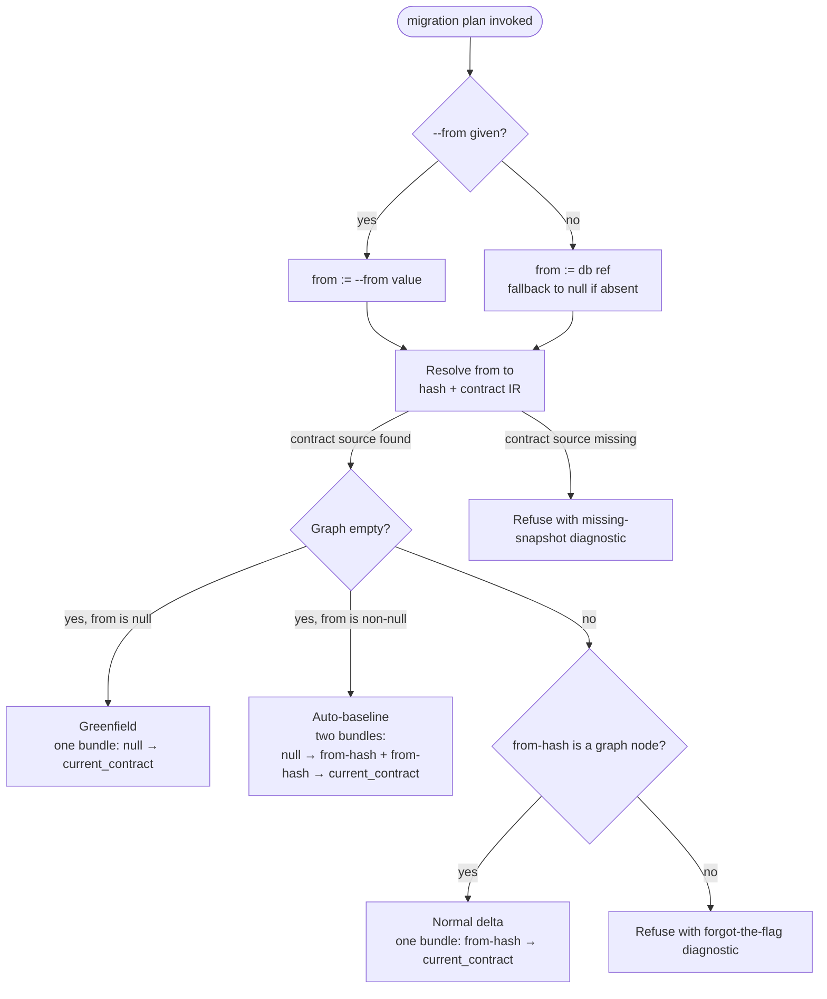

# Design notes: dev-to-ship-migration-handoff

> Synthesised design document for `dev-to-ship-migration-handoff`. Read this if you want to understand **what the design is**, **what principles it serves**, and **what alternatives were considered and rejected**. This is the settled design as of the design discussion's close; it stands independently of the chat that produced it.
>
> Cross-link from the project spec; never block on a design-notes update during execution.

## Vocabulary

These terms are used precisely throughout the rest of this document.

- **Contract hash** — a content-addressed hash of a contract IR (`sha256:…`). Identifies a contract state uniquely.
- **DB marker** — the row(s) in the live database recording which contract hash the database was last brought up to. Stored in `prisma_contract.marker` (Postgres) or the `_prisma_migrations` collection (MongoDB). Per [ADR 021 — Contract Marker Storage](../../docs/architecture%20docs/adrs/ADR%20021%20-%20Contract%20Marker%20Storage.md).
- **Migration bundle** — an on-disk directory under `migrations/app/<ts>_<slug>/` containing `migration.json` (manifest), `ops.json` (operations), `start-contract.json` / `end-contract.json`, etc. Each bundle is an edge from one contract hash (`from`) to another (`to`).
- **Migration graph** — the directed graph formed by all on-disk migration bundles. Nodes are contract hashes; edges are bundles.
- **Graph node** — a contract hash that appears in the migration graph. Concretely: a hash is a graph node if it is the `from` or `to` of *any* on-disk migration bundle, or if it is the `null` empty-graph sentinel. A perfectly valid contract hash that doesn't appear in any bundle is *not* a graph node. This distinction is load-bearing — see [§ Universal invariant](#universal-invariant-from-must-be-a-graph-node).
- **Ref** — a named pointer to a contract hash, stored at `migrations/app/refs/<name>.json`. May be paired with a contract snapshot at `migrations/app/refs/<name>.contract.json` (see below).
- **Paired contract snapshot** — a sibling file `<name>.contract.json` (plus `<name>.contract.d.ts` for the typed handle), holding the full contract IR at the ref's hash. New in this design.

## Principles this design serves

- **Explicit over implicit** — every command's effect on dev-state (ref advancement, DB marker, snapshot writes) is predictable from its flags. `migrate` never *infers* dev-state intent; `db init` / `db update` advance a *default* ref, not a magic one.
- **Plans are the product** — `migration plan` output is the durable, attested artifact that gets committed to git and applied later. It must be applyable by construction; emitting a bundle that can't apply is a design failure.
- **Feedback before execution** — failures surface at plan time, not at apply time, when the user is about to commit a bad bundle. Apply time has its own check for cases plan time can't see.
- **Compose, don't configure** — extend existing primitives (refs, markers, the migration graph) rather than introducing new on-disk concepts or per-mode flags.
- **Refs are uniform** — framework and user refs share a single namespace and shape. `db` is the default name a few commands write to; it is not reserved, not protected, not magic. A user who runs `ref set db <hash>` gets exactly what they asked for; the next dev-command overwrites it on the next dev cycle.

## The model

### Refs as the framework's local source of truth

Refs already exist in Prisma Next as named pointers to contract hashes, stored at `migrations/app/refs/<name>.json` with shape `{ hash: string, invariants: string[] }`. They're used today for environment targets (`production`, `staging`) via the `prisma-next ref set/list/delete` CLI surface.

This design extends refs in one dimension: a few framework commands (`db init`, `db update`) gain an implicit default of advancing a ref named `db` (overridable via `--advance-ref <name>`). The `db` ref records "the contract hash this project's dev database has been brought up to" — providing the missing local source of truth that closes the trap in TML-2629.

Refs are otherwise unchanged. The namespace is uniform; the file shape is the same; the resolution grammar is the same.

### Paired contract snapshots

Every ref grows an *optional* paired contract snapshot at `migrations/app/refs/<name>.contract.json` (plus `<name>.contract.d.ts` for the typed import handle, mirroring the convention migration bundles already use for `end-contract.d.ts`).

The snapshot exists because `migration plan` is a *contract-diff engine*: its `ops.json` output is computed as `diff(from-contract, to-contract)`. When the `from` end is a hash that doesn't appear in any migration bundle (e.g. the `db` ref after `db update` against an empty migration graph), there is no on-disk contract IR to diff against. The paired snapshot solves this: `db update` already has the contract in hand at the time it advances the ref; persisting it next to the ref makes the planner's job a pure file read.

**Write rule:** whenever a ref is written or changed, its paired contract snapshot is written / refreshed. Whenever a ref is deleted, the paired snapshot is deleted in the same step. **No stale ref contracts, ever.**

This rule applies uniformly:

- Framework-driven writes (`db init`, `db update`, `migrate --advance-ref <name>`) pair every ref-write with a snapshot-write.
- User-driven writes (`ref set <name> <hash>`) synthesise the snapshot from the existing migration graph: the universal invariant (below) guarantees `<hash>` is a graph node, so its contract IR is available as `end-contract.json` on the bundle whose `to == <hash>`. `ref set` copies that into the paired snapshot file.

The read-side stays simple: when the planner needs the contract at a ref's hash, it reads the paired snapshot directly. No fallback logic, no read-side bifurcation.

### Universal invariant: `from` must be a graph node

**Any `from`-hash that gets resolved by any command — at any time, in any context — must be a graph node in the on-disk migration graph; otherwise the command refuses.**

The `null` empty-graph sentinel always counts as a valid graph node. Any other hash is a graph node if and only if it appears as the `from` or `to` of an existing migration bundle on disk.

This invariant applies to:

- `migration plan` resolving `--from <ref-or-hash>` or the default `db` ref.
- `migrate` resolving `--to <ref-or-hash>` (the target).
- `ref set <name> <hash>` — the hash being set must be a graph node.
- Any future CLI surface that takes a contract reference.

The invariant ensures every emitted bundle has a structurally-coherent `from` end. Without it, the planner could happily produce "floating" bundles whose `from` doesn't connect to anything reachable, recreating the TML-2629 trap in a more general form.

The *only* mechanism that introduces a not-yet-graph-node hash as a `from` end is the auto-baseline path in `migration plan` (see next section). That path materialises the from-hash as a graph node by writing the baseline bundle itself; by the time the invariant is checked downstream, the hash is a node.

### `migration plan`: resolution and emission

`migration plan` defaults `from` to the `db` ref and emits one or two bundles depending on the migration graph's state.

#### Resolution order

1. **Explicit `--from <ref-or-hash>`** — accepts a ref name, full hash, hash prefix, migration directory name, `<dir>^`, or filesystem path (existing grammar).
2. **Default `--from db`** — resolves the `db` ref via `migrations/app/refs/db.json`.
3. **No `db` ref present** — resolves `from` to the `null` empty-graph sentinel. This is the greenfield case (a brand-new project before `db init`).

The from-contract is then materialised from one of two sources:

1. **Paired snapshot at `<name>.contract.json`** — used when `from` was resolved via a ref name (explicit `--from <name>` or default `db`).
2. **Migration bundle's `end-contract.json`** — used when `from` was resolved to a raw hash and a bundle exists whose `to == from-hash`. Existing pathway today.

If neither source yields a contract, the command refuses.

#### Emission cases

After resolution:

| Case | Condition | Emission |
|---|---|---|
| **Greenfield** | Graph empty, `from` resolves to `null` | One bundle: `null → current_contract`. (Today's behaviour for brand-new projects.) |
| **Auto-baseline** | Graph empty, `from` resolves to non-null, snapshot available | **Two bundles**: baseline `null → from-hash` + delta `from-hash → current_contract`. The baseline introduces `from-hash` as a graph node by being written; the delta is the user's intended diff. |
| **Normal delta** | Graph non-empty, `from`-hash is a graph node | One bundle: `from-hash → current_contract`. |
| **Forgot-the-flag** | Graph non-empty, `from`-hash is *not* a graph node | **Refuse** with a "did you mean `--from <reachable-ref>`?" diagnostic. Names both the resolved `from`-hash and the named refs that point at graph nodes. |
| **Snapshot missing** | Graph empty or non-empty, `from` resolves to a non-null hash, no contract source available | **Refuse** with a "no contract snapshot for ref `<name>`" diagnostic. Diagnostic suggests restoring the snapshot (e.g. `git checkout`) or re-running the command that originally wrote the ref (`db update` for `db`). |

Auto-baseline output is *two* committable directories that together encode "the dev iteration up to here, then the new delta." The user sees both in `git status` before committing — no silent file generation.

### Ref-advancement write rules across commands

The rule is *asymmetric* between the dev-command family (`db init`, `db update`) and the general-purpose `migrate` command. The asymmetry has a clean rationale: `db init` and `db update` are inherently about checkpointing the dev DB; `migrate` is generic (deploy, rollback test, CI apply) and shouldn't infer dev-state intent.

| Invocation | Ref advanced? | Snapshot? |
|---|---|---|
| `db init` | `db` (implicit default) | yes (paired) |
| `db init --advance-ref <name>` | `<name>` (override) | yes |
| `db update` | `db` (implicit default) | yes |
| `db update --advance-ref <name>` | `<name>` (override) | yes |
| `db update --db <non-default-url>` | none (different DB ≠ project dev state) | n/a |
| `db update --db <non-default-url> --advance-ref <name>` | `<name>` (explicit) | yes |
| `migrate` | **none** (no implicit) | n/a |
| `migrate --to <X>` | **none** | n/a |
| `migrate --advance-ref <name>` | `<name>` → current contract hash | yes |
| `migrate --to <X> --advance-ref <name>` | `<name>` → X | yes |
| `migrate --db <non-default-url>` (any combo) | only via explicit `--advance-ref` | yes if so |
| `ref set <name> <hash>` | `<name>` → hash | yes (synthesised from graph bundle) |
| `ref delete <name>` | (delete ref + cascade snapshot) | n/a |

**`db` is a default, not magic.** The `db init` / `db update` implicit default exists because dev-state-tracking *is* the purpose of those commands. The same flag (`--advance-ref <name>`) overrides the default cleanly. There are no reserved ref names; the framework will happily write to `db`, `production`, `staging`, or `whatever-the-user-wants`.

#### Implications for `migrate`

Because `migrate` never advances a ref implicitly, the `db` ref will be **stale** after `migrate` (the live DB has advanced, but the `db` ref still points at the prior dev-state hash). The user is expected to either:

1. Run `db update` next (no-op effect on DB state when the marker already matches the contract; refreshes the `db` ref + snapshot to the post-migrate hash).
2. Run `migrate --advance-ref db` to advance the ref in the same step.

If the user does neither and runs `migration plan` immediately after, the planner reads the stale `db` ref → `from`-hash is a graph node (because it's the predecessor of the just-applied migration) → emits a `from = stale-hash, to = current-contract` bundle. At `migrate` time, the apply-time drift check (next section) catches the discrepancy: live marker has advanced past `stale-hash`, planner thinks we start from `stale-hash`. Refuse with a precise diagnostic.

This is an accepted trade-off. The drift diagnostics are the safety net.

### Drift diagnostics

Two complementary checks fire at different lifecycle points:

#### Plan-time refuse (forgot-the-flag)

In `migration plan`, when the resolved `from`-hash isn't a graph node (the forgot-the-flag case above), refuse before emitting any bundle. The diagnostic names:

- The resolved `from`-hash (so the user knows where the planner thinks they wanted to start).
- The fact that this hash isn't anywhere in the on-disk graph.
- Named refs that point at graph nodes (typically `production`, `staging`, or similar), so the user can pick the right `--from <name>`.

Exact wording is slice-time bikeshedding; see open questions.

#### Apply-time drift check

In `migrate`, before running any DDL, read the live DB marker and compare against the planned `from`-hash:

- **Match** → proceed with apply as today.
- **Mismatch** → refuse with a diagnostic naming both hashes (live marker, planned `from`) and suggesting the right mitigation (`db sign` to accept the DB as truth, `db update` to advance the DB to a matching state, or `ref set db <correct-hash>` if the issue is a stale `db` ref).

`migrate` already establishes a DB connection — adding the marker read is essentially free. The diagnostic is *additive* to the existing `PN-RUN-3000 pathUnreachable` error; today the error has no actionable fix text (see scout findings in [§ References](#references)), so this is the first time `migrate` can tell the user concretely what to do.

## Worked example: closing the J4 trap

The J4 audit reproduction from TML-2629 traces as follows under the new design.

| Step | Action | Disk state after | DB state after |
|---|---|---|---|
| 1 | `db init` (contract at H_A) | `refs/db.json` = H_A; `refs/db.contract.json` = contract IR at H_A. Graph: empty. | Marker = H_A. |
| 2 | User edits contract → H_B; `contract emit` | On-disk `contract.json` = H_B. Refs unchanged. | Unchanged. |
| 3 | `db update` | `refs/db.json` = H_B; `refs/db.contract.json` = contract IR at H_B. Graph: empty. | Marker = H_B (live diff applied). |
| 4 | User edits contract → H_C; `contract emit` | On-disk `contract.json` = H_C. Refs unchanged. | Unchanged. |
| 5 | `migration plan --name add-comment-model` | Planner: `from` defaults to `db` ref = H_B. Graph empty + H_B non-null + snapshot at `db.contract.json` exists → **auto-baseline path**. Reads H_B contract from snapshot. Reads H_C contract from on-disk `contract.json`. **Emits two bundles:** `<ts>_baseline/` (`from=null, to=H_B`, ops = create schema for H_B from empty) and `<ts>_add_comment_model/` (`from=H_B, to=H_C`, ops = `diff(H_B-contract, H_C-contract)` — Comment model + FKs). | Unchanged. |
| 6 | `migrate` | Marker = H_B. Path needed: H_B → H_C. Graph: `null → H_B → H_C`. Path found. Baseline's postconditions already satisfied (H_B tables exist) → runner skips via idempotency class. Applies delta `H_B → H_C`. Marker → H_C. `db` ref **not advanced** (no `--advance-ref`). | Marker = H_C. |
| 7 | User runs `db update` to refresh `db` ref | `refs/db.json` = H_C; `refs/db.contract.json` = contract IR at H_C. | Marker = H_C (no-op live diff). |

**Trap closed.** One `migration plan` call. One `migrate` call. No recovery sequence. Step 7 is the user-discipline part: refresh the `db` ref so the next iteration starts clean. (Could be folded into step 6 via `migrate --advance-ref db` if the user prefers.)

The two-bundle output in step 5 is *visible* to the user before `migrate` runs — they see both directories in `git status` and can commit them as one PR.

See [`scenarios.md`](./scenarios.md) for additional walkthroughs (long-project iterative case, cold-clone drift, CI deploy, etc.).

## Alternatives considered

- **Live-DB read at plan time** (online planner reading marker only) — **Rejected because:** once the connection is established at plan time, the offline-planner invariant is broken; future code drift will likely expand the read surface; the "we just read one hash" framing doesn't generalise. The whole point of the planner being offline is that it's a pure function of disk state — preserving that property is worth the file-snapshot cost.
- **New framework-owned file (`dev-state.json`)** — **Rejected because:** introduces a parallel storage concept for the same logical thing (a contract-hash pointer) when refs already do the job. The "framework-owned vs user-owned" namespace split is a typology distinction the user doesn't need to learn; a uniform ref namespace with explicit write-rules is simpler.
- **Reserved ref name `db`** (framework refuses `ref set db <hash>` / `ref delete db`) — **Rejected because:** the operator's stance is that users own their refs; the framework just overwrites on the next dev-command if they're vandalised. Protection-from-self adds complexity without benefit; consistency with the rest of the ref surface (no special names anywhere) is worth more than a guardrail against an unlikely failure mode.
- **Per-ref directory layout** (`migrations/app/refs/<name>/ref.json` + `contract.json` + `contract.d.ts`) — **Rejected for this scope because:** requires migrating existing flat `<name>.json` refs in projects that already use refs; we have exactly one paired artifact (the contract snapshot) for now. Re-evaluate the directory shape if refs grow more paired artifacts (provenance metadata, write source, etc.).
- **Generalised catch-up** (planner emits a catch-up bundle whenever `from`-hash isn't a graph node, regardless of whether the graph is empty) — **Rejected because:** iterative-on-long-project users pass `--from production` explicitly; the case where `db` ref ends up off the graph is forgot-the-flag, not a workflow we want to silently paper over with auto-emitted bundles the user didn't ask for. The refuse-with-hint path keeps the user in control and makes the situation visible at plan time.
- **`migration plan --baseline` first-class command** (TML-2629 tactical alternative #2) — **Rejected because:** the auto-baseline rule captures the same affordance without requiring the user to know they need a separate command. The user can't predict when they'd need `--baseline` until *after* they've already hit the failure, which is exactly the trap we're closing.
- **`migration plan` refuses-on-mismatch with `--db` flag** (TML-2629 tactical alternative #1) — **Rejected because:** same layering concern as the live-read alternative; forces the planner to know about live DB state. The on-disk source-of-truth model achieves the same outcome without the connection.
- **Error-payload-only improvement to `migrate`** (TML-2629 tactical alternative #3) — **Absorbed**, not rejected. It's the apply-time drift diagnostic in the settled design — a complementary improvement, not a substitute for the planner-side fix.
- **Implicit `db` ref advancement on `migrate` (no flags)** — **Rejected mid-discussion because:** it would make `db` "magic" instead of a simple default. The asymmetry between the dev-command family (implicit) and `migrate` (explicit) has a clean justification — dev-state-tracking vs generic apply — and "explicit beats inconsistently-automatic" is the cleaner rule.
- **`db` ref as per-space** (one `db` ref per loaded contract space, mirroring extension head refs) — **Rejected because:** user-facing per-space ref CLI does not exist today; adding it as a prerequisite expands scope significantly. The top-level shape (`migrations/app/refs/db.json`) is consistent with the current ref placement under `migrations/app/refs/`. Re-evaluate if extension-space dev-state tracking becomes a real workflow (likely tied to extension-authoring, which has its own design surface).
- **`migration plan` defaulting `from` to the graph tip when `db` ref isn't a graph node** (silent fallback) — **Rejected because:** silently picking a different `from` than the user (implicitly) asked for is exactly the class of behaviour the explicit-over-implicit principle pushes against. The forgot-the-flag refuse-with-hint is louder; that's the point.

## Open questions / accepted trade-offs

- **Exact diagnostic wording** (plan-time forgot-the-flag and apply-time drift) — punted to slice time. Bikeshedding now risks burning momentum. The shape is settled (name both hashes; suggest named refs that point at graph nodes; for apply-time, mention `db sign` / `db update` / `ref set db` mitigations); the words are slice-time work.
- **`--advance` as a short form of `--advance-ref`** — punted to slice time. Canonical is `--advance-ref`; whether the shorthand lands is a CLI ergonomics question for the slice that introduces the flag.
- **Recovery affordance for projects with already-broken state** (committed bad plan from pre-fix `migration plan`; marker doesn't match; no `db` ref written yet) — **not designed in this round**. The new plan-time refusal closes the trap for new states going forward; legacy broken-state projects need either a one-shot `migration recover` command or a documented manual-recovery procedure. Decide as part of the slice that ships the apply-time drift check.
- **`db` ref staleness after plain `migrate`** — accepted trade-off. User runs `db update` next (no-op effect on DB; refreshes the ref + snapshot) or uses `migrate --advance-ref db` explicitly. The apply-time drift diagnostic catches any case where staleness bites in practice.
- **`migration plan` greenfield emission** — when `from` resolves to `null` (no `db` ref + empty graph), the planner emits a single `null → current_contract` bundle as today. This is unchanged behaviour for brand-new projects without `db init`.
- **Skill text updates** (`prisma-next-migrations`, `prisma-next-migration-review`) — handled at slice time. Both skills need new sections covering: the dev → ship transition under the new defaults; the auto-baseline two-bundle output; the apply-time drift diagnostic and its mitigations. See [`cli-surface.md`](./cli-surface.md) for the scope.
- **Subsystem doc updates** (`docs/architecture docs/subsystems/7. Migration System.md`) — handled at slice time. Sections needing updates: § Refs, § `db init`, § `db update`, § Helpful commands. Possibly an ADR for the refs-with-paired-snapshots pattern.
- **Whether `ref set` should be allowed to set a ref to a hash that isn't a graph node** (i.e. relax the universal invariant for `ref set`) — **No**, the invariant holds. `ref set` requires the hash to be a graph node, period. The framework refuses if not, with a diagnostic suggesting `migration plan` to materialise the hash first.

## References

- Project spec: [`./spec.md`](./spec.md)
- Project plan (slice candidates): [`./plan.md`](./plan.md)
- Worked walkthroughs: [`./scenarios.md`](./scenarios.md)
- CLI delta reference: [`./cli-surface.md`](./cli-surface.md)
- Linear ticket: [TML-2629 — Dev → ship transition broken](https://linear.app/prisma-company/issue/TML-2629/dev-ship-transition-broken-first-migration-plan-after-db-update)
- [Migration System subsystem doc](../../docs/architecture%20docs/subsystems/7.%20Migration%20System.md) — current planner/runner/ref model (will need updates as part of this project's close-out)
- [ADR 169 — On-disk migration persistence](../../docs/architecture%20docs/adrs/ADR%20169%20-%20On-disk%20migration%20persistence.md) — defines refs as version-controlled artifacts
- [ADR 212 — Contract spaces](../../docs/architecture%20docs/adrs/ADR%20212%20-%20Contract%20spaces.md) — per-space refs for extensions (extension head refs already pair with contract snapshots; this design generalises the pairing to user-facing refs)
- [ADR 039 — Migration graph path resolution & integrity](../../docs/architecture%20docs/adrs/ADR%20039%20-%20Migration%20graph%20path%20resolution%20&%20integrity.md) — defines `pathUnreachable` and the graph-walk model
- [ADR 021 — Contract Marker Storage](../../docs/architecture%20docs/adrs/ADR%20021%20-%20Contract%20Marker%20Storage.md) — DB marker model
- [ADR 122 — Database Initialization & Adoption](../../docs/architecture%20docs/adrs/ADR%20122%20-%20Database%20Initialization%20&%20Adoption.md) — `db init` semantics
- [ADR 123 — Drift Detection, Recovery & Reconciliation](../../docs/architecture%20docs/adrs/ADR%20123%20-%20Drift%20Detection,%20Recovery%20&%20Reconciliation.md) — drift taxonomy
- Audit transcript: `/Users/wmadden/Projects/prisma/tml-2604-audit-the-onboarding-flow/run-013/transcript.md` (J4 reproduction sequence)
