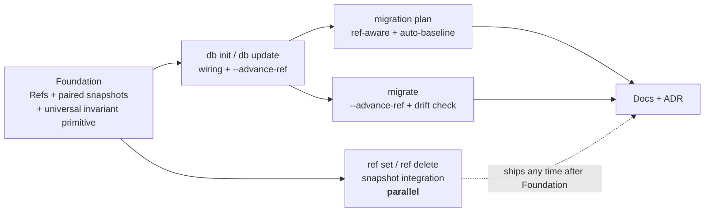

# Project Plan: dev-to-ship-migration-handoff

**Spec:** [`./spec.md`](./spec.md)
**Design notes:** [`./design-notes.md`](./design-notes.md)
**Scenarios:** [`./scenarios.md`](./scenarios.md)
**CLI surface delta:** [`./cli-surface.md`](./cli-surface.md)
**Linear Project (umbrella):** `[PN] Onboarding Audit`
**Original ticket:** [TML-2629](https://linear.app/prisma-company/issue/TML-2629/dev-ship-transition-broken-first-migration-plan-after-db-update)

**Purpose** _(from spec)_: Make Prisma Next's dev → ship transition trustworthy by construction: a developer following the documented workflow (`db update` for personal iteration, `migration plan` + `migrate` for team sharing) produces an applyable migration on the first formal step. Drift between local DB state, the on-disk migration graph, and the live DB marker surfaces at plan time or apply time with precise diagnostics, never as the unrecoverable `pathUnreachable` failure mode that triggered the TML-2629 audit finding.

## At a glance

Six slices: one foundation slice (refs + paired snapshots primitive in `@prisma-next/migration`), four feature slices wiring the primitive into `db init`/`db update`, `ref set`/`ref delete`, `migration plan`, and `migrate`, and one documentation slice. Shape is **stack-heavy with one parallel branch off the foundation and one parallel pair before docs** — there's no realistic all-parallel decomposition because every feature slice consumes the foundation primitive.

## Composition

### Stack (deliver in order)

#### 1. Slice — Refs + paired snapshots foundation

- **Purpose.** Land the on-disk pairing convention and the universal "from must be a graph node" invariant primitive, without yet wiring either into user-facing commands.
- **Scope.**
  - `@prisma-next/migration`: extend `writeRef` / `readRefs` / `deleteRef` to cascade snapshot writes/reads/deletes at `migrations/app/refs/<name>.contract.json` (+ `<name>.contract.d.ts`).
  - New primitive `readRefContract(refsDir, name) → ContractIR | null`.
  - New primitive `assertHashIsGraphNode(hash, graph)` (and its inverse predicate for use sites that need to branch rather than throw).
  - Atomic ref + snapshot updates (NFR4): partial states must be detectable and the writing command idempotent.
- **Spec items.** FR1, FR2, FR3, FR9 (primitive).
- **Linear issue.** _TBD — create at handoff (see "Linear creation" below)._
- **Depends on.** None.
- **Sizing.** 2–3 dispatches, M-sized total.
- **Risk.** Low — pure additive primitives in a single package; no consumer fan-out yet.

#### 2. Slice — `db init` and `db update` ref-write integration

- **Purpose.** Wire the foundation primitive into the dev-command family with the implicit-`db`-default rules from the spec.
- **Scope.**
  - `@prisma-next/cli`: add `--advance-ref <name>` flag to `db init` and `db update`.
  - Implement implicit `--advance-ref db` semantics:
    - Default DB + no explicit `--advance-ref` → advance `db`.
    - `--db <non-default-url>` → no implicit advancement (unless explicit `--advance-ref`).
  - Pair every ref write with the snapshot write using Slice 1's primitives.
  - Integration tests: default behaviour writes `db` ref + snapshot; `--advance-ref staging` writes staging instead; non-default `--db` doesn't write a ref unless explicit; partial scenarios from `./scenarios.md`.
- **Spec items.** FR5, FR6, FR7.
- **Linear issue.** _TBD._
- **Depends on.** Slice 1.
- **Sizing.** 2–3 dispatches, M-sized total.
- **Risk.** Low–medium — flag parsing surface is well-trodden; integration tests require fresh PGlite + Mongo fixtures.

#### 3. Slice — `migration plan` ref-aware planning + auto-baseline

- **Purpose.** The planner-side fix that closes the J4 trap. Most complex slice in the project.
- **Scope.**
  - `@prisma-next/cli` `migration-plan.ts`: change default `from` resolution to use the `db` ref (fallback to `null` if absent).
  - Implement the auto-baseline path: empty graph + non-null resolved `from` + contract source available → emit two bundles in one invocation.
  - Implement the universal "from must be a graph node" check on `--from` (and the default-resolved `from`).
  - Implement contract-source resolution from paired snapshot (Slice 1's primitive) for ref-resolved `from`.
  - Plan-time refuse for the forgot-the-flag case (non-empty graph + `from` not a graph node).
  - Plan-time refuse for the snapshot-missing case.
  - E2E test: TML-2629 J4 reproduction passes end-to-end (planner side; full e2e finalised in Slice 4).
- **Spec items.** FR9 (planner enforcement), FR10, FR11, FR12, FR13, FR14, FR15, FR16, PDoD4 (planner side), PDoD6.
- **Linear issue.** _TBD._
- **Depends on.** Slices 1 and 2.
- **Sizing.** 3–4 dispatches; PR boundary tight. The auto-baseline emission logic is the load-bearing piece — likely its own dispatch.
- **Risk.** **Medium.** Touches the planner's core resolution path. Three-case rule branches each need integration tests. Watch for the runner's idempotency-class assumption (A4) — if a baseline emits ops whose postconditions are already satisfied, the runner must skip via `postcheck_pre_satisfied`, not re-run; verify before merging.

#### 4. Slice — `migrate` `--advance-ref` flag + apply-time drift check

- **Purpose.** Runner-side fix and `migrate`'s new ref-advancement opt-in. Closes the cold-clone-drift trap.
- **Scope.**
  - `@prisma-next/cli` `migrate.ts`: add `--advance-ref <name>` flag.
  - Implement the pre-DDL drift check: read live marker, compare against the next-to-apply migration's `from`, refuse with improved `PN-RUN-3000` payload on mismatch.
  - Define the new `meta.kind` discriminant (e.g. `markerMismatch`) for the pre-DDL refusal, distinct from the existing `pathUnreachable`.
  - Improve the existing `pathUnreachable` payload's `fix` text (currently empty per scout report § 5).
  - Pair `--advance-ref` ref write with snapshot write on successful apply (using Slice 1 primitive).
  - E2E test: TML-2629 J4 reproduction passes end-to-end (full e2e, finalising what Slice 3 staged).
  - E2E test: cold-clone drift scenario surfaces the new pre-DDL refusal with both hashes named.
- **Spec items.** FR8, FR9 (runner enforcement on `--to`), FR17, NFR6, PDoD4 (runner side), PDoD5.
- **Linear issue.** _TBD._
- **Depends on.** Slices 1 and 2.
- **Sizing.** 2–3 dispatches.
- **Risk.** Low — additive flag + additive check; the runner's marker-read path already exists.
- **Parallel with Slice 3.** No surface overlap (different commands, different packages of `cli`). The shared dependency is Slice 2 (`db` ref must be writable for the J4 e2e), but Slices 3 and 4 themselves don't collide.

#### 5. Slice — Documentation + ADR

- **Purpose.** Make the new behaviour discoverable and recoverable in the documentation surfaces; capture the architectural pattern in an ADR.
- **Scope.**
  - `skills-contrib/prisma-next-migrations/SKILL.md`: new "dev → ship transition" section; document `db` ref's role; what `db init` / `db update` write; the auto-baseline two-bundle output; the forgot-the-flag pitfall.
  - `skills-contrib/prisma-next-migration-review/SKILL.md`: new row for the pre-DDL drift error (`markerMismatch` discriminant); update `MIGRATION.MARKER_NOT_IN_HISTORY` guidance.
  - `docs/architecture docs/subsystems/7. Migration System.md`: § Refs (paired snapshots); § `db init` and § `db update` (ref + snapshot writes); § Helpful commands (`--advance-ref` listings); universal "from must be a graph node" invariant.
  - **ADR** under `docs/architecture docs/adrs/`: refs-with-paired-snapshots pattern + universal invariant + asymmetric ref-advancement rules. (Settles OQ4: one ADR.)
- **Spec items.** FR18, FR19, FR20, PDoD10, PDoD11, PDoD12.
- **Linear issue.** _TBD._
- **Depends on.** Slices 1–4 merged (documentation reflects implemented behaviour).
- **Sizing.** 3–4 dispatches; wide-but-shallow.
- **Risk.** Low — documentation-only.

### Parallel group A (independent of stack)

#### Slice — `ref set` and `ref delete` snapshot integration

- **Purpose.** Wire Slice 1's primitives into the user-facing `ref` CLI surface so the new pairing rule applies uniformly. Parallel-safe because it touches `ref set` / `ref delete` (distinct files from the stack's `db-*` / `migrate` / `migration-plan` commands).
- **Scope.**
  - `@prisma-next/cli` `ref set <name> <hash>`:
    - Refuse if hash isn't a graph node (FR9 enforcement on `ref set`).
    - On accept, synthesise the paired snapshot from the migration bundle whose `to == hash`.
    - Write both `<name>.json` and `<name>.contract.json` + `<name>.contract.d.ts` atomically (NFR4).
  - `@prisma-next/cli` `ref delete <name>`:
    - Delete `<name>.json`.
    - Cascade-delete `<name>.contract.json` and `<name>.contract.d.ts`.
  - `@prisma-next/cli` `ref list`: no behavioural change; check that paired snapshots don't appear as phantom refs.
  - Tests: snapshot synthesis, cascade delete, refusal on non-graph-node hashes.
- **Spec items.** FR4, FR9 (enforcement on `ref set`).
- **Linear issue.** _TBD._
- **Depends on.** Slice 1.
- **Sizing.** 2 dispatches, S–M sized.
- **Risk.** Low.
- **Parallelism note.** Can land any time after Slice 1; doesn't block any other slice. Surface it in QA alongside the rest of the slices for consistency (Slice 5 documentation will mention `ref set` synthesising snapshots).

### No external dependencies

This project has no upstream blockers. All work happens inside `@prisma-next/migration` + `@prisma-next/cli`, and the runner change (Slice 4) is additive on top of the existing visitor-SPI runner (ADR 198) with no SPI changes.

## Dependencies (external)

- [x] **None.** All scope lives inside `@prisma-next/migration` and `@prisma-next/cli`; no SPI changes required of target packs; no contract IR surface changes (per spec § Contract impact).

## Project-DoD coverage map

| Project-DoD | Delivered by |
|---|---|
| **PDoD1.** All slices in plan delivered or deferred | Slices 1–5 + parallel A (definitional) |
| **PDoD2.** Manual-QA coverage across user-observable surfaces | Each slice carries its own `drive-qa-plan` (slice-DoD overlay); rolled up at close-out |
| **PDoD3.** Mandatory final retro complete; output landed | Close-out (`drive-run-retro` invocation) |
| **PDoD4.** J4 reproduction succeeds end-to-end with zero recovery | Slice 3 (planner side) + Slice 4 (full e2e) |
| **PDoD5.** Cold-clone drift surfaces pre-DDL refusal w/ both hashes named | Slice 4 (pre-DDL check + payload) |
| **PDoD6.** Forgot-the-flag surfaces plan-time refusal | Slice 3 (plan-time refuse path) |
| **PDoD7.** `pnpm lint:deps` clean | Every slice's DoD validation gate |
| **PDoD8.** `pnpm build` clean | Every slice's DoD validation gate |
| **PDoD9.** `pnpm fixtures:check` clean | Every slice's DoD validation gate (no fixture changes expected; verify) |
| **PDoD10.** Skill text updates landed | Slice 5 (docs + ADR) |
| **PDoD11.** Subsystem doc updated | Slice 5 (docs + ADR) |
| **PDoD12.** ADR landed | Slice 5 (docs + ADR) |
| **PDoD13.** References to `projects/dev-to-ship-migration-handoff/**` stripped | Close-out |
| **PDoD14.** `projects/dev-to-ship-migration-handoff/` deleted | Close-out |
| **PDoD15.** TML-2629 marked Done | Auto-handled by GitHub integration on merge; verify at close-out |
| **PDoD16.** Final status update on `[PN] Onboarding Audit` Project | Close-out |
| **PDoD17.** ADR audit walked | Close-out (final retro item) |

Every PDoD has a delivering unit. Plan is complete by the coverage gate (pitfall 4).

## Risks + open questions

1. **Slice 3 PR-cap pressure.** `migration plan`'s resolution + auto-baseline emission + three-case refuse paths is the most surface-heavy slice. Mitigation: the slice plan (run `drive-plan-slice` at pickup) should decompose into M-sized dispatches with the auto-baseline emission as its own dispatch and each refuse case verified by its own e2e test. If the dispatch count overflows or a dispatch sizes to L, re-split the slice along resolution-vs-emission lines.
2. **Runner idempotency assumption (A4).** The auto-baseline emission relies on the runner skipping ops whose postconditions are already satisfied (via `postcheck_pre_satisfied`). The first dispatch in Slice 3 must verify this assumption against a fresh PGlite scenario before the slice is considered done. If the runner *doesn't* skip cleanly, Slice 3's scope grows (or routes back to discussion). I12 candidate.
3. **`pathUnreachable` payload migration.** Slice 4 changes the existing empty `fix` field on `PN-RUN-3000`. If any downstream consumer parses the empty string, this is a (very mild) behaviour change. Mitigation: grep for `pathUnreachable` consumers before merging Slice 4; record findings.
4. **Recovery-affordance question (OQ1).** Decision deferred to Slice 4 pickup: ship a `migration recover` command, or document manual recovery in skill text. If the slice-time decision goes "ship the command," scope grows; either re-split Slice 4 or promote `migration recover` to its own slice. Tracked in `./design-notes.md § Open questions` and spec § Open Questions.
5. **Parallel group A's QA roll-up.** Slice 2 (parallel) and Slices 3–4 (stack) ship related-but-distinct ref-writing behaviour. Manual-QA roll-up at close-out should cover both `ref set` (synthesised snapshot) and `db update` (live snapshot) so the convention reads as one coherent surface to users, not two.

## Linear creation (handoff item)

Six Linear issues to create, all under the `[PN] Onboarding Audit` Project, all with `relatedTo: ["TML-2629"]`, none with `parentId` (per the no-linear-sub-issues rule):

| Plan position | Title (provisional) |
|---|---|
| Stack 1 | `Refs + paired contract snapshots foundation` |
| Stack 2 | `db init / db update ref-write integration` |
| Stack 3 | `migration plan ref-aware planning + auto-baseline` |
| Stack 4 | `migrate --advance-ref flag + apply-time drift check` |
| Stack 5 | `Documentation + ADR for refs-with-paired-snapshots pattern` |
| Parallel A | `ref set / ref delete snapshot integration` |

Each issue will:

- Link back to `projects/dev-to-ship-migration-handoff/spec.md` + the relevant slice section of this plan.
- Carry the spec items (FRs / PDoDs) the slice addresses.
- Be created at handoff (this is an MCP write; surfacing as a discrete authorization step rather than firing now).

Slice DoR (per `drive/calibration/dor.md`) requires Linear issues to exist before slice pickup, so they need to land before `drive-build-workflow` fires on any slice.

## Close-out (required)

Per `drive/calibration/dod.md § Project-DoD overlay`:

- [ ] Verify all acceptance criteria in [`./spec.md`](./spec.md) (PDoD1).
- [ ] Confirm the TML-2629 J4 reproduction passes end-to-end with no recovery sequence (PDoD4 e2e + manual-QA evidence).
- [ ] Confirm cold-clone drift scenario surfaces the new pre-DDL refusal (PDoD5).
- [ ] Confirm forgot-the-flag scenario surfaces the plan-time refusal (PDoD6).
- [ ] Run `pnpm lint:deps`, `pnpm build`, `pnpm fixtures:check` — all clean (PDoD7–9).
- [ ] Mandatory final retro complete; output landed in canonical / project-context / ADR (PDoD3).
- [ ] Migrate long-lived docs into `docs/` (ADR for refs-with-paired-snapshots lives at `docs/architecture docs/adrs/`).
- [ ] Strip repo-wide references to `projects/dev-to-ship-migration-handoff/**` (replace with canonical `docs/` links or remove). Run the grep gate from `drive/calibration/grep-library.md`.
- [ ] Delete `projects/dev-to-ship-migration-handoff/`.
- [ ] TML-2629 marked Done (verify auto-close); final status update on `[PN] Onboarding Audit` Linear Project linking the close-out retro.
- [ ] ADR audit (PDoD17): walk `./design-notes.md § Open questions` + spec § Open Questions for any decision that hasn't migrated to an ADR; block close-out until durable architectural decisions have ADRs.
