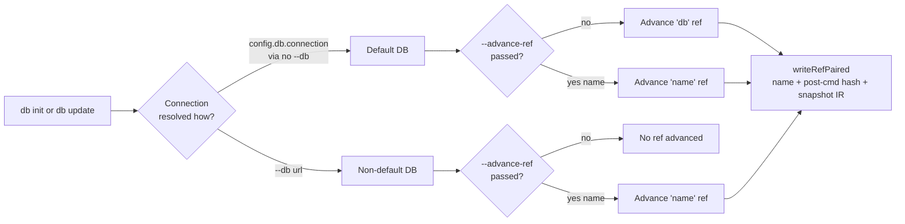
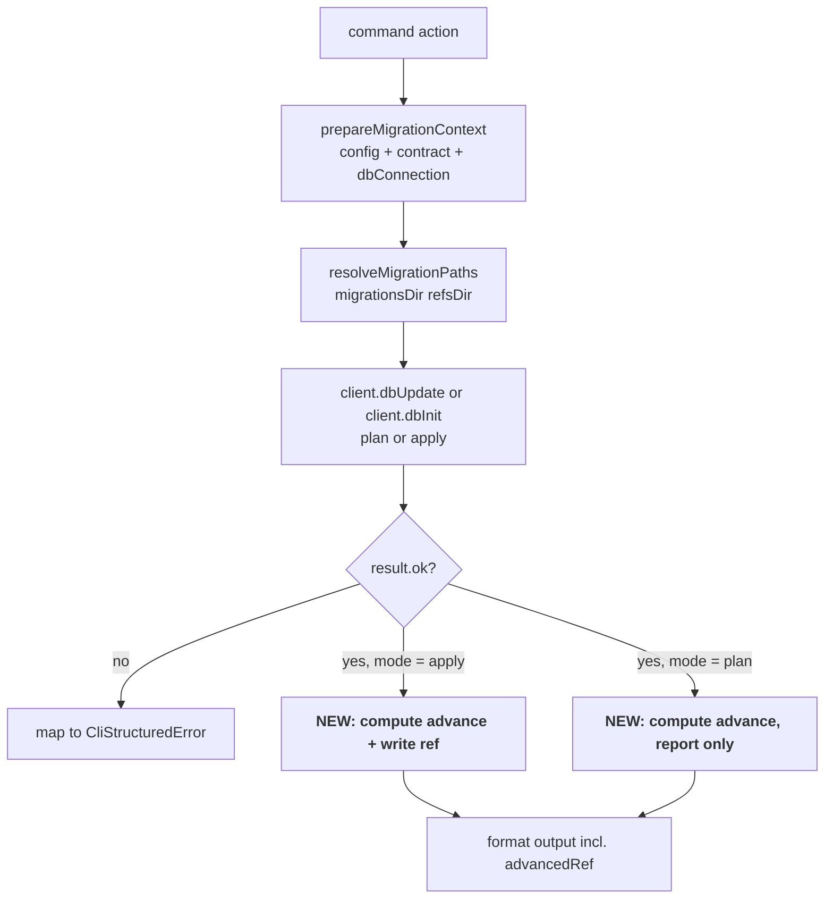

# Slice: `db init` / `db update` — ref-write integration + `--advance-ref`

_Parent project: [`projects/dev-to-ship-migration-handoff/`](../../). This slice satisfies **FR5**, **FR6**, **FR7** from [the project spec](../../spec.md). It also exercises Slice 1's `writeRefPaired` primitive in its first real consumer._

## At a glance

Wire the foundation slice's paired-snapshot writes into the two dev-mode commands that advance the live DB marker. After this slice ships, every `db init` / `db update` invocation that targets the project's default database also lands the `db` ref (pointer + paired contract snapshot) on disk — so `migration plan` in the next slice can read the dev-state contract IR without connecting to a database.

Three observable changes:

1. **`db init` and `db update` accept `--advance-ref <name>`.** Names the ref to advance to the post-command contract hash; the paired contract snapshot is written alongside.
2. **When the user runs against the default database without `--advance-ref`, the `db` ref is advanced implicitly.** "Default database" means `--db` was not passed (i.e. the connection resolved from `config.db.connection`).
3. **When the user passes `--db <url>` without `--advance-ref`, no ref is advanced.** Avoids surprising the user by treating a one-off command against a non-default database as a state-of-default-DB advancement.



## Scope

### In scope

- **`@prisma-next/cli`** `db-init.ts` + `db-update.ts`:
  - Add `--advance-ref <name>` option (commander option) to both commands. Reuses one shared definition (likely a new line in `addMigrationCommandOptions` in `migration-command-scaffold.ts`, or — if cleaner — colocated with each command).
  - On successful apply (`mode: 'apply'`, `result.ok`, post-DDL), compute whether a ref should be advanced and which name:
    - If `options.advanceRef` is provided → use that name.
    - Else if `options.db` is undefined → use `'db'` (implicit default).
    - Else → no ref advancement.
  - When a ref is to be advanced, call `writeRefPaired(refsDir, name, entry, snapshot)` with:
    - `name` = resolved ref name.
    - `entry.hash` = the post-command storage hash (already on `result.value.marker.storageHash`).
    - `snapshot` = the contract IR being applied (already loaded as `contractJson` in `prepareMigrationContext`, validated through the existing control-API pipeline).
  - On `--dry-run` (mode: `'plan'`), do **not** write any ref or snapshot. Print which ref *would* be advanced and to which hash in the dry-run output so the user can see intent before committing to apply.
- **Output reporting** (NFR3 — "no silent disk writes"):
  - Apply-mode output gains a "Advanced ref `<name>` → `<hash>`" line when a ref was written. JSON output gains an `advancedRef: { name, hash } | null` field on the result envelope.
  - Dry-run mode output gains a "Would advance ref `<name>` → `<hash>`" line. JSON output likewise gains a `plannedAdvanceRef: { name, hash } | null` field.
- **Integration tests** in the cli package's test suite:
  - Default DB + no `--advance-ref` → `migrations/app/refs/db.{json,contract.json,contract.d.ts}` lands after `db init`; same after `db update`.
  - Default DB + `--advance-ref staging` → `staging.{json,contract.json,contract.d.ts}` lands; no `db.*` files created or modified by the command.
  - `--db <url>` + no `--advance-ref` → no ref files created or modified.
  - `--db <url>` + `--advance-ref staging` → `staging.*` files land.
  - `--dry-run` + default DB + no `--advance-ref` → no ref files touched on disk; output names the ref+hash that would be advanced.
  - Re-running `db update` after a contract change advances the same ref again (idempotent rewrite per NFR4).
  - Failed apply (driver throws mid-DDL) → no ref written even if the marker was partially updated (atomicity from the command's perspective: ref advancement is a post-success step).

### Out of scope (this slice)

- **`migration plan` resolution path.** Default-`db`-ref consumption and auto-baseline emission live in Stack 3.
- **`migrate --advance-ref`.** Runner-side opt-in lives in Stack 4.
- **`ref set` / `ref delete`** behaviour change. Lives in parallel-group-A slice.
- **Universal `from must be a graph node` enforcement on `--to`.** `db update --to <ref>` already accepts refs (existing code at `db-update.ts L101–134`); tightening that path's invariant is Stack 3's job (the planner-side `from` check there is the load-bearing one).
- **Per-space `db` ref.** App-space only (matches project spec § Non-goals — extension-space dev-state tracking is its own design problem).
- **Backwards-compat migration of legacy on-disk refs.** Slice 1's NFR2 already covered: first rewrite under new code lands the snapshot; nothing eager.
- **CLI surface for listing or inspecting refs.** `ref list` is unchanged.
- **Documentation.** Skill text + subsystem doc edits live in Stack 5.

## Approach

The two commands each have the same hand-off shape (see `db-update.ts L78–219` and `db-init.ts` for parallel structure):



The new logic — "compute ref to advance + call `writeRefPaired`" — is a single helper function that both commands call after a successful apply. Putting it in a shared utility (likely a new function in `migration-command-scaffold.ts` next to `prepareMigrationContext` and `resolveMigrationPaths`, or a new `ref-advancement.ts` sibling if `migration-command-scaffold.ts` gets too crowded) means both commands stay thin and the implicit-`db`-default rule lives in exactly one place.

### The "is this the default database?" check

The slice uses a simple lexical test: the user passed `--db` ↔ non-default. Specifically: `options.db !== undefined`. The connection resolution in `prepareMigrationContext` (`migration-command-scaffold.ts L126`) is:

```typescript
const dbConnection = options.db ?? config.db?.connection;
```

So the slice's check uses `options.db` directly, not `dbConnection`. Rationale: the user's *intent* is what matters for ref advancement — a user who passes `--db postgres://prod...` against the project's prod DB is doing a one-off, not declaring "this is my default dev DB." Even if the URL happens to match `config.db.connection`, the explicit `--db` flag signals "this invocation is targeted, not part of my dev iteration." We optimise for the "I'm doing something special" reading.

### The contract IR snapshot source

Slice 1's `writeRefPaired` takes a `ContractIR` argument for the paired snapshot. The contract IR is already available in the command pipeline:

- For `db update` without `--to`: it's the `contractJson` loaded by `prepareMigrationContext` (validated by the control-API pipeline as part of `client.dbUpdate`).
- For `db update --to <ref>`: it's the `contractJson` that gets *replaced* at `db-update.ts L122–124` (loaded from `endContractPath` of the matching bundle); same variable, just sourced differently.
- For `db init`: it's the `contractJson` from the prepared context.

The snapshot is what was *applied* (post-DDL), so the variable name `contractJson` in the result branch is the right source — same value whether it came from the contract file or the bundle's `end-contract.json`.

### The hash to record

`result.value.marker.storageHash` is the post-apply storage hash (`db-update.ts L181`). That's the ref pointer's `hash` value. We don't need `profileHash` (refs are storage-hash-keyed, matching how the rest of the migration tooling addresses contracts).

### Atomicity (NFR4)

Ref advancement is a *post-success* step. If the apply succeeded but the ref write fails, the on-disk state has a DB whose marker is ahead of the `db` ref — which is one of the legacy-on-disk-state scenarios Slice 1's NFR2 already accounts for ("first rewrite under new code lands the snapshot"). On the next successful apply, the ref will land correctly. The command output should surface the ref-write failure clearly (NFR6: actionable diagnostics) so the user can manually re-run if recovery is needed. We do **not** attempt to roll back the DDL on a ref-write failure — that would be more disruptive than the consistency drift it would prevent.

The slice's atomicity story is therefore: *every successful ref advancement is itself atomic at the file-pair level* (via Slice 1's `writeRefPaired`). Cross-boundary atomicity (DDL ↔ file) is out of scope and would require distributed-transaction machinery that doesn't fit this project's scope.

### Output reporting (NFR3)

The user must see the ref write happen. Two surfaces:

- **Human-readable output** (`formatMigrationApplyOutput`, `formatMigrationPlanOutput`): one new line, `"Advanced ref \"db\" → sha256:..."` (or the actual ref name). The line is part of the success block, not the header; it shows up after "Applied N operations" and similar status lines.
- **JSON output** (`formatMigrationJson` via `MigrationCommandResult` envelope): one new field, `advancedRef: { name: string; hash: string } | null`. In dry-run mode the field is named `plannedAdvanceRef` for clarity; both fields can coexist in the type (one is always null).

The MigrationCommandResult interface in `formatters/migrations.ts` needs the additional optional field. Same shape additive change as past fields.

### CLI flag layout

`--advance-ref <name>` lives on each command directly (not in `addMigrationCommandOptions`). Rationale: it's a behavioural flag specific to the dev-command family; `addMigrationCommandOptions` already carries the shared connection / config / dry-run options; mixing in a behavioural flag clouds the helper's purpose. Slice 4's `migrate` will add the same flag (per FR8) with its own opt-in semantics; reuse of the helper would tempt the implementer to put implicit-default logic *in the helper*, which is wrong (the implicit rule is dev-command-only).

If, at dispatch time, the implementer finds a clean shared definition that *only* registers the option (no semantics), they may extract — but the default value (or absence thereof) must remain command-local.

## Edge cases (Example-Mapping)

| Edge case | Disposition | Notes |
|---|---|---|
| Default DB + no `--advance-ref` + success | **Handle** | Implicit `db` advancement. Test covers `db init` and `db update` paths separately (both must hit the same code path via the shared helper). |
| Default DB + `--advance-ref staging` + success | **Handle** | Explicit name wins over implicit default. `db.*` files are not touched. Test covers. |
| `--db <url>` + no `--advance-ref` + success | **Handle** | No ref advanced. Test asserts zero new files under `migrations/app/refs/`. |
| `--db <url>` + `--advance-ref staging` + success | **Handle** | Explicit advancement regardless of DB source. Test covers. |
| `--dry-run` + default DB + no `--advance-ref` | **Handle** | Mode is `'plan'`; the planned advancement is reported but not written. Test asserts no file changes + asserts the planned-advancement line/field is present. |
| `--dry-run` + `--advance-ref name` | **Handle** | Same: reported, not written. |
| Apply fails (control client returns `notOk`) | **Handle** | No ref write attempted. Test injects a planning failure via the control client (existing test infra supports this) and asserts zero ref-file changes. |
| Apply succeeds but `writeRefPaired` itself throws (disk full, permission, etc.) | **Handle** | Command output surfaces the ref-write failure; exit code is non-zero. The DDL stays applied (no rollback). Diagnostic includes the ref name + the underlying error code (NFR6). |
| `--advance-ref db` (explicit name = the default) | **Handle** | Same as the implicit case — single code path, no special-casing for the literal `"db"` name. Test covers. |
| `--advance-ref` with slashed name (`refs/staging/v1` per existing `REF_NAME_PATTERN`) | **Handle** | Slice 1 already supports slashed names; the wrapper passes the name through unchanged. Test covers one slashed name. |
| `--advance-ref` with invalid name (fails `REF_NAME_PATTERN`) | **Handle** | Slice 1's `writeRefPaired` already throws `MIGRATION.INVALID_REF_NAME` via `validateRefName`. The CLI wraps that into a `CliStructuredError` (using the existing `mapMigrationToolsError` path) so the user sees a structured error, not a stack trace. Test covers. |
| Default DB + `--advance-ref` provided WITHOUT a name (commander treats as boolean) | **Handle** | Commander will reject this at parse time (option declared with `<name>` requires a value). Test covers — assertion is "exits with usage error." |
| `db update --to <ref>` + no `--advance-ref` + default DB | **Handle** | The `--to` flag changes which contract is applied (to a historical bundle's `end-contract.json`), not the advancement semantics. The implicit `db` ref advances to the **applied** hash (which is the target hash from `--to`, not the current contract's hash). Test covers. |
| `db update --to <ref>` + `--advance-ref staging` | **Handle** | `staging` advances to the applied hash; same logic. Test covers. |
| `db update --to <ref>` against `--db <non-default>` + no `--advance-ref` | **Handle** | No ref advanced. Test covers. |
| Re-running the same command (idempotent rewrite) | **Handle** | `writeRefPaired` is idempotent (Slice 1 NFR4 covers). Test asserts content identical after re-run; `git status` clean. |
| Apply succeeds, ref write succeeds, but `--json` flag is set | **Handle** | JSON output carries `advancedRef: { name, hash }`. Test parses JSON and asserts. |
| Apply succeeds, ref-write would succeed, but disk is full during the snapshot's `.contract.d.ts` write | **Handle** | Slice 1's atomic write handles the cross-pair partial-write rollback. The cli surfaces this as a ref-write failure (with the original `MIGRATION.*` code in the meta). Tested at the slice-1 layer; this slice only verifies the CLI wraps the error correctly. |
| Apply succeeds against an extension-space `--space` flag (if it exists) | **Explicitly out** | Per project spec § Non-goals, extension-space dev-state tracking is a separate design problem. If `db init` / `db update` support a `--space` flag today (verify at dispatch time), this slice ignores it for ref-advancement purposes — `db` ref always tracks the app-space hash. If a `--space` flag is in flight and would conflict, that's a discovery for dispatch-1 reconnaissance (escalate to orchestrator). |
| The CLI is being run from a directory that has no `migrations/app/refs/` directory yet (fresh project) | **Handle** | `writeRefPaired` should be tolerant of a missing parent directory (existing `writeRef` uses `mkdir -p` semantics — verify at dispatch time; if it doesn't, add a `mkdir -p` step in the helper). |
| Ref name with leading/trailing whitespace from a shell paste mishap | **Handle** | Slice 1's `validateRefName` rejects per `REF_NAME_PATTERN`; the CLI surfaces as `MIGRATION.INVALID_REF_NAME`. Test covers one whitespace case. |

## Slice Definition of Done

Per `drive/calibration/dod.md § Slice-DoD overlay` + the canonical SDoD:

- [ ] **SDoD1.** All "Done when" gates from the slice plan pass: `pnpm typecheck`, `pnpm turbo test --filter @prisma-next/cli`, `pnpm test:integration --filter @prisma-next/cli` (PGlite + mongodb-memory-server scenarios), `pnpm lint:deps`, `pnpm build --filter @prisma-next/cli`, `pnpm fixtures:check`.
- [ ] **SDoD2.** Every pre-named edge case handled per its disposition. The `--space` edge case is documented as "explicitly out" in the spec; no implicit handling.
- [ ] **SDoD3.** Reviewer verdict `SATISFIED` on `projects/dev-to-ship-migration-handoff/reviews/code-review.md`.
- [ ] **SDoD4.** Manual-QA — **required**: this slice ships user-observable CLI behaviour. A `drive-qa-plan` script lands at `projects/dev-to-ship-migration-handoff/slices/db-cmds-ref-integration/manual-qa.md` covering the four scenarios from § Scope > In scope (default + implicit, default + explicit, non-default + no advance, non-default + explicit). The QA script is **not** required to be executed before slice merge (this is a "library + library-test" slice from a system perspective — the integration tests are the load-bearing coverage), but it must exist so the project-level QA roll-up at close-out has a coherent end-to-end story.
- [ ] **SDoD5.** Slice doesn't touch surfaces listed as out-of-scope: no edits to `migration-plan.ts`, `migrate.ts`, `ref.ts`. No subsystem-doc edits.
- [ ] **SDoD6.** Existing CLI command tests still pass unmodified — additive flag + post-success step mean no existing test should need to change. Exception: tests that mock `MigrationCommandResult` envelope shape may need to include the new optional fields if they assert envelope shape exactly; this counts as a localized envelope-extension change, not a behavioural regression.
- [ ] **SDoD7.** No new public-export drift: `pnpm lint:deps` clean. No new exports outside `@prisma-next/cli`.

## Open Questions

1. **`--advance-ref` extraction into `addMigrationCommandOptions`.** Working position: **no** — keep flag-registration command-local until Stack 4 also needs it; revisit then. If both commands' registrations end up byte-identical, the deduplication is trivial then. Dispatch-time call.
2. **JSON field naming.** `advancedRef` (apply) vs `plannedAdvanceRef` (dry-run) is one option; `refAdvancement: { mode: 'applied' | 'planned'; name, hash } | null` is another. Working position: two separate fields (simpler consumer code; one is always null in any given output); revisit if a JSON consumer surfaces a real preference.
3. **Tests' shape.** This slice's integration tests likely fit into the existing `db-init.integration.test.ts` / `db-update.integration.test.ts` neighbourhood (verify at dispatch time). Working position: extend in place rather than spawning new test files; if the existing files get unwieldy, factor out a `db-cmds-ref-advancement.integration.test.ts` sibling.
4. **`db init` failure surface for "ref dir doesn't exist."** Working position: `writeRefPaired` should `mkdir -p` the parent directory. If Slice 1's primitive doesn't do that today, the helper in this slice does it before calling `writeRefPaired`. Dispatch-time verification.
5. **The `--space` flag question.** If `db init` / `db update` already support multi-space invocation (e.g. `--space app`, `--space ext-name`), this slice's ref-advancement only fires on the app space — extension-space dev-state tracking is a separate design problem (project spec § Non-goals). Working position: confirm at dispatch time via grep; if `--space` exists, document the app-space-only behaviour in the slice's manual-QA script. If `--space` doesn't exist yet, no action needed.

## References

- Parent project: [`projects/dev-to-ship-migration-handoff/spec.md`](../../spec.md) §§ FR5–FR7, NFR3, NFR4
- Project plan (slice context): [`projects/dev-to-ship-migration-handoff/plan.md`](../../plan.md) § Stack 2
- Design notes: [`projects/dev-to-ship-migration-handoff/design-notes.md`](../../design-notes.md)
- Scenarios (worked walkthroughs): [`projects/dev-to-ship-migration-handoff/scenarios.md`](../../scenarios.md) — J4 trap-closing + iterative-long-project both exercise this slice's behaviour
- CLI surface delta: [`projects/dev-to-ship-migration-handoff/cli-surface.md`](../../cli-surface.md)
- Foundation slice (consumer): [`../foundation-refs-paired-snapshots/spec.md`](../foundation-refs-paired-snapshots/spec.md) — `writeRefPaired` primitive used here
- Existing `db update` command: [`packages/1-framework/3-tooling/cli/src/commands/db-update.ts`](../../../../packages/1-framework/3-tooling/cli/src/commands/db-update.ts)
- Existing `db init` command: [`packages/1-framework/3-tooling/cli/src/commands/db-init.ts`](../../../../packages/1-framework/3-tooling/cli/src/commands/db-init.ts)
- Shared scaffold: [`packages/1-framework/3-tooling/cli/src/utils/migration-command-scaffold.ts`](../../../../packages/1-framework/3-tooling/cli/src/utils/migration-command-scaffold.ts)
- Linear issue: _not created (operator declined Linear sync)_
