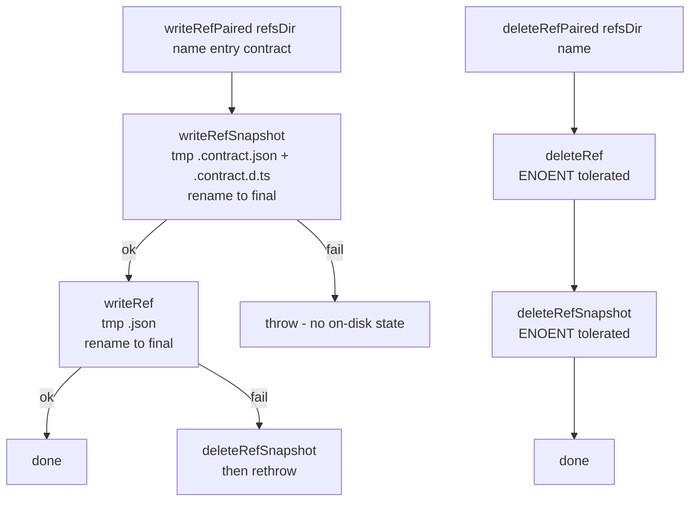

# Slice: Foundation — refs + paired contract snapshots

_Parent project: [`projects/dev-to-ship-migration-handoff/`](../../). This slice satisfies foundation primitives required by FR1, FR2, FR3, FR9 (primitive form), and NFR2, NFR4 from [the project spec](../../spec.md)._

## At a glance

Add three additive primitives to `@prisma-next/migration`: (1) paired contract-snapshot file I/O alongside a ref's pointer file, (2) atomic pair-write / cascade-delete wrappers that operate on ref + snapshot together, and (3) a `MigrationGraph`-node predicate + assertion. Existing `writeRef` / `deleteRef` callers are untouched in this slice — Slices 2–5 opt into the paired wrappers later.

## Scope

### In scope

- **New on-disk shape** under `migrations/app/refs/`:
  - `<name>.contract.json` — full contract IR at the ref's hash (canonicalised; same shape as a migration bundle's `end-contract.json`).
  - `<name>.contract.d.ts` — typed handle, structured the same way the existing emitter produces typed handles for migration bundles.
- **New primitives in `@prisma-next/migration` (additive only)**:
  - `writeRefSnapshot(refsDir, name, contract): Promise<void>` — writes `<name>.contract.json` + `<name>.contract.d.ts` atomically (temp-file + rename, same pattern as existing `writeRef`).
  - `readRefSnapshot(refsDir, name): Promise<ContractIR | null>` — reads + validates the snapshot; returns `null` if no snapshot exists for the ref.
  - `deleteRefSnapshot(refsDir, name): Promise<void>` — deletes `<name>.contract.json` + `<name>.contract.d.ts`; no-op if neither exists.
  - `writeRefPaired(refsDir, name, entry, contract): Promise<void>` — atomic wrapper: writes both pointer and snapshot; cleans up on partial failure so the on-disk state never advertises a ref without its snapshot or vice versa.
  - `deleteRefPaired(refsDir, name): Promise<void>` — atomic wrapper: cascades pointer + snapshot deletion.
  - `isGraphNode(hash, graph): boolean` — `graph.nodes.has(hash)` predicate, exported as a stable API.
  - `assertHashIsGraphNode(hash, graph): asserts hash is in graph.nodes` — throws a typed `MigrationToolsError` when the hash isn't a graph node; carries a diagnostic with the available reachable hashes.
- **Tests** in `packages/1-framework/3-tooling/migration/test/refs/` (extending the existing `contract-ref.test.ts` neighbourhood):
  - Snapshot I/O round-trips (write → read → equal).
  - Cascade delete (snapshot file removed; pointer file untouched; both removed via `deleteRefPaired`).
  - Atomic pair-write under failure injection (snapshot write fails mid-flight → pointer not written; pointer write fails → snapshot not written; partial state recoverable by re-running).
  - Backwards-compat read path: a ref pointer that has no paired snapshot — `readRefSnapshot` returns `null`, doesn't throw (NFR2).
  - `isGraphNode` / `assertHashIsGraphNode` over a constructed graph: empty-graph sentinel (`EMPTY_CONTRACT_HASH`) is a node; arbitrary unknown hash is not; assertion throws with reachable-hash list in the diagnostic.

### Out of scope (this slice)

- **No changes to existing `writeRef` / `deleteRef` callers** (`db init`, `db update`, `ref set`, `ref delete`, `migrate`). These move to the paired wrappers in Slices 2–5 of the project plan.
- **No `migration plan` resolution logic.** Default-ref resolution, auto-baseline emission, plan-time refuse paths all live in Stack 3.
- **No `migrate` drift check.** Apply-time pre-DDL marker comparison lives in Stack 4.
- **No CLI surface changes.** This slice ships library code only; no new flags, no new commands, no `prisma-next` binary changes.
- **Synthesising snapshots from existing migration bundles** (the `ref set` synthesis path). That's the parallel-A slice's job (`ref set` / `ref delete`).
- **Backwards-compat migration of existing on-disk refs without snapshots.** NFR2 already says "first rewrite under new code creates the paired snapshot" — that lazy migration falls out of Slices 2–5's behaviour; no eager migration ships here.

## Approach

The shape mirrors `writeRef` (see [`packages/1-framework/3-tooling/migration/src/refs.ts (L137–L155)`](../../../../packages/1-framework/3-tooling/migration/src/refs.ts)): temp-file write + atomic rename for each artifact, then composition into a paired wrapper that handles ordering and rollback.



The pair-write order is **snapshot first, pointer second**. Rationale: a snapshot without a pointer is an orphan but doesn't mislead readers (the ref doesn't exist, so the snapshot is unreferenced); a pointer without a snapshot misleads readers (the ref exists but the snapshot is missing, which violates the convention). If the snapshot write fails, no pointer was written and the ref doesn't exist from a consumer's view. If the pointer write fails, we roll back the snapshot so the on-disk state matches "ref doesn't exist."

The pair-delete order is **pointer first, snapshot second**. Rationale: once the pointer is gone, the ref doesn't exist (consumers won't try to read its snapshot); a lingering snapshot from a partial delete is recoverable by re-running `deleteRefPaired` (idempotent on ENOENT).

The `isGraphNode` / `assertHashIsGraphNode` primitives are trivial wrappers over the existing `MigrationGraph.nodes: Set<string>` (see [`packages/1-framework/3-tooling/migration/src/migration-graph.ts (L39–L60)`](../../../../packages/1-framework/3-tooling/migration/src/migration-graph.ts)). The point isn't new logic — it's giving Slices 2–5 a single stable export to consume so the universal "from must be a graph node" invariant has one source of truth.

```typescript
// Illustrative; final names + module paths confirmed at dispatch time.
export function isGraphNode(hash: string, graph: MigrationGraph): boolean {
  return graph.nodes.has(hash);
}

export function assertHashIsGraphNode(
  hash: string,
  graph: MigrationGraph,
): asserts hash is string {
  if (graph.nodes.has(hash)) return;
  throw new MigrationToolsError(
    'MIGRATION.HASH_NOT_IN_GRAPH',
    `Hash "${hash}" is not a node in the migration graph`,
    {
      why: `The migration graph contains nodes ${formatReachableHashes(graph)}; "${hash}" isn't one of them.`,
      fix: `Pass a hash that's the from-or-to of an on-disk migration bundle, or run "prisma-next migration plan" to introduce it.`,
      details: { hash, reachableHashes: [...graph.nodes].sort() },
    },
  );
}
```

## Edge cases (Example-Mapping)

| Edge case | Disposition | Notes |
|---|---|---|
| Snapshot file already exists; `writeRefPaired` called again with same contract | **Handle** | Idempotent: rewrite both files (same content); no diff in `git status`. Test covers byte-equality after rewrite. |
| Snapshot file already exists; `writeRefPaired` called with **different** contract | **Handle** | Overwrite (atomic). The contract is the new truth; the old snapshot is stale. Test covers the rewrite path. |
| Ref pointer exists; no paired snapshot (legacy on-disk state) | **Handle** | `readRefSnapshot` returns `null`. NFR2: backwards-compat read path. Test covers explicitly. |
| `writeRefSnapshot` fails mid-write (tmp rename fails) | **Handle** | No `.contract.json` or `.contract.d.ts` left on disk (temp file cleanup); pointer not yet written. Test uses fs failure injection. |
| `writeRef` fails after snapshot wrote | **Handle** | Roll back: `deleteRefSnapshot` to clean up the orphan. Test uses fs failure injection. |
| `deleteRefPaired` called on a ref with no paired snapshot | **Handle** | Idempotent: pointer deleted; snapshot delete tolerates ENOENT. Test covers. |
| `deleteRefPaired` — pointer missing, json-orphan present (json survived a partial earlier delete) | **Handle** | Self-healing: presence probe sees the json; delete the orphan, return success. Test covers. |
| `deleteRefPaired` — pointer missing, dts-only orphan (json missing, dts survived a partial earlier delete) | **Handle** | Self-healing: presence probe checks **both** `.contract.json` AND `.contract.d.ts`; delete the dts orphan, return success. Test covers. |
| `deleteRefPaired` — pointer missing, no snapshot files (genuine typo / non-existent ref) | **Handle** | Throw `MIGRATION.UNKNOWN_REF` (preserves existing `deleteRef` semantics for the genuine-typo case; doesn't silently no-op a delete on a name that never existed). Test covers. |
| Concurrent `writeRefPaired` calls on the same ref name | **Explicitly out** | No file-locking guarantees in this slice. Concurrent CLI invocations against the same project aren't supported today; if they become a real workflow, that's its own slice. |
| `isGraphNode(EMPTY_CONTRACT_HASH, graph)` on any graph (empty or non-empty) | **Handle** | Returns `true` — `EMPTY_CONTRACT_HASH` is always a node per `reconstructGraph` (it's the universal baseline sentinel). Test covers both empty + non-empty graphs. |
| `assertHashIsGraphNode` on a malformed (non-`sha256:...`) string | **Handle** | Throws; the diagnostic doesn't try to be helpful about the malformed input shape — that's `validateRefValue`'s job at the calling layer. Test covers. |
| `readRefSnapshot` on a malformed `.contract.json` (invalid IR) | **Handle** | Throws via the existing IR-schema validation (`errorInvalidRefFile`-shaped). Test covers; diagnostic names the file path. |
| Ref name with a slash (`refs/staging/v1`) per existing `REF_NAME_PATTERN` | **Handle** | The existing pattern allows `[a-z0-9/-]`. Snapshot files follow the same hierarchical layout; tests cover one slashed name. |
| Snapshot file's hash doesn't match the ref pointer's hash (post-hoc tamper) | **Explicitly out** | This slice doesn't add a self-consistency check between pointer.hash and snapshot.contractHash. If a consumer wants that, it's a separate verification pass — defer. Note in `## Open Questions`. |
| Disk full mid-write | **Handle** | Whatever error fs surfaces propagates; the atomic rename pattern + cleanup means we don't leave partial files. Test uses simulated `ENOSPC`. |
| `.contract.d.ts` write succeeds but `.contract.json` write fails (or vice versa) | **Handle** | Both are part of the snapshot pair. `writeRefSnapshot` must clean up the one that did write before rethrowing. Test covers via failure injection at each of the two writes. |

## Slice Definition of Done

Per `drive/calibration/dod.md § Slice-DoD overlay` + the canonical SDoD:

- [ ] **SDoD1.** All "Done when" gates from the slice plan pass: `pnpm typecheck`, `pnpm test:packages -- @prisma-next/migration`, `pnpm lint:deps`, `pnpm build` (clean turbo run), `pnpm fixtures:check` (no fixture changes expected; verify).
- [ ] **SDoD2.** Every pre-named edge case handled per its disposition. Edge cases marked "explicitly out" are documented in spec; no implicit handling.
- [ ] **SDoD3.** Reviewer verdict `SATISFIED` on `projects/dev-to-ship-migration-handoff/reviews/code-review.md`.
- [ ] **SDoD4.** Manual-QA — **explicit N/A**: this slice ships library primitives with no CLI surface and no user-observable behaviour change. Slices 2–5 (which wire these primitives into commands) are where manual-QA scripts apply.
- [ ] **SDoD5.** Slice doesn't touch surfaces listed as out-of-scope: no edits to `db-init.ts`, `db-update.ts`, `ref.ts` (the CLI command), `migrate.ts`, `migration-plan.ts`. No CLI flag additions. No subsystem-doc edits (those land in Stack 5).
- [ ] **SDoD6.** Existing `refs.test.ts` and `refs/contract-ref.test.ts` still pass unmodified — additive primitives mean no existing test should need to change. Caught case: anything that requires modifying an existing test counts as a behavioural change to non-snapshot code paths, which is out of scope.
- [ ] **SDoD7.** No new public-export drift: `pnpm lint:deps` clean. The new primitives are exported from the package barrel under whatever naming scheme the package's existing exports convention dictates.

## Open Questions

1. **Should `.contract.d.ts` reference `<name>.contract.json` via a typed JSON import, or be a hand-rolled `export type Contract = {…}` declaration?** Working position: follow whatever the existing emitter does for `end-contract.d.ts` (typed JSON import is the prevalent pattern; verify at dispatch time). Resolved at dispatch 1.
2. **Self-consistency check between ref pointer and snapshot.** Should `readRefSnapshot` verify that the snapshot's hash matches the pointer's hash? Working position: **no** — that's a verification-pass concern, not a read-path concern. The atomic pair-write should make divergence impossible-in-practice; if it surfaces from tampering, downstream commands will fail loudly via existing validation. Track for possible follow-up if reviewer pushes back.
3. **Exact error code for `assertHashIsGraphNode`.** Working position: `MIGRATION.HASH_NOT_IN_GRAPH` — distinct from `MIGRATION.UNKNOWN_REF`. Slice-time decision; could be merged with an existing code if a clean fit exists.
4. **Module path for the new primitives.** Options: extend `src/refs.ts` directly, or add a new sibling like `src/refs/snapshot.ts` next to the existing `src/refs/contract-ref.ts`. Working position: new sibling `src/refs/snapshot.ts` for the snapshot I/O + paired wrappers; `isGraphNode` / `assertHashIsGraphNode` go into a new sibling next to `src/migration-graph.ts` (e.g. `src/graph-membership.ts`). Reviewer or dispatch DoR can adjust.

## References

- Parent project: [`projects/dev-to-ship-migration-handoff/spec.md`](../../spec.md)
- Project plan (slice context): [`projects/dev-to-ship-migration-handoff/plan.md`](../../plan.md) § Stack 1
- Design notes (rationale): [`projects/dev-to-ship-migration-handoff/design-notes.md`](../../design-notes.md)
- Existing refs implementation: `packages/1-framework/3-tooling/migration/src/refs.ts`
- Existing refs subdirectory: `packages/1-framework/3-tooling/migration/src/refs/{types,contract-ref,migration-ref}.ts`
- Existing graph implementation: `packages/1-framework/3-tooling/migration/src/migration-graph.ts`
- Linear issue: _not created (operator declined Linear sync)_
