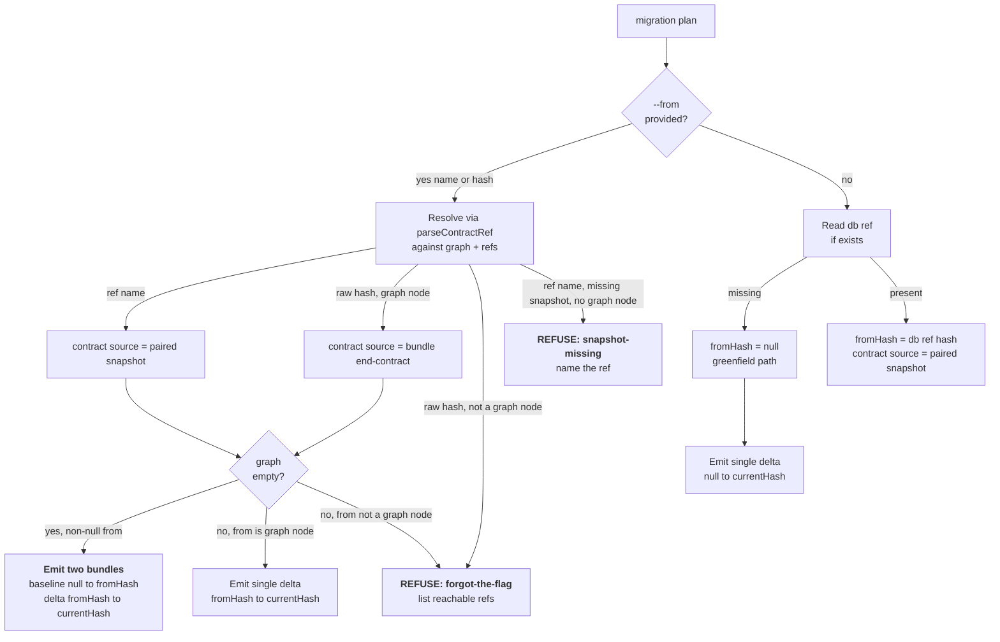
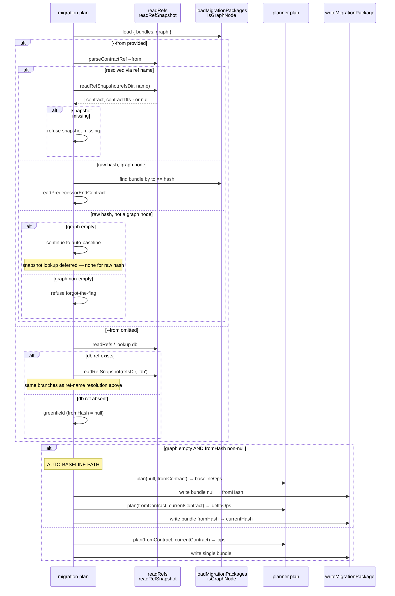

# Slice: `migration plan` — ref-aware resolution + auto-baseline emission

_Parent project: [`projects/dev-to-ship-migration-handoff/`](../../). This slice satisfies **FR9 (planner enforcement)**, **FR10**, **FR11**, **FR12**, **FR13**, **FR14**, **FR15**, **FR16**, **PDoD4 (planner side)**, and **PDoD6** from [the project spec](../../spec.md). It is the load-bearing slice for closing the TML-2629 J4 trap._

## At a glance

After this slice ships, `migration plan` resolves the from-hash through the `db` ref (and its paired snapshot) by default, enforces the universal "from must be a graph node" invariant, and emits the auto-baseline pair when an empty graph meets a non-null resolved from. The dev → ship transition (`db update` followed by `migration plan`) becomes applyable-by-construction.

Four observable changes:

1. **Default `from` resolution.** When the user omits `--from`, `migration plan` reads the `db` ref first; if absent (greenfield), falls back to `null` (existing greenfield path). Today's default — "the graph leaf" — moves below those two.
2. **Ref-resolved `from` reads contract from the paired snapshot.** When `from` resolves via a ref name (explicit `--from staging` or default `db`), the planner reads the from-contract from `<refsDir>/<name>.contract.json` (Slice 1's primitive) rather than from a migration bundle's `end-contract.json`. The bundle-as-contract-source path remains for the "raw-hash that's a graph node" case.
3. **Auto-baseline.** When the migration graph is empty, the resolved `from` is non-null, and a contract source exists at that hash, `migration plan` writes **two** migration bundles in one invocation: a baseline `null → fromHash` and the delta `fromHash → currentHash`. The user sees both in `git status` and commits both together.
4. **Plan-time refuse paths.** The universal "from must be a graph node" invariant gets enforced at plan time. When the graph is non-empty and the resolved `from` isn't a graph node ("forgot the flag"), the command refuses with a structured diagnostic naming reachable refs. When the resolved `from` is non-null but no contract source is locatable (snapshot missing AND no matching bundle), the command refuses with a separate diagnostic naming the affected ref.



## Scope

### In scope

- **`@prisma-next/cli` `migration-plan.ts`** rewrite of the `from`-resolution branch (`L240–301`):
  - When `options.from` is **not** provided:
    1. Attempt to read the `db` ref via `readRefs` + presence check.
    2. If `db` ref exists → `fromHash = db.hash`; `fromContract = (readRefSnapshot(refsDir, 'db')).contract` (deserialized via `familyInstance.deserializeContract`); `fromContractDts = (readRefSnapshot).contractDts` (for the auto-baseline bundle's `end-contract.d.ts`).
    3. Else, fall through to the existing greenfield path: `fromContract = null`, `fromHash = null`, no auto-baseline (it's just `null → currentHash`).
  - When `options.from` **is** provided:
    1. `parseContractRef(options.from, { graph, refs })` resolves the input to a hash.
    2. If the input is a **ref name** (the parse result indicates the source was `name` rather than `hash` — discover the exact discriminant via grep at dispatch time), read the paired snapshot and use that as the contract source.
    3. Else, the input is a **raw hash**. Apply Slice 1's `isGraphNode(hash, graph)`:
       - **Graph node:** existing path — find the matching bundle, read its `end-contract.json` via `readPredecessorEndContract`. Unchanged.
       - **Not a graph node:** **refuse** with the forgot-the-flag diagnostic. Even if a paired snapshot happens to exist for this hash (spec § Open Questions OQ5: working position is refuse), refuse — snapshots are paired artifacts of refs, not free-standing.
  - **Universal "from must be a graph node" enforcement** at the resolution boundary, with one legitimate escape: the auto-baseline path. Conceptually: any resolved `from`-hash that isn't a graph node must either trigger the auto-baseline (graph empty) or trigger a refuse (graph non-empty). No other escape.
- **Auto-baseline emission** when graph is empty + resolved `from` is non-null + contract source exists:
  - Invoke the planner once for `(null, fromContract) → baselineOps`.
  - Invoke the planner once for `(fromContract, currentContract) → deltaOps`.
  - Write **two** packages under `appMigrationsDir`, with timestamps such that the baseline's directory sorts before the delta's. The simplest path: same `timestamp = new Date()`, but the baseline uses a fixed slug (`baseline` or `null-to-${fromHash-short}`) and the delta uses the user's `--name` slug (default `migration`); insert a small delay (1ms is enough, or just `timestamp + 1ms`) so the second directory's prefix sorts after the first. Final ordering choice is the implementer's at dispatch time per spec § Open Questions.
  - Each bundle gets its own `metadata` with `from` / `to` set correctly; each gets its `migration.ts`, `ops.json`, `end-contract.{json,d.ts}`, and (where applicable) `start-contract.{json,d.ts}` files.
  - The baseline bundle's `end-contract.{json,d.ts}` is **the from-contract from the paired snapshot**, not the current contract. The delta bundle's `end-contract.{json,d.ts}` is the current contract.
- **Plan-time refuse paths** with structured `CliStructuredError` diagnostics:
  - **Forgot-the-flag.** `migration plan` resolved a from-hash via `--from` (or via `db` ref default) that isn't a graph node AND the graph is non-empty. Diagnostic shape: `MIGRATION.HASH_NOT_IN_GRAPH` (Slice 1's code) wrapped at the CLI layer; `why` names both hashes ("graph reaches ${listReachable}, resolved ${resolved}"); `fix` lists `--from <reachable-ref-name>` suggestions enumerating refs whose hash IS a graph node. If no such ref exists, the fix text falls back to "run `migration plan --from <graph-tip>`".
  - **Snapshot-missing.** Resolved `from` is non-null but no contract source is locatable (no paired snapshot AND no bundle with `to == fromHash`). Diagnostic shape: new error code `MIGRATION.SNAPSHOT_MISSING` (or fold into existing `errorFileNotFound`'s envelope — dispatch-time call); `why` names the ref or hash; `fix` suggests `ref delete <name>` (clear the orphan) or `db update --advance-ref <name>` to repopulate the snapshot.
- **Tests** at the cli unit + integration layer:
  - Unit-test the resolution function in isolation (no DB) covering each branch: explicit-hash-graph-node, explicit-hash-non-graph-node-empty-graph (→ auto-baseline-path), explicit-hash-non-graph-node-non-empty-graph (→ refuse), explicit-ref-name-with-snapshot, explicit-ref-name-without-snapshot (→ refuse), implicit-db-ref-present, implicit-db-ref-absent-greenfield.
  - Unit-test the auto-baseline emission function (the two-planner-invocation orchestrator) with a constructed pair of (empty, fromContract, currentContract).
  - Integration-test the planner-side J4 reproduction end-to-end: empty `migrations/app/`, populated `db` ref + snapshot (set up via `db update` from Slice 2), then `migration plan` produces two bundles. Asserts both bundles land + content shape.
  - Integration-test the forgot-the-flag refuse + the snapshot-missing refuse with structured diagnostic asserts.
  - Snapshot the new "auto-baseline two-bundle" output format (helper text in `formatMigrationPlanOutput`).

### Out of scope (this slice)

- **Apply-time drift check** in `migrate`. Lives in Stack 4. The pre-DDL marker comparison is the runner-side complement to this slice's plan-time refuse paths.
- **`migrate --advance-ref`.** Slice 4.
- **`ref set` graph-membership enforcement.** Parallel A. The universal invariant is enforced in three places (this slice + Slice 4 + Parallel A); the principles are the same but each command owns its own enforcement.
- **Backwards-compat migration of legacy on-disk refs without paired snapshots.** Per project spec NFR2, first rewrite under the new code lands the snapshot. This slice's resolution path encounters a legacy `db` ref by: (a) pointer file exists, (b) `readRefSnapshot` returns `null`. Disposition: if the graph is non-empty AND `db.hash` is a graph node, fall through to the bundle-as-contract-source path (existing behavior); if the graph is empty OR `db.hash` isn't a graph node, refuse with snapshot-missing diagnostic (the user re-runs `db update` per Slice 2 to repopulate the snapshot). No eager migration.
- **Documentation.** Skill + subsystem-doc updates live in Stack 5.
- **Output-format polish for the two-bundle case.** This slice ships a functional output ("Planned 2 migration packages: baseline ... + delta ..."). Aesthetic polish is open for refinement based on user feedback after the slice lands; tracked in OQ2 below.
- **Runner idempotency verification (assumption A4).** Verified end-to-end as part of Slice 4's J4 reproduction. This slice's tests stop at "the auto-baseline bundle pair lands on disk with correct shape."
- **CLI surface changes beyond the resolution path.** No new flags. `--from` semantics widen (it accepts a ref name today via `parseContractRef`; the new bit is that ref-resolved-from reads the snapshot rather than refusing). Help text gets a small touch-up for the auto-baseline behavior.
- **`prepareMigrationContext` refactor to hoist `contractDts`** (Slice 2 R1 reviewer note 2). `migration plan` is offline and doesn't use `prepareMigrationContext` — it reads the contract file directly at `migration-plan.ts:191–227`. The corresponding source-of-truth question for THIS slice is whether the from-contract's `.d.ts` is loaded via `readRefSnapshot` (for ref-resolved from) or via `getEmittedArtifactPaths` + `copyFilesWithRename` (for bundle-resolved from, the existing path) — both already in place. No refactor needed here.

## Approach

The current resolution branch at `migration-plan.ts:240–301` runs as:

1. `loadMigrationPackages(appMigrationsDir)` → `{ bundles, graph }`.
2. If `options.from`: `parseContractRef` → `fromHash`; find matching bundle by `metadata.to === fromHash`; read `end-contract.json` from bundle.
3. Else: `findLatestMigration(graph)` → if present, `fromHash = leaf.to`; read `end-contract.json` from leaf bundle. Else `fromHash = null` (greenfield).

The new branch replaces step 3 with the `db`-ref-default and inserts the snapshot-read + auto-baseline + refuse-paths logic into both 2 and 3.



The new resolution function is a single (large-ish) helper, ~80 LOC, that returns a discriminated result type:

```typescript
// Illustrative — final shape settled at dispatch time.
type FromResolution =
  | { kind: 'greenfield'; fromHash: null; fromContract: null }
  | { kind: 'graph-node'; fromHash: string; fromContract: Contract; sourceDir: string }
  | { kind: 'snapshot'; fromHash: string; fromContract: Contract; contractDts: string }
  | { kind: 'auto-baseline'; fromHash: string; fromContract: Contract; contractDts: string };
```

The four `kind`s carry exactly the information the emission branch needs:
- `greenfield` → single bundle `null → currentHash`.
- `graph-node` → single bundle `fromHash → currentHash`, copy `start-contract.{json,d.ts}` from `sourceDir`.
- `snapshot` → single bundle `fromHash → currentHash` (graph non-empty + ref-resolved), but the `start-contract.{json,d.ts}` come from the paired snapshot (not from a bundle).
- `auto-baseline` → two bundles. Baseline `null → fromHash` (using `fromContract`/`contractDts` as `end-contract.{json,d.ts}`); delta `fromHash → currentHash` (with `start-contract.{json,d.ts}` copied from the just-written baseline's `end-contract.{json,d.ts}`).

The fifth branch is implicit: refuse paths short-circuit before producing a `FromResolution`.

### Universal invariant enforcement

The universal "from must be a graph node" check (Slice 1's `assertHashIsGraphNode`) lives at exactly one place in this slice: the boundary where the resolved hash is about to be consumed by the bundle-source-resolution. Specifically:

- For `kind: 'snapshot'` (graph non-empty case), assert `isGraphNode(fromHash, graph)`. The implicit-`db` and explicit-`--from <ref>` paths share this — the snapshot's existence doesn't waive the invariant.
- For `kind: 'graph-node'`, the assertion is structurally guaranteed (we just found the bundle).
- For `kind: 'auto-baseline'` and `kind: 'greenfield'`, the assertion doesn't apply — the baseline path is the one legitimate escape; `null` is always a node.

The assertion failure produces the forgot-the-flag refuse via `assertHashIsGraphNode`'s `MIGRATION.HASH_NOT_IN_GRAPH` error, wrapped at the CLI layer with a `fix` enumerating reachable refs.

### Auto-baseline emission

When the resolver returns `kind: 'auto-baseline'`, the emission block runs two planner invocations:

```typescript
// Illustrative — final final shape at dispatch time.
const baselineOps = planner.plan({
  contract: fromContractFromSnapshot,
  schema: contractToSchema(null, frameworkComponents),  // empty schema
  fromContract: null,
  ...
}).operations;

const deltaOps = planner.plan({
  contract: currentContract,
  schema: contractToSchema(fromContractFromSnapshot, frameworkComponents),
  fromContract: fromContractFromSnapshot,
  ...
}).operations;
```

Two `writeMigrationPackage` invocations follow, each with its own metadata + `end-contract.{json,d.ts}` (and the delta gets `start-contract.{json,d.ts}` copied from the baseline's `end-contract.{json,d.ts}`).

The result envelope's `dir` field becomes `delta.dir` (the user's named bundle); the new `baselineDir` field is added optionally. Both surfaces (output + JSON) name both bundles so the user sees the two-bundle output as a coherent unit. The success summary widens from `Planned N operation(s)` to `Planned baseline + N operation(s)`.

### Two-bundle metadata

Both bundles get their own `migrationHash` (content-addressed). The baseline's `from` is `null`; its `to` is `fromHash`. The delta's `from` is `fromHash`; its `to` is `currentHash`. Both timestamps are within ~1ms of each other; the directory names sort baseline-first by virtue of the baseline's earlier timestamp.

### Snapshot-missing refuse vs. greenfield fallthrough

Two cases produce a `null` `fromContract`-from-snapshot situation:

- **Greenfield:** `db` ref doesn't exist on disk at all. `readRefs` returns no `db` entry. Continue as `greenfield`. The existing greenfield emission path handles `fromHash = null`.
- **Snapshot-missing:** `db` ref exists (pointer file on disk) but `readRefSnapshot` returns `null`. This is the legacy-on-disk case (NFR2) where a `db.json` pointer file lives without paired snapshot files. Disposition:
  - If `db.hash` IS a graph node → fall through to `kind: 'graph-node'` (read contract from the bundle whose `to == db.hash`).
  - If `db.hash` is NOT a graph node (the J4-shaped case where `db update` advanced past the graph) → refuse with `MIGRATION.SNAPSHOT_MISSING`; suggest `db update` to repopulate, or `ref delete db` to clear.

The split is structurally important: NFR2 says backwards-compat read paths shouldn't break; this slice honors that for the "still in the graph" case but refuses for the "advanced past the graph" case. The user gets one rerun of `db update` (Slice 2) to repopulate; after that, the trap is closed.

## Edge cases (Example-Mapping)

| Edge case | Disposition | Notes |
|---|---|---|
| Empty graph, `db` ref absent, contract has changes | **Handle (greenfield)** | Single bundle `null → currentHash`. Test covers. |
| Empty graph, `db` ref present + paired snapshot, contract has changes | **Handle (auto-baseline)** | Two bundles. The J4 closure case. Test covers as the centerpiece of this slice. |
| Empty graph, `db` ref present + paired snapshot, contract unchanged (`fromHash === currentHash`) | **Handle (no-op)** | Single no-op result; no bundles written. Existing no-op detection at `migration-plan.ts:329` already covers (after our new resolution sets `fromHash`). Test covers. |
| Non-empty graph, `db` ref present + paired snapshot + `db.hash` IS the graph tip | **Handle (normal delta)** | Single bundle `tipHash → currentHash`. Existing path; snapshot is read for consistency but the bundle would have served too. Test covers. |
| Non-empty graph, `db` ref present + paired snapshot + `db.hash` is a graph node but NOT the tip | **Handle (normal delta from non-tip)** | Single bundle `db.hash → currentHash`. Useful when a developer rolls back via `db update --to <older>` and then plans from there. Test covers. |
| Non-empty graph, `db` ref present + paired snapshot + `db.hash` NOT a graph node | **Refuse (forgot-the-flag)** | The user `db update`-d past the graph without committing the resulting migration first. Diagnostic names `db.hash`; `fix` lists reachable refs OR `--from <graph-tip>`. Test covers with structured-error assertion. |
| Non-empty graph, explicit `--from <ref-name>` + paired snapshot present + ref.hash IS a graph node | **Handle (normal delta)** | Same as the no-`--from` case with the matching ref. Test covers. |
| Non-empty graph, explicit `--from <ref-name>` + paired snapshot present + ref.hash NOT a graph node | **Refuse (forgot-the-flag)** | Same diagnostic shape as the implicit case. Test covers. |
| Non-empty graph, explicit `--from <raw-hash>` + raw-hash IS a graph node | **Handle (normal delta)** | Existing path; bundle-as-contract-source. Unchanged. Test covers (regression). |
| Non-empty graph, explicit `--from <raw-hash>` + raw-hash NOT a graph node | **Refuse (forgot-the-flag)** | OQ5: even if a paired snapshot happens to exist for that hash (e.g. the user manually created one), refuse — snapshots are paired artifacts of refs, not free-standing. Test covers. |
| Empty graph, explicit `--from <raw-hash>` (no snapshot anywhere, no graph) | **Refuse (snapshot-missing)** | No contract source. Test covers. |
| Empty graph, explicit `--from <ref-name>` + paired snapshot present | **Handle (auto-baseline)** | Same as the implicit-`db` case but the ref name is explicit. Test covers. |
| `db` ref pointer file present but **no** paired snapshot files (legacy on-disk state) AND `db.hash` IS a graph node | **Handle (normal delta from bundle source)** | NFR2 backwards-compat: read contract from the bundle whose `to == db.hash`. Test covers. |
| `db` ref pointer file present but no paired snapshot files AND `db.hash` is NOT a graph node | **Refuse (snapshot-missing)** | The J4-shaped legacy case. Diagnostic suggests `db update` to repopulate. Test covers. |
| `db.hash` resolves to a graph node but the bundle file has been deleted manually | **Existing path** | `readPredecessorEndContract` throws `errorFileNotFound`; existing error surface unchanged. Test covers (regression). |
| User runs `migration plan` with `--from db` explicitly (same as implicit default) | **Handle (same code path)** | `parseContractRef` resolves `db` as a ref name; the resolution function takes the `kind: 'snapshot'` (or `'auto-baseline'`) branch identically. Test covers. |
| Paired snapshot's `contract.json` validates via arktype but the family deserializer rejects it (e.g. legacy untagged shape, structural mismatch) | **Handle (existing `errorContractValidationFailed` shape)** | The deserialization happens at the read site (parallel to the bundle-source path); the existing error surface applies cleanly. Test covers one bad-shape case. |
| Paired snapshot's `contract.d.ts` is missing but `contract.json` is present | **Handle via Slice 1 (`readRefSnapshot` throws `errorInvalidRefFile`)** | Surfaces as `MIGRATION.INVALID_REF_FILE` → `CliStructuredError`. Test asserts the error surface. |
| `prisma-next migration plan` invoked in a project that uses extension packs (extension-space contracts) | **Handle (no change to extension-space behavior)** | The seed-phase / aggregate-phase code at `migration-plan.ts:303–326` and `353–369` is untouched. The resolution-and-emission changes are app-space-only (matching the project spec's app-space-only scope for `db` ref). Test covers one extension-pack scenario to verify no regression. |
| Auto-baseline + extension packs | **Handle (extension packs still seed before the two-bundle write)** | The seed-phase runs once at the top of the command; both bundles are app-space-only. Extension packs flow through `seedResult` unchanged. Test covers. |
| Two-bundle output: user wants to suppress the baseline (e.g. they want a manual baseline path) | **Explicitly out** | No opt-out flag in this slice. The auto-baseline is the J4 closure path; users who want manual control over the baseline can `ref set db <graph-tip>` to push the resolved `db` hash into the graph first, then plan as a normal delta. Reconsider if real workflows surface a need. |
| Concurrent `migration plan` invocations | **Explicitly out** | No file-locking; same as Slice 1 + Slice 2's stance on concurrent CLI invocations. |
| `--from null` (literal string) | **Handle (existing parseContractRef)** | `parseContractRef` may or may not accept the literal `"null"` — discover at dispatch time. If it does, treat as the greenfield case. If it doesn't, surface the existing rejection. Not a new edge case for this slice. |
| Plan-time refuse with `--json` | **Handle** | The structured error surfaces in JSON output via `handleResult`'s existing path. Test asserts the JSON envelope shape. |
| Plan-time refuse + verbose mode | **Handle** | Existing verbose-flag plumbing carries through. Not tested separately. |

## Slice Definition of Done

Per `drive/calibration/dod.md § Slice-DoD overlay` + the canonical SDoD:

- [ ] **SDoD1.** All "Done when" gates from the slice plan pass: `pnpm typecheck`, `pnpm vitest run` direct in `@prisma-next/cli` (avoiding the turbo env-pollution flake from Slice 2 ground-truthing), `pnpm vitest run` direct in the integration test suite, `pnpm lint:deps`, `pnpm build --filter @prisma-next/cli`, `pnpm fixtures:check`.
- [ ] **SDoD2.** Every pre-named edge case handled per its disposition. The "explicitly out" rows (two-bundle opt-out, concurrent invocations) are documented as out-of-scope in spec; no implicit handling.
- [ ] **SDoD3.** Reviewer verdict `SATISFIED` on `projects/dev-to-ship-migration-handoff/reviews/code-review.md`.
- [ ] **SDoD4.** Manual-QA — **required**: this slice ships user-observable CLI behaviour. The `manual-qa.md` extends the slice-2 script with the J4 reproduction scenario walked as a real user (default `db update` → contract edit → `migration plan` → assert two bundles land). Authored at slice close-out via `drive-qa-plan` invocation.
- [ ] **SDoD5.** Slice doesn't touch surfaces listed as out-of-scope: no edits to `migrate.ts`, `db-init.ts`, `db-update.ts`, `ref.ts`. No subsystem-doc edits. No `@prisma-next/migration-tools` source modifications (the consumer treats Slice 1's primitives as a black box).
- [ ] **SDoD6.** Existing `migration-plan.ts` tests still pass unmodified, except where existing tests assert the old "from = graph leaf" default behaviour — those tests need updating to reflect the new "from = `db` ref by default" semantics. The slice plan enumerates which tests need touching at dispatch time.
- [ ] **SDoD7.** No new public-export drift: `pnpm lint:deps` clean. No new exports outside `@prisma-next/cli` (Slice 1's primitives are consumed; no new ones added).

## Open Questions

1. **Bundle ordering for auto-baseline. SETTLED at slice close: (b) timestamp-based, with +60s (not +1ms) delta.** The two bundles must sort baseline-first by directory name. Options considered: (a) same timestamp, distinct slugs sorted lexicographically (`baseline-...` < `migration-...`); (b) different timestamps (baseline = `now`, delta = `now + 1ms`); (c) explicit ordinal in the directory name. Initial working position was (b) with a +1ms delta. **Landed choice: (b) with a +60s delta.** `formatMigrationDirName` produces directory names of shape `${YYYYMMDD}T${HHMM}_${slug}` — minute precision only. A +1ms delta produces identical prefixes, forcing ordering to fall through to slug-only lexicographic compare, which inverts whenever the user's `--name` slug sorts before `baseline` (e.g. `add_users` < `baseline`). The +60s delta forces a different minute prefix, guaranteeing baseline-first ordering regardless of the slug.
2. **Output format for the two-bundle case.** The success line "Planned 2 migration packages: baseline ... + delta ..." is the working position. Final wording is bikeshedding; iterate based on the dispatch's UX feel. Lock at slice close.
3. **`MIGRATION.SNAPSHOT_MISSING` error code naming.** Options: distinct new code (`MIGRATION.SNAPSHOT_MISSING`), or fold into existing `errorFileNotFound` envelope. Working position: distinct new code — it's a structurally meaningful refuse with different `fix` guidance than a generic missing-file error. Decide at dispatch time.
4. **`--from <raw-hash>` with paired snapshot present but not a graph node.** Spec OQ5 (project-level) working position: refuse. Honoring that here. If a future workflow surfaces a real need for "use this orphan snapshot as the from-contract," that's its own discussion; for this slice, the answer is no.
5. **Backwards-compat with legacy on-disk refs without paired snapshots when `db.hash` is mid-graph.** Working position: fall through to bundle-as-contract-source (existing behavior). The user gets one free pass; the next `db update` lands the paired snapshot and the legacy case is gone. Reconsider if reviewer disagrees.
6. **Where does the `db`-ref-default vs `findLatestMigration(graph)` precedence settle?** Today's default is the graph leaf (`findLatestMigration`). The new default is the `db` ref. If both are present (graph non-empty + `db` ref points at graph tip), they coincide — same hash, same contract source. But if `db` ref points at non-tip (rollback case) and the graph has a tip, the new default uses `db`. Working position: `db` ref always wins when present. The graph-leaf fallback is only consulted when both `--from` is absent AND `db` ref is absent (a pre-Slice-2 project). Lock at dispatch time.

## References

- Parent project: [`projects/dev-to-ship-migration-handoff/spec.md`](../../spec.md) §§ FR9–FR16, PDoD4, PDoD6
- Project plan: [`projects/dev-to-ship-migration-handoff/plan.md`](../../plan.md) § Stack 3
- Project design notes: [`projects/dev-to-ship-migration-handoff/design-notes.md`](../../design-notes.md)
- Project scenarios: [`projects/dev-to-ship-migration-handoff/scenarios.md`](../../scenarios.md) — J4 trap-closing + iterative-long-project + forgot-the-flag all exercise this slice
- CLI surface delta: [`projects/dev-to-ship-migration-handoff/cli-surface.md`](../../cli-surface.md)
- Foundation slice (consumer of primitives): [`../foundation-refs-paired-snapshots/spec.md`](../foundation-refs-paired-snapshots/spec.md) — `readRefSnapshot`, `isGraphNode`, `assertHashIsGraphNode`
- Slice 2 (writes the snapshots this slice reads): [`../db-cmds-ref-integration/spec.md`](../db-cmds-ref-integration/spec.md)
- Existing `migration plan` command: [`packages/1-framework/3-tooling/cli/src/commands/migration-plan.ts`](../../../../packages/1-framework/3-tooling/cli/src/commands/migration-plan.ts)
- Linear issue: _not created (operator declined Linear sync)_
