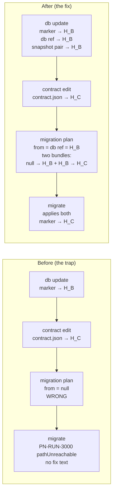

# Summary

Close the most severe Trap surfaced by the Onboarding Audit (TML-2629): a developer following the documented dev → ship workflow gets an unapplyable migration on the first formal step. The fix extends refs with paired contract snapshots, makes `migration plan` aware of the dev DB's last-known state via a default `db` ref, and adds precise drift diagnostics at both plan time and apply time so future failures (cold-clone drift, forgot-the-flag) surface immediately and actionably rather than as a generic `PN-RUN-3000 pathUnreachable`.

**Tracker:** [TML-2629 — Dev → ship transition broken](https://linear.app/prisma-company/issue/TML-2629/dev-ship-transition-broken-first-migration-plan-after-db-update)
**Linear Project (umbrella):** `[PN] Onboarding Audit`
**Working branch:** `tml-2629-dev-ship-transition-broken-first-migration-plan-after-db`

# Purpose

Make Prisma Next's dev → ship transition trustworthy by construction: a developer following the documented workflow (`db update` for personal iteration, `migration plan` + `migrate` for team sharing) produces an applyable migration on the first formal step. Drift between local DB state, the on-disk migration graph, and the live DB marker surfaces at plan time or apply time with precise diagnostics, never as the unrecoverable `pathUnreachable` failure mode that triggered the TML-2629 audit finding.

# At a glance

The trap, as audited (J4 run-013): a developer scaffolds an app, runs `db init`, iterates locally with `db update`, then adds a model and runs `migration plan` to formalise the change. The planner — which is offline and reads only the on-disk migration graph — finds an empty graph and silently emits a `from: null` migration. `migrate` then refuses to apply that migration because the live DB marker has advanced past `null` (`db update` advanced it). The developer ends up with a committed migration directory the framework refuses to run, and no actionable hint in the error payload. Recovery requires a six-step manual sequence no skill documents.

The shape the project ships:

After the fix: one `migration plan` + one `migrate`, no recovery. The two-bundle output is visible in `git status` before commit; the user knows exactly what they're committing.

The same machinery (refs + paired snapshots + universal "from must be a graph node" invariant) closes adjacent traps: cold-clone drift surfaces as a pre-DDL refusal with both hashes named; iterative `db update` after formalisation (forgot-the-flag) surfaces at plan time with a "did you mean `--from production`?" diagnostic.

# Scope

## In scope

- Refs gain paired contract snapshots (`migrations/app/refs/<name>.contract.json` + `.contract.d.ts`).
- `db init` and `db update` advance a default `db` ref + snapshot; both accept `--advance-ref <name>` to override.
- `migration plan` defaults `from` to the `db` ref; auto-emits a baseline bundle in addition to the user's named delta when the migration graph is empty.
- `migrate` accepts `--advance-ref <name>` (opt-in, no implicit ref write).
- Universal "from must be a graph node" invariant enforced across `migration plan --from`, `migrate --to`, `ref set`.
- Pre-DDL drift check in `migrate` with improved `PN-RUN-3000` payload.
- `ref set <name> <hash>` synthesises and writes the paired snapshot; `ref delete <name>` cascades.
- Skill text updates (`prisma-next-migrations`, `prisma-next-migration-review`).
- Subsystem doc updates (`docs/architecture docs/subsystems/7. Migration System.md`).
- ADR for the refs-with-paired-snapshots pattern as part of close-out.

## Non-goals

- **Per-space `db` ref** (one per loaded contract space, mirroring extension head refs). App-space-only for this scope. Extension-space dev-state tracking is its own design problem if it surfaces as a real workflow.
- **Online planner**. The design explicitly preserves the offline-planner invariant.
- **Migration squash / baseline operations.** The squash-first advisor (ADR 102) is untouched.
- **Recovery affordance for already-broken legacy projects** (pre-fix `migration plan` outputs sitting unapplyable in someone's repo). The new design closes the trap for new states; legacy recovery is an open question; decide at slice time whether to ship a one-shot `migration recover` command or document manual recovery.
- **Per-environment ref management beyond what already exists.** Creating environment refs automatically, syncing across environments, etc. is separate work.
- **Multi-target dev-state tracking** beyond the existing Postgres + Mongo families. The design works for both; no new target-specific code.

# Approach

The settled design lives in [`./design-notes.md`](./design-notes.md). The four capability-level moves:

**1. Refs as the framework's local source of truth.** The dev-state ref (`db`) reuses the existing ref machinery — no new on-disk concept, no parallel storage, no reserved-names protection. `db init` and `db update` advance the `db` ref by default; `migrate` opts in via `--advance-ref`. The same `--advance-ref <name>` flag overrides the default cleanly across all three commands. `db` is a default name, not a magic one — users can `ref set db <hash>` or `ref delete db` like any other ref.

**2. Refs grow optional paired contract snapshots.** The `migration plan` resolution path needs the contract IR at the resolved `from`-hash to compute the operations diff. When the from-hash isn't anywhere in the on-disk migration graph (the J4 case: empty graph + `db` ref pointing at a hash advanced by `db update`), the contract IR has to come from somewhere on disk. The design pairs every ref-write with a contract-snapshot write at `<name>.contract.json` (+ `.d.ts`). The rule is uniform: any ref write or change refreshes the paired snapshot; any ref delete cascades. *No stale ref contracts, ever.*

**3. `migration plan` consults the dev-state by default; emits applyable plans by construction.** Default `from` resolution: explicit `--from` wins; otherwise default to the `db` ref; fall back to `null` (greenfield) if `db` ref is absent. Three emission cases: graph empty + non-null `from` + snapshot available → auto-baseline (two bundles, encoding the dev iteration as a runnable migration plus the user's named delta); graph non-empty + `from`-hash is a graph node → emit just the delta; graph non-empty + `from`-hash isn't a graph node → refuse with a "did you mean `--from <reachable-ref>`?" diagnostic. The universal "from must be a graph node" invariant guarantees no bundle's `from` end can dangle.

**4. Drift diagnostics at both lifecycle points.** Plan-time refuse catches forgot-the-flag cases before the bad bundle is committed. Apply-time pre-DDL check in `migrate` reads the live marker (already established in the existing DB connection), compares against the planned `from`, and refuses with hash-naming mitigations on mismatch. The existing `PN-RUN-3000 pathUnreachable` payload — empty `fix` text today (scout report § 5) — gets actionable mitigations and a new `meta.kind` discriminant for the pre-DDL refusal case.

See [`./scenarios.md`](./scenarios.md) for six worked workflow walkthroughs (J4 trap-closing, iterative-long-project, forgot-the-flag, cold-clone drift, CI deploy, non-graph-node `ref set`) and [`./cli-surface.md`](./cli-surface.md) for the CLI reference delta.

## Contract impact

This project **does not modify contract IR structure** — no new entity kinds, no new fields on existing kinds, no changes to canonicalisation or hashing. It introduces a **new persistence surface for contract IRs**: paired snapshots at `migrations/app/refs/<name>.contract.json` (+ `.contract.d.ts`), each holding the full contract IR at the ref's hash. The IR format inside the snapshot is identical to what migration bundles already write to `end-contract.json` (same canonicalisation, same hash invariants); only the file location is new.

Downstream consumers of `contract.json` are unaffected. The new files are framework-internal — they're read by the planner (Slice 4) and the runner (via the new pre-DDL drift check, Slice 5); they're not part of any public artifact surface.

## Adapter impact

**None.** No target adapters touched. The changes live in:

- `@prisma-next/migration` (refs + paired snapshots primitive; universal invariant).
- `@prisma-next/cli` (`db init`, `db update`, `migrate`, `migration plan`, `ref set`, `ref delete`).

The runner (which uses adapters via visitor SPIs per [ADR 198](../../docs/architecture%20docs/adrs/ADR%20198%20-%20Runner%20decoupled%20from%20driver%20via%20visitor%20SPIs.md)) gets an additive pre-DDL drift check; the SPI surface is unchanged. Postgres, MongoDB, and any future target adapters require zero changes to integrate.

## ADR pointer

The project commits to authoring one ADR as part of close-out, covering the **refs-with-paired-snapshots pattern + universal "from must be a graph node" invariant**. The ADR will live under `docs/architecture docs/adrs/`. Decision content: refs as the framework's local source of truth for dev-state; the snapshot-pairing rule; the universal invariant and why the auto-baseline path is its only legitimate escape; the asymmetric ref-advancement rules between dev-command family and `migrate`. Slice 6 (Documentation) carries the ADR work.

# Project Definition of Done

Per the canonical project DoD + the team's overlays in [`drive/calibration/dod.md`](../../drive/calibration/dod.md):

## Slice / plan-side

- [ ] **PDoD1.** All slices in [`./plan.md`](./plan.md) delivered or explicitly deferred (in `projects/dev-to-ship-migration-handoff/deferred.md`).
- [ ] **PDoD2.** Manual-QA coverage across user-observable surfaces (at minimum: the J4 dev → ship transition, cold-clone drift, forgot-the-flag); no unresolved 🛑 Blocker findings.
- [ ] **PDoD3.** Mandatory final retro complete; output landed in canonical / project-context / ADR (per [`drive/retro/README.md`](../../drive/retro/README.md)).

## Project-specific

- [ ] **PDoD4.** TML-2629 J4 reproduction (audit run-013 sequence: `db init` → `db update` → contract edit → `contract emit` → `migration plan` → `migrate`) succeeds end-to-end with zero recovery commands. Reproduction lives in `e2e` tests and in the manual-QA script.
- [ ] **PDoD5.** Cold-clone drift scenario surfaces a pre-DDL refusal with both hashes named and actionable mitigations in the error payload (verified by e2e + manual QA).
- [ ] **PDoD6.** Forgot-the-flag scenario surfaces a plan-time refusal with `--from <reachable-ref>` hints (verified by e2e + manual QA).

## Repo-wide gates

- [ ] **PDoD7.** `pnpm lint:deps` clean.
- [ ] **PDoD8.** `pnpm build` clean (turbo cache OK).
- [ ] **PDoD9.** `pnpm fixtures:check` clean.

## Documentation & migration

- [ ] **PDoD10.** Skill text updates landed: `skills-contrib/prisma-next-migrations/SKILL.md`, `skills-contrib/prisma-next-migration-review/SKILL.md`.
- [ ] **PDoD11.** Subsystem doc updated: `docs/architecture docs/subsystems/7. Migration System.md` (§ Refs, § `db init`, § `db update`, § Helpful commands, plus the universal "from must be a graph node" invariant).
- [ ] **PDoD12.** ADR for refs-with-paired-snapshots pattern + universal invariant landed under `docs/architecture docs/adrs/`.
- [ ] **PDoD13.** References to `projects/dev-to-ship-migration-handoff/**` removed from the codebase (per the doc-maintenance rule).
- [ ] **PDoD14.** `projects/dev-to-ship-migration-handoff/` deleted from the repo.

## Linear close-out

- [ ] **PDoD15.** TML-2629 marked Done (auto-handled by GitHub integration on merge; verify).
- [ ] **PDoD16.** Final status update on the `[PN] Onboarding Audit` Linear Project notes TML-2629's resolution and links the close-out retro.

## ADR audit (final-retro item)

- [ ] **PDoD17.** Walk `design-decisions.md` (or `design-notes.md` § Open questions) for any decision that hasn't migrated to an ADR; block close-out until cross-cutting / hard-to-reverse decisions have ADRs.

# Functional Requirements

## Refs + paired snapshots foundation

- **FR1.** Refs gain an optional paired contract snapshot at `migrations/app/refs/<name>.contract.json` plus `<name>.contract.d.ts` for the typed handle.
- **FR2.** Any operation that writes or changes a ref also writes / refreshes the paired snapshot atomically with the ref write.
- **FR3.** `ref delete <name>` deletes the paired snapshot and typed handle along with the ref pointer.
- **FR4.** `ref set <name> <hash>` refuses if `<hash>` is not a graph node (per FR9 below). When accepted, it synthesises the paired snapshot from the migration bundle whose `to == hash` and writes it alongside the ref.

## Default ref-advancement behaviour

- **FR5.** `db init` (default DB, no `--advance-ref`) advances the `db` ref + paired snapshot to the post-init contract hash.
- **FR6.** `db update` (default DB, no `--advance-ref`) advances the `db` ref + paired snapshot to the post-update contract hash.
- **FR7.** `db init` and `db update` accept `--advance-ref <name>` to override the implicit `db` default; the named ref + paired snapshot is written instead.
- **FR8.** `migrate` does *not* advance any ref unless `--advance-ref <name>` is provided. With the flag, the named ref + paired snapshot is written to the migration target hash.

## Graph-integrity invariants

- **FR9.** **Universal "from must be a graph node" invariant.** Any command that resolves a `from`-hash refuses if the hash is not a graph node (i.e. not the `from` or `to` of any on-disk migration bundle, and not the `null` empty-graph sentinel). Applies uniformly to `migration plan --from`, `migrate --to`, `ref set`, and any future contract-reference-taking command.

## `migration plan` resolution and emission

- **FR10.** `migration plan` defaults `from` to the `db` ref when `--from` is not provided. If no `db` ref exists, it falls back to the `null` empty-graph sentinel (greenfield behaviour).
- **FR11.** When `from` is resolved via a ref name (explicit or default), the planner reads the from-contract from the ref's paired snapshot.
- **FR12.** When `from` is resolved to a raw hash that is a graph node, the planner reads the from-contract from the corresponding migration bundle's `end-contract.json` (existing pathway).
- **FR13.** **Auto-baseline.** When the migration graph is empty, the resolved `from` is a non-null hash, and a contract source is available, `migration plan` emits two bundles in the same invocation: a baseline `null → from-hash` plus the user's named delta `from-hash → current-contract`.
- **FR14.** **Normal delta.** When the graph is non-empty and the resolved `from`-hash is a graph node, `migration plan` emits a single bundle `from-hash → current-contract`.
- **FR15.** **Plan-time refuse (forgot-the-flag).** When the graph is non-empty and the resolved `from`-hash is not a graph node, `migration plan` refuses with a diagnostic naming the resolved `from`-hash and suggesting named refs that point at graph nodes.
- **FR16.** **Snapshot-missing refuse.** When the resolved `from` is a non-null hash but no contract source is available (no paired snapshot and no matching graph bundle), `migration plan` refuses with a diagnostic naming the affected ref and suggesting recovery.

## Apply-time drift check

- **FR17.** **Pre-DDL marker check.** `migrate` reads the live DB marker before running any DDL and compares it against the next-to-apply migration's `from` hash. On mismatch, refuse with a `PN-RUN-3000` error whose payload names both hashes and the available mitigations (`db sign`, `db update`, `ref set db <hash>`). The new check is additive to today's `pathUnreachable` path; both fire `PN-RUN-3000` but with distinct `meta.kind` discriminants.

## Documentation

- **FR18.** `skills-contrib/prisma-next-migrations/SKILL.md` updated to document the dev → ship transition under the new defaults: `db` ref's role; what `db init` / `db update` write; the auto-baseline two-bundle output and why it's expected.
- **FR19.** `skills-contrib/prisma-next-migration-review/SKILL.md` updated to document the new pre-DDL drift error (distinct from existing `pathUnreachable`) and updated `MIGRATION.MARKER_NOT_IN_HISTORY` guidance.
- **FR20.** `docs/architecture docs/subsystems/7. Migration System.md` updated: § Refs (paired snapshots), § `db init` (ref + snapshot writes), § `db update` (ref + snapshot writes), § Helpful commands (`--advance-ref` listings), and the universal `from must be a graph node` invariant.

# Non-Functional Requirements

- **NFR1.** **Planner stays offline.** No DB connection at plan time. Live-DB reads remain confined to `migrate`, `db init`, `db update`, and other commands that already connect.
- **NFR2.** **Backwards-compatible on-disk layout.** Existing refs without paired snapshots continue to work for read paths that don't require the snapshot (e.g. `ref list`). The first time the ref is rewritten under the new code, the paired snapshot is written.
- **NFR3.** **No silent disk writes.** Every ref or snapshot write is reported in command output and is visible in `git status` before commit.
- **NFR4.** **Atomic ref + snapshot updates.** A ref write must not succeed without its paired snapshot write succeeding, and vice versa. Partial states (ref present but snapshot missing, or vice versa) must be detectable; recovery is by re-running the writing command (idempotent rewrite).
- **NFR5.** **Performance.** Snapshot writes add one file write per ref-write; read-side resolution from snapshot is one file read. No measurable command-time regression expected.
- **NFR6.** **Error diagnostics are actionable.** Every refuse case (plan-time `forgot-the-flag`, plan-time `snapshot-missing`, apply-time `markerMismatch`) names the relevant hashes and lists concrete mitigation commands. No empty `fix` text.

# Constraints + Assumptions

Load-bearing assumptions named explicitly — these are I12-relevant candidates for falsification during implementation. If any of these is observed to be false, halt and route to `/drive-discussion`.

- **A1.** Refs are stored today at `migrations/app/refs/<name>.json` with shape `{ hash, invariants }`. (Scout-confirmed: `packages/1-framework/3-tooling/cli/src/utils/command-helpers.ts L119-149`.)
- **A2.** `migration plan` is offline today and emits `from: null` when the graph is empty (scout-confirmed: `packages/1-framework/3-tooling/cli/src/commands/migration-plan.ts L239-301`).
- **A3.** `migrate` already establishes a DB connection and reads the marker; adding a pre-DDL marker comparison costs effectively nothing.
- **A4.** The runner's idempotency class handles the "baseline's postconditions already satisfied" case correctly — i.e. a baseline bundle whose `CREATE TABLE` ops produce tables that already exist is skipped via the `postcheck_pre_satisfied` path, not re-run.
- **A5.** `migration plan` reads the from-contract from the predecessor bundle's `end-contract.json` today (scout-confirmed: `migration-plan.ts L254-265`). This pathway continues to work for the "from-hash is a graph node" case; the new snapshot-read path is additive.
- **A6.** Contract IR size stays bounded (one IR per advanced ref pair). Snapshots are roughly the same size as the on-disk `contract.json`; per-ref overhead is one file of bounded size.
- **A7.** The CLI's existing flag-parsing surface supports adding `--advance-ref <name>` to `db init`, `db update`, `migrate` without conflicts (the flag name is new across all three).
- **A8.** No project today relies on `ref set` accepting hashes that aren't graph nodes. Tightening the invariant (FR9) is a *clarification*, not a breaking change in practice.
- **A9.** Disk space for paired snapshots is acceptable. Even with many refs, the total size is bounded by `refs.length × contract.json.size` — small for realistic projects.

# Open Questions

- **OQ1. Recovery affordance for projects with already-broken legacy state** (committed bad `migration plan` outputs sitting unapplyable in someone's repo). Working position: ship documented manual recovery (in skill text) rather than a `migration recover` CLI command. Reopen if user reports suggest the manual path is too painful. Decide concretely as part of Slice 5.
- **OQ2. Exact diagnostic wording** for `forgot-the-flag` (plan-time) and `markerMismatch` (apply-time) error payloads. Working position: per the shape in [`./scenarios.md`](./scenarios.md) (name both hashes; list available named refs that point at graph nodes; list concrete mitigation commands). Final wording is slice-time bikeshedding.
- **OQ3. `--advance` as shorthand for `--advance-ref`.** Working position: only `--advance-ref` initially; reconsider if the long form proves clunky in practice. Slice-time decision.
- **OQ4. ADR scope** — one ADR covering refs-with-paired-snapshots + universal invariant, or two separate ADRs. Working position: one ADR (the two concepts are coupled — the invariant only makes sense in light of the snapshot-pairing rule that enables the auto-baseline path). Slice 6 settles.
- **OQ5. Behaviour of `migration plan --from <hash>` when the hash is *not* a graph node but a snapshot for that hash happens to exist** (e.g. someone manually created the file). Working position: refuse anyway — the snapshot is a *paired* artifact of a ref; a snapshot without a ref pointing at it is unsupported. Slice 4 settles.

# References

- Design notes: [`./design-notes.md`](./design-notes.md)
- Worked scenarios: [`./scenarios.md`](./scenarios.md)
- CLI surface delta: [`./cli-surface.md`](./cli-surface.md)
- Slice candidates: [`./plan.md`](./plan.md)
- [TML-2629](https://linear.app/prisma-company/issue/TML-2629/dev-ship-transition-broken-first-migration-plan-after-db-update) — original ticket
- [Migration System subsystem doc](../../docs/architecture%20docs/subsystems/7.%20Migration%20System.md)
- [ADR 169 — On-disk migration persistence](../../docs/architecture%20docs/adrs/ADR%20169%20-%20On-disk%20migration%20persistence.md)
- [ADR 212 — Contract spaces](../../docs/architecture%20docs/adrs/ADR%20212%20-%20Contract%20spaces.md)
- [ADR 039 — Migration graph path resolution & integrity](../../docs/architecture%20docs/adrs/ADR%20039%20-%20Migration%20graph%20path%20resolution%20&%20integrity.md)
- [ADR 021 — Contract Marker Storage](../../docs/architecture%20docs/adrs/ADR%20021%20-%20Contract%20Marker%20Storage.md)
- [ADR 122 — Database Initialization & Adoption](../../docs/architecture%20docs/adrs/ADR%20122%20-%20Database%20Initialization%20&%20Adoption.md)
- [ADR 123 — Drift Detection, Recovery & Reconciliation](../../docs/architecture%20docs/adrs/ADR%20123%20-%20Drift%20Detection,%20Recovery%20&%20Reconciliation.md)
- [ADR 198 — Runner decoupled from driver via visitor SPIs](../../docs/architecture%20docs/adrs/ADR%20198%20-%20Runner%20decoupled%20from%20driver%20via%20visitor%20SPIs.md)
- Audit transcript: `/Users/wmadden/Projects/prisma/tml-2604-audit-the-onboarding-flow/run-013/transcript.md`
