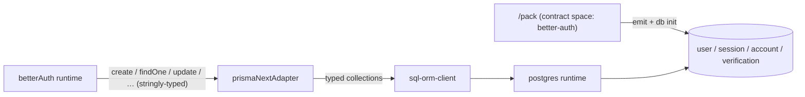

# extension-better-auth

## Purpose

Let application developers use [BetterAuth](https://www.better-auth.com) with Prisma Next as its database layer — with the auth schema owned, migrated, and verified by the framework's contract machinery instead of hand-rolled SQL or an untyped escape hatch. The project proves that Prisma Next contract spaces can back a third-party library's stringly-typed persistence interface without giving up contract-level type safety.

## At a glance

An app adds one pack to its config and hands the adapter to `betterAuth()`:

```ts
// prisma-next.config.ts
import betterAuthPack from '@prisma-next/extension-better-auth/pack';

export default {
  extensionPacks: [betterAuthPack],
};
```

```ts
// src/auth.ts
import { betterAuth } from 'better-auth';
import { prismaNextAdapter } from '@prisma-next/extension-better-auth/adapter';
import { db } from './prisma/db'; // ordinary prisma-next Db over the app's aggregate contract

export const auth = betterAuth({
  database: prismaNextAdapter(db),
  emailAndPassword: { enabled: true },
});
```

`prisma-next contract emit` folds the extension's contract space (`spaceId: 'better-auth'`, models `User`, `Session`, `Account`, `Verification`) into the app's aggregate; `prisma-next db init` applies the space's shipped baseline migration and creates the tables — the space is `managed`, so the framework owns DDL and verification (unlike the supabase space, which is `external`).

At runtime the adapter is the translation seam: BetterAuth speaks in strings (`model: 'session'`, `where: [{ field: 'userId', … }]`); the adapter resolves those strings against the shipped contract's typed model set and executes through the contract-typed ORM collections, so every value passes through contract codecs and every model/field mismatch is a compile-time error inside the package — not a runtime surprise in the app.



## Non-goals

- **BetterAuth plugin tables and `additionalFields`.** This project ships the core four models only. Unknown models or fields fail fast with a typed adapter error naming the unsupported surface. No contract-override / schema-extension mechanism is designed or promised here.
- **Non-postgres targets.** The pack is `targetId: 'postgres'` (PGlite included). SQLite/Mongo variants follow the same pattern later; nothing in this project may preclude them, but nothing ships.
- **BetterAuth CLI integration.** No `createSchema` hook for `@better-auth/cli generate`, no adapter-side migration support — schema lifecycle belongs to `prisma-next contract emit` / `db init` / `db update` exclusively.
- **Auth feature surface.** No opinions on BetterAuth configuration beyond what the adapter needs (email/password + sessions are exercised in tests/example; OAuth providers etc. are the app's business).
- **A runtime facade.** No `SupabaseDb`-style wrapped runtime — the app constructs an ordinary prisma-next `Db`; BetterAuth is a consumer of the adapter, not of a wrapped runtime. *(Amended 2026-07-13, I12: the package DOES ship a minimal `/runtime` subpath exporting the pack's `SqlRuntimeExtensionDescriptor` — required by the framework's component model to construct a client over an aggregate contract that includes the space; pgvector/postgis/supabase all ship one. This is component registration, not a facade; the non-goal's substance stands.)*

## Place in the larger world

- **Contract spaces (ADR 212).** The pack ships a contract space exactly as `pgvector` / `paradedb` / `supabase` do (`SqlControlExtensionDescriptor<'postgres'>` with `contractSpace: { contractJson, migrations, headRef }`). The novel wrinkle: it is the first **managed** extension space that ships table DDL — `db init` / `db update` walk the space's migration graph via the existing `computeExtensionSpaceApplyPath` machinery (`packages/1-framework/3-tooling/migration/`). No new framework mechanism is expected; if a gap surfaces, closing it becomes in-scope framework work and is named in the affected slice's spec.
- **Extension package precedent.** Package layout, subpath-only exports, and tree-shaking discipline mirror `packages/3-extensions/supabase/` (`/pack`, `/contract`, plus `/adapter` in place of `/runtime`). `@prisma-next/extension-better-auth` lands in `packages/3-extensions/better-auth/` and registers in `architecture.config.json`.
- **BetterAuth adapter contract.** The adapter is built with `createAdapterFactory` from `better-auth/adapters` (v1.5+ interface): `create`, `findOne`, `findMany`, `update`, `updateMany`, `delete`, `deleteMany`, `count`, plus `consumeOne`, `transaction`, and relation prefetching (`join`). Conformance is checked by BetterAuth's own suite, `@better-auth/test-utils/adapter`. `consumeOne` (atomic delete-and-return for single-use credentials) is implemented natively on `Collection.delete()`, which already provides the required semantics: find-first + identity-narrowed `DELETE … RETURNING` inside one transaction (`withMutationScope`), returning `Row | null` — a concurrent loser's narrowed DELETE affects zero rows and yields `null`, so two requests can never consume the same row. It requires the `returning` contract capability, which the postgres target provides. The `join` parameter on `findOne`/`findMany` (e.g. "fetch the session and its user at once") translates onto the ORM's typed `Collection.include()` reads — parent-anchored single-query relation fetches over the contract space's declared relations; a join target that doesn't resolve to a contract relation fails fast with a typed error.
- **Cross-space references.** The `/contract` subpath ships `extensionModel`-branded handles (like supabase's `AuthUser`) so app models can declare FKs onto `better-auth` space models (`rel.belongsTo(BetterAuthUser, …)`) through the existing cross-contract-refs brand machinery.
- **ORM client.** CRUD executes through `@prisma-next/sql-orm-client` collections resolved at the space's namespace coordinate; the adapter adds no query surface of its own.

### Contract impact

No changes to the framework contract surface (`packages/1-framework/0-foundation/contract/**`) are expected. The project adds one new contract space (additive; hand-authored `contract.json` + emitted `contract.d.ts`, same pipeline as the supabase space) with internal FKs (`Session.userId → User.id`, `Account.userId → User.id`) declared as navigable relations (they back the adapter's `join` support via `include()`), and unique constraints (`User.email`, `Session.token`). Models map to BetterAuth's ecosystem-default table names — singular `user`, `session`, `account`, `verification` in the `public` namespace (`user` needs quoting; the postgres adapter already quotes identifiers). `id` columns are `text` (BetterAuth generates string IDs; the adapter declares `supportsNumericIds: false`). Downstream consumers are unaffected unless they opt into the pack.

### Adapter impact

No target adapter (`packages/3-targets/**`) is modified. The postgres target is consumed, not changed. The word "adapter" in this project means the BetterAuth database adapter, not a Prisma Next target adapter.

### ADR pointer

If the "stringly-typed third-party interface over contract-typed collections" translation pattern proves durable (it is the template for future library adapters — Auth.js, Lucia, …), an ADR is authored at close-out. The managed-extension-space decision itself is already covered by ADR 212; close-out audits whether it needs an amendment for spaces that ship table DDL.

## Cross-cutting requirements

- **Contract-derived typing throughout.** The mapping from BetterAuth model/field names to contract models is exhaustively typed against the shipped `contract.d.ts` — adding a model to the contract without an adapter mapping (or vice versa) must fail `pnpm typecheck` inside the package. No `any`, no bare casts (repo cast policy applies), no stringly-typed pass-through into SQL.
- **Values cross the seam through codecs.** Dates, booleans, and IDs are converted by contract codecs, not ad-hoc `customTransformInput/Output` logic; the adapter config declares `supportsDates` / `supportsBooleans` truthfully for postgres.
- **Tree-shaking discipline.** `/pack` and `/contract` must not transitively import `better-auth` or runtime code; an app that only authors a contract pays for nothing else. `better-auth` itself is a `peerDependency` pinned to the v1.5+ `createAdapterFactory` interface (plus a `devDependency` for tests) — the app owns its version.
- **The extension is reachable end-to-end via documented commands.** `pnpm prisma-next contract emit` → `db init` → running app is the only setup path; no manual SQL step may creep into any slice, test, or the example.
- **Both proof surfaces stay green.** The integration suite (PGlite, hermetic, per-PR) and the example app are regression surfaces from the slice that introduces them onward.

## Transitional-shape constraints

N/A — single-slice project (operator decision, 2026-07-10: all three phases land as one PR). Nothing ships mid-project; the only shape constraint is that the single merge lands with CI green (`pnpm typecheck`, `lint`, `test:packages`, `test:integration`, `lint:deps`, `fixtures:check`) and `architecture.config.json` registering the new package in the same PR.

## Project Definition of Done

- [ ] Team-DoD floor items (inherited; see [`drive/calibration/dod.md`](../../drive/calibration/dod.md)).
- [ ] `@prisma-next/extension-better-auth` exists at `packages/3-extensions/better-auth/` with `/pack`, `/contract`, `/adapter` subpaths; `pnpm build` and `pnpm lint:deps` clean.
- [ ] BetterAuth's official adapter conformance suite (`@better-auth/test-utils/adapter`) passes against the adapter over PGlite — including its join coverage, with the adapter's native `join` path enabled — wired into `pnpm test:integration`.
- [ ] An integration test drives `betterAuth()` itself (email/password sign-up → session retrieval) through the adapter against PGlite — proving the real consumer path, not just the adapter interface.
- [ ] On a fresh database, `prisma-next contract emit` + `db init` create the four tables from the space's shipped migration, and `db update` is a no-op at head (managed extension-space path proven).
- [ ] `examples/better-auth` runs end-to-end (emit → db init → sign-up → authenticated request) with a README documenting the flow; a cross-space FK from an app model onto the `better-auth` `User` is demonstrated.
- [ ] Extension-authoring docs/skill references are updated to name this package as the managed-space (DDL-shipping) precedent.

## Settled decisions (operator-confirmed)

- **Table naming & namespace**: BetterAuth default names (`user`, `session`, `account`, `verification`) in the `public` namespace — see Contract impact.
- **Dependency posture**: `better-auth` as `peerDependency` (v1.5+) + `devDependency` for tests — see Cross-cutting requirements.
- **`consumeOne`**: implemented natively on `Collection.delete()` (atomic by construction; verified against `sql-orm-client` source) — see Place in the larger world.
- **`transaction` support**: wired onto the prisma-next runtime's transaction API from the start — see Place in the larger world.
- **Numeric IDs**: unsupported (`supportsNumericIds: false`); `id` columns are `text`, BetterAuth generates string IDs — see Contract impact.
- **Relation prefetching (`join`)**: in scope — implemented via the ORM's `Collection.include()` (the ORM supports parent-anchored single-query relation reads, so the adapter must not fall back to BetterAuth's separate-queries path) — see Place in the larger world.

## Open Questions

None — all shaping-time questions were resolved by operator review (see Settled decisions).

## References

- Linear Project: [BetterAuth Extension](https://linear.app/prisma-company/project/betterauth-extension-3b602d4b711a)
- Sibling projects: [`projects/extension-supabase/spec.md`](../extension-supabase/spec.md) (package shape, contract-space precedent — external control), `packages/3-extensions/pgvector/` (managed space shipping migrations)
- ADRs: ADR 212 — Contract spaces; ADR 112 — Target Extension Packs; ADR 015 — ORM as Optional Extension
- BetterAuth: [Create a Database Adapter](https://www.better-auth.com/docs/guides/create-a-db-adapter) (`createAdapterFactory`, adapter methods, `@better-auth/test-utils/adapter`), [core schema](https://www.better-auth.com/docs/concepts/database#core-schema)
- Framework machinery: `packages/1-framework/3-tooling/migration/src/compute-extension-space-apply-path.ts` (extension-space apply path), `packages/3-extensions/sql-orm-client/` (typed collections)
