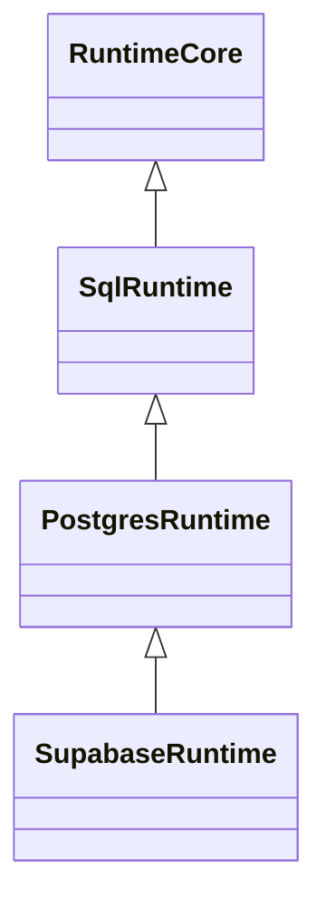

# Summary

> **Scope note — read before reshaping this spec.** The runtime half this spec describes has **already shipped** under the runtime-target-layer project (see [ADR 230](../../docs/architecture%20docs/adrs/ADR%20230%20-%20Runtime%20target%20layer%20session-coupled%20connections.md)): `SupabaseRuntime` (as `SupabaseRuntimeImpl`), the async `supabase({...})` factory, `asUser` / `asAnon` / `asServiceRole`, JWT validation, and the role-bound `Db` are all live in `@prisma-next/extension-supabase/runtime`. The role binding is enforced by **session-coupled connections** (`set_config(role/claims)` on the connection + `RESET ALL` on release), **not** the `SET LOCAL`-in-`execute()`-override / `withRawConnection` design this spec body still describes. The remaining scope for this project is therefore the **non-runtime** surface: the hand-authored Supabase contract, the `/contract` typed handles + role refs, the `/pack` descriptor, and the example app — plus reconciling this spec's runtime sections to the shipped API. Reconcile fully at this project's drive-start (the body below predates ADR 230).

This project ships `@prisma-next/extension-supabase` — the user-facing npm package that integrates Supabase with Prisma Next end-to-end. It consumes the four framework primitives shipped in parallel ([target-extensible-ir](../target-extensible-ir/spec.md), [cross-contract-refs](../cross-contract-refs/spec.md), [postgres-rls](../postgres-rls/spec.md), [runtime-target-layer](../../docs/architecture%20docs/adrs/ADR%20230%20-%20Runtime%20target%20layer%20session-coupled%20connections.md) — plus the [control-policy](../control-policy/spec.md) framework primitive) and packages them into a working developer experience: a hand-authored contract describing Supabase's `auth.*` and `storage.*` schemas, branded typed model handles + role refs from a `/contract` subpath, a `supabase({...})` runtime factory returning a role-bound `Db` interface (`asUser(jwt)` / `asAnon()` / `asServiceRole()`), and a canonical example app that exercises the entire stack against a real Supabase project. The runtime is `class SupabaseRuntime extends PostgresRuntime` — RLS enforcement is structural (`SET LOCAL role` issued below the user middleware chain inside an implicit transaction), not policy. The package is the user-visible deliverable that makes the launch a launch.

# Context

## At a glance

End-to-end usage. The user installs one npm package and gets the full surface — contract authoring in PSL (or in TS — the two forms are equivalent), runtime factory in TS:

```prisma
// app/prisma/schema.prisma
namespace public {
  model Profile {
    id       String @id @default(uuid())
    userId   String @unique(map: "profile_userId_unique")
    username String

    user     supabase:auth.User @relation(fields: [userId], references: [id], onDelete: Cascade, map: "profile_userId_fkey")

    @@map("profile")
  }

  policy profiles_select_anon_and_authed {
    target    = Profile
    operation = select
    roles     = [anon, authenticated]
    using     = "true"
  }

  policy profiles_update_own {
    target    = Profile
    operation = update
    roles     = [authenticated]
    using     = "user_id = (auth.uid())::uuid"
    withCheck = "user_id = (auth.uid())::uuid"
  }
}
```

`family`, `target`, `extensionPacks: [supabasePack]`, and contract provider selection (`prismaContract(...)` vs `typescriptContract(...)`) live in `prisma-next.config.ts`. The TS contract surface is structurally parallel: `defineContract({ namespaces: ['public'], extensionPacks: [supabasePack], … }, ({ model }) => { … })` with `.rls([{ name, operation, roles, using, withCheck }, …])` as a fourth staged method on the model builder. The example app under M3 ships both forms side by side.

```ts
// app/db.ts
import supabase from '@prisma-next/extension-supabase/runtime';
import type { Contract, TypeMaps } from './prisma/contract.d';
import contractJson from './prisma/contract.json' with { type: 'json' };

export const db = await supabase<Contract, TypeMaps>({
  contractJson,
  url: process.env['DATABASE_URL']!,
  jwtSecret: process.env['SUPABASE_JWT_SECRET']!,
});
```

```ts
// app/handlers.ts — per-request usage
import { db } from './db';

export async function listProfiles(req: Request) {
  const jwt = req.headers.get('authorization')?.replace(/^Bearer /, '');
  const session = jwt ? db.asUser(jwt) : db.asAnon();  // throws InvalidJwtError on bad JWT
  return session.sql.from('profile').select({ id: true, username: true }).build().execute();
}

export async function adminListProfiles() {
  return db.asServiceRole().sql.from('profile').select('*').build().execute();
}
```

`SupabaseDb` is **not** a `Db` — there's no `db.sql.from(...)` at the top level. A user must pick a role before they can build a query. This is intentional: in a Supabase app there is no meaningful "no role" execution context; the alternative (defaulting to whatever role the connection authenticated as, typically a privileged one) is exactly the silent-RLS-bypass footgun the design eliminates.

Under the hood:



- `RuntimeCore` — framework-components (existing, exported).
- `SqlRuntime` — sql-runtime (exported via the runtime-target-layer project).
- `PostgresRuntime` — postgres/runtime (added by the runtime-target-layer project).
- `SupabaseRuntime` — **this project**; overrides `execute()` to wrap in an implicit transaction + `SET LOCAL role` + `request.jwt.claims`, below user middleware.

## Problem

Three concrete problems motivate this project:

**1. The framework primitives are useless to a Supabase user without a Supabase-specific binding.** TML-2459 ships namespaces. The cross-contract-refs project ships `supabase:auth.User` syntax. The postgres-rls project ships `.rls([...])`. The runtime-target-layer project ships `PostgresRuntime`. None of these have any Supabase-aware content — they are *framework primitives*. A Supabase user needs the framework primitives **plus** the Supabase-specific glue: a contract describing Supabase's schemas, role constants for `anon` / `authenticated` / `service_role`, a runtime that knows how to validate Supabase-signed JWTs and bind them to a Postgres session via `SET LOCAL`. Without this project, the launch ships an empty integration story — "you can build the building blocks, here's no example of putting them together."

**2. The role-binding contract has to be unbypassable, not documented.** The most common Supabase footgun is "I forgot to set the role" — a query that silently runs as a privileged role because the developer expected RLS to enforce isolation and forgot to `SET LOCAL role` first. The fix is structural, not procedural: the user-facing API must make it *impossible* to execute a query without first picking a role. The runtime-target-layer project provides the substrate (`withRawConnection` below middleware, implicit transactions); this project consumes it to ship a `SupabaseDb` whose top-level type intentionally lacks `.sql.from(...)`. The user picks a role first, gets back a `RoleBoundDb` that *does* have `.sql.from(...)`, and only then can run a query. The role binding is part of the type system, enforced at compile time.

**3. The launch needs a working example app, not just a feature inventory.** A working example end-to-end (auth flow → profile creation → cascade-delete on user removal → RLS-protected list) is the artefact that turns "we shipped a Supabase integration" into "you can actually use it." The example app doubles as a regression test surface (it exercises every framework primitive against a real database) and as documentation (it's the answer to "show me how to use this"). Without it, the launch is a feature ship without a demo.

## Approach

### Package shape (subpath-only entrypoints)

Per umbrella decision [C6](../supabase-integration/decisions.md), the package exports only via three subpaths — `/pack`, `/contract`, `/runtime`. There is no umbrella export from the package root. Tree-shaking discipline: `/pack` must not transitively import runtime code; `/contract` must not transitively import SDK or runtime code; an app that only authors a contract pays for nothing else.

```
@prisma-next/extension-supabase/
├── package.json                   # exports field declares /pack, /contract, /runtime subpaths
├── src/
│   ├── pack/                      # → '@prisma-next/extension-supabase/pack'
│   │   └── index.ts               # ExtensionPack value + optional factory wrapper for options
│   ├── contract/                  # → '@prisma-next/extension-supabase/contract'
│   │   ├── index.ts               # hand-authored typed authoring handles: AuthUser, roles.anon, …
│   │   ├── contract.json          # hand-authored, ~50 lines (the source-of-truth IR)
│   │   └── contract.d.ts          # emitted from contract.json (same pipeline as app contracts)
│   ├── runtime/                   # → '@prisma-next/extension-supabase/runtime'
│   │   └── index.ts               # default-export supabase({...}) factory + SupabaseRuntime class
│   └── schema.psl                 # optional: PSL source the contract.json was emitted from
├── examples/
│   └── basic/                     # working example app — see § "Example app"
└── README.md
```

The package is the canonical reference for "what does a Prisma Next extension look like?" — it deliberately mirrors the layout established by `packages/3-extensions/cipherstash/` and `packages/3-extensions/pgvector/`. The extension-authoring skill (TML-2492) is updated as part of this project's close-out to point at this package as the canonical example.

### The shipped contract

For v0.1, hand-authored. The contract describes the slice of Supabase's schemas that app code typically references — `auth.users`, `auth.identities`, `storage.buckets`, `storage.objects` — plus the role declarations. Sketch:

```jsonc
{
  "$schema": "https://prisma-next.io/contract.schema.json",
  "spaceId": "supabase",
  "target": "postgres",
  "defaultControl": "external",
  "namespaces": ["auth", "storage", "realtime", "extensions"],
  "models": {
    "AuthUser": {
      "namespace": "auth",
      "tableName": "users",
      "fields": {
        "id":        { "type": "uuid",        "primary": true },
        "email":     { "type": "text" },
        "createdAt": { "type": "timestamptz", "columnName": "created_at" },
        "updatedAt": { "type": "timestamptz", "columnName": "updated_at" }
      }
    },
    "AuthIdentity":  { /* … */ },
    "StorageBucket": { /* … */ },
    "StorageObject": { /* … */ }
  },
  "roles": {
    "anon":          { "control": "external" },
    "authenticated": { "control": "external" },
    "service_role":  { "control": "external" }
  }
}
```

Three properties:

- **`defaultControl: 'external'`** is the contract-level default; the framework's verifier under [control-policy](../control-policy/spec.md) treats every model in this contract as "verify it exists with exactly-matching declared columns; emit no DDL." App contracts cascade-delete from `auth.users` rely on the verifier confirming the table is present and the FK target column has the expected type, but the framework owns no migration responsibility for `auth.*`.
- **Not every column is modelled.** Only the columns app code is likely to reference (`id`, `email`, timestamps). The verifier under `control: 'external'` tolerates extra columns, so the package ships a minimal slice and grows it as user needs surface.
- **Roles are first-class IR** (per the [postgres-rls](../postgres-rls/spec.md) project's `PostgresRole` IR shape). The Supabase pack declares `anon` / `authenticated` / `service_role` as `external` — verified to exist via `pg_roles` introspection, not created. App authors don't need to know the role wire names; they reference `supabaseRoles.anon` from the `/contract` subpath.

### Typed model handles + role refs (`/contract`)

The `/contract` subpath ships pre-built typed handles for every model + role the extension contributes. Hand-written for v0.1; emitter-generated as a roadmap item per umbrella decision [C7](../supabase-integration/decisions.md).

```ts
// @prisma-next/extension-supabase/contract
import type { ModelHandle, RoleRef } from '@prisma-next/contract-core/authoring';

export const AuthUser: ModelHandle<'supabase', { id: string; email: string; /* … */ }>;
export const AuthIdentity: ModelHandle<'supabase', { /* … */ }>;
export const StorageBucket: ModelHandle<'supabase', { /* … */ }>;
export const StorageObject: ModelHandle<'supabase', { /* … */ }>;

export const roles: {
  anon:          RoleRef<'supabase'>;
  authenticated: RoleRef<'supabase'>;
  serviceRole:   RoleRef<'supabase'>;
};
```

Two properties make this work end-to-end:

- **The handles are branded by `spaceId: 'supabase'`.** The cross-contract-refs project's brand machinery picks up the brand at the call site; an app's `rel.belongsTo(AuthUser, …)` lowers to a `source: 'space'` FK reference without the user typing anything special.
- **Role refs are also branded.** RLS policy `roles: [supabaseRoles.anon, …]` lists at the postgres-rls authoring surface accept branded `RoleRef`s — typo-proof at compile time.

The handles themselves are mechanical — derived from `contract.json`'s shape. For v0.1, hand-authored; the emitter-generated version (umbrella decision **C7**) lifts this work into a generator pass that any extension can run.

### Pack descriptor (`/pack`)

The `/pack` subpath ships the `ExtensionPack` value consumed by `prisma-next.config.ts`'s `extensionPacks` list. Two forms:

```ts
// @prisma-next/extension-supabase/pack
import type { ExtensionPack } from '@prisma-next/config';

export interface SupabaseOptions {
  /** Override the contract.json shipped in this package (e.g. to add custom auth.* tables). */
  contractOverride?: unknown;
}

declare const supabasePack: ExtensionPack;
export default supabasePack;

export function supabasePackWith(options: SupabaseOptions): ExtensionPack;
```

Usage:

```ts
// prisma-next.config.ts
import supabasePack from '@prisma-next/extension-supabase/pack';

export default {
  extensionPacks: [supabasePack],
  // or: extensionPacks: [supabasePackWith({ contractOverride })],
};
```

The pack carries the contract.json the framework adds to the aggregate. No target-specific behaviour hooks are needed in v0.1 — the framework's control-policy dispatch + the RLS verifier from the postgres-rls project handle everything.

### Runtime facade (`/runtime`)

One factory, one returned object. The user never touches the underlying Postgres runtime directly — the facade *is* one (a `PostgresRuntime` subclass).

```ts
// @prisma-next/extension-supabase/runtime
import type { Db, PoolOptions } from '@prisma-next/postgres/runtime';
import type { SqlMiddleware } from '@prisma-next/sql-runtime';

export interface SupabaseRuntimeOptions {
  contractJson: unknown;
  url: string;
  /** Supabase project's JWT signing secret. */
  jwtSecret?: string;
  /** Alternative to jwtSecret: a JWKS endpoint. Warmed up at factory time. */
  jwksUrl?: string;
  /** Pool knobs forwarded to the underlying Postgres runtime. */
  pool?: PoolOptions;
  /** User middleware. Forwarded to the underlying runtime. SET LOCAL is NOT visible to these. */
  middleware?: readonly SqlMiddleware[];
}

export interface SupabaseDb<TContract, TTypeMaps> {
  asUser(jwt: string): RoleBoundDb<TContract, TTypeMaps>;
  asAnon(): RoleBoundDb<TContract, TTypeMaps>;
  asServiceRole(): RoleBoundDb<TContract, TTypeMaps>;
}

export interface RoleBoundDb<TContract, TTypeMaps> extends Db<TContract, TTypeMaps> {
  transaction<R>(fn: (tx: RoleBoundDb<TContract, TTypeMaps>) => Promise<R>): Promise<R>;
}

export default function supabase<TContract, TTypeMaps>(
  options: SupabaseRuntimeOptions,
): Promise<SupabaseDb<TContract, TTypeMaps>>;
```

Six properties are load-bearing:

- **`SupabaseDb` is not a `Db`.** Top-level type intentionally lacks `.sql.from(...)`. Users must call `asUser(jwt)` / `asAnon()` / `asServiceRole()` first; the returned `RoleBoundDb` *does* extend `Db`. Role binding is part of the type system.
- **Factory is uniformly async.** `supabase({...})` returns `Promise<SupabaseDb>` regardless of whether the user passed `jwtSecret` (synchronous-resolvable) or `jwksUrl` (requires HTTP fetch for JWKS warmup). The uniform-async signature avoids splitting the API into sync-when-secret / async-when-jwks.
- **JWT validation is eager.** `asUser(jwt)` validates the JWT synchronously and throws a typed `InvalidJwtError` on malformed / expired / mis-signed tokens *before* any connection is acquired. The signing key is always in hand by the time `asUser` runs (because the factory warmed it up).
- **`SET LOCAL` is structural, not policy.** `SupabaseRuntime.execute()` (the subclass override) issues `SET LOCAL role = '...'` and `SET LOCAL request.jwt.claims = '...'` via the `withRawConnection` accessor from the runtime-target-layer project — below the user middleware chain entirely. User middleware never sees the SET LOCAL statements; user middleware cannot prevent them. The role binding is unbypassable except by writing a custom `SupabaseRuntime` subclass, which is an obvious red flag in code review.
- **No `serviceRoleKey` option.** Supabase's service-role key is a JWT identity used by `@supabase/supabase-js` to authenticate to PostgREST. We're below PostgREST — we connect directly to Postgres with a privileged URL. The only Supabase-issued secret we need is `jwtSecret` (or `jwksUrl`) to validate *user* JWTs.
- **Implicit transactions.** `SET LOCAL` requires an open transaction (otherwise the SET has session scope and survives into the next pool checkout — exactly the RLS-bypass footgun the design eliminates). Every role-bound execute is wrapped in `BEGIN; SET LOCAL …; <query>; COMMIT`. Multi-statement transactions (`db.asUser(jwt).transaction(async (tx) => { … })`) issue one `BEGIN; SET LOCAL …;` at transaction open; the closure body runs against `tx` pinned to the same connection; commit/rollback at closure exit. `SET LOCAL` never outlives its transaction; transaction completion resets it before the connection returns to the pool.

### Class hierarchy


Origins: `RuntimeCore` (framework-components, exists); `SqlRuntime` (sql-runtime, exported via runtime-target-layer); `PostgresRuntime` (postgres/runtime, added by runtime-target-layer); `SupabaseRuntime` (this project).

`SupabaseRuntime`'s additional surface:

- A constructor that consumes `SupabaseRuntimeOptions`, validates the JWT secret / JWKS configuration, warms up the JWKS if applicable, and forwards `contractJson` / `url` / `pool` / `middleware` to `super(...)`.
- An override of `execute()` that wraps the call in `withTransaction(() => withRawConnection(conn => { conn.exec(SET LOCAL …); return super.execute(plan); }))`.
- A `RoleBoundDb` factory method that produces the role-bound `Db` instance, threading the current role + claims through to the next `execute()` call's `SET LOCAL`.
- A custom transaction method on the role-bound `Db` that reuses `withTransaction` for the multi-statement case.

The subclass is approximately 200–400 LOC depending on how tightly the JWT validation, the JWKS cache, and the role-bound `Db` wrapper are scoped. None of the new logic touches the framework hot path; the cost is paid by Supabase users only.

### Example app (canonical demo)

A working example app lives at `examples/supabase` (top-level, alongside the other example apps — decision [C13](../supabase-integration/decisions.md)). It is the **walking skeleton**: stood up in M1 and grown one feature at a time as each constituent lands (full strategy in the [umbrella README](../supabase-integration/README.md) §"Walking skeleton"). By launch it exercises every framework primitive end-to-end:

- A `Profile` model in the app's `public` namespace with a cross-contract FK to `auth.users.id` (uses the cross-contract-refs project).
- An RLS policy on `Profile` declaring `anon` can read, `authenticated` can update only their own row (uses the postgres-rls project + roles from this package).
- A handler exposing `listProfiles` (calls `db.asUser(jwt)` or `db.asAnon()` based on Authorization header).
- A handler exposing `adminListProfiles` (calls `db.asServiceRole()`).
- A README walking through setup (Supabase project URL, JWT secret, migration commands) end-to-end.

The example is a regression test surface across two lanes (decision [C14](../supabase-integration/decisions.md)): the hermetic per-PR lane runs against PGlite seeded with `bootstrapSupabaseShim(client)`, and the acceptance lane runs against a real Supabase project (manual / nightly). The example doubles as the demo content for the launch announcement.

### Pool considerations

RLS + connection pooling has a known footgun: if you `SET ROLE` and don't reset it, the next pool checkout inherits the role. The design eliminates this by construction:

- **Always `SET LOCAL`, never bare `SET`.** Transaction-scoped, automatic reset at COMMIT/ROLLBACK.
- **Always in a transaction.** The subclass `execute()` override guarantees this; no execute path on a `SupabaseRuntime` runs outside a transaction.
- **Document the pool requirements** (must reset session state between checkouts) for users running a custom pool — defense-in-depth note, not the primary mitigation.

# Requirements

## Functional Requirements

### Package shape

- **FR1.** The package exports subpaths `/pack`, `/contract`, `/runtime`. There is no umbrella export from the package root. The `package.json` `exports` field enforces this.
- **FR2.** Tree-shaking discipline: `/pack` does not transitively import runtime code; `/contract` does not transitively import SDK or runtime code. Verified by automated dependency-graph inspection (a CI check or a manual bundle-size review).
- **FR3.** The package's `contract.json` is hand-authored for v0.1, lives in `src/contract/`, declares `spaceId: 'supabase'`, `target: 'postgres'`, `defaultControl: 'external'`, and contains models for at minimum `AuthUser`, `AuthIdentity`, `StorageBucket`, `StorageObject` plus roles `anon`, `authenticated`, `service_role`.

### Pack descriptor

- **FR4.** `/pack` exports a default `ExtensionPack` value (`supabasePack`) and an optional `supabasePackWith(options)` factory accepting `{ contractOverride?: unknown }`.
- **FR5.** `extensionPacks: [supabasePack]` in `prisma-next.config.ts` registers the Supabase contract space with the framework's contract aggregate. The aggregate-load checks from the cross-contract-refs project enforce dependency-graph + namespace-ownership rules.

### Typed handles + role refs

- **FR6.** `/contract` exports branded `ModelHandle<'supabase', …>` instances for every model in the shipped contract (`AuthUser`, `AuthIdentity`, `StorageBucket`, `StorageObject`). Each handle exposes `.refs.<columnName>` accessors.
- **FR7.** `/contract` exports `roles: { anon, authenticated, serviceRole }` with each member a branded `RoleRef<'supabase'>`. The exact wire role names are `'anon'` / `'authenticated'` / `'service_role'` (camelCase API → snake_case wire).
- **FR8.** The `/contract` handles work transparently with the cross-contract-refs project's lowering — `rel.belongsTo(AuthUser, …)` and `constraints.foreignKey(cols.x, AuthUser.refs.id, …)` lower to `source: 'space'` FK references without any extension-side glue beyond shipping the branded handles.

### Runtime facade

- **FR9.** `/runtime` exports a default function `supabase<TContract, TTypeMaps>(options: SupabaseRuntimeOptions): Promise<SupabaseDb<TContract, TTypeMaps>>`.
- **FR10.** `SupabaseRuntimeOptions` carries `contractJson`, `url`, optional `jwtSecret` xor `jwksUrl`, optional `pool` and `middleware`. Passing both `jwtSecret` and `jwksUrl` is a configuration error (thrown synchronously from `supabase({...})`).
- **FR11.** `supabase({...})` returns `Promise<SupabaseDb>` regardless of whether `jwtSecret` or `jwksUrl` is configured. The factory warms up the JWKS (single HTTP fetch) when `jwksUrl` is set; resolves to the `SupabaseDb` once the signing key is in hand.
- **FR12.** `SupabaseDb` exposes exactly three role-binding methods: `asUser(jwt: string)`, `asAnon()`, `asServiceRole()`. It does **not** extend `Db`; the type system enforces that a user must pick a role before building queries.
- **FR13.** `asUser(jwt)` validates the JWT synchronously: signature against `jwtSecret` or the warmed JWKS, expiry check, audience check (if configured), issuer check (if configured). Failures throw `InvalidJwtError` with a typed `reason` field naming the specific failure. No connection is acquired during validation.
- **FR14.** `asAnon()` and `asServiceRole()` are pure factories — no validation; they return a `RoleBoundDb` bound to the respective wire role name with empty claims.
- **FR15.** `RoleBoundDb` extends `Db` (so user code can call `.sql.from(...)`, `.orm.<model>.find(...)`, etc.) and adds a `transaction<R>(fn: (tx: RoleBoundDb) => Promise<R>): Promise<R>` method that runs the closure under a single transaction with one `SET LOCAL role` + `SET LOCAL request.jwt.claims` issued at transaction open.
- **FR16.** Every role-bound `execute()` is wrapped in an implicit transaction. Single-statement calls produce `BEGIN; SET LOCAL …; <query>; COMMIT;` automatically. Multi-statement transactions via `RoleBoundDb.transaction()` produce one `BEGIN; SET LOCAL …;`, the closure body, then `COMMIT` / `ROLLBACK` on closure exit.
- **FR17.** `SET LOCAL` statements are issued via the `withRawConnection` accessor from the runtime-target-layer project. They are not visible to user middleware. User middleware sees logical query traffic only.
- **FR18.** The `middleware?: readonly SqlMiddleware[]` option is forwarded unchanged to the base `PostgresRuntime`. Existing middleware (telemetry, logging, query budgets) works transparently.

### Class hierarchy

- **FR19.** `SupabaseRuntime extends PostgresRuntime` is exported from the `/runtime` subpath as a public class. The class is the structural extension point for downstream code that wants to subclass `SupabaseRuntime` further (rare; documented as an escape hatch).

### Example app

- **FR20.** A working example app lives at `examples/supabase` (decision [C13](../supabase-integration/decisions.md)) demonstrating:
  - An app contract with a `Profile` model that has a cross-contract FK to `auth.users.id` (cascade on delete).
  - An RLS policy on `Profile` declaring `anon` SELECT, `authenticated` UPDATE-own.
  - Handlers exercising `asUser(jwt)`, `asAnon()`, `asServiceRole()`.
  - A README walking through setup end-to-end.
- **FR21.** The example app runs in CI against either a real Supabase project (if feasible via env-secret configuration) or PGlite seeded with Supabase's `auth.*` schema (for self-contained test runs). The example's behavioural tests assert RLS enforcement: a query through `asAnon()` cannot see another user's private rows; a query through `asUser(jwt)` can see only the JWT-owner's row; `asServiceRole()` bypasses RLS as expected.

### Verifier behaviour at the package boundary

- **FR22.** When the framework verifier introspects a live Supabase database, it confirms the existence and shape of `auth.users`, `auth.identities`, `storage.buckets`, `storage.objects` (as declared in `contract.json`) — under `control: 'external'` it emits no DDL ops for these but raises `missing_table` / `column_type_mismatch` if the shape diverges from the declared one. Extra columns on these tables are tolerated.
- **FR23.** Verifier introspection of `pg_roles` confirms `anon`, `authenticated`, `service_role` exist. Missing roles surface as `missing_role` errors (severity dispatched through the control-policy primitive — `external` is an error). This catches the common misconfiguration where the user points the runtime at a non-Supabase Postgres instance.

## Non-Functional Requirements

- **NFR1.** The runtime hot path for a single role-bound query (the `BEGIN; SET LOCAL role; SET LOCAL request.jwt.claims; <query>; COMMIT;` cycle) adds <2ms median overhead vs. an unrolewrapped Postgres query against PGlite. Measured by a synthetic benchmark in the example app.
- **NFR2.** JWT validation is sub-millisecond for symmetric-secret (`jwtSecret`) validation; <10ms for JWKS-cached (`jwksUrl`) validation. Measured by a synthetic benchmark in the package's test suite.
- **NFR3.** The package's tree-shaken `/pack` subpath bundles to under 5 KB (gzip). The `/contract` subpath under 10 KB. The `/runtime` subpath is larger (it carries the runtime class hierarchy via re-exports) and is allowed up to 50 KB. Verified by bundle-size CI check at merge time.
- **NFR4.** Layering is enforced by `pnpm lint:deps`. The package depends on `@prisma-next/postgres/runtime`, `@prisma-next/sql-runtime`, `@prisma-next/framework-components`, `@prisma-next/config`, `@prisma-next/contract-core`, plus an off-the-shelf JWT validation library (`jose` is the leading candidate). It does not depend on `@supabase/supabase-js` or any Supabase SDK — the framework speaks Postgres directly.
- **NFR5.** Documentation: the package README walks through setup, usage, the role-binding model, the `SET LOCAL`-below-middleware security property, and known caveats. The README also points at the example app as the canonical reference.

## Non-goals

- **Trigger-driven "create profile on signup" pattern.** A common Supabase pattern is a Postgres trigger on `auth.users` insert that calls `INSERT INTO public.profiles ...`. This requires either user-authored SQL triggers (out of v0.1 framework scope; functions are not first-class IR per umbrella decision **C4**) or a separate "create profile after JWT validation" call in the user's handler. **Working assumption: handler-side creation is the v0.1 recommendation.** The trigger pattern is a stretch goal explicitly captured in the PM-pass.
- **PGREST/PostgREST compatibility.** Prisma Next connects directly to Postgres, not through PostgREST. The `service_role` "key" concept (a JWT identity for authenticating to PostgREST) is irrelevant — we use `SET LOCAL role = 'service_role'` instead. Apps that need both Prisma Next *and* PostgREST run them side-by-side with their own auth flows.
- **`@supabase/supabase-js` interop.** No code path through the Supabase JS SDK. The integration is Postgres-direct.
- **Storage upload ergonomics.** The `storage.*` tables are declared in the contract for read-only reference. Ergonomic upload/download helpers are out of v0.1 scope. Users either write raw `INSERT INTO storage.objects ...` queries or use `@supabase/storage-js` for uploads.
- **Realtime channels.** The `realtime.*` schema is declared in the contract but no integration with Supabase Realtime websocket subscriptions exists in v0.1.
- **Custom auth schemas via emitter-generated `/contract`.** Some Supabase users extend `auth.*` with extra columns or tables. The `contractOverride` option in `supabasePackWith(...)` is the v0.1 escape hatch; a full introspection-driven `/contract` regeneration pipeline is the C8/C7 roadmap.
- **Edge-runtime support.** v0.1 targets Node.js + Bun. Cloudflare Workers / Deno / Vercel Edge are out of scope (the runtime depends on a Postgres driver that doesn't run on V8-isolate edges without significant rework).
- **Per-tenant connection-string-derived runtimes.** Multi-tenant apps that need a separate `SupabaseRuntime` instance per tenant manage that at the application layer (cache `SupabaseRuntime` instances by tenant id). The framework provides the primitive; per-tenant orchestration is application-layer code.
- **Function-level posture for arbitrary user-defined functions.** Per umbrella decision **C4**, functions are not first-class contract elements in v0.1. `auth.uid()`, `auth.jwt()`, `auth.role()` are opaque references inside policy predicate strings. The Supabase pack may register these into the framework's `DefaultFunctionRegistry` if column-default support is needed (currently uncertain — out of v0.1 critical path).

## Sequencing constraints

This project is the integration layer; it consumes all four sibling projects:

- **[target-extensible-ir](../target-extensible-ir/spec.md)** — for namespaces, the target-only IR kind seam, the `Namespace` + `__unspecified__` pattern. (Through M5b.)
- **[cross-contract-refs](../cross-contract-refs/spec.md)** — for the brand machinery the `/contract` model handles consume.
- **[postgres-rls](../postgres-rls/spec.md)** — for the `.rls([…])` authoring surface, `PostgresRlsPolicy` IR, `PostgresRole` IR, the verifier algorithm, the migration ops.
- **[runtime-target-layer](../../docs/architecture%20docs/adrs/ADR%20230%20-%20Runtime%20target%20layer%20session-coupled%20connections.md)** — for `PostgresRuntime` as the base class and `withRawConnection` as the below-middleware primitive.
- **[control-policy](../control-policy/spec.md)** — for the `external` control-policy value the shipped Supabase contract uses by default.

Resulting global sequence (within the Supabase umbrella): **TML-2459 + control-policy → cross-contract-refs ∥ postgres-rls ∥ runtime-target-layer → this project**.

This project lands the integration / launch. Slipping any upstream dependency cascades into this project.

# Acceptance Criteria

- [ ] **AC1.** `npm install @prisma-next/extension-supabase` makes the three subpaths (`/pack`, `/contract`, `/runtime`) available. Importing the package root resolves to nothing. Bundle-size CI check passes the NFR3 thresholds.
- [ ] **AC2.** An app contract that imports `AuthUser` from `/contract` and uses it in `rel.belongsTo(AuthUser, …)` and `constraints.foreignKey(cols.x, AuthUser.refs.id, …)` lowers to a Contract IR with `source: 'space'` FK references and produces the correct DDL (`REFERENCES "auth"."users"("id")`).
- [ ] **AC3.** An app contract that imports `roles.anon` / `roles.authenticated` from `/contract` and uses them in `.rls([{ roles: [roles.anon, roles.authenticated], … }])` lowers correctly. The emitted `CREATE POLICY` statements name the wire role names (`anon`, `authenticated`).
- [ ] **AC4.** `await supabase({ contractJson, url, jwtSecret })` returns a `SupabaseDb` instance. The instance exposes `asUser`, `asAnon`, `asServiceRole`; it does *not* expose `.sql.from(...)` at the top level (type-level assertion).
- [ ] **AC5.** `db.asUser(badJwt)` throws `InvalidJwtError` synchronously with a typed `reason` field. No connection is acquired; the throw happens before any I/O.
- [ ] **AC6.** `db.asUser(validJwt).sql.from('profile').select(...).build().execute()` runs the query inside an implicit transaction with `SET LOCAL role = 'authenticated'` and `SET LOCAL request.jwt.claims = '{...}'` issued before the query. Verified by hooking the underlying connection (in a test fixture) and asserting the statement sequence.
- [ ] **AC7.** User middleware registered via the `middleware` option sees only the user's logical query — not the `BEGIN`, `SET LOCAL …`, or `COMMIT` statements. Verified by a logging middleware that records every statement it sees.
- [ ] **AC8.** End-to-end test against PGlite seeded with `bootstrapSupabaseShim(client)`:
  - `Profile` created via `asUser(jwt)` lands in the table with the correct `user_id`.
  - `Profile.user_id` cascades on `DELETE FROM auth.users` (FK with `onDelete: 'cascade'`).
  - `asAnon().sql.from('profile').select('*')` returns rows whose RLS policy permits anon read; returns zero rows where it doesn't.
  - `asUser(jwt).sql.from('profile').update(...).where(...)` succeeds for the JWT-owner's row and fails (zero rows updated) for other users' rows.
  - `asServiceRole().sql.from('profile').select('*')` returns all rows (bypasses RLS).
- [ ] **AC9.** The example app at `examples/supabase` runs in CI green. Its README is reviewed for accuracy by a non-author teammate before the launch.
- [ ] **AC10.** The framework verifier, run against the Supabase database used in the example app, reports zero issues for the `auth.*` and `storage.*` tables (under `control: 'external'`) and zero issues for the `anon` / `authenticated` / `service_role` role declarations (existence confirmed via `pg_roles`).
- [ ] **AC11.** The framework verifier raises `missing_role` if `pg_roles` doesn't contain `anon` / `authenticated` / `service_role`. Demonstrated by a regression test pointing the runtime at a vanilla Postgres database (no Supabase setup) and asserting the verifier rejects the configuration.
- [ ] **AC12.** Performance benchmarks meet NFR1 and NFR2 thresholds. Reported in the example app's README.
- [ ] **AC13.** `pnpm lint:deps` passes. No layering violations. The package's dependency graph contains no Supabase JS SDKs.

# Other Considerations

## Security

This project's primary security responsibility is RLS enforcement. The security properties:

- **Role binding is structural.** `SupabaseDb` doesn't extend `Db`; the type system forces role selection before query execution. A user *cannot* skip role binding by accident.
- **`SET LOCAL` is below user middleware.** Issued via `withRawConnection` (from runtime-target-layer); user middleware cannot reorder, replace, or suppress it.
- **Implicit transactions.** Every role-bound execute is in a transaction; `SET LOCAL` never outlives the transaction. The pool-leak footgun (a role persisting across pool checkouts) is structurally impossible.
- **JWT validation is eager.** Bad JWTs throw before any connection is acquired. The runtime never executes a query for a malformed / expired / mis-signed token.
- **No `serviceRoleKey` option.** The `service_role` JWT-key concept (used by `@supabase/supabase-js` for PostgREST auth) is intentionally absent. Service-role access requires connecting with a privileged Postgres URL — making service-role use a deployment-time decision, not a runtime credential the application code can mishandle.
- **Connection-string handling.** The framework expects a Postgres-compatible URL containing credentials. Users are responsible for not leaking this URL into logs or client-side bundles. The package's README documents this explicitly; the example app uses `process.env['DATABASE_URL']` and includes a `.env.example` that doesn't ship secret values.

## Cost

Internal engineering effort + the example app's CI runtime. Estimated breakdown:

- **Package scaffolding** (`package.json`, `exports`, `tsconfig`, build config): ~50 LOC.
- **Hand-authored contract.json + contract.d.ts** (~50 lines of JSON + ~150 lines of `.d.ts`): mechanical, ~200 LOC.
- **Typed handles in `/contract` `index.ts`** (`AuthUser`, `AuthIdentity`, `StorageBucket`, `StorageObject`, `roles`): ~150 LOC.
- **Pack descriptor `/pack`**: ~50 LOC.
- **Runtime facade `/runtime`** (`SupabaseRuntime`, JWT validation, role-bound `Db`, transaction handling): ~300–500 LOC.
- **Example app** (contract, handlers, README, CI integration, README walkthrough): ~400 LOC + content.
- **Tests** (unit tests for JWT validation, role binding, middleware invisibility; integration tests for RLS enforcement against PGlite + `bootstrapSupabaseShim`; bundle-size CI check): ~500–800 LOC. (The shim helper itself is authored in M1 and shared by every constituent's `examples/supabase` test.)

Total ~1700–2200 LOC + content. The package is mid-sized; the bulk of the complexity is in the runtime facade (JWT validation + role-bound Db threading) and the integration test surface (proving RLS enforcement actually works against a real database).

CI cost: the example app's hermetic integration tests (PGlite + `bootstrapSupabaseShim`) run on every PR. Estimated ~30s of CI time per run. The real-Supabase acceptance lane is manual / nightly, off the per-PR path (decision [C14](../supabase-integration/decisions.md)).

## Observability

User middleware sees logical query traffic only; the `SET LOCAL` plumbing is invisible. This is intentional (lint/budget middleware shouldn't count `BEGIN` / `COMMIT` / `SET` against user-query budgets) but means observability for the role-binding plumbing has to live elsewhere. The package can expose a separate "internal observability" hook in a future iteration if real users need it; v0.1 trusts that the structural correctness (`SET LOCAL` is issued by the same code path every time) makes per-call observability unnecessary.

The `InvalidJwtError` is a typed error with a `reason` field — handlers can log it explicitly and surface the failure category in their telemetry without parsing error messages.

## Data Protection

User data flows through the runtime constantly; the RLS enforcement *is* the data-protection mechanism. The package's correctness is what makes the user's data protection real. No personal data is stored by the package itself (no caching of JWT claims beyond the request scope, no caching of role bindings beyond the per-connection `SET LOCAL`).

The JWT secret / JWKS URL is a configuration secret; the package handles it in memory only and never logs it. Users are responsible for sourcing it from a secret manager.

## Analytics

Not applicable. The package is library code; analytics are the consuming application's responsibility.

# References

- [Umbrella project — Supabase integration](../supabase-integration/README.md) — context, decisions log, and the canonical example artefact that motivated this project's decomposition.
- [Umbrella `decisions.md`](../supabase-integration/decisions.md) — consumes **C2, C5, C6, C7, C8, C12**. C12 (runtime target-layer) is the structural prerequisite; C5 (roles as first-class) is the IR shape; C6 (subpath-only entrypoints) is the package layout; C12 names the subclass hierarchy this project completes.
- [target-extensible-ir project spec](../target-extensible-ir/spec.md) — load-bearing dependency for namespaces + the target-only IR kind seam.
- [cross-contract-refs project spec](../cross-contract-refs/spec.md) — load-bearing dependency for the brand machinery the typed handles consume.
- [postgres-rls project spec](../postgres-rls/spec.md) — load-bearing dependency for `.rls(...)` authoring + `PostgresRole` IR + verifier behaviour.
- [runtime-target-layer project spec](../../docs/architecture%20docs/adrs/ADR%20230%20-%20Runtime%20target%20layer%20session-coupled%20connections.md) — load-bearing dependency for the `PostgresRuntime` base class + the `withRawConnection` accessor.
- [control-policy project spec](../control-policy/spec.md) — the framework primitive whose `external` value the shipped Supabase contract uses by default.
- [Umbrella `extension-package.md`](../supabase-integration/extension-package.md) — the longer-form design narrative this spec consolidates. Retained in the umbrella as historical context.
- [TML-2492 — Skill: author a Prisma Next extension](https://linear.app/prisma-company/issue/TML-2492/skill-author-a-prisma-next-extension) — the extension-authoring skill this package serves as canonical example for.
- [`jose` library](https://github.com/panva/jose) — the leading candidate for JWT validation; mature, dependency-free, supports the algorithms Supabase uses.

# Open Questions

- **Where does the example app live in the workspace?** **Resolved — decision [C13](../supabase-integration/decisions.md): `examples/supabase`** (top-level, alongside the other example apps), *not* co-located under the package. All example apps in this repo live in the top-level `examples/`. It is the walking skeleton — stood up in M1 and grown by each constituent.
- **CI test database: real Supabase project vs PGlite-seeded?** **Resolved — decision [C14](../supabase-integration/decisions.md): two lanes.** Hermetic per-PR lane is PGlite + `bootstrapSupabaseShim(client)` (roles + `auth` schema + `auth.uid()`/`auth.jwt()`/`auth.role()` reading session GUCs; no Docker). Real-Supabase (CLI via `supabase/setup-cli` + `supabase start`, or a cloud project behind secrets) is the manual / nightly acceptance lane and the ground truth for the C8 round-trip.
- **`pgvector` integration scope.** Some Supabase users enable `pgvector` for embedding storage. The framework's contract-installation flow ([umbrella `decisions.md`](../supabase-integration/decisions.md) — PM-pass note "`CREATE EXTENSION pgvector` is handled") covers extension installation. Does this package need to declare anything about `pgvector`, or does it stay entirely in the user's own contract? **Working assumption: nothing in this package** — `pgvector` is an orthogonal extension; the user adds it independently.
- **`auth.uid()` as column default via `DefaultFunctionRegistry`.** Should the Supabase pack register `auth.uid()` as a valid `field.uuid().default(...)` value? **Working assumption: yes, as a stretch.** The mechanism exists in the framework today; wiring it through the pack is a small targeted change. Out of v0.1 critical path; if implementation time permits, add it. If not, defer to v0.2.
- **Trigger pattern for "create profile on signup".** The PM-pass marked this as a stretch goal. The implementer evaluates whether the `auth.users` insert trigger pattern is feasible to ship via raw-SQL migrations in v0.1 (it would be a one-off `prisma-next` migration that creates the trigger function and the trigger). **Working assumption: ship as a documented recipe in the README, not as first-class framework support.** Users write the trigger themselves; the README shows the canonical example.
- **`SupabaseRuntimeOptions.middleware` semantics with role binding.** Should middleware run per-request or per-role-binding? Specifically: if user middleware adds a query header based on the current role, can it inspect the role? **Working assumption: middleware runs per-execute (per-query) and has no direct access to the role.** Middleware that wants role-awareness can read it from `request.jwt.claims` indirectly (or via a middleware-specific context the role-bound `Db` injects — implementer's discretion).
